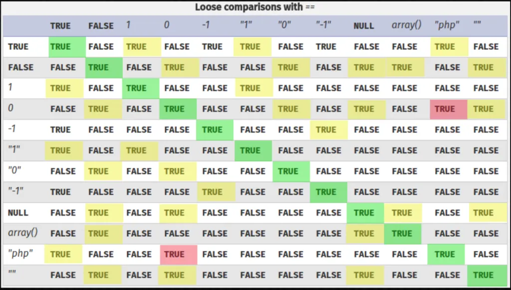
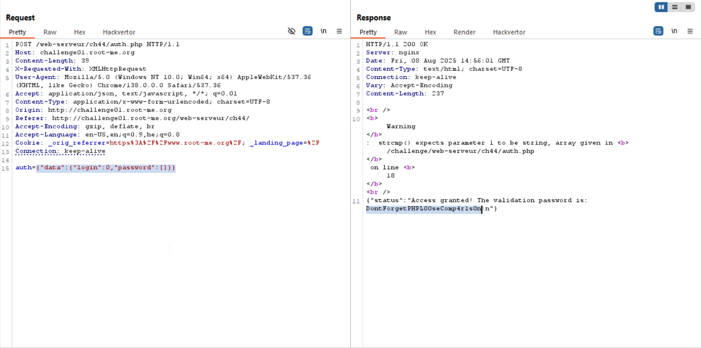

This is the vulnerable code:
```php
// check login and password (sha256)
if($auth['data']['login'] == $USER && !strcmp($auth['data']['password'], $PASSWORD_SHA256)){
        $return['status'] = "Access granted! The validation password is: $FLAG";
}
```

First, let's look on the loose comparison table:


As you can see, `0` equals to `"php"`, so, this:
```php
$auth['data']['login'] == $USER
```
Can be bypassed by supplying `0` as `login`.

Second, we can see we use `strcmp`. As we can see from here https://avishaigonen123.github.io/CTF_writeups/websec.fr/level17.html, when strcmp gets empty array it returns null, which can helps us in this case, to bypass this check:
```php
!strcmp($auth['data']['password'], $PASSWORD_SHA256)
```

So, this will be our payload:
```
{"data":{"login":0,"password":[]}}
```



**Flag:** **_`DontForgetPHPL00seComp4r1s0n`_**
