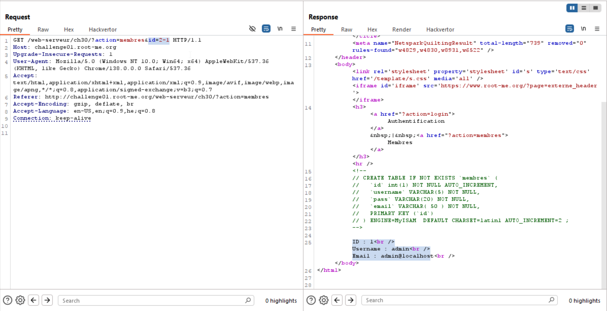

As you can see, when giving this payload:
```
?action=members&id=2-1
```
We get `id=1`, so it means there is a basic SQL injection here.
However, when trying to use this vulnerability for an exploit, we face fences of `WAF`, and we hate `WAF`.




**Flag:** **_`blablablablabla`_**