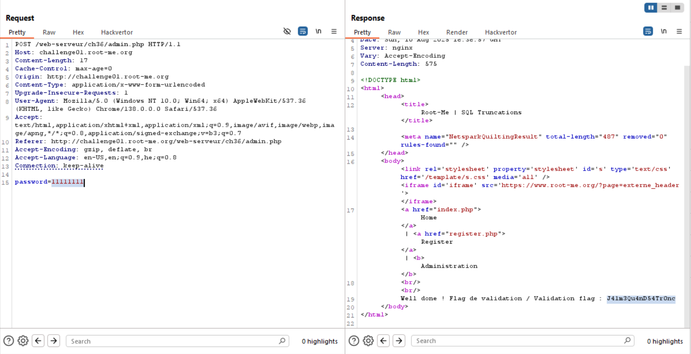

Here the challenge is very similar to https://avishaigonen123.github.io/CTF_writeups/overthewire/natas/natas27.html.

This is the schema we get.
```sql
CREATE TABLE IF NOT EXISTS user(   
	id INT NOT NULL AUTO_INCREMENT,
    login VARCHAR(12),
    password CHAR(32),
    PRIMARY KEY (id));
```

If we'll create user like: `admin [spaces] a`, when the `a` is the 13th char, then it'll get truncate and when validate, the system will create duplicate to the real `admin`.

So, we give this:
```
login=admin       bla&password=11111111
```

And then can basically login with `11111111`



**Flag:** **_`J41m3Qu4nD54Tr0nc`_**