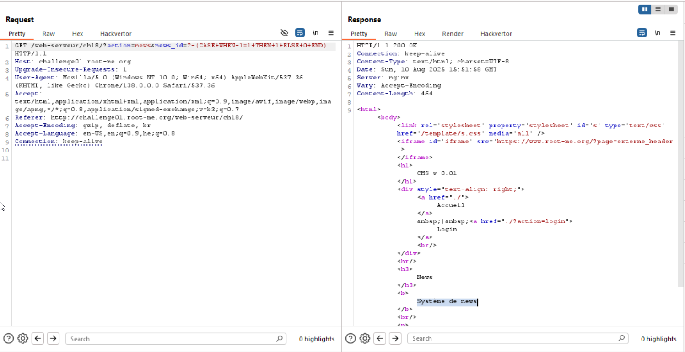
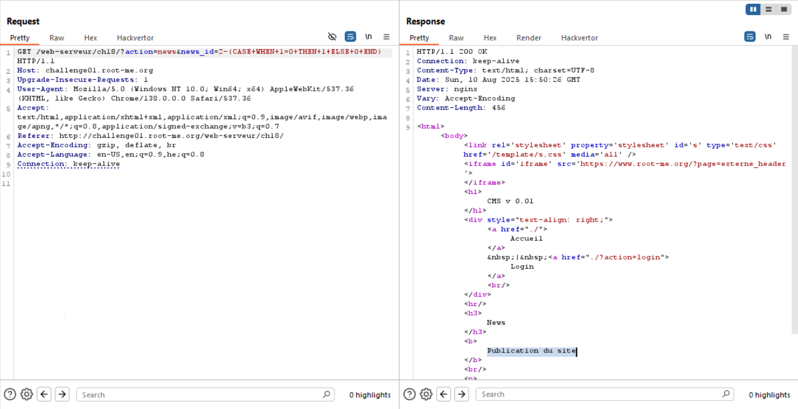

Here we can see that when given `?action=news&news_id=1` and `?action=news&news_id=2` we get different results. 

However, what will happen if we'll give something like this
```
?action=news&news_id=2-(CASE WHEN 1=1 THEN 1 ELSE 0 END)
```

In this case, we can play with the condition, and by this way exfiltrate data.

In this example, we query `2-(CASE WHEN 1=1 THEN 1 ELSE 0 END)`, which gives us `1`.


In this example, we query `2-(CASE WHEN 1=0 THEN 1 ELSE 0 END)`, which gives us `2`.



As you can see, we get different results.

This script is very fast, I wrote it using chatGPT, and it do the job.
I simply took the script we used in [SQL-Injection-Blind](./SQL-injection-Blind.md), and adjusted it.
```py

```

Notice that we can't use `'`, so I use `unicode` which is like ascii function, and by this way exfiltrate char by char.

After execution, we get this:
```
Extracted credentials snippets:
Cred 0: user1 vUrpg
Cred 1: admin aTlkJYLjcbLmue3
Cred 2: user2 aFjKx7j9d
```
So, the password is:

```
aTlkJYLjcbLmue3
```

**Flag:** **_`aTlkJYLjcbLmue3`_**