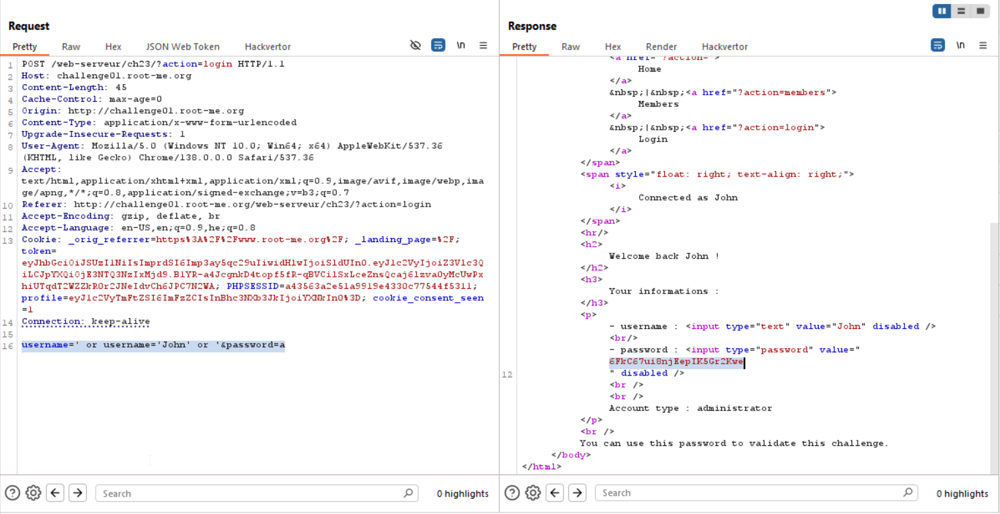

This is the query:
```xml
string(//user[username/text()='input' and password/text()='input']/account/text())
```

And we also can see this table:

**Members**
Username |	Email |	Account type
----- |       -----  |  ------
Steve |	steve@jobs.com  |	subscriber
John  | John@doe.org |	administrator
Eric  |	ric@ard.biz |	subscriber


So, we'll give this payload `' or username='John' or '` and the full query will be:
```
username=' or username='John' or '&password=a
```



**Flag:** **_`J41m3Qu4nD54Tr0nc`_**