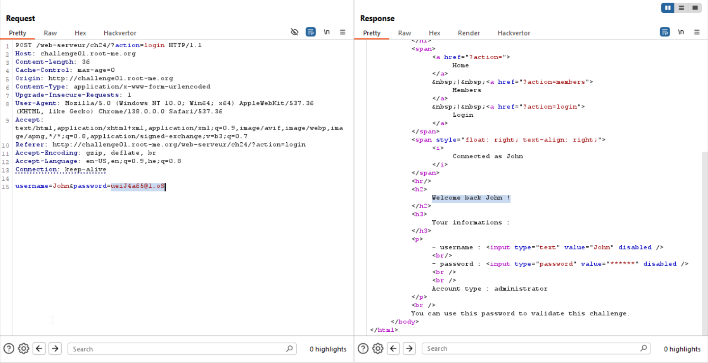

This challenge on it's own shouldn't be so difficult, because this is like simple Blind injection.

The idea is to give this query:
```
?action=user&userid=1 and substring(//user[userid=2]/password,{i},1)='c'
```
And just brute-force the char, until we exfiltrate the password of `John`, which has `userid=2` and also he's an admin, as we can see from the table here:
Username |	Email |	Account type
----     |  --   |  ---
Steve |	steve@jobs.com |	subscriber
John |	John@doe.org |	administrator
Eric |	ric@ard.biz	| subscriber
Jerry |	Jerry@tomcat.net	| subscriber
Elise	| Elise@tomcat.net |	subscriber

However, the problem is that we can't use `'` or `"`. 
In addition, there are no functions like `ascii` or `char`, so we are screwed :(

And that's where I came to this great idea, we can exfiltrate chars, for example if we want to get `s`, we can take this:
```
substring(//user[userid=1]/email,1,1)
```
Because we take the first char of `steve@jobs.com`, as shown in the table.

So, we can create our mapGadget, and by this way we can achieve huge number of chars!

This is our script:
```py

```

And after execution, we get: 
```
ueiJ4a65@1.oS
```



**Flag:** **_`ueiJ4a65@1.oS`_**